# Create Credential

## Introduction

Files in the object store are protected by a system of 'credentials'. It's possible for a bucket to be public, meaning that the files within it are readable by anyone who knows (or can guess) the URI. If the bucket is not public, then the owner of the bucket must create a cloud credential, and provide that credential to anyone (or any program) that needs to access the file.

There are various ways of creating a credential, but the simplest method is by creating an 'auth token' through the OCI control panel, and creating a credential from that.

Estimated Time: 10 minutes

### Objectives

In this lab, you will:

* Create an auth token
* Use the auth token to create a credential in Database Actions

### Prerequisites

* Be logged into your Oracle Cloud Account

## Task 1: Find OCI Username and create Auth Token

1. Find your full OCI username
    
    From the main OCI Control Panel menu, choose **Identity &amp; Security**, then **Users**. From the list choose your username. It will most likely be prefixed &quot;oracleidentitycloudservice/&quot; followed by your login email, with &quot;Yes&quot; in the federated column. You may see a non-federated ID, which is likely just your email - do not use that. Save the username to a text file for use in Task 2.

    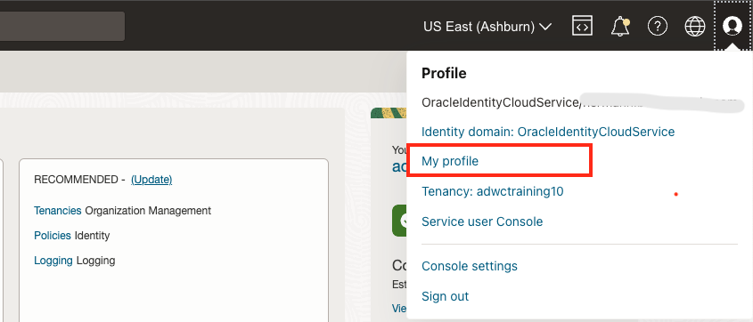

    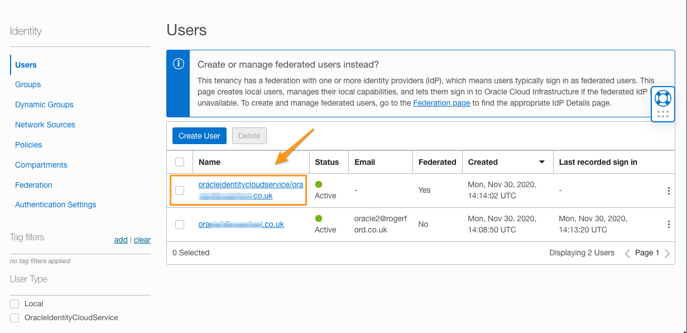

2. Create an Auth Token

    Click on the username from the previous step, if you have not already done so. You should now be on the 'User Details' page.

    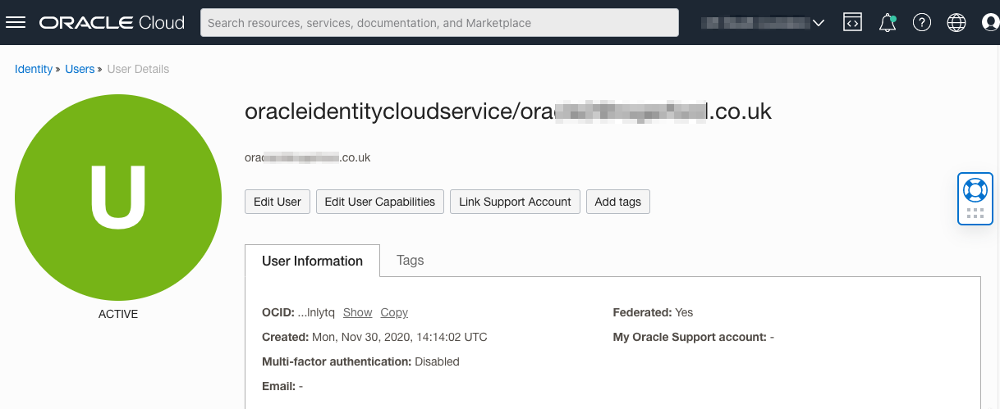  

    Now scroll to the bottom of that page. On the left is a **Resources** section. Choose **Auth Tokens** from there.
    
    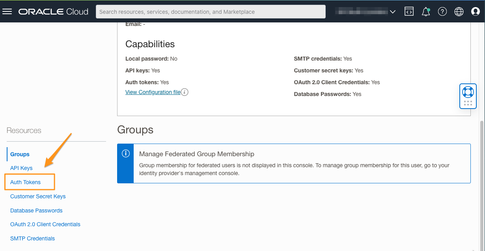
      
    Clicking on Auth Tokens will open an Auth Tokens panel. From here, you can click on **Generate Token**

    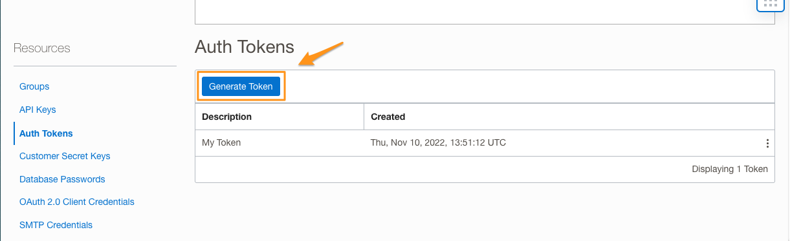

    You will be asked for a description. Enter "Auth token for files" and click on **Generate Token**.

    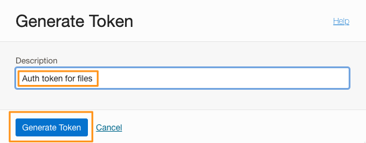

    An Auth Token will be generated. If you click on **Show** you will see a short string of apparently random characters. Click the **Copy** button and save the Auth Token string to a text file for the next step.

    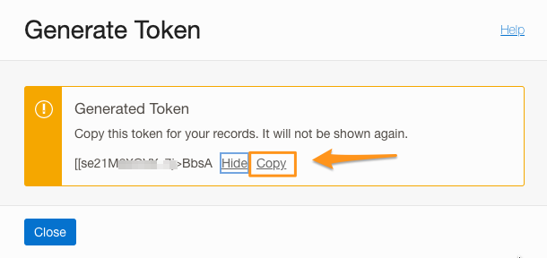

    Click the **Close** button when you have copied the token.

## Task 2: Create the Cloud Credential

1. Gather required information.

    For this task, you will need to have the Cloud Username and Auth Token string that you saved in the previous steps.

    We need to run the next part from within the SQL part of Database Actions.

<if type="alwaysfree">
2. If you are using a Free Trial or Always Free account, and you want to use Always Free Resources, you need to be in a region where Always Free Resources are available. You can see your current default **Region** in the top, right-hand corner of the page.

    

</if>
<if type="livelabs">
2. If you are using a LiveLabs account, you need to be in the region your account was provisioned in. You can see your current default **Region** in the top, right-hand corner of the page. Make sure that it matches the region on the LiveLabs Launch page.

    

</if>

3. Click the navigation menu in the upper left to show top-level navigation choices.

4. Click on **Oracle Database** and choose **Autonomous Transaction Processing**.

    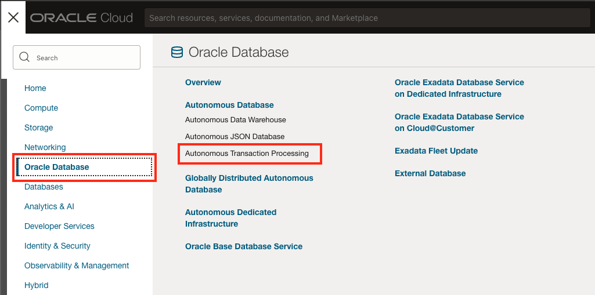


5. Use the __List Scope__ drop-down menu on the left to select the same compartment where you created your Autonomous Database in Lab 1. Make sure your workload type is __Transaction Processing__. <if type="livelabs">Enter the first part of your user name, for example `LL185` in the Search Compartments field to quickly locate your compartment.

    

</if>
<if type="freetier">
5. If using FreeTier, your compartment should be the root compartment for your tenancy.

    
</if>

<if type="freetier">
   **Note:** Avoid the use of the ManagedCompartmentforPaaS compartment as this is an Oracle default used for Oracle Platform Services.
</if>

<if type="freetier">
6. You should see your database **TEXTDB** listed in the center. Click on the database name "TEXTDB".
</if>

<if type="livelabs">
6. You should see your database **TEXTDBnnnnn** (where nnnn represents your LiveLabs user id) listed in the center. Click on the database name "TEXTDBnnnn".
</if>

    

7.  On the database page, choose __Database Actions__.

    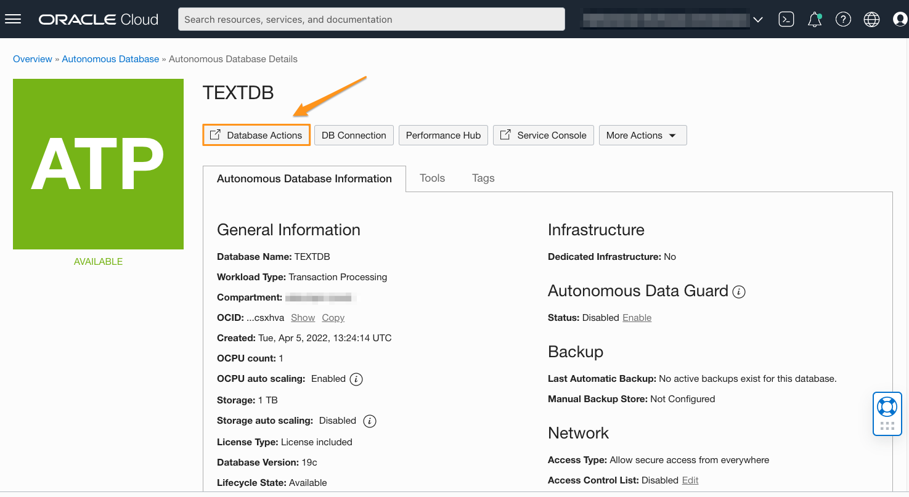

8.  You are now in Database Actions.

    Database Actions allows you to connect to your Autonomous Database through various browser-based tools. We will just be using the SQL workshop tool.

9. You should be in the Database Actions panel. Click on the **SQL** card

    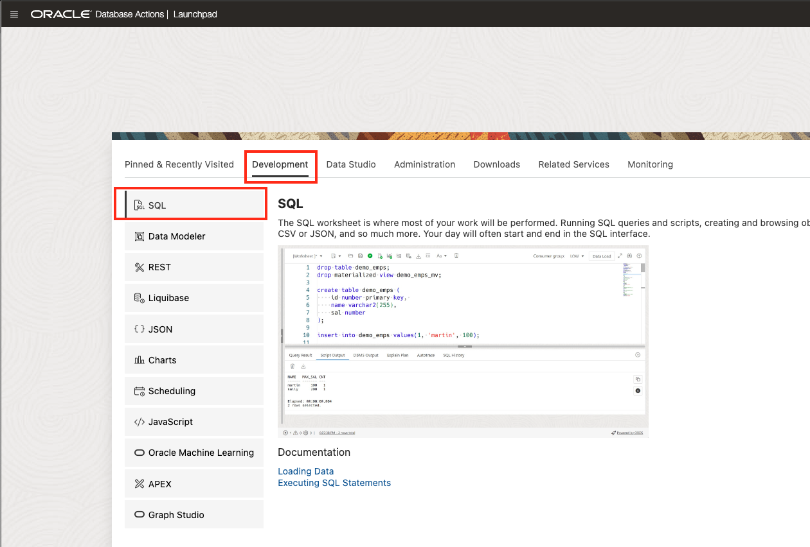

    When you first enter SQL, you will get a tour of the features. We recommend you step through it, but you can skip the tour by clicking on the "X". The tour is available at any time by clicking the tour button. You can dismiss the warning that you are logged in as the ADMIN user.

    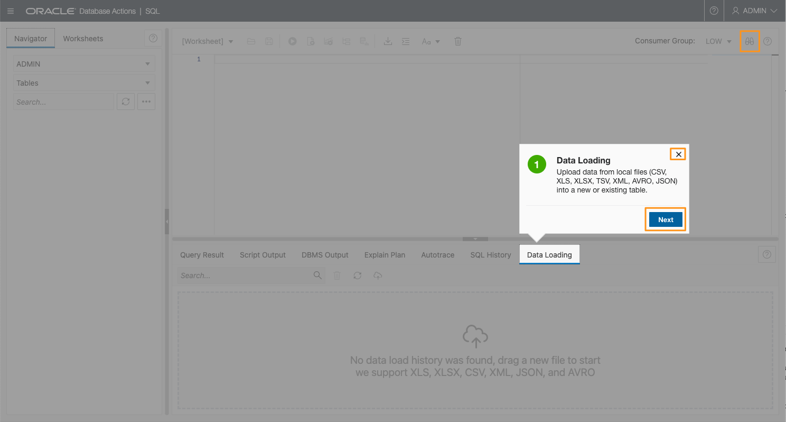

10. Now we're ready to enter the actual credential creation command. Copy the following text into the **Worksheet** section. You *MUST* replace the username with your Cloud Username, and the password with your Auth Token string, as found in the previous task. When done, click the **Run Statement** button.

    ```
    <copy>
    begin
        dbms_cloud.create_credential (
            credential_name => 'mycredential',
            username        => 'oracleidentitycloudservice/myname@example.com',
            password        => 'Xe#eB<y9M<blhd#_5XYZ'
        );
    end;
    </copy>
    ```
    
    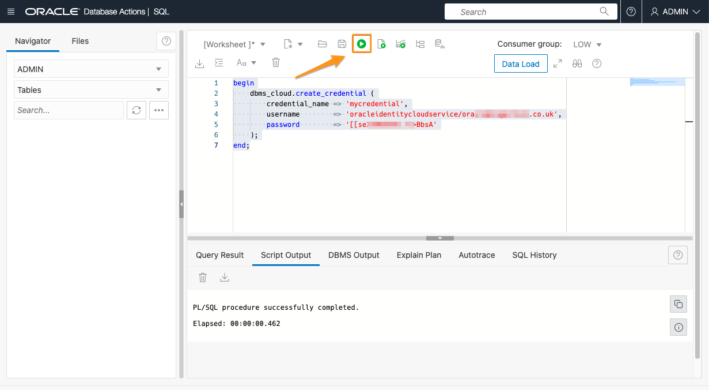

That's it, you've now created a credential called "mycredential". In the next lab, we'll use it to create the external index.

## Acknowledgements

- **Author** - Roger Ford, Principal Product Manager
- **Contributors** - Kamryn Vinson, Andres Quintana, James Zheng
- **Last Updated By/Date** - Roger Ford, March 2022
