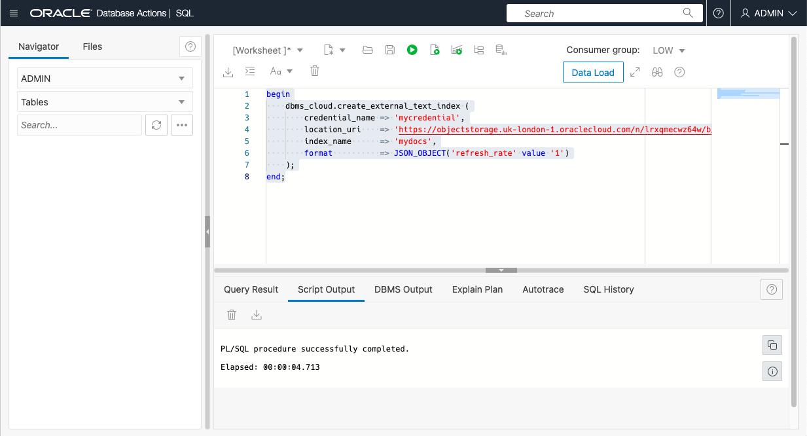
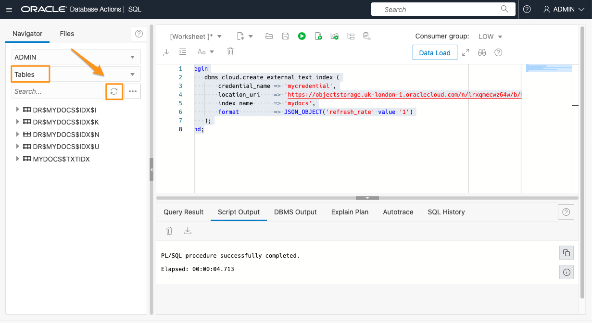
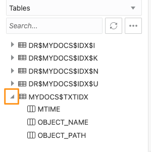
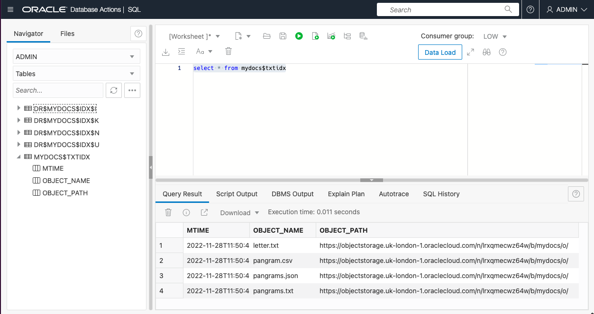

# Create an External Text Index

## Introduction

In this lab, you will create an External Text Index on the documents you loaded in Lab 2.

Estimated Time: 10 minutes

### Objectives

In this lab, you will:

* Learn how to create External Text Indexes given a credential and a URI.

### Prerequisites

* Be logged in to your Oracle Cloud Account
* Have the URI for your bucket that you created in Lab 2
* Have the name of the credential you created in Lab 3


## Task 1: Open Database Actions / SQL

If you've just completed the previous lab, you will already have Database Actions open. If you have closed the Database Actions tab of your browser, refer to the previous lab to reopen Database Actions and SQL.

## Task 2: Create the External Text Index

1. Run the index creation SQL.

    An External Text Index is created by the **DBMS\_CLOUD** procedure **CREATE\_EXTERNAL\_TEXT\_INDEX**, which takes the following parameters

    * **credential\_name** : the name of a cloud credential. May be NULL if the bucket and all files within it are publicly accessible.
    * **location\_uri** : the address of our bucket
    * **index\_name** : a name that we provide, which will be used to generate a table and index name in the database.
    * **format** : optional, provides index options. A JSON field, it currently only accepts one attribute, refresh\_rate, which is the number of minutes between refreshes (the default is 5). Very soon it will also accept an additional option, binary_file, to allow for binary files (such as Word and PDF files) as well as text files.

    Copy the following text into the **Worksheet** panel, and click the **Run Statement** button.

    ```
    <copy>
    begin
        dbms_cloud.create_external_text_index (
            credential_name => 'mycredential',
            location_uri    => 'https://objectstorage.uk-london-1.oraclecloud.com/n/lrqmxecwz64w/b/mydocs/o/',
            index_name      => 'mydocs',
            format          => JSON_OBJECT('refresh_rate' value '1')
        );
    end;
    </copy>
    ```
    You should see "PL/SQL procedure successfully completed" at the bottom.

    

    If anything goes wrong, and you need to re-run it, you may need to first drop the external index using this command:

    ```
    <copy>
    -- !! only run this if you need to delete the index before trying again !!
    begin
        dbms_cloud.drop_external_text_index(
            index_name      => 'mydocs'
        );
    end;
    </copy>
    ```

2. Check the tables created

    On the left side of the screen, under **Navigator**, check that **Tables** is selected. Then click the "Refresh" button.

    

    You can see that several tables have been created. The ones prefixed **DR$** are the internal text index tables, you don't need to worry about those.
    The table you should be interested in is **MYDOCS$TXTIDX**. You'll see that that's the name of the index you created ("mydocs"), followed by **$TXTIDX**.

    You can expand that table in the navigator, and you'll see it consists of three columns:
    * **MTIME**: The time at which the file was last read
    * **OBJECT\_NAME**: The simple name of the file
    * **OBJECT\_PATH**: The full URI of the file

    

3. List the indexed files

    In the **Worksheet** area, enter the following SQL and click the *Run Statement* button

    ```
    <copy>
    select * from mydocs$txtidx
    </copy>
    ```

    

    If you don't see any data, you may have to wait a short while for the table to be populated. If you still don't see anything after a few minutes, then
    it's likely that either the location_uri was incorrect, or the credential is not valid. See the next step for troubleshooting.

4. Optional - troubleshoot if you don't see any data

    If you don't see any rows in MYDOCS$TXTIDX, it is likely that one of the following is true:
    * You got the URI for the documents wrong
    * You specified a non-existent credential
    * The credential is not valid for the document URI

    The following query may give you more information about the problem. Make sure that you use the same credential name and URI that you used in the **CREATE\_EXTERNAL\_TEXT\_INDEX** operation:

    ```
    <copy>
    begin
        for c in (select object_name from table (dbms_cloud.list_objects (
                credential_name => 'mycredential',
                location_uri    => 'https://objectstorage.uk-london-1.oraclecloud.com/n/lrxqmecwz64w/b/mydocs/o/'))) LOOP
            dbms_output.put_line(c.object_name);
        end loop;
    end;
    </copy>
    ```

    If this works, it will produce a list of filenames. If it does not work it will produce a series of error messages. The first message is usually the important one.
    For example, you might see:

    ```
    ORA-20401: Authorization failed for URI - https://objectstorage.uk-london-1.oraclecloud.com/n/lrxqmecwz64w/b/mydocs/o/
    ```

    This means the URI and the credential both exist, but the credential is not valid for the URI. Most likely, the credential was created with the wrong username, or the wrong Auth Token.


You may now proceed to the next lab where we will run queries against the index.


## Acknowledgements

- **Author** - Roger Ford, Principal Product Manager, Oracle Database
- **Contributors** - Kamryn Vinson, Andres Quintana, James Zheng
- **Last Updated By/Date** - Roger Ford, March 2022
