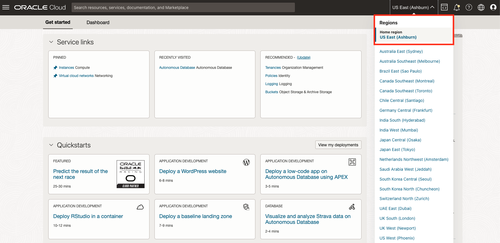

# Create an Oracle Text index

## Introduction

This lab will use the SQL Workshop in Database Actions from the Autonomous Transaction Processing page. It will create a simple Oracle table with a textual column in it, and create an Oracle Text index on that table.

We will then briefly explore information about the index before moving on to queries in the next lab.

Estimated Time: 10 minutes

### Objectives

In this lab, you will:

* Download some sample files
* Create an Object Storage bucket
* Load the files into the bucket
* Find the URI for the bucket

### Prerequisites

* Be logged into your Oracle Cloud Account

## Task 1: Download the sample files

You will need some text files to save to object storage. So start by downloading these four files to your local machine:

* [pangram.csv](./files/pangram.csv?download=1 "pangram.csv download")
* [pangrams.json](./files/pangrams.json?download=1 "pangrams.json download")
* [pangrams.txt](./files/pangrams.txt?download=1 "pangrams.txt download")
* [letter.txt](./files/letter.txt?download=1 "letter.txt download")

## Task 2: Create a bucket in Object Storage and upload files

1. Log in to the Oracle Cloud.

<if type="freetier">

2. If you are using a Free Trial or Always Free account, and you want to use Always Free Resources, you need to be in a region where Always Free Resources are available. You can see your current default **Region** in the top, right-hand corner of the page.

    

</if>
<if type="livelabs">

2. If you are using a LiveLabs account, you need to be in the region your account was provisioned in. You can see your current default **Region** in the top, right-hand corner of the page. Make sure that it matches the region on the LiveLabs Launch page.

    

</if>

3. Click the navigation menu in the upper left to show top-level navigation choices.

4. Click on **Storage** and choose **Buckets** under the heading "Object Storage and Archive Storage.

    

5. Use the __List Scope__ drop-down menu on the left to select the same compartment where you created your Autonomous Database in Lab 1.

<if type="livelabs">Enter the first part of your user name, for example `LL185` in the Search Compartments field to quickly locate your compartment.

    

</if>
<if type="freetier">
5. If using FreeTier, your compartment should be the root compartment for your tenancy.

    
</if>

<if type="freetier">
   **Note:** Avoid the use of the ManagedCompartmentforPaaS compartment as this is an Oracle default used for Oracle Platform Services.
</if>

<if type="freetier">
6. Click **Create Bucket**. You can choose a name (I chose &quot;mydocs&quot;) or leave it to default. All other fields can be left at their default value. Click &quot;Create&quot;, 
</if>

<if type="livelabs">
6. Click **Create Bucket**. You can choose a name (which includes the first part of your username, for example `LL185_mydocs`, or leave it to default. All other fields can be left at their default value. Click **Create**;
</if>

    

    On the next page, click on the name of the bucket you just created.

    

    You can now upload the four documents (downloaded in Task 1) to the bucket. Click the **Upload** button near the bottom of the page, then drag and drop your documents, or use the file selector. Finally, click the **Upload** button, and close the panel once all your files are uploaded.

    

Task 3: Find the URI for the bucket

We now need to know the Universal Resource Identifier (URI) of the bucket. Unfortunately, the control panel doesn't directly show this, so instead click on the three dots to the right of one of the files, and choose &quot;View Object Details&quot;.

Copy the URL PAth (URI) from this page, and remove the final part representing the file name (for example, &quot;letter.txt&quot;). The rest of the URI is the identifier for the bucket itself. Save that URI for later use.

You may now continue to the next lab.

## Acknowledgements

- **Author** - Roger Ford, Principal Product Manager
- **Contributors** - Alexandra Czarlinska, James Zheng
- **Last Updated By/Date** - Roger Ford, March 2022

[def]: ./files/letter.txt?download=1