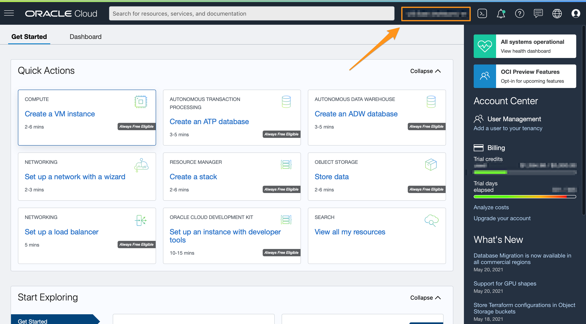
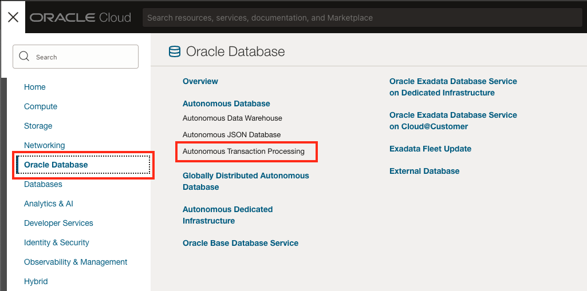
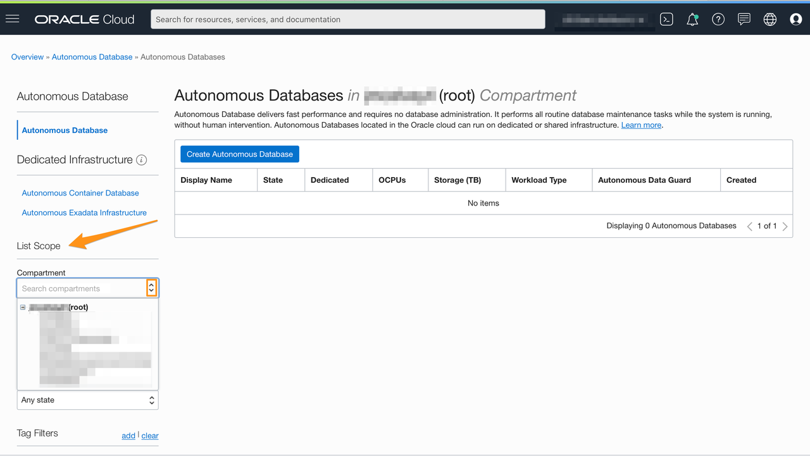
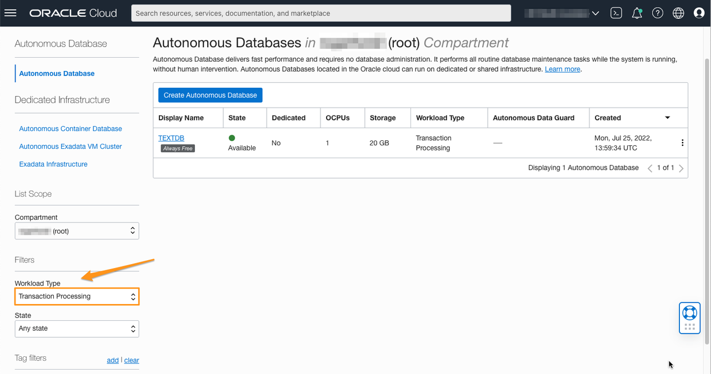
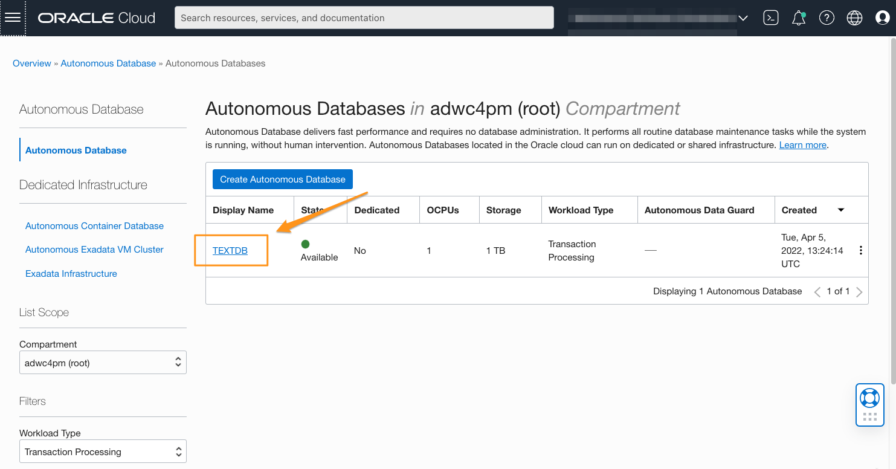
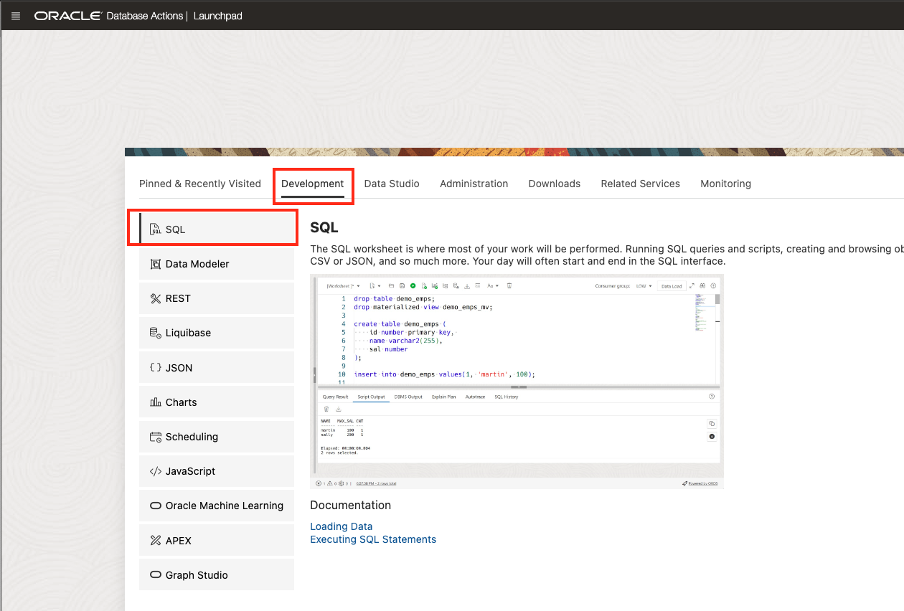
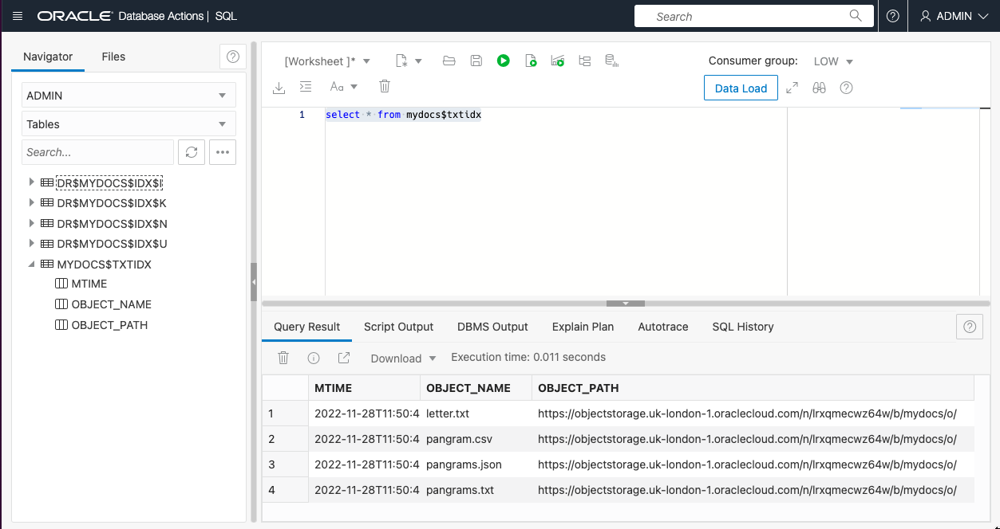
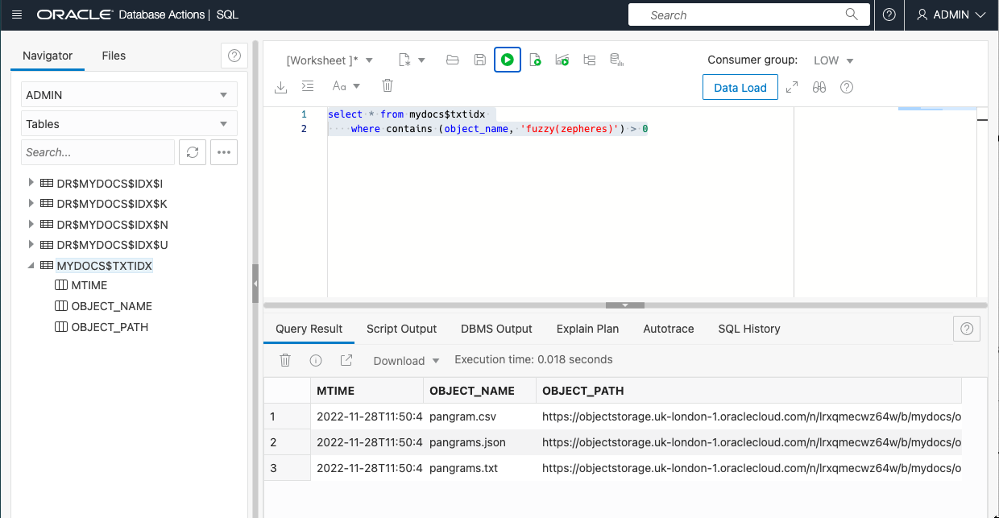

# Run Queries

## Introduction

This lab will use the SQL Workshop in Database Actions from the Autonomous Transaction Processing page. We will explore the CONTAINS operator, used to query Oracle Text indexes.

Estimated Time: 10 minutes

### Objectives

In this lab, you will:

* Explore the CONTAINS text query operator
* Look at various basic text searches
* See how the SCORE() operator helps you rank your query results

### Prerequisites

* Be logged into your Oracle Cloud Account
* Have completed the previous lab to create an index

## Task 1: Open Database Actions

1. If you have just completed the previous lab, you can skip this task as you will already be in Database Actions.
Otherwise, log in to the Oracle Cloud.

<if type="freetier">

2. If you are using a Free Trial or Always Free account, and you want to use Always Free Resources, you need to be in a region where Always Free Resources are available. You can see your current default **Region** in the top, right-hand corner of the page.

    

</if>
<if type="livelabs">

3. If you are using a LiveLabs account, you need to be in the region your account was provisioned in. You can see your current default **Region** in the top, right-hand corner of the page. Make sure that it matches the region on the LiveLabs Launch page.

    

</if>

4. Click the navigation menu in the upper left to show top-level navigation choices.

5. Click on **Oracle Database** and choose **Autonomous Transaction Processing**.

    

6. Use the __List Scope__ drop-down menu on the left to select the same compartment where you created your Autonomous Database in Lab 2. Make sure your workload type is __Transaction Processing__. <if type="livelabs">Enter the first part of your user name, for example `LL185` in the Search Compartments field to quickly locate your compartment.
<if type="livelabs">

    

</if>
<if type="freetier">
    
</if>
    

<if type="freetier">
   > **Note:** Avoid the use of the ManagedCompartmentforPaaS compartment as this is an Oracle default used for Oracle Platform Services.
</if>

7. You should see your database **TEXTDB** listed in the center. Click on the database name "TEXTDB".

    

8.  On the database page, choose __Database Actions__.

    

9.  You are now in Database Actions.

    Database Actions allows you to connect to your Autonomous Database through various browser-based tools. We will just be using the SQL workshop tool.
    

10. You should be in the Database Actions panel. Click on the **SQL** card

    

## Task 2: Run Text Queries

1.  First familiarize yourself with the text contained in the table which was created for the external text index. Copy the following and press the "Run Command" button.

    ```
    <copy>
    select * from mydocs$txtidx
    </copy>
    ```

    

    That should show you four rows in the table, one row per indexed document (if it does not, then follow the trouble-shooting section at the end of the last lab).
    Remember that our text index is created on the _contents_ of the files, so you may wish to take a look at the actual files you uploaded, in order to see what we indexed.

2.  The CONTAINS operator

    To search an Oracle Text CONTEXT index you must use the CONTAINS operator. CONTAINS is specific to that type of index.
    Unlike 'ordinary' indexes, you can't get the same results with or without an index. CONTAINS simply won't work if there is no CONTEXT index present.

    CONTAINS is a function returning a number. It is almost always used in the form __WHERE CONTAINS(...) > 0__. If the return value is greater than zero, there's a match for the row, if it's zero there isn't.

    CONTAINS takes two or three arguments. The third is optional and we won't discuss it here. The two required arguments are:

    1.  The name of the column to be searched. In the case of external text indexes, the index is always created on the column **OBJECT\_NAME**, so that's what we need to use. 
    2.  A string value to search for. The string can be a literal string, or anything that evaluates to a string (VARCHAR2 or CLOB).
    
    An external text index is an example of an _indirect index_. Although the index is created on the column **OBJECT\_NAME** column, we actually fetch the data to be indexed from somewhere else - in this case from the contents of the file referenced by the combination of **OBJECT\_NAME** and **OBJECT\_PATH**

    Let's try a simple example. We'll look for the word 'jump'. 

    ```
    <copy>
    select * from mydocs$txtidx 
        where contains (object_name, 'jump') > 0
    </copy>
    ```
    

    We can see that returned three of our four files - the files containing pangram text which includes the word 'jump'.

    So is this just like the SQL **LIKE** operator, but working on the contents of files? It has some similarities, but the basic answer is "No, not really". For a start, change the query above to 'JUMP' in upper-case. Still works, right? Yes, because Oracle Text indexes are case-insensitive (by default). Now try 'jum'. No match, because it's a word-based index and that doesn't match a complete word.

    Let's try another search:

    ```
    <copy>
    select * from mydocs$txtidx 
        where contains (object_name, '(boxing AND fox) OR (pangram)') > 0
    </copy>
    ```

    That finds all four documents. Three of them contain the words 'boxing' and 'fox' somewhere in the document. The other contains the word 'pangram'.

    Finally, we'll try an inexact query. The files contain the word 'zephyrs', but it's an easy word to mis-spell. Try this:

    ```
    <copy>
    select * from mydocs$txtidx 
        where contains (object_name, 'fuzzy(zepheres)') > 0
    </copy>
    ```

    

    The fuzzy operator can find words which are spelled or pronounced similarly to our search term.

This is as far as well go in exploring queries in this lab, but feel free to experiment further.

You can find a list of query operators here: [Contains Query Operators](https://docs.oracle.com/en/database/oracle/oracle-database/19/ccref/oracle-text-CONTAINS-query-operators.html).

You also might be interested in our other Oracle Text Livelab, [Full Text Indexing in Oracle Database](https://livelabs.oracle.com/pls/apex/r/dbpm/livelabs/view-workshop?wid=3286) which has ßmore detail about searching using the CONTAINS operator.

## Acknowledgements

- **Author** - Roger Ford, Principal Product Manager
- **Last Updated By/Date** - Hermann Baer, May 2024
