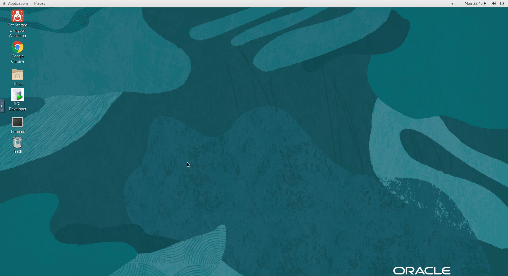

# Using noVNC Remote Desktop and enabling SSH access

## Introduction

This workshop can be accessed using a browser based graphical remote desktop (noVNC). It can also be accessed using SSH. You are free to use either method but we recommend SSH as for this workshop it provides a superior experience.

This lab will show you how to get started with your workshop with a remote desktop session and how to enable SSH access. 

**Estimated Lab Time**: 10 minutes

### Objectives

In this lab, you will:

- Enable fullscreen display of remote desktop session
- Enable remote clipboard integration
- Open the workshop guide from the remote desktop
- Enable SSH access (optional but recommended)

### Prerequisites

This lab assumes you have:

- Launched the workshop in the LiveLabs environment
- An RSA format SSH private/public key pair to use to access the OCI instance (optional)

If you need help in generating a suitable SSH key pair, please consult [this tutorial](https://docs.oracle.com/en/learn/generate_ssh_keys/index.html).

## Task 1: Enable Full-screen Display
For seamless desktop integration and to make the best use of your display, perform the following tasks to render your remote desktop session in fullscreen mode.

1. Click on the small gray tab on the middle-left side of your screen to open the control bar.

    

2. Select *Fullscreen* to render the session on your entire screen.

    
    

## Task 2: Enable Copy/Paste from Local to Remote Desktop
During the execution of your labs you may need to copy text from your local PC/Mac to the remote desktop, such as commands from the lab guide. While such direct copy/paste isn't supported as you will realize, you may proceed as indicated below to enable an alternative local-to-remote clipboard with Input Text Field.

1. Continuing from the last task above, Select the *clipboard* icon

    

2. Copy some text from your local computer as illustrated below and paste into the clipboard widget, then finally open up the desired application (e.g. Terminal) and paste accordingly using *mouse controls*

    

    *Note:* Please make sure you initialize your clipboard with step [1] shown in the screenshot above before opening the target application in which you intend to paste the text. Otherwise will find the *paste* function in the context menu grayed out when attempting to paste for the first time.

## Task 3: Open Your Workshop Guide

1. If the *Web* browser window(s) is(are) not already open side-by-side, double-click on the *Get Started with your Workshop* icon from the remote desktop. This will launch one or two windows depending on the workshop.

    

2. On the left windows is your workshop guide and depending on your workshop, you may also one or two browser tabs loaded with webapps. e.g. Weblogic console, Enterprise Manager Cloud Console, or a relevant application to your workshop such as SQL Developer, JDeveloper, etc.

    
    

You may now proceed to the next lab.

## Task 4: Configure SSH access (optional).

While your workshop can be executed end-to-end from the remote desktop, follow the steps provided below if you need to access the instance remotely using an SSH client such as Putty, Unix/Linux/MacOS Terminal, OCI cloudshell, and other terminal emulators available on Windows.

*Notes:* In this section you are enabling SSH access to the OS user running the remote desktop, wich for this workshop is the **oracle** user.

This assumes that you already have an RSA type SSH key-pair available on the local system where you will be connecting from. If you don't and for more info on creating and using SSH keys for your specific platform and client, please refer to the guide [Generate SSH Keys](https://docs.oracle.com/en/learn/generate_ssh_keys/index.html)

1. Open the remote clipboard on the remote desktop as shown in *Task 2* and launch a terminal session

2. Paste the block below onto the remote clipboard first, then onto the terminal to create or update the file *$HOME/.ssh/authorized_keys* with the *Vi* editor

    ```
    <copy>
    cd $HOME/.ssh
    vi authorized_keys
    </copy>
    ```

    

3. From the local system (e.g. your laptop) and with the exception of *Putty* users, locate the SSH public key from the key-pair, open it, and copy the entire content to the clipboard.

    

    If using Putty you must load the private key (*.ppk*) into *Puttygen* utility to see the relevant public key block to copy. Do not copy the content of the public key file directly as it will not work.

    

4. Paste the copied public key onto the remote clipboard first, then onto the terminal where you opened *authorized_keys* for edit

    

5. Save and exit *vi* editor

6. Set required permissions on *authorized_keys*

    ```
    <copy>
    chmod 0600 authorized_keys
    </copy>
    ```

7. Test/Validate connectivity using the private key (for Unix/Linux/MacOS Terminal, OCI cloudshell, and Terminal emulators on Windows such as Cygwin and MobaXterm).

    ```
    ssh -i [path to private key] remote-user@[instance-public-ip-address]
    e.g.
    <copy>
    ssh -i /home/youruser/.ssh/livelabs_rsa oracle@150.136.123.105
    </copy>
    ```

    For Putty, please refer to the guide [Generate SSH Keys](https://oracle-livelabs.github.io/common/labs/generate-ssh-key) on how to establish the connection using the *.ppk* private key.

## Acknowledgements
* **Author** - Rene Fontcha, LiveLabs Platform Lead, NA Technology
* **Contributors** - Arabella Yao, Database Product Management
* **Last Updated By/Date** - Chris Jenkins, July 2022