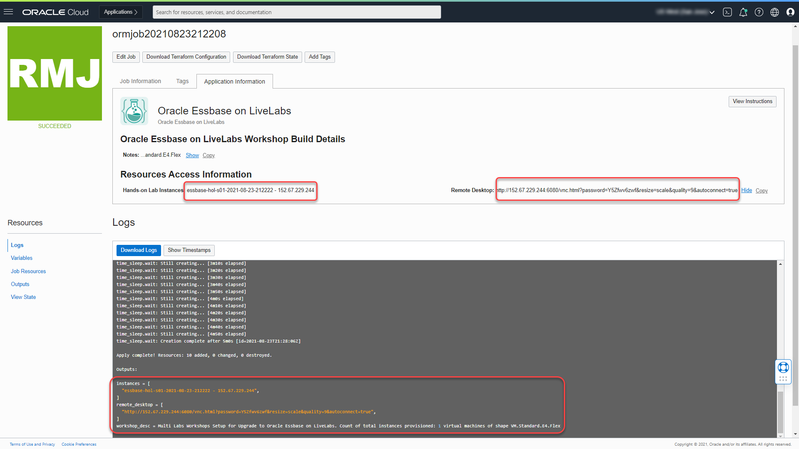

# Setup compute instance

## Introduction

This lab shows you how to setup a Resource Manager stack that generates the Oracle Cloud objects needed to run your workshop.

**Estimated Lab Time:** 15 minutes

### About Terraform and Oracle Cloud Resource Manager

For more information about Terraform and Resource Manager, see the appendix below.

### Objectives

-   Create a Resource Manager stack.
-   Use the stack to create the required OCI resources.
-   Connect to the created compute instance.

### Prerequisites

This lab assumes that you have:

- An Oracle Cloud account (paid or free trial).
- Completed *Lab: Prepare Setup*.

## Task 1: Create Stack: Choose a Path

When using the downloaded ORM stack file to deploy the required OCI resources you have two options:

- Allow the stack to create and configure a private, dedicated network (VNC and subnet) for you (recommended).

- Specify an existing, suitably configured, network (VCN and subnet) to be used.

The rest of this lab assumes that you will allow the stack to create the network for you.

If you wish to use an existing network (see *Lab: Prepare Setup* for details of required **Ingress** rules) then consult **Appendix 3** below for instructions.

## Task 2: Create Stack:  Compute + Networking

1. Identify the ORM stack zip file downloaded in *Lab: Prepare Setup*.
2. Login to Oracle Cloud.
3.  Open up the hamburger menu in the left hand corner.  Click **Developer Services**, choose **Resource Manager > Stacks**. Choose the compartment in which you would like to install. Click **Create Stack**.  

  

  

4.  Select **My Configuration**, choose the **.ZIP FILE** button, click the **Browse** link and select the zip file that you downloaded or drag-n-drop for the file explorer.

  

5.  Click **Next**.

6. Enter or select the following:

  

    - **Instance Count:** Accept the default, **1**.
    - **Select Availability Domain:** Select an availability domain from the dropdown list.
    - **Need Remote Access via SSH?:** Unless you are certain than you do not want to use SSH to access the workshop compute instance, leave this checked.
    - **Auto Generate SSH Key Pair?:** If you want to have an SSH key pair automatically generated, leave this checked. If you unckeck it then you will be given the option to provide your own public key.

7. Depending on the quota you have in your tenancy you can choose from standard Compute shapes or Flex shapes. Please visit the Appendix: Troubleshooting Tips for instructions on checking your quota
    - **Use Flexible Instance Shape with Adjustable OCPU Count?:** Keep the default as checked (unless you plan on using a fixed shape).
    - **Instance Shape:** Keep the default or select from the list of Flex shapes in the dropdown menu (e.g *VM.Standard.E4.Flex*).
    - **Instance OCPUS:** Accept the default shown. e.g. **4** will provision 4 OCPUs and 64GB of memory, which is the minimum for this workshop. Please ensure you have the capacity available before increasing the resources.
8.  If don't have quota for Flex Shapes or you prefer to use fixed shapes, follow the instructions below.  Otherwise skip to the next step.
    - **Use Flexible Instance Shape with Adjustable OCPU Count?:** Unchecked
    - **Instance Shape:** Accept the default shown or select from the dropdown. e.g. VM.Standard2.4

  

10. In this section we are provisioning a new VCN with all the appropriate ingress and egress rules needed to run this workshop (recommended).
    - **Use Existing VCN?:** Accept the default by leaving this unchecked. This will create a **new VCN**.

11. Click **Next**.

12. Make sure that **Run Apply** is checked and click **Create**.

  

13. Your stack has now been created and the *Apply* action is running to deploy your environment.

  

## Task 3: Apply Terraform
In the prior steps we elected to trigger the *terraform apply action* on stack creation.

1.  Review the job output.

  

2.  Congratulations, your environment has been created!  Click on the *Application Information* tab to get additional information about your environment.
3.  Your public IP address(es), instance name(s), and remote desktop URL are displayed.

You can now **proceed to the next lab**.

## Appendix 1:  Terraform and Resource Manager
Terraform is a tool for building, changing, and versioning infrastructure safely and efficiently.  Configuration files describe to Terraform the components needed to run a single application or your entire datacenter.  In this lab, a configuration file has been created for you to build network and compute components. The compute component you will build uses an image out of Oracle's Cloud Marketplace. This image is running Oracle Linux 8.

Resource Manager is an Oracle Cloud Infrastructure service that enables you to automate the process of provisioning your Oracle Cloud Infrastructure resources. Using Terraform, Resource Manager helps you install, configure, and manage resources through the "infrastructure-as-code" model. To learn more about OCI Resource Manager, watch the video below.

[OCI Resource Manager youtube video](youtube:udJdVCz5HYs)

## Appendix 2: Troubleshooting Tips
If you encountered any issues during the lab, follow the steps below to resolve them. If you are unable to resolve the issue, please skip to the **Need Help** section to submit your issue via our  upport forum.

###Common issues and solutions

- Availability Domain Mismatch
- Flex Shape Not Found
- Limits Exceeded
- Instance shape selection grayed out

### **Issue #1:** Availability Domain Mismatch

#### Issue #1 Description
When creating a stack and using an existing VCN, the availability domain and the subnet must match otherwise the stack errors.  

#### Fix for Issue #1
1.  Click on **Stack**-> **Edit Stack** -> **Configure Variables**.
2.  Scroll down to the network definition.
3.  Make sure the Availability Domain number matches the subnet number.  E.g. If you choose AD-1, you must also choose subnet #1.
4.  Click **Next**
5.  Click **Save Changes**
6.  Click **Terraform Actions** -> **Apply**

### **Issue #2:** Flex Shape Not Found

#### Issue #2 Description
When creating a stack your ability to create an instance is based on the shapes and resources that you have available in your tenancy.

#### Fix for Issue #2
If you have other compute instances you are not using, you can go to those instances and delete them.  If you are using them, follow the instructions to check your available usage and adjust your variables.

1. Click on the Hamburger menu, go to **Governance & Administration** -> **Tenancy Management** -> **Limits, Quotas and Usage**.
2. Select **Compute**.
3. These labs use the following compute types.  Check your limit, your usage and the amount you have available in each availability domain (click Scope to change Availability Domain).
4. Look for *Cores for Standard.E2 based VM and BM instances*, *Cores for Standard.xx.Flex based VM and BM instances*, and *Cores for Optimized3 based VM and BM instances*.
4. Click on the hamburger menu, go to **Developer Services** -> **Resource Manager** -> **Stacks**.
5. Click on the stack you created previously.
6. Click **Edit Stack** -> **Configure Variables**.
7. Scroll down to Options.
8. Change the shape based on the availability you have in your tenancy.
9. Click **Next**.
10. Click **Save Changes**.
11. Click **Terraform Actions** -> **Apply**.

### **Issue #3:** Limits Exceeded

#### Issue #3 Description

When creating a stack your ability to create an instance is based on the capacity you have available for your tenancy.

**NOTE** Please ensure that you are NOT running this workshop in the **Always Free** Tier. This workshop does not run on the Always Free tier, you must have available cloud credits.  Go to **Governance & Administration** -> **Tenancy Management** -> **Limits, Quotas and Usage**, select **Compute** and ensure that you have **more than** the micro tier available.  If you have only 2 micro computes, your account has transitioned to an Always Free.  This means that the promotional period of 30 days has expired or you have run out of credits, this workshop will NOT run.

#### Fix for Issue #3
If you have other compute instances you are not using, you can go to those instances and delete them.  If you are using them, follow the instructions to check your available usage and adjust your variables.

1. Click on the Hamburger menu, go to **Governance & Administration** -> **Tenancy Management** -> **Limits, Quotas and Usage**.
2. Select **Compute**.
3. These labs use the following compute types.  Check your limit, your usage and the amount you have available in each availability domain (click Scope to change Availability Domain).
4. Look for *Cores for Standard.E2 based VM and BM instances*, *Cores for Standard.xx.Flex based VM and BM instances*, and *Cores for Optimized3 based VM and BM instances*.
5. Click on the Hamburger menu, goto **Developer Services** -> **Resource Manager** -> **Stacks**.
6. Click on the stack you created previously.
7. Click **Edit Stack** -> **Configure Variables**.
8. Scroll down to Options.
9. Change the shape based on the availability you have in your system.
10. Click **Next**.
11. Click **Save Changes**.
12. Click **Terraform Actions** -> **Apply**.

### **Issue #4:** Instance Shape Selection Grayed Out

#### Issue #4 Description
When creating a stack selected the option *"Use Flexible Instance Shape with Adjustable OCPU Count"* but the *"Instance Shape"* selection is grayed out and the following error message displayed:***"Specify a value that satisfies the following regular expression: ^VM\.(Standard\.E3\.Flex)$"***

This issue is an indication that your tenancy is not currently configured to use flexible shapes (e3flex)

#### Fix for Issue #4
Modify your stack to use fixed shapes instead.

1. Uncheck the option *"Use Flexible Instance Shape with Adjustable OCPU Count"* to use fixed shape instead.

## Appendix 3: Create Stack using an existing VCN

If you have an existing VCN which you wish to use, and are comfortable updating VCN configurations, please ensure your VCN meets the minimum requirements. Refer to *Lab: Prepare Setup*

*Note:* We recommend letting our stack create the VCN to reduce the potential for error.

1.  Identify the ORM stack zip file downloaded in *Lab: Prepare Setup*.
2.  Login to Oracle Cloud.
3.  Open up the hamburger menu in the left hand corner.  Choose the compartment in which you would like to install.  Choose **Developer Services** -> **Resource Manager > Stacks**.  

  

  

4. Select **My Configuration**, click the **Browse** link and select the zip file (dbsec-lab-mkplc-freetier.zip) that you downloaded. Click **Select**.

  

  Enter the following information:
  
  - **Name**:  Enter a name  or keep the prefilled default (*DO NOT ENTER ANY SPECIAL CHARACTERS HERE*, including periods, underscores, exclamation etc, it will mess up the configuration and you will get an error during the apply process).
  - **Description**:  Same as above.
  - **Create in compartment**:  Select the correct compartment if not already selected.

  *Note:* If this is a newly provisioned tenant such as freetier with no user created compartment, stop here and first create it before proceeding.

5. Click **Next**.

  

  Enter or select the following:
  
  - **Instance Count:** Keep the default to **1** to create only one instance.
  - **Select Availability Domain:** Select an availability domain from the dropdown list.
    - **Use Flexible Instance Shape with Adjustable OCPU Count?:** Keep the default as checked (unless you plan on using a fixed shape).
    - **Instance Shape:** Keep the default or select from the list of Flex shapes in the dropdown menu (e.g *VM.Standard.E4.Flex*).
    - **Instance OCPUS:** Accept the default shown. e.g. **4** will provision 4 OCPUs and 64GB of memory, which is the minimum for this workshop. Please ensure you have the capacity available before increasing the resources.
    - **Use Existing VCN?:** Check to select.
    - **Select Existing VCN?:** Select existing VCN with regional public subnet and required security list.

  *Note:* For an existing VCN to be used successfully, review the details at the bottom of this section.

6. If you prefer to use fixed shapes, follow the instructions below.  Otherwise skip to the next step.
    - **Use Flexible Instance Shape with Adjustable OCPU Count?:** Unchecked
    - **Instance Shape:** Accept the default shown or select from the dropdown. e.g. VM.Standard.E2.4

  

7. Review and click **Create**.

  

8. Your stack has now been created and the *Apply* action is running to deploy your environment!

  

You may now return to **Task 3: Terraform Apply** above.

## Acknowledgements
* **Author** - Rene Fontcha, LiveLabs Platform Lead, NA Technology
* **Last Updated By/Date** - Jenny Bloom, March 2023