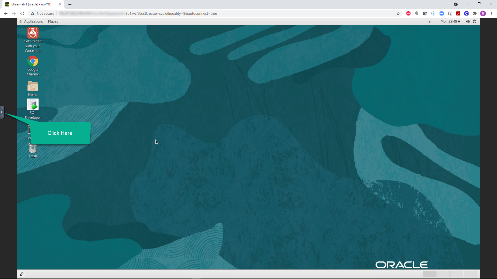
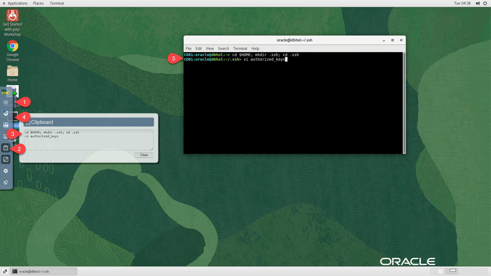
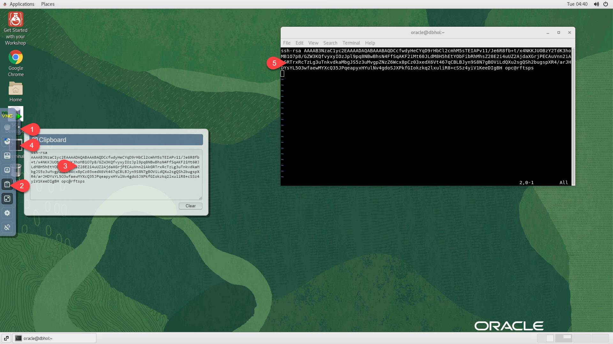

# Connect to the workshop compute instance

## Introduction
This lab shows you how to login to your pre-created compute instance running on Oracle Cloud.

**Estimated Lab Time:** 10 minutes

### Objectives

- Learn how to connect to your compute instance using the NoVNC Remote Desktop.
- Learn the basics of using the NoVNC Desktop, including copy and paste.
- Configure and use SSH access to the compute instance (optional).

### Prerequisites

This lab assumes:

- You have successfully provisioned a workshop compute instance either in the LiveLabs sandbox or in your own tenancy.
- If you using the LiveLabs sandbox, and you wish to use SSH to access the compute instance, that you have an RSA format SSH private/public key pair to use to access the compute instance (optional).

If you wish to use the NoVNC graphical desktop to access the workshop compute instance, please complete **tasks 1 and 2** below.

If you prefer to use SSH to access the compute instance, please complete **tasks 2 and 3** below.

If you wish to be able to use both connection methods, please complete all the tasks in this lab.

**IMPORTANT:** Due to the slightly cumbersome nature of copying between your host system and the NoVNC session, we recommend that you perform all of the copy/paste actions within the NoVNC session itself, as this avoids the use of the NoVNC clipboard. Alternatively, access the workshop's compute instance using SSH and copy/paste between the lab instructions displayed in your local browser and your SSH session.

## Task 1: Enable NoVNC Full-screen Display

To make the best use of your display, perform the following tasks to render your remote desktop session in fullscreen mode.

1. Click on the small gray tab on the middle-left side of your screen to open the control bar.

    

2. Select *Fullscreen* to render the session on your entire screen.

    
    

 *Note:* The Full-screen option is available if the browser supports it. Switch to another browser if you don't see the full-screen option in the control bar.
 
## Task 2: Enable Copy/Paste from Local to Remote Desktop

During the execution of this workshop you will need to copy text from the workshop instructions (use the copy button provided) to a terminal session (remote desktop or SSH). As direct copy/paste between your local browser and the NoVNC desktop isn't supported, you may proceed as indicated below to enable an alternative local-to-remote clipboard using the NoVNC Clipboard.

1. Continuing from the last task above, Select the *clipboard* icon

    

2. Copy some text from your local computer as illustrated below and paste into the clipboard widget, then finally open up the desired application (e.g. Terminal) and paste accordingly using *mouse controls*

    

*Note:* Please make sure you initialize your clipboard with step [1] shown in the screenshot above before opening the target application in which you intend to paste the text. Otherwise will find the *paste* function in the context menu grayed out when attempting to paste for the first time.
    
If you will be using the NoVNC desktop for the workshop, make sure that you have an open terminal session. If you have closed the terminal session that was open when you first logged in, open a new one now using **Activities > Terminal** from the Linux desktop menu bar. 

## Task 3: Configure and use SSH access (optional)

While your workshop can be executed end-to-end from the remote desktop, follow the steps provided below if you prefer to access the instance remotely using an SSH client such as Putty, Unix/Linux/MacOS Terminal, OCI cloudshell, and other terminal emulators available on Windows.

**IMPORTANT:** If you are running the workshop instance in your own tenancy and you configured SSH access as part of deploying the instance using the ORM stack, skip straight to step **7** below.

*Note:* In this section you are enabling SSH access to the OS user running the remote desktop, which for this workshop is the **oracle** user.

This assumes that you already have an RSA type SSH key-pair available on the local system where you will be connecting from. If you don't, then for more info on creating and using SSH keys for your specific platform and client, please refer to the guide [Generate SSH Keys](https://docs.oracle.com/en/learn/generate_ssh_keys/index.html)

1. Open the remote clipboard on the remote desktop as shown in *Task 3* and launch a terminal session.

2. Paste the block below onto the remote clipboard first, then onto the terminal to create or update the file *\$HOME/.ssh/authorized_keys* using the *vi* editor.

    ```
    <copy>
    cd $HOME/.ssh
    vi authorized_keys
    </copy>
    ```

    
    
    Enter append mode in vi (type **A**), and start a new line if required.

3. From the local system (e.g. your laptop), with the exception of *Putty* users, locate the SSH _public_ key from your key-pair, open it, and copy the entire content to the clipboard.

    

    If using *Putty* you must load the private key (*.ppk*) into *Puttygen* utility to see the relevant public key block to copy. Do not copy the content of the public key file directly as it will not work.

    

4. Paste the copied public key into the remote clipboard first, then into the terminal where you opened the *authorized_keys* file for editing.

    

5. Save and exit the *vi* editor (press the **Escape** key then type **ZZ**).

6. Set the required permissions on *authorized_keys*.

    ```
    <copy>
    chmod 0600 authorized_keys
    </copy>
    ```

7. Verify SSH connectivity using the private key (for Unix/Linux/MacOS Terminal, OCI cloudshell, and Terminal emulators on Windows such as Cygwin and MobaXterm).

    ```
    ssh -i [path to private key] remote-user@[instance-public-ip-address]
    e.g.
    <copy>
    ssh -i ~/.ssh/livelabs_rsa oracle@150.136.123.105
    </copy>
    ```

    If copy/pasting the above _example_, substitue the appropriate values for the SSH key private key file and the compute instance IP address.
    
    For Putty, please refer to the guide [Generate SSH Keys](https://oracle-livelabs.github.io/common/labs/generate-ssh-key) on how to establish the connection using the *.ppk* private key.

You should now have an open terminal session in the compute instance, either through the NoVNC desktop or through SSH. Keep this session open for the next lab.

You can now **proceed to the next lab**.


## Acknowledgements
* **Author** - Rene Fontcha, LiveLabs Platform Lead, NA Technology
* **Contributors** - LiveLabs Team
* **Last Updated By/Date** - Jenny Bloom, June 2023