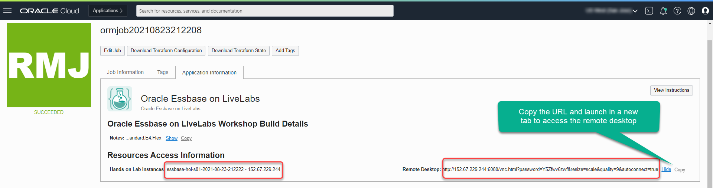

# Connect to the workshop compute instance using NoVNC Remote Desktop

## Introduction
This lab shows you how to login to your compute instance running on Oracle Cloud using the browser based NoVNC remote graphical desktop.

If you configured the workshop compute instance for SSH access when you deployed it, and you prefer to use SSH instead of the graphical remote desktop, then skip this lab and **proceed to the next lab**.

**Estimated Lab Time:** 10 minutes

### Objectives

- Learn how to connect to your compute instance using the NoVNC Remote Desktop.
- Learn the basics of using the NoVNC Desktop, including copy and paste.

### Prerequisites

This lab assumes:

- You have successfully completed all the previous labs in this workshop, in sequence.

## Task 1: Access the Graphical Remote Desktop
For ease of execution of this workshop, your VM instance has been pre-configured with a remote graphical desktop accessible using any modern browser on your laptop or workstation. Proceed as detailed below to login.

If you prefer to connect to the compute instance using SSH to execute the workshop steps and commands, please skip the rest of this lab and  **proceed to the next lab**.

1. Navigate to **Stack Details**, **Application Information** tab, and **Copy** the remote desktop URL.

  

  

  Paste this URL into another browser window and it will take you to the remote desktop.

  

**Note:**  While rare, you _may_ see an error titled **Deceptive Site Ahead**, or similar, depending on your browser type, as shown below.

Public IP addresses used for LiveLabs provisioning come from a pool of reusable addresses. This error is due to the fact that the address was previously used by a different compute instance, long terminated, which wasn't properly cleaned up.

You can safely ignore this error. Proceed by clicking on **Details**, and finally on **visit this unsafe site**.

## Task 2: Enable NoVNC Full-screen Display

To make the best use of your display, perform the following tasks to render your remote desktop session in fullscreen mode.

1. Click on the small gray tab on the middle-left side of your screen to open the control bar.

    

2. Select *Fullscreen* to render the session on your entire screen.

    
    

    *Note:* The Full-screen option is available if the browser supports it. Switch to another browser if you don't see the full-screen option in the control bar.
    
## Task 3: Enable Copy/Paste from Local to Remote Desktop

During the execution of this workshop you will need to copy text from the workshop instructions (use the copy button provided) to a terminal session (remote desktop or SSH). As direct copy/paste between your local browser and the NoVNC desktop isn't supported, you may proceed as indicated below to enable an alternative local-to-remote clipboard using the NoVNC Clipboard.

1. Continue from the last task above, Select the *clipboard* icon

    

2. Copy some text from your local computer as illustrated below and paste into the clipboard widget, then finally open up the desired application (e.g. Terminal) and paste accordingly using *mouse controls*

    

*Note:* Please make sure you initialize your clipboard with step [1] shown in the screenshot above before opening the target application in which you intend to paste the text. Otherwise you will find the *paste* function in the context menu grayed out when attempting to paste for the first time.
    
**IMPORTANT:** Due to the slightly cumbersome nature of copying between your host system and the NoVNC session, we recommend that you perform all of the copy/paste actions within the NoVNC session itself, as this avoids the use of the NoVNC clipboard. Alternatively, access the workshop's compute instance using SSH and copy/paste between the lab instructions displayed in your local browser and your SSH session.

If you will be using the NoVNC desktop for the workshop, make sure that you have an open terminal session. If you have closed the terminal session that was open when you first logged in, open a new one now using **Activities > Terminal** from the Linux desktop menu bar. 

You can now **proceed to the next lab**.

## Acknowledgements
* **Author** - Rene Fontcha, LiveLabs Platform Lead, NA Technology
* **Contributors** - LiveLabs Team
* **Last Updated By/Date** - Jenny Bloom, June 2023