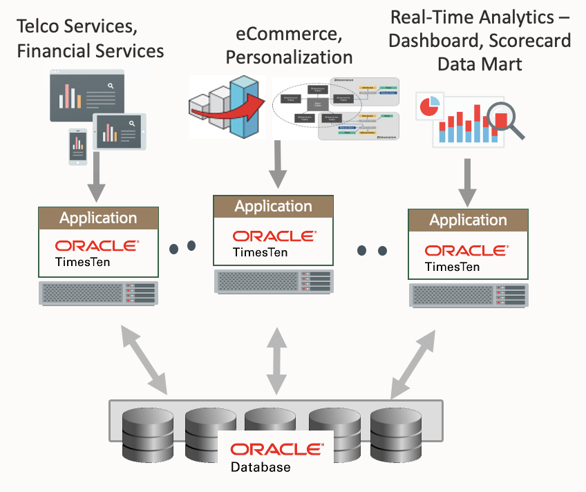

# Introduction

## About this Workshop

In this workshop you will discover how deploying Oracle TimesTen In-Memory Database as an in-memory relational cache for Oracle Database can dramatically improve the response times for SQL queries, typically by an order of magnitude.

Setting up a TimesTen cache is quick and easy. This workshop leads you through the process step by step and uses a simple OLTP application and some example queries to demonstrate the incredibly low query latencies provided by TimesTen.

**Estimated Workshop Time:** 120 minutes

### About Oracle TimesTen In-Memory Database

Oracle TimesTen In-Memory Database (TimesTen) delivers real-time application performance (low response time and high throughput) by changing the assumptions around where data resides at runtime. By managing data in memory, and optimizing data structures and access algorithms accordingly, database operations execute with maximum efficiency achieving dramatic gains in responsiveness and throughput.

TimesTen is a relational database, with SQL as its access language and PL/SQL as its procedural language so that you can leverage your existing Oracle Database skills. It supports many database APIs such as JDBC, ODBC, ODP.NET and Oracle Call Interface (OCI) and several Open Source languages, such as Python and Node.js, are supported via Open Source APIs. TimesTen provides full persistence and has built-in high availability.

TimesTen can be deployed both as a database of record or as a high-performance relational cache in front of an Oracle database to accelerate Oracle database applications. This lab focuses on the cache deployment mode.

### Objectives

In this workshop you will:

* Start up the components required for the labs
* Create a TimesTen instance
* Execute some basic TimesTen commands
* Prepare the Oracle database for TimesTen caching
* Prepare a TimesTen database and set it up as a cache
* Load data from the Oracle database into the cached tables and activate cache refresh
* Verify cache refresh
* Run a simple OLTP benchmark to see the performance benefit of TimesTen
* Run some queries to see the speedup provided by TimesTen
* Use dynamic cache groups
* Shutdown the TimesTen cache and instance

### Prerequisites

This workshop assumes that you have:

* Some familiarity with Oracle Database
* A basic understanding of SQL

In order to run this workshop you need:

* An active Oracle account or Oracle Cloud account

You can run this workshop:

* In the LiveLabs sandbox using a regular Oracle Account
* In your own tenancy using a paid Oracle Cloud account or a free-trial Oracle Cloud account

This workshop does _not_ support the Oracle Cloud 'Always Free' tier due to that tier's resource restrictions.

**IMPORTANT:** This workshop requires an OCI compute instance with at least **4 CPUs** and **32 GB RAM.** If you choose to run this workshop in your own tenancy, please ensure that you have sufficient resources available.

You may now ***proceed to the next lab***.

## Learn More

* [TimesTen Product Home](https://www.oracle.com/database/technologies/related/timesten.html)
* [TimesTen Samples on GitHub](https://github.com/oracle-samples/oracle-timesten-samples)
* [TimesTen Documentation](https://docs.oracle.com/en/database/other-databases/timesten/)

## Acknowledgements

* **Author** - Chris Jenkins, Senior Director, TimesTen Product Management
* **Contributors** -  Doug Hood & Jenny Bloom, TimesTen Product Management
* **Last Updated By/Date** - Chris Jenkins, August 2022
