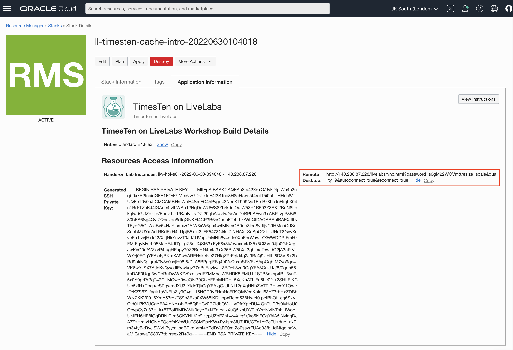

# Connect to the workshop compute instance

## Introduction

In this lab, you will learn the different ways to connect to the OCI compute instance that hosts the workshop.

The workshop requires you to use a terminal session to run various commands and observe their output. Often you may need to copy and paste commands or text from the workshop instructions into the terminal session.

If you chose to run the workshop in your own tenancy, or in a free-trial Cloud account, then you have a choice of using a browser-based GUI connection method or, if you selected the option during deployment via the ORM stack, the option to use SSH connectivity. 

**Estimated Lab Time:** 5 minutes

### Objectives

- Connect to the compute instance using noVNC
- Connect to the compute instance using SSH (optional)

### Prerequisites

This lab assumes that you have:

- Completed all the previous labs in this workshop, in sequence.

## Task 1: Connect using noVNC remote desktop

The lab *Using noVNC Remote Desktop* provides information on using the noVNC remote desktop.

The noVNC connection URL can be viewed and copied on the Stack's Application Information tab:



Copy/paste the URL from the log into your browser and you should then see the workshop desktop.


You can use the **Terminal** option under the *Activities* menu, or double-click the *Terminal* icon on the desktop, to open a terminal session.

## Task 2: Connect using SSH (optional)

If you configured SSH access as part setting up the ORM stack then you can connect to the instance, as the oracle user, using an SSH private key.

If you selected an automatically generated SSH private key, the key can be viewed and copied on the Stack's Application Information tab:


Copy/paste the key into a file on your client computer, or import into your SSH client, and use it to connect via SSH.

**NOTE:** On Linux and macOS systems, SSH private keys should be stored in your user's .ssh directory (**~/.ssh**) and must have permissions of **600 (rw-------)**.

Assuming that the SSH private key is **~/.ssh/id_livelabs** and the public IP address of the workshop compute instance is **123.123.123.123** then you can connect using:

```
<copy>
ssh -i ~/.ssh/id_livelabs oracle@123.123.123.123
</copy>
```

```
The authenticity of host '123.123.123.123 (123.123.123.123)' can't be established.
ED25519 key fingerprint is SHA256:bm2wv3HgyBIhIRov6+EtId10rQHyq1LXpXglQMpqhqA.
This key is not known by any other names
Are you sure you want to continue connecting (yes/no/[fingerprint])? yes
Warning: Permanently added '140.238.69.118' (ED25519) to the list of known hosts.
Last login: Mon Jun 27 09:12:52 2022 from aa.bb.cc.dd
[oracle@ttlivelabvm ~]$
```

You can now *proceed to the next lab*. 

If you plan to use SSH then keep your terminal session open for use in the next lab.

## Acknowledgements

* **Author** - Chris Jenkins, Senior Director, TimesTen Product Management
* **Contributors** -  Doug Hood & Jenny Bloom, TimesTen Product Management
* **Last Updated By/Date** - Chris Jenkins, July 2022

