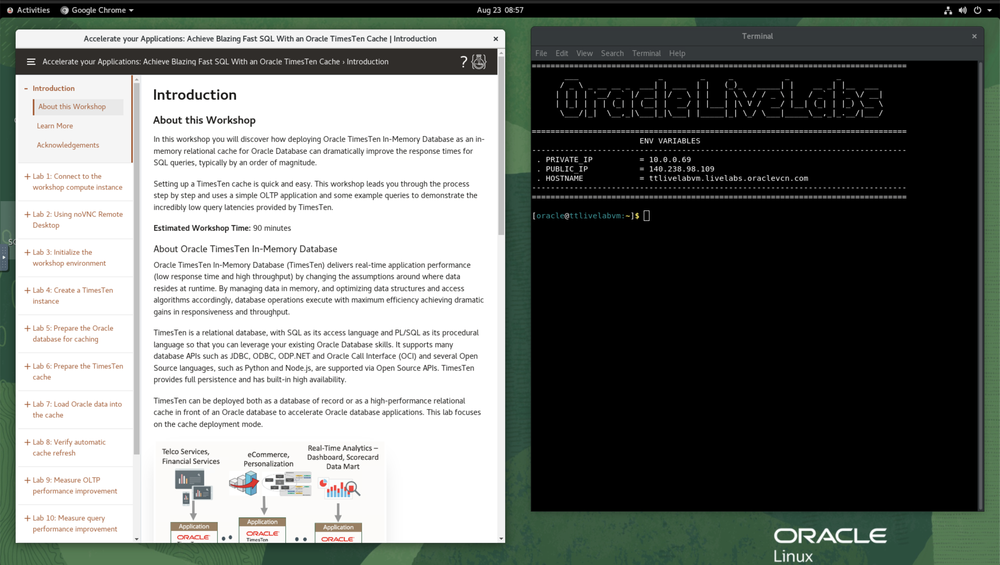

# Connect to the workshop compute instance

## Introduction

In this lab, you will learn the different ways to connect to the OCI compute instance that hosts the workshop.

The workshop requires you to use a terminal session to run various commands and observe their output. Often you may need to copy and paste commands or text from the workshop instructions into the terminal session.

In the LiveLabs sandbox, the only connection method available to you by default is a GUI session using the browser-based noVNC remote desktop mechanism. It is possible to set up SSH connectivity by adding your own SSH public key into the instance.

If you wish to use the NoVNC remote desktop, we recommend that you perform all of your copy/paste activities completely within NoVNC.

If you prefer, you can connect using SSH and copy/paste between the workshop instructions in your host's browser and your SSH session.

**Estimated Lab Time:** 5 minutes

### Objectives

- Connect to the compute instance using noVNC remote desktop
- Connect to the compute instance using SSH (optional)

### Prerequisites

This lab assumes that you have:

- Completed all the previous labs in this workshop, in sequence.

## Task 1: Connect using noVNC remote desktop

When you launch the workshop by clicking the *Launch Workshop* link in the LiveLabs reservation page entry, these instructions open in your browser. Click on ***View Login Info*** at the tope left of the browser window and then click the Launch Remote Desktop button. You should then see the workshop desktop.



You can use the **Terminal** option under the *Activities* menu, or double-click the *Terminal* icon on the desktop, to open a terminal session.

## Task 2: Connect using SSH (optional)

You can connect to the instance as the oracle user using an SSH private key.

Follow the instructions in the lab *Using noVNC Remote Desktop* to add your SSH public key to the **oracle** user's SSH **authorized_keys** file. You can then connect to the workshop compute instance using the corresponding SSH private key.

Assuming that the corresponding SSH private key is **~/.ssh/id_livelabs** and the public IP address of the workshop compute instance is **123.123.123.123** then you can connect using:

```
<copy>
ssh -i ~/.ssh/id_livelabs oracle@123.123.123.123
</copy>
```

```
The authenticity of host '123.123.123.123 (123.123.123.123)' can't be established.
ED25519 key fingerprint is SHA256:bm2wv3HgyBIhIRov6+EtId10rQHyq1LXpXglQMpqhqA.
This key is not known by any other names
Are you sure you want to continue connecting (yes/no/[fingerprint])? yes
Warning: Permanently added '140.238.69.118' (ED25519) to the list of known hosts.
Last login: Mon Jun 27 09:12:52 2022 from aa.bb.cc.dd
[oracle@ttlivelabvm ~]$
```

You can now *proceed to the next lab*.

If you plan to use SSH then keep your terminal session open for use in the next lab.

## Acknowledgements

* **Author** - Chris Jenkins, Senior Director, TimesTen Product Management
* **Contributors** -  Doug Hood & Jenny Bloom, TimesTen Product Management
* **Last Updated By/Date** - Chris Jenkins, August 2022

