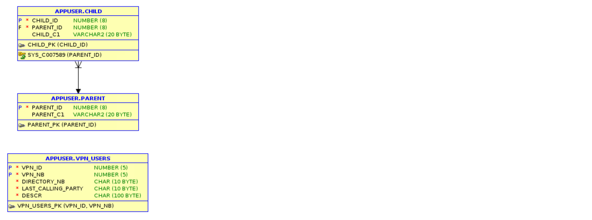

# Prepare the Oracle database for caching

## Introduction

In this lab, we will prepare the Oracle database to support TimesTen caching.

**Estimated Lab Time:** 10 minutes.

### Objectives

- Create a tablespace for TimesTen metadata.
- Create the TimesTen cache admin user.
- Grant all necessary privileges to the cache admin user.

### Prerequisites

This lab assumes that you:

- Have completed all the previous labs in this workshop, in sequence.
- Have an open terminal session in the workshop compute instance, either via NoVNC or SSH, and that session is logged into the TimesTen host (tthost1).

## Task 1: Examine Oracle database schemas and tables

For this workshop, two separate schema users, **appuser** and **oe**, have been defined in the Oracle Database. Each user has several tables, which have already been created, and some example data has been pre-loaded into those tables.

Examine the table definitions, and their row counts, by reviewing the **tables\_appuser.sql** and **tables\_oe.sql** files:

```
<copy>
more tables_appuser.sql
</copy>
```

```
-- Rows: 1000000
CREATE TABLE vpn_users
    ( vpn_id             NUMBER(5) NOT NULL
    , vpn_nb             NUMBER(5) NOT NULL
    , directory_nb       CHAR(10 BYTE) NOT NULL
    , last_calling_party CHAR(10 BYTE) NOT NULL
    , descr              CHAR(100 BYTE) NOT NULL
    , PRIMARY KEY (vpn_id, vpn_nb)
    ) ;

-- Rows: 5
CREATE TABLE parent
    ( parent_id          NUMBER(8) NOT NULL
    , parent_c1          VARCHAR2(20 BYTE)
    , PRIMARY KEY (parent_id)
    ) ;

-- Rows: 7
CREATE TABLE child
    ( child_id           NUMBER(8) NOT NULL
    , parent_id          NUMBER(8) NOT NULL
    , child_c1           VARCHAR2(20 BYTE)
    , PRIMARY KEY (child_id)
    , FOREIGN KEY (parent_id)
          REFERENCES parent (parent_id)
    );
```

```
<copy>
more tables_oe.sql
</copy>
```

```    
-- Rows: 2
CREATE TABLE promotions
    ( promo_id   NUMBER(6)
    , promo_name VARCHAR2(20)
    , PRIMARY KEY (promo_id)
    );

…

-- Rows: 665
CREATE TABLE order_items
    ( order_id           NUMBER(12)
    , line_item_id       NUMBER(3)  NOT NULL
    , product_id         NUMBER(6)  NOT NULL
    , unit_price         NUMBER(8,2)
    , quantity           NUMBER(8)
    , PRIMARY KEY (order_id, line_item_id)
    , FOREIGN KEY (order_id)
      REFERENCES orders(order_id)
    , FOREIGN KEY (product_id)
      REFERENCES product_information(product_id)
    ) ;

CREATE UNIQUE INDEX order_items_uk
 ON order_items (order_id, product_id) ;
```

Just for information, here are the entity-relationship diagrams showing the relationships between the tables.

_APPUSER schema_



_OE schema_


After the tables were created and populated with suitable example data, optimizer statistics were gathered using **dbms\_stats.gather\_schema\_stats** to ensure that the Oracle database will be able to generate optimal query plans.

## Task 2: Create tablespace and cache admin user

1. In your tthost1 session, connect to the Oracle database (running on dbhost) using the **SQL\*Plus** utility:

```
<copy>
sqlplus sys/RedMan99@orclpdb1 as sysdba
</copy>
```

```

SQL*Plus: Release 19.0.0.0.0 - Production on Tue Jun 21 10:04:41 2022
Version 19.14.0.0.0

Copyright (c) 1982, 2021, Oracle.  All rights reserved.


Connected to:
Oracle Database 19c Enterprise Edition Release 19.0.0.0.0 - Production
Version 19.3.0.0.0

SQL>
```

2. Create a tablespace to hold the TimesTen Cache metadata:

```
<copy>
CREATE TABLESPACE cachetblsp DATAFILE '/opt/oracle/oradata/ORCLCDB/ORCLPDB1/ttcache.dbf' SIZE 2G SEGMENT SPACE MANAGEMENT AUTO;
</copy>
```

```
Tablespace created.
```

**NOTE:** This operation takes a few minutes. 

3. Create the TimesTen cache admin user in the Oracle database (in this workshop we name the user **ttcacheadm** with password **ttcacheadm**):

```
<copy>
CREATE USER ttcacheadm IDENTIFIED BY ttcacheadm DEFAULT TABLESPACE cachetblsp QUOTA UNLIMITED ON cachetblsp;
</copy>
```

```
User created.
```

4. Grant CREATE SESSION privilege to the user:

```
<copy>
GRANT CREATE SESSION TO ttcacheadm;
</copy>
```

```
Grant succeeded.
```

## Task 3: Grant required roles and privileges to the cache admin user

The cache admin user needs various privileges in the Oracle database. In order to simplify granting these, TimesTen includes a SQL script (**\$TIMESTEN_HOME/install/oraclescripts/grantCacheAdminPrivileges.sql**) that can be run to grant them.

Run that script in your SQL\*Plus session, passing it the cache admin username (ttcacheadm):

```
<copy>
@/tt/inst/ttinst/install/oraclescripts/grantCacheAdminPrivileges.sql ttcacheadm
</copy>
```

```
Please enter the administrator user id
The value chosen for administrator user id is ttcacheadm

***************** Creation of TT_CACHE_ADMIN_ROLE starts ******************
0. Creating TT_CACHE_ADMIN_ROLE role
** Creation of TT_CACHE_ADMIN_ROLE done successfully **
***************** Initialization for cache admin begins ******************
0. Granting the CREATE SESSION privilege to TTCACHEADM
1. Granting the TT_CACHE_ADMIN_ROLE to TTCACHEADM
2. Granting the DBMS_LOCK package privilege to TTCACHEADM
3. Granting the DBMS_DDL package privilege to TTCACHEADM
4. Granting the DBMS_FLASHBACK package privilege to TTCACHEADM
5. Granting the CREATE SEQUENCE privilege to TTCACHEADM
6. Granting the CREATE CLUSTER privilege to TTCACHEADM
7. Granting the CREATE OPERATOR privilege to TTCACHEADM
8. Granting the CREATE INDEXTYPE privilege to TTCACHEADM
9. Granting the CREATE TABLE privilege to TTCACHEADM
10. Granting the CREATE PROCEDURE  privilege to TTCACHEADM
11. Granting the CREATE ANY TRIGGER  privilege to TTCACHEADM
12. Granting the GRANT UNLIMITED TABLESPACE privilege to TTCACHEADM
13. Granting the DBMS_LOB package privilege to TTCACHEADM
14. Granting the SELECT on SYS.ALL_OBJECTS privilege to TTCACHEADM
15. Granting the SELECT on SYS.ALL_SYNONYMS privilege to TTCACHEADM
16. Checking if the cache administrator user has permissions on the default
tablespace
     Permission exists
18. Granting the CREATE TYPE privilege to TTCACHEADM
19. Granting the SELECT on SYS.GV$LOCK privilege to TTCACHEADM
20. Granting the SELECT on SYS.GV$SESSION privilege  to TTCACHEADM
21. Granting the SELECT on SYS.DBA_DATA_FILES privilege  to TTCACHEADM
22. Granting the SELECT on SYS.USER_USERS privilege  to TTCACHEADM
23. Granting the SELECT on SYS.USER_FREE_SPACE privilege  to TTCACHEADM
24. Granting the SELECT on SYS.USER_TS_QUOTAS privilege  to TTCACHEADM
25. Granting the SELECT on SYS.USER_SYS_PRIVS privilege  to TTCACHEADM
26. Granting the SELECT on SYS.V$DATABASE privilege  to TTCACHEADM (optional)
27. Granting the SELECT on SYS.GV$PROCESS privilege  to TTCACHEADM (optional)
28. Granting the SELECT ANY TRANSACTION privilege to TTCACHEADM
29. Creating the TTCACHEADM.TT_07_ARDL_CG_COUNTER table
30. Granting SELECT privilege on TTCACHEADM.TT_07_ARDL_CG_COUNTER table to
PUBLIC
********* Initialization for cache admin user done successfully *********
```

## Task 4: Grant table specific privileges to the cache admin user

The cache admin user also needs specific privileges on each user table that is cached in TimesTen. The exact privileges depend on the type of caching being used. In this workshop we are using READONLY caching, so the cache admin user needs SELECT privilege on all the user tables that will be cached,

1. Grant those privileges (be sure to press 'Enter' after pasting this into SQL\*Plus):

```
<copy>
GRANT SELECT ON oe.promotions TO ttcacheadm;
GRANT SELECT ON oe.product_information TO ttcacheadm;
GRANT SELECT ON oe.customers TO ttcacheadm;
GRANT SELECT ON oe.orders TO ttcacheadm;
GRANT SELECT ON oe.order_items TO ttcacheadm;
GRANT SELECT ON oe.inventories TO ttcacheadm;
GRANT SELECT ON oe.product_descriptions TO ttcacheadm;
GRANT SELECT ON appuser.vpn_users TO ttcacheadm;
GRANT SELECT ON appuser.parent TO ttcacheadm;
GRANT SELECT ON appuser.child TO ttcacheadm;
</copy>
```

2. Exit from SQL\*Plus:

```
<copy>
quit
</copy>
```

```
Disconnected from Oracle Database 19c Enterprise Edition Release 19.0.0.0.0 - Production
Version 19.3.0.0.0
```

The Oracle database is now set up to support a TimesTen cache for the specified tables.

You can now **proceed to the next lab**. 

Keep your terminal session to tthost1 open for use in the next lab.

## Acknowledgements

* **Author** - Chris Jenkins, Senior Director, TimesTen Product Management
* **Contributors** -  Doug Hood & Jenny Bloom, TimesTen Product Management
* **Last Updated By/Date** - Chris Jenkins, July 2022

