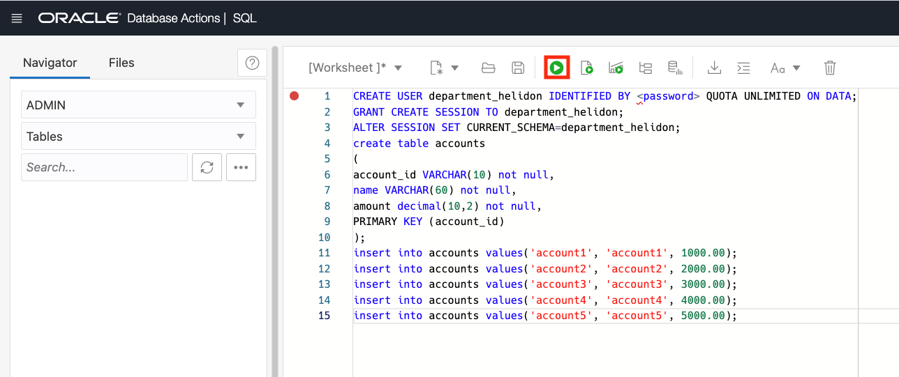
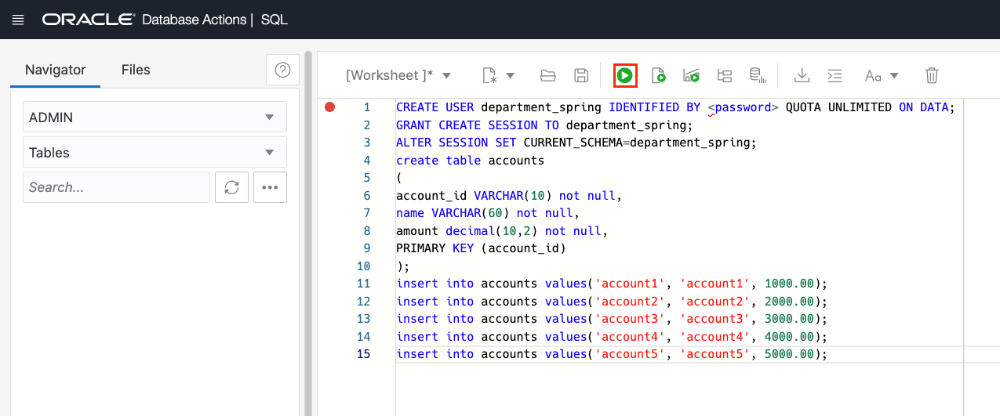

# Provision an Oracle Autonomous Database for use as resource manager

## Introduction

This lab walks you through the steps to quickly provision an Oracle Autonomous Database (Autonomous Transaction Processing [ATP]) on Oracle Cloud. You will use this database in the subsequent labs of this workshop. For this lab, you must create two ATP instances. One ATP instance acts as a resource manager for Department 1 and the other ATP instance acts as resource manager for Department 2.

Estimated lab time: 20 minutes

### Objectives

* Provision two new Autonomous Transaction Processing instances.
* Download the wallet file for each ATP instance.
* Create a table with sample values for Department 1 and Department 2 applications.

### Prerequisites

* This lab requires completion of the **Get Started** section in the Contents menu on the left.

## Task 1: Choose ATP from the Services Menu

1. Log in to the Oracle Cloud, as shown in the previous lab.
2. Once you are logged in, you are taken to the cloud services dashboard where you can see all the services available to you. Click the navigation menu in the upper left to show top level navigation choices.

    **Note:** You can also directly access your Autonomous Transaction Processing service in the **Quick Actions** section of the dashboard.

    

3. This lab shows provisioning of an Autonomous Transaction Processing database, so click **Oracle Database** -> **Autonomous Transaction Processing**.

    

4. On the left side, make sure your **Workload Type** is **Transaction Processing** or **All** to see your Autonomous Transaction Processing instances. You can use the **Compartment** drop-down menu to select a compartment. Select your root compartment, or another compartment of your choice where you will create your new ATP instance. If you want to learn how to create a new compartment, click [here](https://docs.cloud.oracle.com/iaas/Content/Identity/Tasks/managingcompartments.htm#Working). To learn more about compartments, click [here](https://docs.cloud.oracle.com/en-us/iaas/Content/GSG/Concepts/settinguptenancy.htm#Setting_Up_Your_Tenancy).

 **Note** - Avoid the use of the ManagedCompartmentforPaaS compartment as this is an Oracle default used for Oracle Platform Services.

   

5. This console in the last screenshot shows that no databases yet exist. If there were a long list of databases, you could filter the list by the state of the databases (available, stopped, terminated, and so on). You can also sort by **Workload Type**. Here, the **Transaction Processing** workload type is selected.

## Task 2: Create an Autonomous Database Instance for Department 1

1. Click **Create Autonomous Database** to start the instance creation process.

    

2. This brings up the **Create Autonomous Database** screen where you will specify the configuration of the instance.
3. Provide basic information for the autonomous database:

    * **Compartment** - Select a compartment for the database from the drop-down list. In the example below, **MyCompartment** was created ahead of time and chosen.
    * **Display Name** - Enter a memorable name for the database for display purposes. For this lab, use **Department1DB**.
    * **Database Name** - Use letters and numbers only, starting with a letter. Maximum length is 14 characters. (Underscores not initially supported.) For this lab, use **Department1DB**.

    

4. Choose a workload type. For this lab, choose **Transaction Processing** as the workload type.

    

5. Choose a deployment type. For this lab, choose **Shared Infrastructure** as the deployment type.

    

6. Configure the database:

    * **Always Free** - If your cloud account offers it, select this option to create an always free autonomous database, which comes with 1 CPU and 20 GB of storage. If you don't have this option, select the details mentioned below to create an autonomous database.
    * **Choose database version** - Select a database version from the available versions.
    * **OCPU count** - Number of CPUs for your service. For this lab, specify **1 CPU**.  An Always Free database comes with 1 CPU.
    * **Storage (TB)** - Select your storage capacity in terabytes. For this lab, specify **0.02 TB** of storage (20 GB). An Always Free database comes with 20 GB of storage.
    * **OCPU Auto Scaling** - For this lab, you can disable OCPU auto scaling. Auto scaling allows the system to automatically use up to three times more CPU and IO resources to meet workload demand. The Always Free database does not scale up/down.
    * **Storage Auto Scaling** - For this lab, you can disable storage auto scaling. The Always Free database does not scale up/down.
    * **New Database Preview** - If a checkbox is available to preview a new database version, do **not** select it.

    

7. Create administrator credentials:

    * **Password and Confirm Password** - Specify the password for ADMIN user of the service instance. The password must meet the following requirements:
    * The password must be between 12 and 30 characters long and must include at least one uppercase letter, one lowercase letter, and one numeric character.
    * The password cannot contain the username.
    * The password cannot contain the double quote (") character.
    * The password must be different from the last 4 passwords used.
    * The password must not be the same password that is set less than 24 hours ago.
    * Re-enter the password to confirm it. Make a note of this password.

    
8. Choose network access. For this lab, accept the default, **Secure access from everywhere**, and then select the **Require mutual TLS (mTLS) authentication** option. Skip and go to the next step if the **Require mutual TLS (mTLS) authentication** option is unavailable or disabled. mTLS will be required to authenticate connections to your Autonomous Database. TLS connections allows Oracle Data Provider for .NET to connect to your Autonomous Database without a wallet. See the [documentation for network options](https://docs.oracle.com/en/cloud/paas/autonomous-database/adbsa/support-tls-mtls-authentication.html#GUID-3F3F1FA4-DD7D-4211-A1D3-A74ED35C0AF5) for options to allow TLS, or to require only mutual TLS (mTLS) authentication.

    

9. Choose a license type. For this lab, choose **License Included**. Select this type when you want to subscribe to new database software licenses and the database cloud service.

    

10. Provide a contact email address. The **Contact Email** field allows you to list contacts to receive operational notices and announcements as well as unplanned maintenance notifications.

    

11. Click **Create Autonomous Database**.

    

12. Your instance will begin provisioning. In a few minutes the state will turn from Provisioning to Available. At this point, your Autonomous Transaction Processing database is ready to use! Have a look at your instance's details here including its name, database version, CPU count and storage size.


    Provisioning an Autonomous Database instance.

    
    Autonomous Database instance successfully provisioned.

## Task 3: Download the Wallet Files

To download client credentials from the Oracle Cloud Infrastructure Console:

1. Navigate to the Autonomous Database details page.

2. Click **DB Connection**.

   

3. On the Database Connection page select Wallet type as **Instance Wallet**.

4. Click **Download Wallet**.
   

5. In the **Download Wallet** dialog, enter a wallet password in the **Password** field and confirm the password in the **Confirm Password** field.

6. Click **Download** to save the client security credentials zip file.

    

   By default, the filename is: `Wallet_`*databasename*`.zip`. For example, `Wallet_Department1DB.zip`. You can save this file with any filename you want.

   You must protect this file to prevent unauthorized database access.

7. Unzip the wallet file into the Database_Wallet folder. Replace the file name in following example code based on your environment.

    ```text
    <copy>
    unzip Wallet_Department1DB.zip -d <path to Database_Wallet folder>
    <copy>
    ```


8. Extract the wallet files to the `/home/oracle/OTMM/otmm-22.3/samples/xa/java/department-helidon/Database_Wallet/` folder. This folder contains the source code for the Department 1 participant application.

## Task 4: Connect with SQL Worksheet

Although you can connect to your autonomous database from local desktop tools, such as Oracle SQL Developer, you can conveniently access the browser-based SQL Worksheet directly from your Autonomous Database console.

1. In your database's details page, click the **Database Actions** button.

    

2. A sign-in page opens for Database Actions. For this lab, simply use your database instance's default administrator account, **Username - ADMIN**, and **Password** you specified when creating the database. Click **Sign in**.

    

3. The Database Actions page opens. In the **Development** box, click **SQL**.

    

4. The first time you open SQL Worksheet, a series of pop-up informational boxes introduce you to the main features. Click **Next** to take a tour through the informational boxes.

    

    After touring through the informational boxes, keep this SQL Worksheet open and please **proceed to the next task.**

## Task 5: Create a Table for Department 1

To create a table with sample values for the Department 1 application, execute the `CREATE TABLE` statement.

1. Ensure that you are connected to SQL Worksheet as administrator.

2. Copy and paste the following code snippet to your SQL Worksheet to create the Accounts table with `account_id` as the primary key. Replace *&lt;password&gt;* by choosing a password for user department_helidon. Execute the queries one by one. At the end, execute the select query on accounts table to ensure the records have been inserted into the table.

   **Syntax**

   ```text
   <copy>
   CREATE USER department_helidon IDENTIFIED BY &lt;password&gt; QUOTA UNLIMITED ON DATA;
   GRANT CREATE SESSION TO department_helidon;
   ALTER SESSION SET CURRENT_SCHEMA=department_helidon;
   create table accounts
   (
   account_id VARCHAR(10) not null,
   name VARCHAR(60) not null,
   amount decimal(10,2) not null,
   PRIMARY KEY (account_id)
   );
   insert into accounts values('account1', 'account1', 1000.00);
   insert into accounts values('account2', 'account2', 2000.00);
   insert into accounts values('account3', 'account3', 3000.00);
   insert into accounts values('account4', 'account4', 4000.00);
   insert into accounts values('account5', 'account5', 5000.00);
   </copy>
   ```
   
   

   This creates a table with the name `accounts`. It also populates the accounts table with sample values. Verify the data in the table.
   ```text
   <copy>
   select * from accounts;
   </copy>
   ```

## Task 6: Create an Autonomous Database Instance for Department 2

Repeat tasks 1, 2, 3, and 4 to create another ATP database instance for Department 2 and download the wallet for the database.

1. Repeat tasks 1 and 2 to create an Autonomous Database instance, which you will use as resource manager, for Department 2.

    

2. After creating the database, repeat task 3 to download the wallet file. Copy the contents of the unzipped wallet file to the `/home/oracle/OTMM/otmm-22.3/samples/xa/java/department-spring/Database_Wallet/` folder. This file contains the source code for the Department 2 participant application.

3. Connect to the database using SQL Worksheet. Repeat task 4 to connect to the ATP database that you have created for Department 2 using SQL Worksheet.

Proceed to the next task to create a table and populate it with sample values.

## Task 7: Create a Table for Department 2

To create a table with sample values for the Department 2 application, execute the `CREATE TABLE` statement.

1. Ensure that you are connected to SQL Worksheet as administrator.

2. Copy and paste the following code snippet to your SQL Worksheet to create the Accounts table with `account_id` as the primary key. Replace *&lt;password&gt;* by choosing a password for user department_spring. Execute the queries one by one. At the end, execute the select query on accounts table to ensure the records have been inserted into the table.

      **Syntax**

      ```text
      <copy>
      CREATE USER department_spring IDENTIFIED BY <password> QUOTA UNLIMITED ON DATA;
      GRANT CREATE SESSION TO department_spring;
      ALTER SESSION SET CURRENT_SCHEMA=department_spring;
      create table accounts
      (
      account_id VARCHAR(10) not null,
      name VARCHAR(60) not null,
      amount decimal(10,2) not null,
      PRIMARY KEY (account_id)
      );
      insert into accounts values('account1', 'account1', 1000.00);
      insert into accounts values('account2', 'account2', 2000.00);
      insert into accounts values('account3', 'account3', 3000.00);
      insert into accounts values('account4', 'account4', 4000.00);
      insert into accounts values('account5', 'account5', 5000.00);
      </copy>
      ```

   

   This creates a table with the name `accounts`. It also populates the accounts table with sample values. Verify the data in the table.
   ```text
   <copy>
   select * from accounts;
   </copy>
   ```
   
You may now **proceed to the next lab.**

## Learn More

* [Using Oracle Autonomous Database on Shared Exadata Infrastructure](https://docs.oracle.com/en/cloud/paas/autonomous-data-warehouse-cloud/user/autonomous-workflow.html#GUID-5780368D-6D40-475C-8DEB-DBA14BA675C3)
* [Database Concepts](https://docs.oracle.com/en/database/oracle/oracle-database/19/cncpt/introduction-to-oracle-database.html#GUID-A42A6EF0-20F8-4F4B-AFF7-09C100AE581E)

## Acknowledgements

* **Author** - Richard Green, Alex Keh, Sylaja Kannan
* **Last Updated By/Date** - Sylaja Kannan, September 2022
