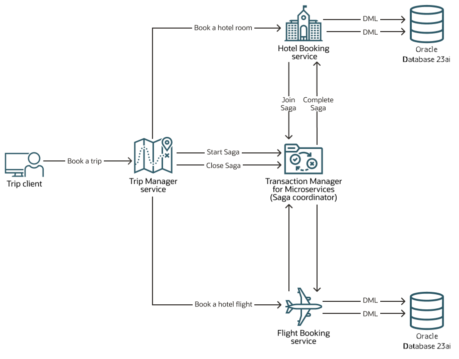
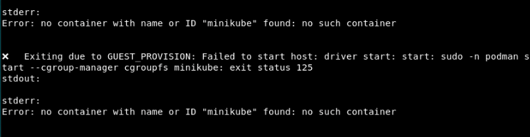
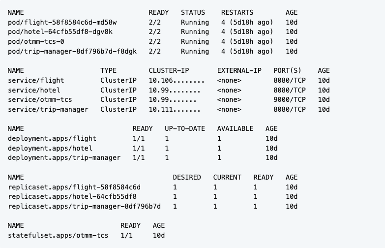
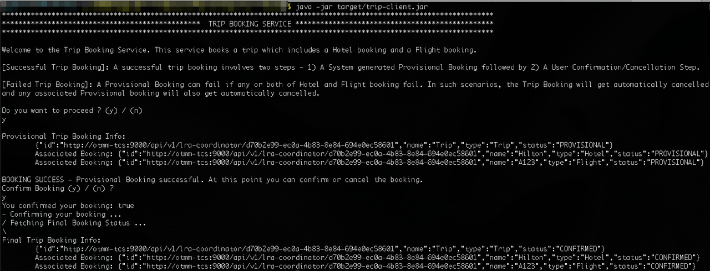
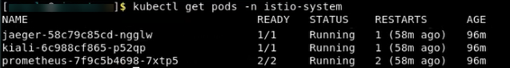
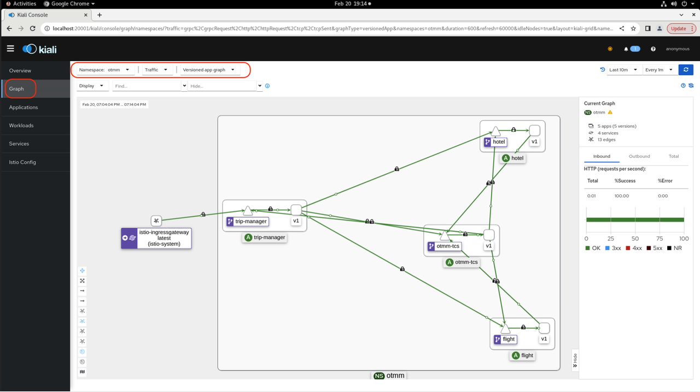
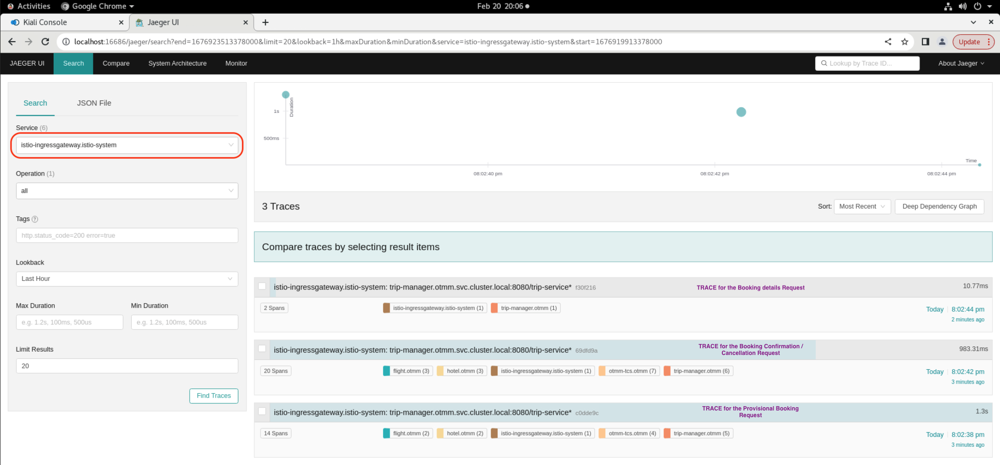
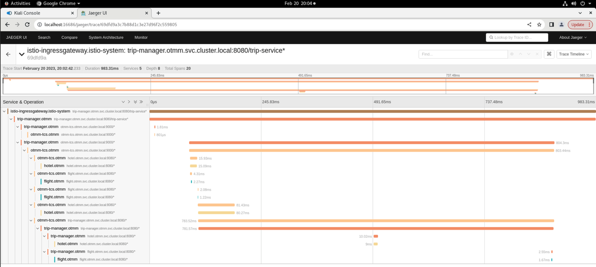

# Run Travel Agent App which Uses Saga and Lock-Free Reservation

## Introduction

Run a Travel Agent application that uses the Saga transaction protocol to book a trip and understand how you can use Oracle Transaction Manager for Microservices (MicroTx) to coordinate the transactions. The Saga transaction protocol is based on Eclipse MicroProfile Long Running Actions (LRA).

Estimated Time: *10 minutes*

Watch the video below for a quick walk-through of the lab.
[Run the Travel Agent App Using Saga](videohub:1_0g2khxyc)

### About the Travel Agent Application

The following figure shows a Travel Agent application, which contains several microservices, to demonstrate how you can develop microservices that participate in Saga transactions while using MicroTx to coordinate the transactions. When you run the application, it makes a provisional booking by reserving a hotel room and a flight ticket. The Flight Booking and Hotel Booking applications store the booking or reservation information in Oracle Database 23ai. Oracle Database 23ai are provisioned in the Minikube environment.



Only when you provide approval to confirm the provisional booking, the booking of the hotel room and flight ticket is confirmed. If you cancel the provisional booking, the hotel room and flight ticket that was blocked is released and the booking is canceled. The Flight Booking application in this example allows only two confirmed bookings by default. To test the failure scenario, the Flight Booking applications rejects any additional booking requests after two confirmed bookings. This leads to the cancellation (compensation) of a provisionally booked hotel within the trip and the trip is not booked.

When microservices use only Oracle Database 23ai as resource manager, you can use Sagas provided by Oracle Database to manage transactions. If one microservice uses Oracle Database 23ai as resource manager and other microservices use other databases, then you can use MicroTx to leverage the lock-free reservation feature introduced in Oracle Database 23ai. See [Using Lock-Free Reservation](https://docs.oracle.com/en/database/oracle/oracle-database/23/adfns/using-lock-free-reservation.html#GUID-299FDC3E-2169-4D5F-80A9-E9F704B1CEAF) in Database Development Guide.

Code for the Travel Agent application is available in the MicroTx distribution package. The MicroTx library files are already integrated with the application code. For more details, see [About the Sample Saga Application](https://docs.oracle.com/pls/topic/lookup?ctx=microtx-latest&id=TMMDG-GUID-C5332159-BD13-4210-A02E-475107919FD9) in the *Transaction Manager for Microservices Developer Guide*.

### Objectives

In this lab, you will:

* Configure Minikube
* Start a tunnel between Minikube and MicroTx
* Run the Travel Agent application
* Visualize the flow of requests (optional)
* View source code of the Travel Agent application (optional)
* Access the Oracle Database instances (optional)

### Prerequisites

This lab assumes you have:

* An Oracle Cloud account.
* Successfully completed all previous labs:
  * Get Started
  * Lab 1: Prepare setup
  * Lab 2: Environment setup
* Logged in using remote desktop URL as an `oracle` user. If you have connected to your instance as an `opc` user through an SSH terminal using auto-generated SSH Keys, then you must switch to the `oracle` user before proceeding with the next step.

      ```text
      <copy>
      sudo su - oracle
      </copy>
      ```

## Task 1: Configure Minikube

Follow the instructions in this section to start Minikube. When you start Minikube, an instance of the Oracle Database 23ai Free Release with two PDBs is deployed on Minikube. See [Oracle Database Free](https://www.oracle.com/database/free/get-started/). The Flight Booking microservice uses `FLIGHTPDB` PDB as resource manager. The Hotel Booking microservice uses `HOTELPDB` PDB as resource manager.

1. Click **Activities** in the remote desktop window to open a new terminal.

2. Run the following command to start Minikube.

    ```text
    <copy>
    minikube start
    </copy>
    ```

   In rare situations, you may the error message shown below. This message indicates that the stack resources have not been successfully provisioned. In such cases, complete **Lab 6: Environment Clean Up** to delete the stack and clean up the resources. Then perform the steps in Lab 2 to recreate the stack.

   

3. Verify that all resources, such as pods and services, are ready before proceeding to the next task. Use the following command to retrieve the list of resources in the namespace `otmm` and their status.

    ```text
    <copy>
    kubectl get all -n otmm
    </copy>
    ```

    **Example output**

   

## Task 2: Start a tunnel

Before you start a transaction, you must start a tunnel between Minikube and MicroTx. You can skip this task if you had started a tunnel earlier while running another lab.

1. Run the following command in a new terminal to start a tunnel. Keep this terminal window open.

    ```text
    <copy>
    minikube tunnel
    </copy>
    ```

2. In another new terminal, run the following command to get the external IP address of the Istio ingress gateway.

    ```text
    <copy>
    kubectl get svc istio-ingressgateway -n istio-system
    </copy>
    ```

    **Example output**

    

    From the output note down the value of `EXTERNAL-IP`, which is the external IP address of the Istio ingress gateway. You will provide this value in the next step.

    Let's consider that the value of the external IP in the above example is 192.0.2.117.

3. Store the external IP address of the Istio ingress gateway in an environment variable named `CLUSTER_IPADDR` as shown in the following command.

    ```text
    <copy>
    export CLUSTER_IPADDR=192.0.2.117
    </copy>
    ```

    Note that, if you don't do this, then you must explicitly specify the IP address when required in the commands.

4. Store the URL for the Trip Manager service, which is the transaction initiator service, in an environment variable as shown in the following command.

    **Command syntax**

    ```text
   <copy>
    export TRIP_SERVICE_URL=http://<copied-external-IP-address>/trip-service/api/sync/trip
   </copy>
    ```

    **Example command**

    ```text
    <copy>
    export TRIP_SERVICE_URL=http://192.0.2.117/trip-service/api/sync/trip
    </copy>
    ```

## Task 3: Deploy the Travel Agent Application

When you start Minikube, the Travel Agent application which uses Saga is deployed by default. Uninstall this application and reinstall the Travel Agent application which uses Saga and lock-free reservation. The Helm Chart that contains the configuration information for this application is available at `/home/oracle/OTMM/otmm-package/samples/lra/helmcharts/sampleappslra-lockfree/values.yaml`.

1. Run the following command to uninstall the Travel Agent application that uses Saga.
    ```text
    <copy>
    helm uninstall sample-lra-app -n otmm
    </copy>
    ```

2.  Deploy the Travel Agent application that uses Saga and lock-free reservation.

    ```text
    <copy>
    cd /home/oracle/OTMM/otmm-package/samples/lra/helmcharts
    helm install sample-lra-lockfree-app --namespace otmm sampleappslra-lockfree/ --values sampleappslra-lockfree/values.yaml
    </copy>
    ```

It may take upto 45 seconds to initialize the pod, so wait for a minute before you proceed to the next task.

## Task 4: Run the Travel Agent Application

Run the Travel Agent application to book a hotel room and flight ticket.

1. Run the Trip Client application.

    ```text
    <copy>
    cd /home/oracle/OTMM/otmm-package/samples/lra/lrademo/trip-client
    java -jar target/trip-client.jar
    </copy>
    ```

    The Trip Booking Service console is displayed.

2. Type **y** to confirm that you want to run the Travel Agent application, and then press Enter.
The Travel Agent application provisionally books a hotel room and a flight ticket and displays the details of the provisional booking.

3. Type **y** to confirm the provisional booking, and then press Enter.

    Your booking is confirmed and information about your confirmed booking is displayed.

   

4. Call the Trip-Service, Hotel Service and Flight Service REST APIs to view the list of the trip bookings, hotel bookings and flight bookings.

   **Example command for Trip-Service**

    ```text
    <copy>
    curl --location --request GET http://$CLUSTER_IPADDR/trip-service/api/sync/trip | jq
    </copy>
    ```

   The following image provides an example output for Trip-Service. The type is Trip and the status is CONFIRMED.


   **Example command for Hotel Service**

    ```text
    <copy>
    curl --location --request GET http://$CLUSTER_IPADDR/hotelService/api/hotel | jq
    </copy>
    ```

   **Example command for Flight Service**

    ```text
    <copy>
    curl --location --request GET http://$CLUSTER_IPADDR/flightService/api/flight | jq
    </copy>
    ```

## Task 5: Visualize the Flow of Requests (Optional)

To visualize the flow of requests between MicroTx and the distributed microservices to book a trip, use Kiali and Jaeger dashboards.

When you started Minikube while performing Task 1, Kiali, Jaeger, and Prometheus are deployed and configured. The YAML files that contain the configuration information for Kiali, Jaeger, and Prometheus are available in the `$HOME/visualizations` folder.

1. Run the following command to ensure that Kiali, Prometheus, and Jaeger are in the `Running` status.

    ```text
    <copy>
    kubectl get pods -n istio-system
    </copy>
    ```
    
    **Example output**
    

2. Start the Kiali Dashboard. Open a new tab in the terminal window and then run the following command. Leave the terminal running. If a new browser window appears, close the browser window.

    ```text
    <copy>
    istioctl dashboard kiali
    </copy>
    ```

   A URL is displayed. Open the URL in a new tab in your browser to access the Kiali dashboard. For example, `http://localhost:20001/kiali.`

3. Select Graph for the `otmm` namespace.


4. Start the Jaeger Dashboard. Open a new tab in the terminal window and then run the following command. Leave the terminal running. If a new browser window appears, close the browser window.

    ```text
    <copy>
    istioctl dashboard jaeger
    </copy>
    ```

   A URL is displayed. Open the URL in a new tab in your browser to access the Jaeger dashboard. For example, `http://localhost:16686`.

5. From the **Service** drop-down list, select **istio-ingressgateway.istio-system**.
6. Click **Find Traces**. You can see the list of traces with each trace representing a request.

7. Select one of the traces to view.


## Task 6: View Source Code of the Travel Agent Application (Optional)

The source code of the Travel Agent application is present in folder: `/home/oracle/OTMM/otmm-package/samples/lra/lockfree/springboot`.
- Trip Service Source code: `/home/oracle/OTMM/otmm-package/samples/lra/lockfree/springboot/trip-manager-springboot`
- Hotel Service Source code: `/home/oracle/OTMM/otmm-package/samples/lra/lockfree/springboot/hotel-springboot`
- Flight Service Source code: `/home/oracle/OTMM/otmm-package/samples/lra/lockfree/springboot/flight-springboot`

You can use the VIM editor to view the source code files. You can also use the Text Editor application to view the source code files. To bring up the Text Editor, click on Activities (top left) -> Show Applications -> Text Editor. Inside Text Editor, select Open a File and browse to the source code files in the folders shown above.

## Task 7: Access the Oracle Database Instances (Optional)

Use tools, such as Oracle Database SQL*Plus, to access the Oracle Database 23ai instances to view the tables and data.

1. Navigate to the folder that contains the scripts.

    ```text
    <copy>
    cd $HOME/db_access
    </copy>
    ```

2. Run the following command to access `FLIGHTPDB` PDB, which contains details for the Flight Booking application.

    ```text
    <copy>
    ./loginFlightPDB.sh
    </copy>
    ```

2. Run the following command to access `HOTELPDB` PDB, which contains details for the Hotel Booking application.

    ```text
    <copy>
    ./loginHotelPDB.sh
    </copy>
    ```

You may now **proceed to the next lab**. If you do not want to proceed further and would like to finish the LiveLabs and clean up the resources, then complete **Lab 6: Clean Up**.

## Learn More

* [Develop Applications with Saga](https://docs.oracle.com/pls/topic/lookup?ctx=microtx-latest&id=TMMDG-GUID-63827BB6-7993-40B5-A753-AC42DE97F6F4)

## Acknowledgements

* **Author** - Sylaja Kannan, Consulting User Assistance Developer
* **Contributors** - Brijesh Kumar Deo and Bharath MC
* **Last Updated By/Date** - Sylaja, August 2024
