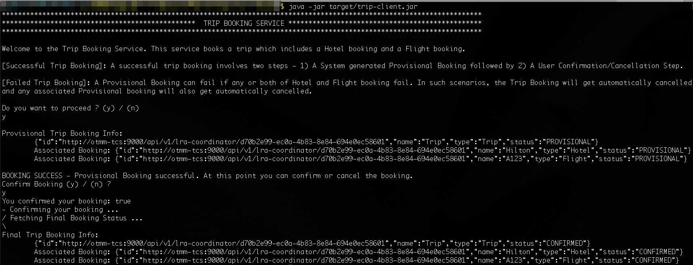

# Run an LRA Sample Application

## Introduction

Run a sample application that uses the Long Running Action (LRA) transaction protocol to book a trip and understand how you can use Transaction Manager for Microservices to coordinate the transactions. Using samples is the fastest way for you to get familiar with Transaction Manager for Microservices.
The sample application code is available in the Transaction Manager for Microservices image. The Transaction Manager for Microservices library files are already integrated with the sample application code.

Estimated Time: 10 minutes

### About LRA Sample Application

The sample application demonstrates how you can develop microservices that participate in LRA transactions while using Transaction Manager for Microservices to coordinate the transactions. When you run the application, it makes a provisional booking by reserving a hotel room and flight ticket. Only when you provide approval to confirm the booking, the booking of the hotel room and flight ticket is confirmed. If you cancel the provisional booking, the hotel room and flight ticket that was blocked is released and the booking is canceled.

The following figure shows a sample LRA application, which contains several microservices, to demonstrate how you can develop microservices that participate in LRA transactions.


For more details, see [About the Sample LRA Application](https://docs.oracle.com/en/database/oracle/transaction-manager-for-microservices/22.3/tmmdg/set-sample-applications.html#GUID-C5332159-BD13-4210-A02E-475107919FD9) in *Transaction Manager for Microservices Developer Guide*.

### Objectives

In this lab, you will:

* Configure Minikube
* Start a tunnel between Minikube and Transaction Manager for Microservices
* Run the LRA sample application

### Prerequisites

This lab assumes you have:

* An Oracle Cloud account
* Successfully completed all previous labs

## Task 1: Configure Minikube

Follow the instructions in this section to configure Minikube, and then run a sample application.

1. Open a new terminal and run the following command to start Minikube.

    ```text
    <copy>
    minikube start
    </copy>
    ```

2. Verify that all resources, such as pods and services, are ready. Use the following command to retrieve the list of resources in the namespace `otmm` and their status.

    ```text
    <copy>
    kubectl get all -n otmm
    </copy>
    ```

    The following information is displayed.

    ```text
    NAME                               READY   STATUS    RESTARTS        AGE
   pod/flight-58f8584c6d-md58w        2/2     Running   4 (5d18h ago)   10d
   pod/hotel-64cfb55df8-dgv8k         2/2     Running   4 (5d18h ago)   10d
   pod/otmm-tcs-0                     2/2     Running   4 (5d18h ago)   10d
   pod/trip-manager-8df796b7d-f8dgk   2/2     Running   4 (5d18h ago)   10d

   NAME                   TYPE        CLUSTER-IP       EXTERNAL-IP   PORT(S)    AGE
   service/flight         ClusterIP   10.106........   <none>        8080/TCP   10d
   service/hotel          ClusterIP   10.99........    <none>        8080/TCP   10d
   service/otmm-tcs       ClusterIP   10.99.......     <none>        9000/TCP   10d
   service/trip-manager   ClusterIP   10.111.......    <none>        8080/TCP   10d

   NAME                           READY   UP-TO-DATE   AVAILABLE   AGE
   deployment.apps/flight         1/1     1            1           10d
   deployment.apps/hotel          1/1     1            1           10d
   deployment.apps/trip-manager   1/1     1            1           10d

   NAME                                     DESIRED   CURRENT   READY   AGE
   replicaset.apps/flight-58f8584c6d        1         1         1       10d
   replicaset.apps/hotel-64cfb55df8         1         1         1       10d
   replicaset.apps/trip-manager-8df796b7d   1         1         1       10d

   NAME                        READY   AGE
   statefulset.apps/otmm-tcs   1/1     10d
    ```

## Task 2: Start a tunnel

Before you start a transaction, you must start a tunnel between Minikube and Transaction Manager for Microservices.

1. Run the following command in a new terminal to start a tunnel. Keep this terminal window open.

    ```text
    <copy>
    minikube tunnel
    </copy>
    ```

2. Enter the password to access your local machine if you are asked to enter your password at the command prompt.

3. In a new terminal, run the following command to note down the external IP address of the Istio ingress gateway.

    ```text
    <copy>
    kubectl get svc istio-ingressgateway -n istio-system
    </copy>
    ```

    From the output note down the value of `EXTERNAL-IP`, which is the external IP address of the Istio ingress gateway. You will provide this value in the next step.

    **Example output**

    

    Let's consider that the external IP in the above example is 192.0.2.117.

4. Set the URL for the Trip Manager service, which is the transaction initiator service.

    **Command syntax**

    ```text
    export TRIP_SERVICE_URL=http://copied-external-IP-adress/trip-service/api/trip
    ```

    **Example command**

    ```text
    <copy>
    export TRIP_SERVICE_URL=http://192.0.2.117/trip-service/api/trip
    </copy>
    ```

## Task 3: Run the LRA sample application

Run the sample LRA application to book a hotel room and flight ticket.

1. Run the Trip Client application.

    ```text
    <copy>
    cd /home/oracle/OTMM/otmm-22.3/samples/lra/lrademo/trip-client
    java -jar target/trip-client.jar
    </copy>
    ```

    The Trip Booking Service console is displayed.

2. Type **y** to confirm that you want to run the LRA sample application, and then press Enter.
The sample application provisionally books a hotel room and a flight ticket and displays the details of the provisional booking.

3. Type **y** to confirm the provisional booking, and then press Enter.

Your booking is confirmed and information about your confirmed booking is displayed.



You may now **proceed to the next lab**.

## Learn More

* [Develop Applications with LRA](https://doc.oracle.com/en/database/oracle/transaction-manager-for-microservices/22.3/tmmdg/develop-lra-applications.html#GUID-63827BB6-7993-40B5-A753-AC42DE97F6F4)

## Acknowledgements

* **Author** - Sylaja Kannan, Principal User Assistance Developer
* **Contributors** - Brijesh Kumar Deo
* **Last Updated By/Date** - Sylaja, October 2022
