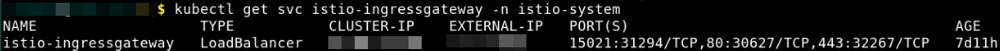
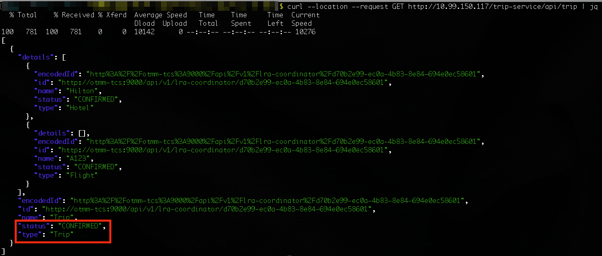
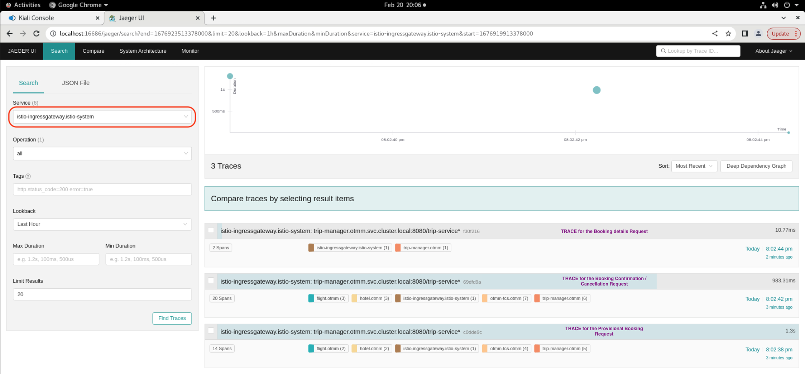

# Run an LRA Sample Application

## Introduction

Run a sample application that uses the Long Running Action (LRA) transaction protocol to book a trip and understand how you can use Transaction Manager for Microservices (MicroTx) to coordinate the transactions. Using samples is the fastest way for you to get familiar with MicroTx.
The sample application code is available in the MicroTx distribution. The MicroTx library files are already integrated with the sample application code.

Estimated Time: *10 minutes*

### About LRA Sample Application

The sample application demonstrates how you can develop microservices that participate in LRA transactions while using MicroTx to coordinate the transactions. When you run the application, it makes a provisional booking by reserving a hotel room and a flight ticket. Only when you provide approval to confirm the provisional booking, the booking of the hotel room and flight ticket is confirmed. If you cancel the provisional booking, the hotel room and flight ticket that was blocked is released and the booking is canceled. The flight service in this example allows only two confirmed bookings by default. To test the failure scenario, the flight service sample app rejects any additional booking requests after two confirmed bookings. This leads to the cancellation (compensation) of a provisionally booked hotel within the trip and the trip is not booked.

The following figure shows a sample LRA application, which contains several microservices, to demonstrate how you can develop microservices that participate in LRA transactions.


For more details, see [About the Sample LRA Application](https://docs.oracle.com/en/database/oracle/transaction-manager-for-microservices/22.3/tmmdg/set-sample-applications.html#GUID-C5332159-BD13-4210-A02E-475107919FD9) in the *Transaction Manager for Microservices Developer Guide*.

### Objectives

In this lab, you will:

* Configure Minikube
* Start a tunnel between Minikube and MicroTx
* Deploy Kiali and Jaeger in your minikube cluster (Optional)
* Run the LRA sample application
* View service graph of the mesh and distributed traces to track requests (Optional)
* View source code of the sample application (Optional)

### Prerequisites

This lab assumes you have:

* An Oracle Cloud account.
* Successfully completed all previous labs:
  * Get Started
  * Lab 1: Prepare setup
  * Lab 2: Environment setup
* Logged in using remote desktop URL as an `oracle` user. If you have connected to your instance as an `opc` user through an SSH terminal using auto-generated SSH Keys, then you must switch to the `oracle` user before proceeding with the next step.

      ```text
      <copy>
      sudo su - oracle
      </copy>
      ```

## Task 1: Configure Minikube

Follow the instructions in this section to configure Minikube, and then run a sample application.

1. Click **Activities** in the remote desktop window to open a new terminal.

2. Run the following command to start Minikube.

    ```text
    <copy>
    minikube start
    </copy>
    ```

   In rare situations, you may the error message shown below. This message indicates that the stack resources have not been successfully provisioned. In such cases, complete **Lab 6: Environment Clean Up** to delete the stack and clean up the resources. Then perform the steps in Lab 2 to recreate the stack.

   

3. Verify that all resources, such as pods and services, are ready before proceeding to the next task. Use the following command to retrieve the list of resources in the namespace `otmm` and their status.

    ```text
    <copy>
    kubectl get all -n otmm
    </copy>
    ```

    **Example output**

   

## Task 2: Start a tunnel

Before you start a transaction, you must start a tunnel between Minikube and MicroTx.

1. Run the following command in a new terminal to start a tunnel. Keep this terminal window open.

    ```text
    <copy>
    minikube tunnel
    </copy>
    ```

2. In another new terminal, run the following command to get the external IP address of the Istio ingress gateway.

    ```text
    <copy>
    kubectl get svc istio-ingressgateway -n istio-system
    </copy>
    ```

    **Example output**

    

    From the output note down the value of `EXTERNAL-IP`, which is the external IP address of the Istio ingress gateway. You will provide this value in the next step.

    Let's consider that the value of the external IP in the above example is 192.0.2.117.

3. Store the external IP address of the Istio ingress gateway in an environment variable named `CLUSTER_IPADDR` as shown in the following command.

    ```text
    <copy>
    export CLUSTER_IPADDR=192.0.2.117
    </copy>
    ```

    Note that, if you don't do this, then you must explicitly specify the IP address when required in the commands.

4. Store the URL for the Trip Manager service, which is the transaction initiator service, in an environment variable as shown in the following command.

    **Command syntax**

    ```text
   <copy>
    export TRIP_SERVICE_URL=http://<copied-external-IP-address>/trip-service/api/trip
   </copy>
    ```

    **Example command**

    ```text
    <copy>
    export TRIP_SERVICE_URL=http://192.0.2.117/trip-service/api/trip
    </copy>
    ```

## Task 3: Deploy Kiali and Jaeger in the cluster (Optional)
This optional task lets you deploy Kiali and Jaeger in the minikube cluster to view the service mesh graph and enable distributed tracing.
Distributed tracing enables tracking a request through service mesh that is distributed across multiple services. This allows a deeper understanding about request latency, serialization and parallelism via visualization.
You will be able to visualize the service mesh and the distributed traces after you have run the sample application in the following task.
The following commands can be executed to deploy Kiali and Jaeger. Kiali requires prometheus which should also be deployed in the cluster.

1. Deploy Kiali.

    ```text
    <copy>
    kubectl apply -f https://raw.githubusercontent.com/istio/istio/release-1.17/samples/addons/kiali.yaml
    </copy>
    ```
2. Deploy Prometheus.

    ```text
    <copy>
    kubectl apply -f https://raw.githubusercontent.com/istio/istio/release-1.17/samples/addons/prometheus.yaml
    </copy>
    ```
3. Deploy Jaeger.

    ```text
    <copy>
    kubectl apply -f https://raw.githubusercontent.com/istio/istio/release-1.17/samples/addons/jaeger.yaml
    </copy>
    ```
4. Start Kiali Dashboard. Open a new tab in the terminal window and execute the following command. Leave the terminal running. A browser window may pop up as well. Close the browser window.

    ```text
    <copy>
    istioctl dashboard kiali
    </copy>
    ```
   An output will show a URL on which you can access the kiali dashboard in a browser tab:
    http://localhost:20001/kiali

5. Start Jaeger Dashboard. Open a new tab in the terminal window and execute the following command. Leave the terminal running. A browser window may pop up as well. Close the browser window.

    ```text
    <copy>
    istioctl dashboard jaeger
    </copy>
    ```
   An output will show a URL on which you can access the jaeger dashboard in a browser tab:
   http://localhost:16686

## Task 4: Run the LRA sample application

Run the sample LRA application to book a hotel room and flight ticket.

1. Run the Trip Client application.

    ```text
    <copy>
    cd /home/oracle/OTMM/otmm-22.3/samples/lra/lrademo/trip-client
    java -jar target/trip-client.jar
    </copy>
    ```

    The Trip Booking Service console is displayed.

2. Type **y** to confirm that you want to run the LRA sample application, and then press Enter.
The sample application provisionally books a hotel room and a flight ticket and displays the details of the provisional booking.

3. Type **y** to confirm the provisional booking, and then press Enter.

    Your booking is confirmed and information about your confirmed booking is displayed.

   

4. Call the Trip-Service, Hotel Service and Flight Service REST APIs to view the list of the trip bookings, hotel bookings and flight bookings.

   **Example command for Trip-Service**

    ```text
    <copy>
    curl --location --request GET http://$CLUSTER_IPADDR/trip-service/api/trip | jq
    </copy>
    ```

   The following image provides an example output for Trip-Service. The type is Trip and the status is CONFIRMED.


   **Example command for Hotel Service**

    ```text
    <copy>
    curl --location --request GET http://$CLUSTER_IPADDR/hotelService/api/hotel | jq
    </copy>
    ```

   **Example command for Flight Service**

    ```text
    <copy>
    curl --location --request GET http://$CLUSTER_IPADDR/flightService/api/flight | jq
    </copy>
    ```

## Task 5: View Service Mesh graph and Distributed Traces (Optional)
You can perform this task only if you have performed Task 3. 
To visualize what happens behind the scenes and how a trip booking request is processed by the distributed services, you can use the Kiali and Jaeger Dashboards that you started in Task 3.
1. Open a new browser tab and navigate to the Kiali dashboard URL - http://localhost:20001/kiali

2. Select Graph for the otmm namespace.


3. Open a new browser tab and navigate to the Jaeger dashboard URL - http://localhost:16686
4. Select istio-ingressgateway.istio-system from the Service list. You can see the list of traces with each trace representing a request. 

5. Select one of the traces to view.


## Task 6: View source code of the sample application (Optional)
The source code of the sample application is present in folder: /home/oracle/OTMM/otmm-22.3/samples/lra/lrademo
- Trip Service Source code: /home/oracle/OTMM/otmm-22.3/samples/lra/lrademo/trip-manager
- Hotel Service Source code: /home/oracle/OTMM/otmm-22.3/samples/lra/lrademo/hotel
- Flight Service Source code: /home/oracle/OTMM/otmm-22.3/samples/lra/lrademo/flight
- Trip Client Source code: /home/oracle/OTMM/otmm-22.3/samples/lra/lrademo/trip-client 

You can use the VIM editor to view the source code files. You can also use the Text Editor application to view the source code files. To bring up the Text Editor, click on Activities (top left) -> Show Applications -> Text Editor. Inside Text Editor, select Open a File and browse to the source code files in the folders shown above.


You may now **proceed to the next lab** to run a sample XA application. If you do not want to proceed further and would like to finish the LiveLabs and clean up the resources, then complete **Lab 6: Environment Clean Up**.

## Learn More

* [Develop Applications with LRA](https://doc.oracle.com/en/database/oracle/transaction-manager-for-microservices/22.3/tmmdg/develop-lra-applications.html#GUID-63827BB6-7993-40B5-A753-AC42DE97F6F4)

## Acknowledgements

* **Author** - Sylaja Kannan, Principal User Assistance Developer
* **Contributors** - Brijesh Kumar Deo
* **Last Updated By/Date** - Sylaja, January 2023
