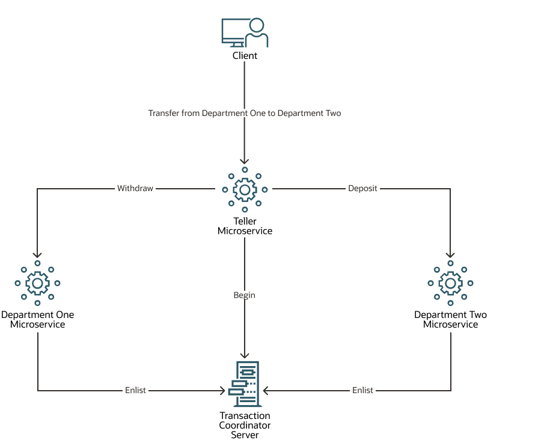
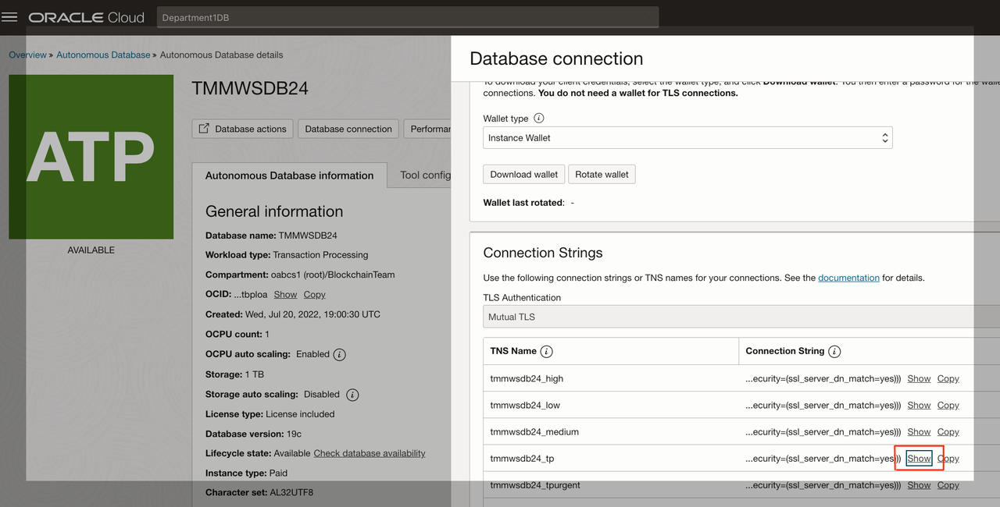
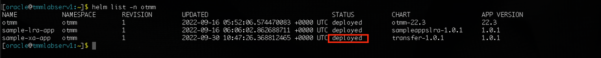
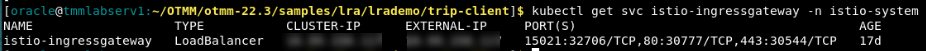

# Run an XA sample application

## Introduction

Run the XA sample application to transfer an amount from one department to another and to understand how you can use Transaction Manager for Microservices (MicroTx) to coordinate XA transactions.

The sample application code is available in the MicroTx distribution. The MicroTx library files are already integrated with the sample application code.

Estimated Lab Time: *20 minutes*

### About XA Sample Application

The following figure shows a sample XA application, which contains several microservices.


The sample application demonstrates how you can develop microservices that participate in XA transactions while using MicroTx to coordinate the transactions. When you run the Teller application, it withdraws money from one department and deposits it to another department by creating an XA transaction. Within the XA transaction, all actions such as withdraw and deposit either succeed, or they all are rolled back in case of a failure of any one or more actions.

For more details, see [About the Sample XA Application](https://docs.oracle.com/en/database/oracle/transaction-manager-for-microservices/22.3/tmmdg/set-sample-applications.html#GUID-A181E2F7-00B4-421F-9EF9-DB8BF76DD53F) in the *Transaction Manager for Microservices Developer Guide*.

### Objectives

In this lab, you will:

* Build container images for each microservice from the XA sample application code. After building the container images, the images are available in your Minikube container registry.
* Update the `values.yaml` file, which contains the deployment configuration details for the XA sample application.
* Install the Sample XA Application. While installing the sample application, Helm uses the configuration details you provide in the `values.yaml` file.
* Deploy Kiali and Jaeger in your minikube cluster (Optional and if not already deployed)
* Run an XA transaction to withdraw an amount from Department A and deposit it in Department B.
* View service graph of the mesh and distributed traces to track requests (Optional)
* View source code of the sample application (Optional)

### Prerequisites

This lab assumes you have:

* An Oracle Cloud account.
* Successfully completed the previous labs:
  * Get Started
  * Lab 1: Prepare setup
  * Lab 2: Environment setup
  * Lab 4: Provision an Oracle Autonomous Database for use as resource manager
* Logged in using remote desktop URL as an `oracle` user. If you have connected to your instance as an `opc` user through an SSH terminal using auto-generated SSH Keys, then you must switch to the `oracle` user before proceeding with the next step.

 ```text
  <copy>
  sudo su - oracle
  </copy>
  ```

## Task 1: Build Container Images for Sample XA Applications

The code for the XA sample application is available in the installation bundle in the `/home/oracle/OTMM/otmm-22.3/samples/xa/java` folder. Build container images for each microservice in the XA sample application.

To build container images for each microservice in the sample:

1. Run the following commands to build the container image for the Teller application.

    ```text
    <copy>
    cd /home/oracle/OTMM/otmm-22.3/samples/xa/java/teller
    </copy>
    ```

    ```text
    <copy>
    minikube image build -t xa-java-teller:1.0 .</copy>
    ```

   When the image is successfully built, the following message is displayed.

   **Successfully tagged xa-java-teller:1.0**

2. Run the following commands to build the Docker image for the Department 1 application.

    ```text
    <copy>
    cd /home/oracle/OTMM/otmm-22.3/samples/xa/java/department-helidon
    </copy>
    ```

    ```text
    <copy>
    minikube image build -t department-helidon:1.0 .
    </copy>
    ```

   When the image is successfully built, the following message is displayed.

   **Successfully tagged department-helidon:1.0**

3. Run the following commands to build the Docker image for the Department 2 application.

    ```text
    <copy>
    cd /home/oracle/OTMM/otmm-22.3/samples/xa/java/department-spring
    </copy>
    ```

    ```text
    <copy>
    minikube image build -t department-spring:1.0 .
    </copy>
    ```

   When the image is successfully built, the following message is displayed.

   **Successfully tagged department-spring:1.0**

The container images that you have created are available in your Minikube container registry.

## Task 2: Update the values.yaml File

The sample application files also contain the `values.yaml` file. This is the manifest file, which contains the deployment configuration details for the XA sample application.

In the `values.yaml` file, specify the image to pull, the credentials to use when pulling the images, and details to access the resource managers. While installing the sample application, Helm uses the values you provide to pull the sample application images from the Minikube container registry.

To provide the configuration and environment details in the `values.yaml` file:

1. Open the values.yaml file, which is in the `/home/oracle/OTMM/otmm-22.3/samples/xa/java/helmcharts/transfer` folder, in any code editor. This file contains sample values. Replace these sample values with values that are specific to your environment.

2. Provide the details of the ATP database instances, that you have created, in the `values.yaml` file, so that the Department A and Department B sample microservices can access the resource manager.

    * `connectString`: Enter the connect string to access the database in the following format. The host, port and service_name for the connection string can be found on the DB Connection Tab under Connection Strings as shown in screenshot below.

      **Syntax**

        ```text
        <copy>
        jdbc:oracle:thin:@tcps://<host>:<port>/<service_name>?retry_count=20&retry_delay=3&wallet_location=Database_Wallet
        </copy>
        ```

    * `databaseUser`: Enter the user name to access the database, such as SYS.
    * `databasePassword`: Enter the password to access the database for the specific user.
    * `resourceManagerId`: A unique identifier (uuid) to identify a resource manager. Enter a random value for this lab as shown below.

   The `values.yaml` file contains many properties. For readability, only the resource manager properties for which you must provide values are listed in the following sample code snippet.

    ```text
   <copy>
    dept1:
      ...
      connectString: jdbc:oracle:thin:@tcps://adb.us-ashburn-1.oraclecloud.com:1522/bbcldfxbtjvtddi_tmmwsdb3_tp.adb.oraclecloud.com?retry_count=20&retry_delay=3&wallet_location=Database_Wallet
      databaseUser: db_user
      databasePassword: db_user_password
      resourceManagerId: 77e75891-27f4-49cf-a488-7e6fece865b7
    dept2:
      ...
      connectString: jdbc:oracle:thin:@tcps://adb.us-ashburn-1.oraclecloud.com:1522/bdcldfxbtjvtddi_tmmwsdb4_tp.adb.oraclecloud.com?retry_count=20&retry_delay=3&wallet_location=Database_Wallet
      databaseUser: db_user
      databasePassword: db_user_password
      resourceManagerId: 17ff43bb-6a4d-4833-a189-56ef023158d3
   </copy>
    ```

   

3. Save your changes.

## Task 3: Install the Sample XA Application

Install the XA sample application in the `otmm` namespace, where you have installed MicroTx. While installing the sample application, Helm uses the configuration details you provide in the values.yaml file.

1. Run the following commands to install the XA sample application.

    ```text
    <copy>
    cd /home/oracle/OTMM/otmm-22.3/samples/xa/java/helmcharts
    </copy>
    ```

    ```text
    <copy>
    helm install sample-xa-app --namespace otmm transfer/ --values transfer/values.yaml
    </copy>
    ```

   Where, `sample-xa-app` is the name of the application that you want to install. You can provide another name to the installed application.

2. Verify that the application has been deployed successfully.

    ```text
    <copy>
    helm list -n otmm
    </copy>
    ```

   In the output, verify that the `STATUS` of the `sample-xa-app` is `deployed.

   **Example output**

   

3. If you need to make any changes in the `values.yaml` file, then uninstall `sample-xa-app`. Update the `values.yaml` file, and then reinstall the `sample-xa-app`. Perform step 1 as described in this task again to reinstall `sample-xa-app`.  and install it again by perform step 1. Otherwise, skip this step and go to the next step.

    ```text
    <copy>
    helm uninstall sample-xa-app --namespace otmm
    </copy>
    ```

4. Verify that all resources, such as pods and services, are ready. Proceed to the next step only when all resources are ready. Run the following command to retrieve the list of resources in the namespace `otmm` and their status.

    ```text
    <copy>
    kubectl get all -n otmm
    </copy>
    ```

## Task 4: Start a Tunnel

Before you start a transaction, you must start a Minikube tunnel.

1. Run the following command in a new terminal to start a tunnel. Keep this terminal window open.

    ```text
    <copy>
    minikube tunnel
    </copy>
    ```

2. Enter the password to access your local machine if you are asked to enter your password at the command prompt.

3. In a new terminal, run the following command to note down the external IP address of the Istio ingress gateway.

    ```text
    <copy>
    kubectl get svc istio-ingressgateway -n istio-system
    </copy>
    ```

    From the output note down the value of `EXTERNAL-IP`, which is the external IP address of the Istio ingress gateway. You will provide this value in the next step.

    **Example output**

    

    Let's consider that the external IP in the above example is 192.0.2.117.

4. Store the external IP address of the Istio ingress gateway in an environment variable named `CLUSTER_IPADDR` as shown in the following command.

    ```text
    <copy>
    export CLUSTER_IPADDR=192.0.2.117
    </copy>
    ```

    Note that, if you don't do this, then you must explicitly specify the IP address in the commands when required.

## Task 5: Deploy Kiali and Jaeger in the cluster (Optional)
**You can skip this task if you have already deployed Kiali and Jaeger in your cluster while performing Lab 3. However, ensure you have started Kiali and Jaeger dashboards as shown in steps 4 and 5.** 
This optional task lets you deploy Kiali and Jaeger in the minikube cluster to view the service mesh graph and enable distributed tracing.
Distributed tracing enables tracking a request through service mesh that is distributed across multiple services. This allows a deeper understanding about request latency, serialization and parallelism via visualization.
You will be able to visualize the service mesh and the distributed traces after you have run the sample application in the following task.
The following commands can be executed to deploy Kiali and Jaeger. Kiali requires prometheus which should also be deployed in the cluster.

1. Deploy Kiali.

    ```text
    <copy>
    kubectl apply -f https://raw.githubusercontent.com/istio/istio/release-1.17/samples/addons/kiali.yaml
    </copy>
    ```
2. Deploy Prometheus.

    ```text
    <copy>
    kubectl apply -f https://raw.githubusercontent.com/istio/istio/release-1.17/samples/addons/prometheus.yaml
    </copy>
    ```
3. Deploy Jaeger.

    ```text
    <copy>
    kubectl apply -f https://raw.githubusercontent.com/istio/istio/release-1.17/samples/addons/jaeger.yaml
    </copy>
    ```
4. Start Kiali Dashboard. Open a new tab in the terminal window and execute the following command. Leave the terminal running. A browser window may pop up as well. Close the browser window.

    ```text
    <copy>
    istioctl dashboard kiali
    </copy>
    ```
   An output will show a URL on which you can access the kiali dashboard in a browser tab:
   http://localhost:20001/kiali

5. Start Jaeger Dashboard. Open a new tab in the terminal window and execute the following command. Leave the terminal running. A browser window may pop up as well. Close the browser window.

    ```text
    <copy>
    istioctl dashboard jaeger
    </copy>
    ```
   An output will show a URL on which you can access the jaeger dashboard in a browser tab:
   http://localhost:16686

## Task 6: Run an XA Transaction

Run an XA transaction When you run the Teller application, it withdraws money from one department and deposits it to another department by creating an XA transaction. Within the XA transaction, all actions such as withdraw and deposit either succeed, or they all are rolled back in case of a failure of any one or more actions.

1. Before you start the transaction, run the following commands to check the balance in Department 1 and Department 2 accounts.

    **Example command to check balance in Department 1**

    ```text
    <copy>
    curl --location \
    --request GET 'http://$CLUSTER_IPADDR/dept1/account1' | jq
    </copy>
    ```

   **Example command to check balance in Department 2**

    ```text
    <copy>
    curl --location \
    --request GET 'http://$CLUSTER_IPADDR/dept2/account2' | jq
    </copy>
    ```

2. Transfer an amount of 50 from Department 1, account1 to Department 2, account2.

    **Example command**

    ```text
    <copy>
    curl --location \
    --request POST 'http://$CLUSTER_IPADDR/transfers' \
    --header 'Content-Type: application/json' \
    --data-raw '{"from" : "account1", "to" : "account2", "amount" : 50}'
     </copy>
    ```

    HTTP status 200 in the response indicates that the transfer was successfully completed.

3. Check balances in Department 1, account1 and Department 2, account2 to verify that the amounts reflect correctly after the transaction. Run the following commands to confirm the transaction.

    **Example command to check balance in Department 1**

    ```text
    <copy>
    curl --location \
    --request GET 'http://$CLUSTER_IPADDR/dept1/account1' | jq
    </copy>
    ```

    **Example command to check balance in Department 2**

    ```text
    <copy>
    curl --location \
    --request GET 'http://$CLUSTER_IPADDR/dept2/account2' | jq
    </copy>
    ```

4. Transfer an amount of 50 from Department 1, account1 to an account that does not exist in Department 2, such as account7. Since account7 does not exist, the deposit fails and MicroTx rolls back the withdraw action.

    **Example command**

    ```text
    <copy>
    curl --location \
    --request POST 'http://$CLUSTER_IPADDR/transfers' \
    --header 'Content-Type: application/json' \
    --data-raw '{"from" : "account1", "to" : "account7", "amount" : 50}'
    </copy>
    ```

5. Check the balance in Department 1, account 1 to verify that the account balance is correct, and no amount was withdrawn.

   **Example command**

    ```text
    <copy>
    curl --location \
    --request GET 'http://$CLUSTER_IPADDR/dept1/account1' | jq
    </copy>
    ```
## Task 7: View Service Mesh graph and Distributed Traces (Optional)
You can perform this task only if you have performed Task 5 or have Kiali and Jaeger deployed in your cluster.
To visualize what happens behind the scenes and how a trip booking request is processed by the distributed services, you can use the Kiali and Jaeger Dashboards that you started in Task 3.
1. Open a new browser tab and navigate to the Kiali dashboard URL - http://localhost:20001/kiali
2. Select Graph for the otmm namespace.
3. Open a new browser tab and navigate to the Jaeger dashboard URL - http://localhost:16686
4. Select istio-ingressgateway.istio-system from the Service list. You can see the list of traces with each trace representing a request.
5. Select one of the traces to view.

## Task 8: View source code of the sample application (Optional)
The source code of the sample application is present in folder: /home/oracle/OTMM/otmm-22.3/samples/xa/java
- Teller Service Source code: /home/oracle/OTMM/otmm-22.3/samples/xa/java/teller
- Department 1 Service Source code: /home/oracle/OTMM/otmm-22.3/samples/xa/java/department-helidon
- Department 2 Service Source code: /home/oracle/OTMM/otmm-22.3/samples/xa/java/department-spring

You can use the VIM editor to view the source code files. You can also use the Text Editor application to view the source code files.
To bring up the Text Editor, click on Activities (top left) -> Show Applications -> Text Editor. Inside Text Editor, select Open a File and browse to the source code files in the folders shown above.


## Learn More

* [Develop Applications with XA](http://docs.oracle.com/en/database/oracle/transaction-manager-for-microservices/22.3/tmmdg/develop-xa-applications.html#GUID-D9681E76-3F37-4AC0-8914-F27B030A93F5)

## Acknowledgements

* **Author** - Sylaja Kannan, Principal User Assistance Developer
* **Contributors** - Brijesh Kumar Deo
* **Last Updated By/Date** - Sylaja, January 2023
