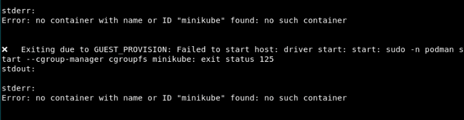
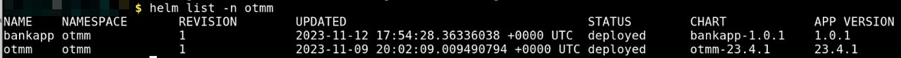
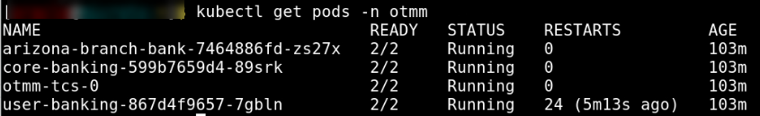
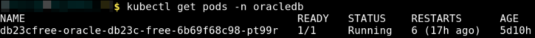

# Run Transfer App which Uses XA

## Introduction

Run the Transfer application, which uses the XA transaction protocol, to transfer an amount from one department to another. Run this application to understand how you can use Transaction Manager for Microservices (MicroTx) to coordinate XA transactions.

Estimated Lab Time: *10 minutes*

Watch the video below for a quick walk-through of the lab.
[Run the Transfer Application](videohub:1_ta8uv36s)

### About the Transfer Application

The following figure shows the various microservices that are available in the Transfer application.


The Transfer application demonstrates how you can develop microservices that participate in XA transactions while using MicroTx to coordinate the transactions. When you run the Teller application, it withdraws money from one department and deposits it to another department by creating an XA transaction. Within the XA transaction, all actions such as withdraw and deposit either succeed, or they all are rolled back in case of a failure of any one or more actions.

For more details, see [About the Transfer Application](https://docs.oracle.com/en/database/oracle/transaction-manager-for-microservices/23.4.1/tmmdg/set-sample-applications.html#GUID-A181E2F7-00B4-421F-9EF9-DB8BF76DD53F) in the *Transaction Manager for Microservices Developer Guide*.

### Objectives

In this lab, you will:

* Start Minikube. When you start Minikube, the Transfer application is deployed and the database instances are created and populated with sample data.
* Deploy Kiali and Jaeger in your minikube cluster (Optional and if not already deployed)
* Run the Transfer application to start an XA transaction to withdraw an amount from Department A and deposit it in Department B.
* View service graph of the mesh and distributed traces to track requests (Optional)
* View source code of the Transfer application (Optional)

### Prerequisites

This lab assumes you have:

* An Oracle Cloud account.
* Successfully completed the previous labs:
  * Get Started
  * Lab 1: Prepare setup
  * Lab 2: Environment setup
* Logged in using remote desktop URL as an `oracle` user. If you have connected to your instance as an `opc` user through an SSH terminal using auto-generated SSH Keys, then you must switch to the `oracle` user before proceeding with the next step.

 ```text
  <copy>
  sudo su - oracle
  </copy>
  ```

## Task 1: Start Minikube

Code for the Transfer application is available in the MicroTx distribution. The MicroTx library files are already integrated with the application code. Container images, for each microservice in the application, are already built and available in your Minikube container registry. The `values.yaml` file is available in the `/home/oracle/OTMM/otmm-23.4.1/samples/xa/java/helmcharts/transfer` folder. This is the manifest file, which contains the deployment configuration details for the application.

When you start Minikube, an instance of the Oracle Database 23c Free Release, with two PDBs, is deployed on Minikube. See [Oracle Database Free](https://www.oracle.com/database/free/get-started). Department 1 microservice, which is developed using the Helidon framework, uses PDB (FREEPDB1) as resource manager. Department 2 microservice, which is developed using the Spring Boot framework, uses another PDB (FREEPDB2) as resource manager. Each PDB contains an `accounts` table with `account_id` as the primary key. The `accounts` table is populated with the following sample data. The `values.yaml` file also contains the details to access the resource managers.

| Account_ID  | Amount    |
| ----------- | --------- |
| account5    | 5000      |
| account4    | 4000      |
| account3    | 3000      |
| account2    | 2000      |
| account1    | 1000      |
{: title="Amount in the various accounts"}

When you start Minikube, the Transfer application is deployed and the database instances are created and populated with sample data.

Follow the instructions in this section to start Minikube, and then verify that all the resources are ready.

1. Click **Activities** in the remote desktop window to open a new terminal.

2. Run the following command to start Minikube.

    ```text
    <copy>
    minikube start
    </copy>
    ```

   In rare situations, you may the error message shown below. This message indicates that the stack resources have not been successfully provisioned. In such cases, complete **Lab 6: Environment Clean Up** to delete the stack and clean up the resources. Then perform the steps in Lab 2 to recreate the stack.

   

3. Verify that the application has been deployed successfully.

    ```text
    <copy>
    helm list -n otmm
    </copy>
    ```

   In the output, verify that the `STATUS` of the `bankapp` is `deployed.

   **Example output**

   

4. Verify that all resources, such as pods and services, are ready. Run the following command to retrieve the list of resources in the namespace `otmm` and their status.

    ```text
    <copy>
    kubectl get pods -n otmm
    </copy>
    ```
   **Example output**

   

5. Verify that the database instance is running. The database instance is available in the `oracledb` namespace.  Run the following command to retrieve the list of resources in the namespace `oracledb` and their status.

    ```text
    <copy>
    kubectl get pods -n oracledb
    </copy>
    ```

   **Example output**

   

It usually takes some time for the Database services to start running in the Minikube environment. Proceed with the remaining tasks only after ensuring that all the resources, including the database service, are ready and in the 'RUNNING` status.

## Task 2: Start a Minikube Tunnel

Before you start a transaction, you must start a Minikube tunnel.

1. Run the following command in a new terminal to start a tunnel. Keep this terminal window open.

    ```text
    <copy>
    minikube tunnel
    </copy>
    ```

2. Enter the password to access your local machine if you are asked to enter your password at the command prompt.

3. In a new terminal, run the following command to note down the external IP address of the Istio ingress gateway.

    ```text
    <copy>
    kubectl get svc istio-ingressgateway -n istio-system
    </copy>
    ```

    From the output note down the value of `EXTERNAL-IP`, which is the external IP address of the Istio ingress gateway. You will provide this value in the next step.

    **Example output**

    

    Let's consider that the external IP in the above example is 192.0.2.117.

4. Store the external IP address of the Istio ingress gateway in an environment variable named `CLUSTER_IPADDR` as shown in the following command.

    ```text
    <copy>
    export CLUSTER_IPADDR=192.0.2.117
    </copy>
    ```

    Note that, if you don't do this, then you must explicitly specify the IP address in the commands when required.

## Task 3: Deploy Kiali and Jaeger in the cluster (Optional)

**Skip this task if you have already deployed Kiali and Jaeger in your cluster while performing Lab 3. However, ensure you have started Kiali and Jaeger dashboards as shown in steps 4 and 5.**

Use distributed tracing to understand how requests flow between MicroTx and the microservices. Use tools, such as Kiali and Jaeger, to track and trace distributed transactions in MicroTx. Kiali requires Prometheus, so deploy Prometheus in the same cluster.

Run the following commands to deploy Kiali and Jaeger.

1. Deploy Kiali.

    ```text
    <copy>
    kubectl apply -f https://raw.githubusercontent.com/istio/istio/release-1.17/samples/addons/kiali.yaml
    </copy>
    ```

2. Deploy Prometheus.

    ```text
    <copy>
    kubectl apply -f https://raw.githubusercontent.com/istio/istio/release-1.17/samples/addons/prometheus.yaml
    </copy>
    ```

3. Deploy Jaeger.

    ```text
    <copy>
    kubectl apply -f https://raw.githubusercontent.com/istio/istio/release-1.17/samples/addons/jaeger.yaml
    </copy>
    ```

4. Start the Kiali dashboard. Open a new tab in the terminal window and then run the following command. Leave the terminal running. If a new browser window appears, close the browser window.

    ```text
    <copy>
    istioctl dashboard kiali
    </copy>
    ```

   A URL is displayed. Open the URL in a new tab in your browser to access the Kiali dashboard. For example, `http://localhost:20001/kiali`.

5. Start the Jaeger dashboard. Open a new tab in the terminal window and then run the following command. Leave the terminal running. If a new browser window appears, close the browser window.

    ```text
    <copy>
    istioctl dashboard jaeger
    </copy>
    ```

   A URL is displayed. Open the URL in a new tab in your browser to access the Jaeger dashboard. For example, `http://localhost:16686`.

## Task 4: Run the Transfer Application

When you run the Transfer application, it starts an XA transaction. The Teller application is the transaction initiator service, it initiates the transaction. When the Teller application runs, it withdraws money from Department A and deposits it to Department B by creating an XA transaction. Within the XA transaction, all actions such as withdraw and deposit either succeed, or they all are rolled back in case of a failure of any one or more actions.

1. Before you start the transaction, run the following commands to check the balance in the Department 1 and Department 2 accounts.

    **Example command to check balance in Department 1**

    ```text
    <copy>
    curl --location \
    --request GET http://$CLUSTER_IPADDR/dept1/account1 | jq
    </copy>
    ```

   **Example command to check balance in Department 2**

    ```text
    <copy>
    curl --location \
    --request GET http://$CLUSTER_IPADDR/dept2/account2 | jq
    </copy>
    ```

2. Transfer an amount of 50 from Department 1, account1 to Department 2, account2.

    **Example command**

    ```text
    <copy>
    curl --location \
    --request POST http://$CLUSTER_IPADDR/transfers \
    --header 'Content-Type: application/json' \
    --data-raw '{"from" : "account1", "to" : "account2", "amount" : 50}'
     </copy>
    ```

    HTTP status 200 in the response indicates that the transfer was successfully completed.

3. Check balances in Department 1, account1 and Department 2, account2 to verify that the amounts reflect correctly after the transaction. Run the following commands to confirm the transaction.

    **Example command to check balance in Department 1**

    ```text
    <copy>
    curl --location \
    --request GET http://$CLUSTER_IPADDR/dept1/account1 | jq
    </copy>
    ```

    **Example command to check balance in Department 2**

    ```text
    <copy>
    curl --location \
    --request GET http://$CLUSTER_IPADDR/dept2/account2 | jq
    </copy>
    ```

4. Transfer an amount of 50 from Department 1, account1 to an account that does not exist in Department 2, such as account7. Since account7 does not exist, the deposit fails and MicroTx rolls back the withdraw action.

    **Example command**

    ```text
    <copy>
    curl --location \
    --request POST http://$CLUSTER_IPADDR/transfers \
    --header 'Content-Type: application/json' \
    --data-raw '{"from" : "account1", "to" : "account7", "amount" : 50}'
    </copy>
    ```

5. Check the balance in Department 1, account 1 to verify that the account balance is correct, and no amount was withdrawn.

   **Example command**

    ```text
    <copy>
    curl --location \
    --request GET http://$CLUSTER_IPADDR/dept1/account1 | jq
    </copy>
    ```

## Task 5: View the Service Mesh Graph and Distributed Traces (Optional)

You can perform this task only if you have performed Task 3 or if Kiali and Jaeger is deployed in your cluster.
To visualize what happens behind the scenes and how the amount transfer request is processed by the distributed services, you can use the Kiali and Jaeger Dashboards that you had started in Task 3.

1. Open a new browser tab and navigate to the Kiali dashboard URL. For example, `http://localhost:20001/kiali`.
2. Select Graph for the `otmm` namespace.
3. Open a new browser tab and navigate to the Jaeger dashboard URL. For example, `http://localhost:16686`.
4. From the **Service** drop-down list, select **istio-ingressgateway.istio-system**.
5. Click **Find Traces**. You can see the list of traces with each trace representing a request.
6. Select one of the traces to view.

## Task 6: View Source Code of the Transfer Application (Optional)

The source code of the application is present in folder: /home/oracle/OTMM/otmm-23.4.1/samples/xa/java
- Teller Service Source code: /home/oracle/OTMM/otmm-23.4.1/samples/xa/java/teller
- Department 1 Service Source code: /home/oracle/OTMM/otmm-23.4.1/samples/xa/java/department-helidon
- Department 2 Service Source code: /home/oracle/OTMM/otmm-23.4.1/samples/xa/java/department-spring

You can use the VIM editor to view the source code files. You can also use the Text Editor application to view the source code files.
To bring up the Text Editor, click on Activities (top left) -> Show Applications -> Text Editor. Inside Text Editor, select Open a File and browse to the source code files in the folders shown above.

## Learn More

* [Develop Applications with XA](http://docs.oracle.com/en/database/oracle/transaction-manager-for-microservices/23.4.1/tmmdg/develop-xa-applications.html#GUID-D9681E76-3F37-4AC0-8914-F27B030A93F5)

## Acknowledgements

* **Author** - Sylaja Kannan, Consulting User Assistance Developer
* **Contributors** - Brijesh Kumar Deo and Bharath MC
* **Last Updated By/Date** - Sylaja Kannan, November 2023
