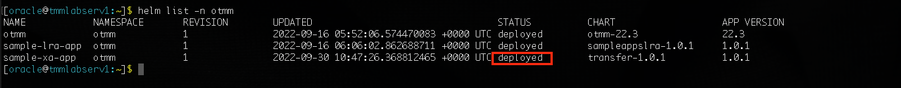

# Run an XA sample application

## Introduction

Run the XA sample application to transfer an amount from one department to another and to understand how you can use Transaction Manager for Microservices to coordinate XA transactions.

The sample application code is available in the Transaction Manager for Microservices distribution. The Transaction Manager for Microservices library files are already integrated with the sample application code.

Estimated Lab Time: 20 minutes

### About XA Sample Application

The following figure shows a sample XA application, which contains several microservices.


The sample application demonstrates how you can develop microservices that participate in XA transactions while using Transaction Manager for Microservices to coordinate the transactions. When you run the Teller application, it withdraws money from one department and deposits it to another department by creating an XA transaction. Within the XA transaction, all actions such as withdraw and deposit either succeed, or they all are rolled back in case of a failure of any one or more actions.

For more details, see [About the Sample XA Application](https://docs.oracle.com/en/database/oracle/transaction-manager-for-microservices/22.3/tmmdg/set-sample-applications.html#GUID-A181E2F7-00B4-421F-9EF9-DB8BF76DD53F) in *Transaction Manager for Microservices Developer Guide*.

### Objectives

In this lab, you will:

* Build container images for each microservice from the XA sample application code. After building the container images, the images are available in your Minikube container registry.
* Update the `values.yaml` file, which contains the deployment configuration details for the XA sample application.
* Install the Sample XA Application. While installing the sample application, Helm uses the configuration details you provide in the `values.yaml` file.
* Run an XA transaction to withdraw an amount from Department A and deposit it in Department B.

### Prerequisites

This lab assumes you have:

* An Oracle Cloud account
* Successfully completed all previous labs
* Logged in using remote desktop URL as oracle user. If you have connected to your instance via an SSH terminal using auto-generated SSH Keys as opc user, then change user to oracle before proceeding with the next step.

 ```text
  <copy>
  sudo su - oracle
  </copy>
  ```

## Task 1: Build Container Images for Sample XA Applications

The code for the XA sample application is available in the installation bundle in the `/home/oracle/OTMM/otmm-22.3/samples/xa/java` folder. Build container images for each microservice in the XA sample application.

To build container images for each microservice in the sample:

1. Run the following commands to build the container image for the Teller application.

    ```text
    <copy>
    cd /home/oracle/OTMM/otmm-22.3/samples/xa/java/teller
    </copy>
    ```

    ```text
    <copy>
    minikube image build -t xa-java-teller:1.0 .</copy>
    ```

   When the image is successfully built, the following message is displayed.

   **Successfully tagged xa-java-teller:1.0**

2. Run the following commands to build the Docker image for the Department 1 application.

    ```text
    <copy>
    cd /home/oracle/OTMM/otmm-22.3/samples/xa/java/department-helidon
    </copy>
    ```

    ```text
    <copy>
    minikube image build -t department-helidon:1.0 .
    </copy>
    ```

   When the image is successfully built, the following message is displayed.

   **Successfully tagged department-helidon:1.0**

3. Run the following commands to build the Docker image for the Department 2 application.

    ```text
    <copy>
    cd /home/oracle/OTMM/otmm-22.3/samples/xa/java/department-spring
    </copy>
    ```

    ```text
    <copy>
    minikube image build -t department-spring:1.0 .
    </copy>
    ```

   When the image is successfully built, the following message is displayed.

   **Successfully tagged department-spring:1.0**


The container images that you have created are available in your Minikube container registry.

## Task 2: Update the values.yaml File

The sample application files also contain the `values.yaml` file. This is the manifest file, which contains the deployment configuration details for the XA sample application.

In the `values.yaml` file, specify the image to pull, the credentials to use when pulling the images, and details to access the resource managers. While installing the sample application, Helm uses the values you provide to pull the sample application images from the Minikube container registry.

To provide the configuration and environment details in the `values.yaml` file:

1. Open the values.yaml file, which is in the `/home/oracle/OTMM/otmm-22.3/samples/xa/java/helmcharts/transfer` folder, in any code editor. This file contains sample values. Replace these sample values with values that are specific to your environment.

2. Provide the details of the ATP database instances, that you have created, in the `values.yaml` file, so that the Department A and Department B sample microservices can access the resource manager.

    * `connectString`: Enter the connect string to access the database in the following format. The host, port and service_name for the connection string can be found on the DB Connection Tab under Connection Strings as shown in screenshot below.

      **Syntax**

        ```text
        <copy>
        jdbc:oracle:thin:@tcps://<host>:<port>/<service_name>?retry_count=20&retry_delay=3&wallet_location=Database_Wallet
        </copy>
        ```

    * `databaseUser`: Enter the user name to access the database, such as SYS.
    * `databasePassword`: Enter the password to access the database for the specific user.
    * `resourceManagerId`: A unique identifier (uuid) to identify a resource manager. Enter a random value for this lab as shown below.
   
   The `values.yaml` file contains many properties. For readability, only the resource manager properties for which you must provide values are listed in the following sample code snippet.

    ```text
   <copy>
    dept1:
      ...
      connectString: jdbc:oracle:thin:@tcps://adb.us-ashburn-1.oraclecloud.com:1522/bbcldfxbtjvtddi_tmmwsdb3_tp.adb.oraclecloud.com?retry_count=20&retry_delay=3&wallet_location=Database_Wallet
      databaseUser: db_user
      databasePassword: db_user_password
      resourceManagerId: 77e75891-27f4-49cf-a488-7e6fece865b7
    dept2:
      ...
      connectString: jdbc:oracle:thin:@tcps://adb.us-ashburn-1.oraclecloud.com:1522/bdcldfxbtjvtddi_tmmwsdb4_tp.adb.oraclecloud.com?retry_count=20&retry_delay=3&wallet_location=Database_Wallet
      databaseUser: db_user
      databasePassword: db_user_password
      resourceManagerId: 17ff43bb-6a4d-4833-a189-56ef023158d3
   </copy>
    ```


3. Save your changes.

## Task 3: Install the Sample XA Application

Install the XA sample application in the `otmm` namespace, where Transaction Manager for Microservices is installed. While installing the sample application, Helm uses the configuration details you provide in the values.yaml file.

1. Run the following commands to install the XA sample application.

    ```text
    <copy>
    cd /home/oracle/OTMM/otmm-22.3/samples/xa/java/helmcharts
    </copy>
    ```

    ```text
    <copy>
    helm install sample-xa-app --namespace otmm transfer/ --values transfer/values.yaml
    </copy>
    ```

   Where, `sample-xa-app` is the name of the application that you want to install. You can provide another name to the installed application. 
2. Verify that the application has been deployed successfully.
   ```text
    <copy>
    helm list -n otmm
    </copy>
    ```
   An output showing the application status as deployed confirms successful deployment.

   
3. If you need to make any changes in the values.yaml file and reinstall the `sample-xa-app`, then you can uninstall the `sample-xa-app` and install it again by performing step 1 above. Otherwise, skip this step and go to the next step.
   ```text
    <copy>
    helm uninstall sample-xa-app --namespace otmm
    </copy>
    ```
4. Verify that all resources, such as pods and services, are ready. Proceed to the next step only when all resources are ready. Run the following command to retrieve the list of resources in the namespace `otmm` and their status.

    ```text
    <copy>
    kubectl get all -n otmm
    </copy>
    ```

## Task 4: Start a Tunnel

Before you start a transaction, you must start Minikube tunnel.

1. Run the following command in a new terminal to start a tunnel. Keep this terminal window open.

    ```text
    <copy>
    minikube tunnel
    </copy>
    ```

2. Enter the password to access your local machine if you are asked to enter your password at the command prompt.

3. In a new terminal, run the following command to note down the external IP address of the Istio ingress gateway.

    ```text
    <copy>
    kubectl get svc istio-ingressgateway -n istio-system
    </copy>
    ```

    From the output note down the value of `EXTERNAL-IP`, which is the external IP address of the Istio ingress gateway. You will provide this value in the next step.

    **Example output**

    

    Let's consider that the external IP in the above example is 192.0.2.117.

## Task 5: Run an XA Transaction

Run an XA transaction When you run the Teller application, it withdraws money from one department and deposits it to another department by creating an XA transaction. Within the XA transaction, all actions such as withdraw and deposit either succeed, or they all are rolled back in case of a failure of any one or more actions.

1. Before you start the transaction, run the following commands to check the balance in Department 1 and Department 2 accounts.

    **Example command to check balance in Department 1**

    ```text
    <copy>
    curl --location \
    --request GET 'http://192.0.2.117/dept1/account1' | jq
    </copy>
    ```

   **Example command to check balance in Department 2**

    ```text
    <copy>
    curl --location \
    --request GET 'http://192.0.2.117/dept2/account2' | jq
    </copy>
    ```

    Where, `192.0.2.117` is the external IP address of the Istio ingress gateway. Replace this with a value specific to your environment.

2. Transfer an amount of 50 from Department 1, account1 to Department 2, account2.

    **Example command**

    ```text
    <copy>
    curl --location \
    --request POST 'http://192.0.2.117/transfers' \
    --header 'Content-Type: application/json' \
    --data-raw '{"from" : "account1", "to" : "account2", "amount" : 50}'
     </copy>
    ```

    Where, `192.0.2.117` is the external IP address of the Istio ingress gateway. Replace this with a value specific to your environment. An http response status 200 indicates a successful transfer.

3. Check balances in Department 1, account1 and Department 2, account2 to verify that the amounts reflect correctly after the transaction. Run the following commands to confirm the transaction.

    **Example command to check balance in Department 1**

    ```text
    <copy>
    curl --location \
    --request GET 'http://192.0.2.117/dept1/account1' | jq
    </copy>
    ```

    **Example command to check balance in Department 2**

    ```text
    <copy>
    curl --location \
    --request GET 'http://192.0.2.117/dept2/account2' | jq
    </copy>
    ```

    Where, `192.0.2.117` is the external IP address of the Istio ingress gateway. Replace this with a value specific to your environment.

4. Transfer an amount of 50 from Department 1, account1 to an account that does not exist in Department 2, such as account7. Since account7 does not exist, the deposit fails and Transaction Manager for Microservices rolls back the withdraw action.

    **Example command**

    ```text
    <copy>
    curl --location \
    --request POST 'http://192.0.2.117/transfers' \
    --header 'Content-Type: application/json' \
    --data-raw '{"from" : "account1", "to" : "account7", "amount" : 50}'
    </copy>
    ```

    Where, `192.0.2.117` is the external IP address of the Istio ingress gateway. Replace this with a value specific to your environment.

5. Check the balance in Department 1, account 1 to verify that the account balance is correct, and no amount was withdrawn.

   **Example command**

    ```text
    <copy>
    curl --location \
    --request GET 'http://192.0.2.117/dept1/account1' | jq
    </copy>
    ```

    Where, `192.0.2.117` is the external IP address of the Istio ingress gateway. Replace this with a value specific to your environment.

## Task 6: Clean up the livelabs stack

Perform this task only if you want to clean up the livelabs stack provisioned using Resource Manager. Performing this task will delete all the stack resources including the remote desktop instance.


1. Open the navigation menu and click Developer Services. Under Resource Manager, click Stacks.
2. Choose a compartment that you have permission to work in (on the left side of the page).
3. Click the name of the stack that you want.
4. The Stack details page opens.
5. Click on Destroy to delete the stack resources.
6. Confirm the operation when prompted.
7. After the Destroy job is completed, go to More actions on the Stack details page and then select Delete stack.
8. Confirm the operation when prompted.


## Learn More

* [Develop Applications with XA](http://docs.oracle.com/en/database/oracle/transaction-manager-for-microservices/22.3/tmmdg/develop-xa-applications.html#GUID-D9681E76-3F37-4AC0-8914-F27B030A93F5)

## Acknowledgements

* **Author** - Sylaja Kannan, Principal User Assistance Developer
* **Contributors** - Brijesh Kumar Deo
* **Last Updated By/Date** - Sylaja, October 2022
