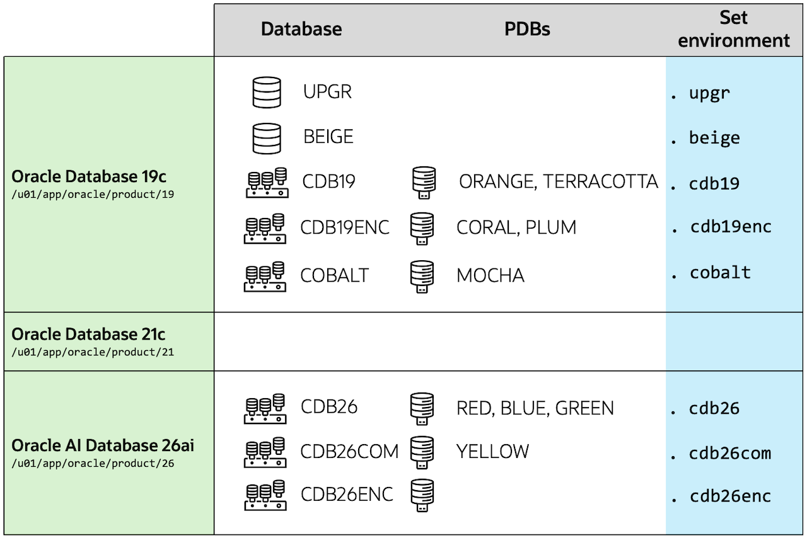

# Introduction

## About this Workshop

Oracle AI Database 26ai is a *Long Term Support Release*. This lab demonstrates an upgrade approach, and equips you with performance features and tools to ensure stability when you move to any new Oracle AI Database release. By upgrading to Oracle AI Database 26ai, you will have Premier Support until the end of 2031 and Extended Support for a period thereafter. There is a direct upgrade path to Oracle AI Database 26ai from Oracle Database 19c and 21c, regardless of the Release Update applied. From Oracle Database 23ai, you simply patch your database to update to Oracle AI Database 26ai.

Estimated Workshop Time: 60 minutes

### Objectives

In this workshop, you will:

* Upgrade the database to Oracle AI Database 26ai
* Use Performance Stability Prescription to ensure performance stability
* Convert to multitenant architecture

## About the workshop contents

This workshop comes with pre-installed Oracle homes and pre-created databases.
You can switch between environments with the shortcuts shown in the last column of the below diagram.

The workshop contains 9 labs.

## AutoUpgrade

* AutoUpgrade is the only recommended tool to upgrade Oracle AI Database. Whether you want to upgrade only one or thousands of databases, AutoUpgrade performs not only the upgrade but also all the pre and post-upgrade tasks. It can upgrade many databases in parallel and allows all sorts of customizations needed in today's complex environments. Furthermore, AutoUpgrade can also plugin your database into a precreated CDB and does the conversion of a non-CDB into a PDB fully unattended. AutoUpgrade works on all supported platforms, for non-CDB and CDBs, for all or only selected pluggable databases.

You may now [*proceed to the next lab*](#next).

## Learn More

* Documentation, [Database Upgrade Guide](https://docs.oracle.com/en/database/oracle/oracle-database/26/upgrd/intro-to-upgrading-oracle-database.html)
* Blog, [Upgrade your Database - NOW!](https://MikeDietrichDE.com)
* My Oracle Support, [Release Schedule of Current Database Releases (Doc ID 742060.1)](https://support.oracle.com/epmos/faces/DocumentDisplay?id=742060.1&displayIndex=1)

## Acknowledgements

* **Author** - Daniel Overby Hansen
* **Contributors** - Klaus Gronau, Rodrigo Jorge, Alex Zaballa, Mike Dietrich, Alejandro Diaz
* **Last Updated By/Date** - Rodrigo Jorge, August 2026
