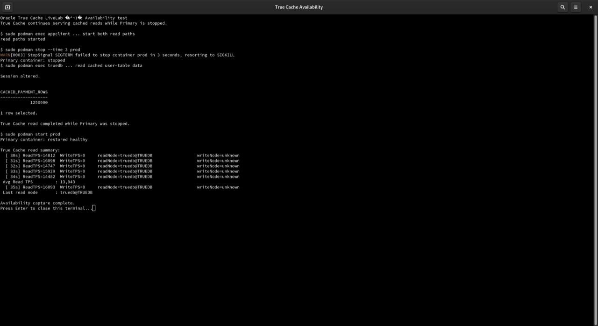

# Availability and Failover

## Introduction

This lab demonstrates that True Cache can continue serving eligible read-only work while the Primary database is stopped, then verifies that the Primary service is restored before the lab ends.

*Estimated Time:* 15 minutes.

### Objectives

- Verify that True Cache continues serving eligible reads while Primary is stopped.
- Restore Primary and confirm that its database service becomes healthy again.

Complete the performance comparison lab first. Use the application-container shell for the read workloads and the host terminal for container stop, health, and restore commands.

## Task 1: Start Both Read Workloads

From the application-container shell, run:

~~~text
<copy>
cd /stage/clientapp
pkill -f '[T]ransactions_TrueCache' || true
READ_ONLY_WORKLOAD=true DIRECT_READ_ONLY=true DISABLE_TRUECACHE_PROPERTY=true URL=172.20.1.2:1521/sales1 THREADS=10 DURATION=120 METRICS_PORT=9092 ./TransactionsApp.sh primary >/tmp/availability-primary.log 2>&1 &
PRIMARY_PID=$!
sleep 2
READ_ONLY_WORKLOAD=true DIRECT_READ_ONLY=true DISABLE_TRUECACHE_PROPERTY=true ALLOW_DIRECT_FALLBACK=true DIRECT_FALLBACK_URL=172.20.1.98:1521/SALES1_TC URL=172.20.1.98:1521/SALES1_TC THREADS=10 DURATION=120 METRICS_PORT=9093 ./TransactionsApp.sh truecache >/tmp/availability-truecache.log 2>&1 &
TRUECACHE_PID=$!
pgrep -af '[T]ransactions_TrueCache'
</copy>
~~~

## Task 2: Stop Primary and Verify True Cache

From the host terminal, stop Primary:

~~~text
<copy>
sudo podman stop --time 3 prod
sudo podman ps --format 'table {{.Names}}\t{{.Status}}'
</copy>
~~~

Open the True Cache container from the host terminal:

~~~text
<copy>
sudo podman exec -it truedb /bin/bash
</copy>
~~~

At the `truedb` container prompt, verify its role and read service:

~~~text
<copy>
export ORACLE_SID=TRUEDB
sqlplus / as sysdba
set pages 100 lines 180
select database_role, open_mode from v$database;
alter session set container=ORCLPDB1;
select name, network_name from v$services where upper(name) = 'SALES1_TC';
exit
exit
</copy>
~~~

Review the True Cache workload from the application-container shell:

~~~text
<copy>
grep -E 'ReadTPS|Read TPS|readNode' /tmp/availability-truecache.log | tail -20
</copy>
~~~

The True Cache process should continue reporting eligible reads while Primary is stopped.

## Task 3: Restore Primary and Confirm Recovery

From the host terminal, restore Primary and wait for its health check:

~~~text
<copy>
sudo podman start prod
for attempt in $(seq 1 36); do
  status=$(sudo podman inspect --format '{{.State.Status}}|{{.State.Health.Status}}' prod 2>/dev/null || true)
  echo "prod: $status"
  if [ "$status" = "running|healthy" ]; then
    break
  fi
  sleep 5
done
if [ "$status" != "running|healthy" ]; then
  echo "prod did not become healthy within 3 minutes; do not continue."
  exit 1
fi
sudo podman ps --format 'table {{.Names}}\t{{.Status}}'
</copy>
~~~

After `prod` reports `running|healthy`, verify its role and service from the Primary container:

~~~text
<copy>
sudo podman exec -it prod /bin/bash
</copy>
~~~

~~~text
<copy>
export ORACLE_SID=ORCLCDB
sqlplus / as sysdba
set pages 100 lines 180
select database_role, open_mode from v$database;
alter session set container=ORCLPDB1;
declare
  l_active number;
begin
  select count(*) into l_active from v$active_services where upper(name) = 'SALES1';
  if l_active = 0 then
    dbms_service.start_service('SALES1');
  end if;
end;
/
select name, network_name from v$services where upper(name) = 'SALES1';
exit
exit
</copy>
~~~

Return to the application-container shell and wait for both read processes to finish:

~~~text
<copy>
wait "$PRIMARY_PID" "$TRUECACHE_PID"
exit
</copy>
~~~

## Next Lab

Continue to [New Feature: Semantic Cache with Vector Search](../vector-search/vector-search_dbw26.md).

## Acknowledgements

* **Authors** - Sambit Panda, Consulting Member of Technical Staff, Oracle Database Product Management
* **Contributors** - Pankaj Chandiramani, Shefali Bhargava, Jyoti Verma, Nithin Thekkupadam Narayanan, Sarvesh Gupta
* **Last Updated By/Date** - Sambit Panda, Consulting Member of Technical Staff, Sep 2026
