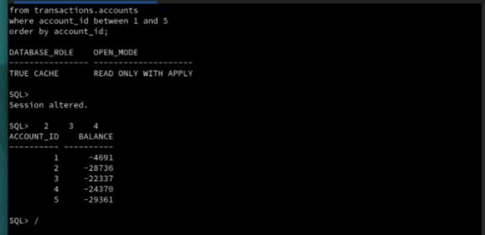

# Availability and Failover

## Introduction

Run a read on True Cache, stop Primary, and repeat that same read. Then restore Primary and verify its service before continuing.

This exercise demonstrates availability of an already-read data set. It does not promote True Cache to a writable Primary, test JDBC reconnection, or guarantee that uncached reads can succeed during a Primary outage.

*Estimated Time:* 15 minutes.

### Video Preview

[Availability and Failover walkthrough](videohub:1_1oq8mc2k)

### Objectives

- Observe an eligible cached read while Primary is stopped.
- Restore Primary and verify its role and active service.

### Prerequisites

Complete cache warmup and the performance comparison. Both database containers must be healthy before starting. Finish other workloads and use only the disposable workshop environment.

Keep two desktop Terminal windows for this lab: **True Cache SQL** for the read, and **Host Control** for stopping and restoring Primary. Set each window title using the method in Initialize Environment. Always complete the restore task, even if the read test fails.

## Task 1: Read the Sample on True Cache

1. From **Host Control**, enter True Cache.

    ```bash
    <copy>
    sudo podman exec -it truedb /bin/bash
    </copy>
    ```

2. At the container prompt, label this window **True Cache SQL** using the terminal-title command from Initialize Environment, then open SQL*Plus.

    ```bash
    <copy>
    ORACLE_SID=TRUEDB sqlplus / as sysdba
    </copy>
    ```

3. At `SQL>`, verify the role, select the PDB, and read the sample rows.

    ```sql
    <copy>
    select database_role, open_mode from v$database;
    alter session set container=ORCLPDB1;
    select account_id, balance
    from transactions.accounts
    where account_id between 1 and 5
    order by account_id;
    </copy>
    ```

    **Expected:** role `TRUE CACHE`, then five account rows. Keep this SQL*Plus session open. Reading the rows before the outage is essential to the demonstration.

    

## Task 2: Stop Primary and Repeat the Read

1. Open a separate desktop Terminal window for **Host Control**. Leave it at the host prompt and stop Primary.

    ```bash
    <copy>
    sudo podman stop --time 3 prod
    sudo podman ps -a --format 'table {{.Names}}\t{{.Status}}'
    </copy>
    ```

    **Expected:** `prod` is stopped; `truedb` and `appclient` remain running. Only Primary is stopped by this command.

    

2. Return to the **True Cache SQL** `SQL>` prompt. Type `/` and press Enter to rerun the last SQL statement, the five-row read.

    **Expected:** the same five rows while Primary is stopped. Do not run a different query before `/`, because SQL*Plus repeats the last statement in its buffer.

    If the query hangs, press **Ctrl+C**, record the error, and proceed immediately to restore Primary. A failed read is not a passed availability test.

## Task 3: Restore Primary

1. In **Host Control**, start Primary.

    ```bash
    <copy>
    sudo podman start prod
    </copy>
    ```

2. Check status. Repeat this command until `prod` is healthy; startup can take several minutes.

    ```bash
    <copy>
    sudo podman ps -a --format 'table {{.Names}}\t{{.Status}}'
    </copy>
    ```

    If it remains stopped or unhealthy, contact the lab administrator. Do not proceed to the next lab with Primary down.

3. After Primary is healthy, enter its container in **Host Control**.

    ```bash
    <copy>
    sudo podman exec -it prod /bin/bash
    </copy>
    ```

4. At the Primary container prompt, label this window **Primary SQL** using the terminal-title command from Initialize Environment, then open SQL*Plus.

    ```bash
    <copy>
    ORACLE_SID=ORCLCDB sqlplus / as sysdba
    </copy>
    ```

5. At `SQL>`, verify the role and active service.

    ```sql
    <copy>
    select database_role, open_mode from v$database;
    alter session set container=ORCLPDB1;
    select name from v$active_services where upper(name) = 'SALES1';
    </copy>
    ```

    **Expected:** `PRIMARY`, `READ WRITE`, and active service `SALES1`. If the service result is empty, use **Troubleshooting** below and verify it again.

6. In **True Cache SQL**, type `/` again. The sample read should still succeed after Primary returns.

7. In **Primary SQL** and **True Cache SQL**, type `exit` to leave SQL*Plus, then `exit` to leave the container.

## Completion

The sample read succeeded before, during, and after the Primary outage. Primary is healthy with `SALES1` active. No background workload or PID files were created in this exercise.

Continue to [New Feature: Semantic Cache with Vector Search](../vector-search/vector-search_dbw26.md).

## Troubleshooting

If the Primary active-service query is empty after restart, run this in the Primary SQL*Plus session, with `ORCLPDB1` selected:

```sql
<copy>
execute dbms_service.start_service('SALES1');
select name from v$active_services where upper(name) = 'SALES1';
</copy>
```

Continue only after the service is listed. If a command reports an unexpected error or the service still does not appear, contact [LiveLabs Help](mailto:livelabs-help-db_us@oracle.com) and retain the error output.

## Acknowledgements

* **Authors** - Sambit Panda, Consulting Member of Technical Staff, Oracle Database Product Management
* **Contributors** - Pankaj Chandiramani, Shefali Bhargava, Jyoti Verma, Nithin Thekkupadam Narayanan, Sarvesh Gupta
* **Last Updated By/Date** - Sambit Panda, Consulting Member of Technical Staff, Sep 2026
