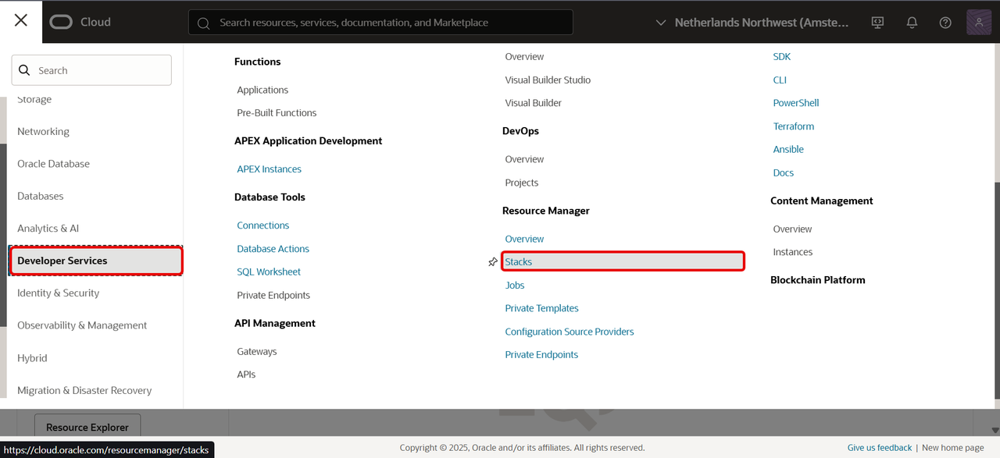

# Clean Up the Stack and Instances

## Introduction

You can permanently delete (terminate) instances that you no longer need. To do this, use the destroy job on the Resource Manager stack that provisioned this workshop. This job tears down the resources and instances and cleans up the associated OCI resources in your tenancy.
We recommend running a destroy job before deleting a stack to release associated resources first. When you delete a stack, its associated state file is also deleted; therefore, you lose track of the state of its associated resources. Cleaning up resources associated with a deleted stack can be difficult without the state file, especially when those resources are spread across multiple compartments. To avoid difficult cleanup later, we recommend that you release associated resources first by running a destroy job.
Data on destroyed resources cannot be recovered.

This lab walks you through running a destroy job.

*Estimated Time:* 5 minutes

### Objectives

- Terminate and tear down all resources/instances used in the Oracle True Cache lab.

### Prerequisites

- You should have provisioned the **Improve application performance with True Cache** workshop by using a Terraform stack.
- You need access to that stack in Resource Manager. No separate Environment Setup lab is required for the sandbox path.

## Task 1: Terminate a Provisioned Oracle Database Instance

1. Log in to Oracle Cloud.

2. Open the navigation menu and click **Developer Services**. Under **Resource Manager**, click **Stacks**.
    

3. Choose the compartment that you chose in Lab 1 to install your stack (on the left side of the page).

4. Select the name of the stack that provisioned this workshop. The Stack Details page opens.

5. Click **Destroy**.

6. In the Destroy panel, enter the name of the destroy job.

7. Click **Destroy**.

8. The destroy job is created. The new job appears under **Jobs**. Your instance and all resources used by it begin to terminate.

9. After the instance is terminated, its lifecycle state changes from Terminating to Terminated.

  You have successfully cleaned up your instance.

## Learn More
[True Cache documentation](https://docs.oracle.com/en/database/oracle/oracle-database/23/odbtc/deleting-true-cache.html)

## Acknowledgements
* **Authors** - Sambit Panda, Consulting Member of Technical Staff, Oracle Database Product Management
* **Contributors** - Pankaj Chandiramani, Shefali Bhargava, Jyoti Verma, Nithin Thekkupadam Narayanan, Sarvesh Gupta
* **Last Updated By/Date** - Sambit Panda, Consulting Member of Technical Staff, Sep 2026
