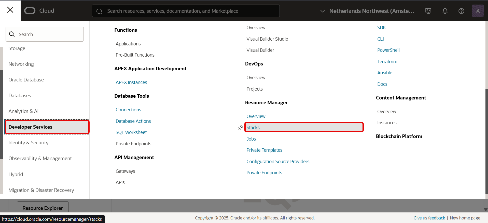

# Clean-up ORM Stack and instances

## Introduction

You can permanently delete (terminate) instances that you no longer need. To do this, use the destroy job on the stack in Resource Manager, which you created in the Environment Setup Lab. This job  tears down the resources/instances and clean up your tenancy.
We recommend running a destroy job before deleting a stack to release associated resources first. When you delete a stack, its associated state file is also deleted; therefore, you lose track of the state of its associated resources. Cleaning up resources associated with a deleted stack can be difficult without the state file, especially when those resources are spread across multiple compartments. To avoid difficult cleanup later, we recommend that you release associated resources first by running a destroy job.
Data cannot be recovered from destroyed resources.

This lab walks you through the steps to running a destroy job

*Estimated Time:* 5 minutes

### Objectives

- Terminate and tear down all resources/instances used in the Oracle True Cache lab.

### Prerequisites

- You should have provisioned the **Application performance improvement with True Cache** workshop using a terraform stack.
- To provision this workshop, there are detailed instructions in Lab 1 of [Application performance improvement with True Cache](https://livelabs.oracle.com/pls/apex/r/dbpm/livelabs/view-workshop?wid=11454) workshop.

## Task 1: Terminate a Provisioned Oracle Database Instance

1. Login to Oracle cloud

2. Open the navigation menu and click **Developer Services**. Under **Resource Manager**, click **Stacks**.
  

3. Choose the compartment that you chose in Lab 1 to install your stack (on the left side of the page).

4. Click the name of the stack that you created in Lab 1.The Stack details page opens.

5. Click **Destroy**.

6. In the Destroy panel , enter the name of the destroy job.

7. Click **Destroy**.

8. The destroy job is created. The new job appears under **Jobs**. Your instance and all resources used by it begin to terminate.

9. After a few minutes, after the instance is terminated, the lifecycle state changes from Terminating to Terminated.

  You have successfully cleaned up your  instance.

## Learn More
[True Cache documentation for internal purposes] (https://docs-uat.us.oracle.com/en/database/oracle/oracle-database/23/odbtc/oracle-true-cache.html#GUID-147CD53B-DEA7-438C-9639-EDC18DAB114B)

## Acknowledgements
* **Authors** - Sambit Panda, Consulting Member of Technical Staff , Vivek Vishwanathan Software Developer, Oracle Database Product Management
* **Contributors** - Pankaj Chandiramani, Shefali Bhargava, Param Saini, Thirumalai Thathachary
* **Last Updated By/Date** - Vivek Vishwanathan ,Software Developer, Oracle Database Product Management, August 2023
