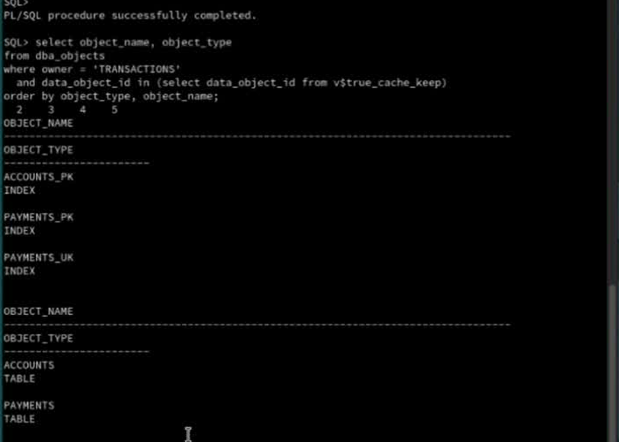
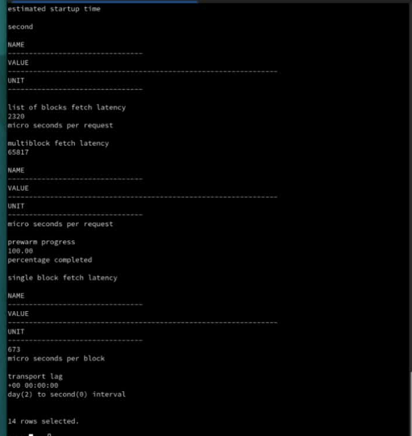

# Prepare and Warm True Cache

## Introduction

Review the preloaded transaction objects, apply KEEP, and warm True Cache using the supplied application. No schema creation or data load is needed.

*Estimated Time:* 15 minutes.

### Video Preview

[Prepare and Warm True Cache walkthrough](videohub:1_f95yjz2m)

### Objectives

- Inspect the transaction objects visible through True Cache.
- Apply KEEP to the selected tables and indexes.
- Run warmup and inspect the cache statistics.

### Prerequisites

Complete Initialize Environment. Start from **Host Control** and keep FastLab workloads stopped. This lab uses **True Cache SQL** and **App Client** terminal roles; set each window title at its shell prompt using the method in Initialize Environment.

## Task 1: Inspect the Transaction Objects

1. From **Host Control**, enter True Cache.

    ```bash
    <copy>
    sudo podman exec -it truedb /bin/bash
    </copy>
    ```

2. At the container prompt, label this terminal **True Cache SQL**:

    ```bash
    <copy>
    printf '\033]0;True Cache SQL\007'
    </copy>
    ```

3. Open SQL*Plus.

    ```bash
    <copy>
    ORACLE_SID=TRUEDB sqlplus / as sysdba
    </copy>
    ```

4. At `SQL>`, check the preloaded tables.

    ```sql
    <copy>
    alter session set container=ORCLPDB1;
    select owner, table_name
    from dba_tables
    where owner = 'TRANSACTIONS'
      and table_name in ('ACCOUNTS', 'PAYMENTS')
    order by table_name;
    </copy>
    ```

    **Expected:** `ACCOUNTS` and `PAYMENTS` under owner `TRANSACTIONS`. Keep this SQL*Plus session open for Tasks 2 and 3.

## Task 2: Apply KEEP

1. In the same SQL*Plus session, apply KEEP to the two tables and their indexes.

    ```sql
    <copy>
    execute dbms_cacheutil.true_cache_keep('TRANSACTIONS','ACCOUNTS');
    execute dbms_cacheutil.true_cache_keep('TRANSACTIONS','ACCOUNTS_PK');
    execute dbms_cacheutil.true_cache_keep('TRANSACTIONS','PAYMENTS');
    execute dbms_cacheutil.true_cache_keep('TRANSACTIONS','PAYMENTS_PK');
    execute dbms_cacheutil.true_cache_keep('TRANSACTIONS','PAYMENTS_UK');
    </copy>
    ```

2. Verify the KEEP list.

    ```sql
    <copy>
    select object_name, object_type
    from dba_objects
    where owner = 'TRANSACTIONS'
      and data_object_id in (select data_object_id from v$true_cache_keep)
    order by object_type, object_name;
    </copy>
    ```

    **Expected:** the five objects named above. KEEP retains selected objects in True Cache; the warmup in Task 3 reads their data. The vector-search sample is handled in the later vector-search lab.

    

## Task 3: Warm True Cache

1. Open a separate desktop Terminal window for the **App Client** role. Load the lab's database credentials and enter the application container.

    ```bash
    <copy>
    source /home/opc/.truecache_lab_env
    sudo podman exec -e DB_PASS="$DB_PASS" -it appclient /bin/bash
    </copy>
    ```

    The environment file supplies the database password. It is not the remote-desktop password. If the file is missing or the password is empty, stop and contact the lab administrator; do not substitute a sample password.

2. At the application-container prompt, label the window **App Client**, then run warmup and wait for it to finish.

    ```bash
    <copy>
    printf '\033]0;App Client\007'
    cd /stage/clientapp
    USE_TC_CONN=Y METRICS_PORT=9091 ./TransactionsApp.sh warmup
    </copy>
    ```

    **Expected:** the warmup application completes without a connection or SQL error. Type `exit` to leave the application container.

3. Return to the **True Cache SQL** window, which is still at the `SQL>` prompt. Review the cache statistics.

    ```sql
    <copy>
    select name, value, unit from v$true_cache_stat order by name;
    </copy>
    ```

    Look for prewarm progress, hit ratios, and fetch latency. Values depend on cache state and workload, so they can differ from the example output.

    

4. Type `exit` to leave SQL*Plus, then `exit` to return to the host.

## Completion

The KEEP list includes the five selected objects, warmup has completed, and the statistics query returns results. Continue to [Use True Cache through JDBC](../jdbc/jdbc-routing_dbw26.md).

## Acknowledgements

* **Authors** - Sambit Panda, Consulting Member of Technical Staff, Oracle Database Product Management
* **Contributors** - Pankaj Chandiramani, Shefali Bhargava, Jyoti Verma, Nithin Thekkupadam Narayanan, Sarvesh Gupta
* **Last Updated By/Date** - Sambit Panda, Consulting Member of Technical Staff, Sep 2026
