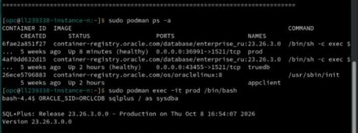
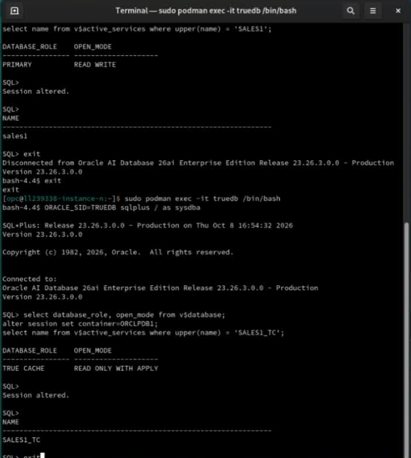

# Initialize Environment

## Introduction

Check the pre-provisioned containers and database services before starting the detailed labs. The schema and sample data are already installed.

*Estimated Time:* 10 minutes.

### Video Preview

[Initialize Environment walkthrough](videohub:1_n0xnpd76)

### Objectives

- Check the three lab containers.
- Verify the Primary and True Cache database roles and active services.

### Prerequisites

Open the remote-desktop link supplied with your workshop. For a sandbox reservation, select **View Login Info**, then the remote-desktop **Open Link**. You do not need to create a stack or load data for this pre-provisioned environment.

## Task 1: Check the Containers

1. In the remote desktop, select **Activities**, then **Terminal**. This opens the **Host Control** terminal. You can maximize the window by double-clicking its title bar. If **Activities** is hidden because Chrome is full-screen, press **Alt+F2**, enter `gnome-terminal`, and press Enter.

    

2. Give the window a role-based title. At the host prompt, run:

    ```bash
    <copy>
    printf '\033]0;Host Control\007'
    </copy>
    ```

    This changes only the terminal title. When a later lab opens another terminal, use its role name (for example, `True Cache SQL`, `Primary SQL`, or `App Client`) in place of `Host Control`. If a new shell changes the title automatically, set it again at that prompt.

3. List the containers.

    ```bash
    <copy>
    sudo podman ps -a
    </copy>
    ```

    **Expected:** `prod` and `truedb` are running and healthy; `appclient` is running. If a container is stopped, use **Troubleshooting** below. If it is starting, wait and repeat the check.

    

    The detailed labs use Terminal. To open FastLab instead, launch **Activities > Google Chrome** and visit `http://127.0.0.1:8080/`. Do not run FastLab workloads while performing the detailed exercises.

## Task 2: Check Primary

1. From **Host Control**, enter the Primary container.

    ```bash
    <copy>
    sudo podman exec -it prod /bin/bash
    </copy>
    ```

2. At the container prompt, label this terminal **Primary SQL**:

    ```bash
    <copy>
    printf '\033]0;Primary SQL\007'
    </copy>
    ```

3. Open SQL*Plus.

    ```bash
    <copy>
    ORACLE_SID=ORCLCDB sqlplus / as sysdba
    </copy>
    ```

4. At `SQL>`, check the role and active service.

    ```sql
    <copy>
    select database_role, open_mode from v$database;
    alter session set container=ORCLPDB1;
    select name from v$active_services where upper(name) = 'SALES1';
    </copy>
    ```

    **Expected:** `PRIMARY`, `READ WRITE`, and an active `SALES1` service. An empty service result needs the conditional service-start step under **Troubleshooting**; it is not a successful check.

5. Type `exit` at `SQL>` to leave SQL*Plus, then `exit` at the container prompt to return to the host. Relabel the window **Host Control** using the title command above.

## Task 3: Check True Cache

1. From **Host Control**, enter True Cache.

    ```bash
    <copy>
    sudo podman exec -it truedb /bin/bash
    </copy>
    ```

2. At the container prompt, label this terminal **True Cache SQL**:

    ```bash
    <copy>
    printf '\033]0;True Cache SQL\007'
    </copy>
    ```

3. Open SQL*Plus.

    ```bash
    <copy>
    ORACLE_SID=TRUEDB sqlplus / as sysdba
    </copy>
    ```

4. At `SQL>`, check the role and active read service.

    ```sql
    <copy>
    select database_role, open_mode from v$database;
    alter session set container=ORCLPDB1;
    select name from v$active_services where upper(name) = 'SALES1_TC';
    </copy>
    ```

    **Expected:** `TRUE CACHE`, `READ ONLY WITH APPLY`, and an active `SALES1_TC` service.

    

5. Type `exit` to leave SQL*Plus, then `exit` to return to **Host Control**.

## Completion

All three containers are running, both database roles are correct, and both services are active. Continue to [Prepare and Warm True Cache](../data-load/data-load_dbw26.md).

## Troubleshooting

**A container is stopped:** run this at the host prompt, then repeat Task 1. Database startup can take several minutes.

```bash
<copy>
sudo podman start prod truedb appclient
</copy>
```

If a named container is missing, or remains unhealthy, stop and contact the lab administrator at [LiveLabs Help](mailto:livelabs-help-db_us@oracle.com). Do not recreate the database or containers.

**The Primary service query is empty:** in the Primary SQL*Plus session, after selecting `ORCLPDB1`, run:

```sql
<copy>
execute dbms_service.start_service('SALES1');
select name from v$active_services where upper(name) = 'SALES1';
</copy>
```

**The True Cache service query is empty:** in the True Cache SQL*Plus session, after selecting `ORCLPDB1`, run:

```sql
<copy>
execute dbms_service.start_service('SALES1_TC');
select name from v$active_services where upper(name) = 'SALES1_TC';
</copy>
```

If a service-start command reports that it is already running, repeat the active-service query. Continue only when the service appears. Other Oracle errors require investigation; do not treat them as a pass.

## Acknowledgements

* **Authors** - Sambit Panda, Consulting Member of Technical Staff, Oracle Database Product Management
* **Contributors** - Pankaj Chandiramani, Shefali Bhargava, Jyoti Verma, Nithin Thekkupadam Narayanan, Sarvesh Gupta
* **Last Updated By/Date** - Sambit Panda, Consulting Member of Technical Staff, Sep 2026
