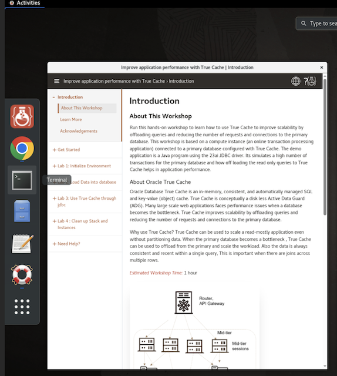

# Initialize Environment

## Introduction

In this lab, you will validate the pre-provisioned Oracle True Cache environment before continuing through the detailed command-line labs.

*Estimated Time:* 10 minutes.

<if type="nonsandbox">
Watch the video for a quick walk-through of Lab 3: Initialize Environment.
[Lab 3](videohub:1_y0sporip)
</if>

### Objectives
- Validate that the Primary database, True Cache, and app containers are running.
- Open the remote desktop terminal used by the command-line labs.
- Verify that the Primary and True Cache services are available.

### Prerequisites
This sandbox image is pre-provisioned. You do not need separate Prepare Setup or Environment Setup labs, and you do not need to create the database schema or seed data. You need the LiveLabs remote-desktop link from the workshop outputs and access to the host terminal inside that desktop.

## Task 1: Validate That Required Processes Are Up and Running
0. If you cannot launch the remote desktop, select View Login Info in the upper-left corner, then select Open Link in the Terraform Outputs section.
    
1. Access your remote desktop session and validate your environment before you start the subsequent labs. The following processes should be up and running:

    - Oracle primary database container
    - Oracle True Cache container
    - Client app container

    The workshop guide and application may open side-by-side by design. If you need more workspace, open the noVNC control bar on the left and select **Fullscreen**. You can maximize an individual browser window from its title bar when working with only that window.

2. Select Activities in the upper-left corner, then select the Terminal icon next to Chrome.

    

3. From the desktop Terminal, list the Podman containers.

        ```
        <copy>
        sudo podman ps -a
        </copy>
        ```
    

4. If a container is not running, start the pre-provisioned containers from the host terminal.

        ```
        <copy>
        sudo podman start prod truedb appclient
        </copy>
        ```

5. From the host terminal, verify that all containers are running.

        ```
        <copy>
        sudo podman ps --format 'table {{.Names}}\t{{.Status}}'
        </copy>
        ```

6. Wait until `prod` and `truedb` report **healthy**. The `appclient` container may show only its running status because it does not expose a database health check.

The LiveLab proxy normally starts the database services after the containers become healthy. If a database container was restarted and the service query in Task 2 does not list `SALES1` or `SALES1_TC`, run the idempotent service-start commands in Task 2 before continuing.

### Recover stopped or unhealthy containers

If `prod`, `truedb`, or `appclient` is stopped, start the pre-provisioned containers and check their status again:

    ```
    <copy>
    sudo podman start prod truedb appclient
    sudo podman ps --format 'table {{.Names}}\t{{.Status}}'
    </copy>
    ```

It may take several minutes for the Oracle database containers to become healthy after a restart. Do not continue until `prod` and `truedb` report **healthy** and all three containers are running. If a named container is missing from `sudo podman ps -a`, the instance was not provisioned with the required lab environment and must be restored by the lab administrator.

## Task 2: Start and Validate True Cache Services from the Terminal

1. From the host terminal, open the Primary database container once.

    ```
    <copy>
    sudo podman exec -it prod /bin/bash
    </copy>
    ```

    At the `prod` container prompt, start SQL*Plus and run the following commands. The `start_service` call is safe to repeat after a container restart.

    ```
    <copy>
    export ORACLE_SID=ORCLCDB
    sqlplus / as sysdba
    set pages 100 lines 180
    select database_role, open_mode from v$database;
    alter session set container=ORCLPDB1;
    begin
      dbms_service.start_service('SALES1');
    end;
    /
    select name, network_name from v$services where upper(name) = 'SALES1';
    exit
    exit
    </copy>
    ```

    Leave the container with `exit` after completing the SQL commands.

    Expected values are `PRIMARY` with a read-write open mode for the Primary database. The service query should list the `SALES1` service in the `ORCLPDB1` PDB.

2. At the host terminal, open the True Cache container once.

    ```
    <copy>
    sudo podman exec -it truedb /bin/bash
    </copy>
    ```

    At the `truedb` container prompt, start SQL*Plus and run the following commands. The `start_service` call is safe to repeat after a container restart.

    ```
    <copy>
    export ORACLE_SID=TRUEDB
    sqlplus / as sysdba
    set pages 100 lines 180
    select database_role, open_mode from v$database;
    alter session set container=ORCLPDB1;
    begin
      dbms_service.start_service('SALES1_TC');
    end;
    /
    select name, network_name from v$services where upper(name) = 'SALES1_TC';
    exit
    exit
    </copy>
    ```

    Leave the container with `exit` after completing the SQL commands.

    Expected values are `TRUE CACHE` with `READ ONLY WITH APPLY` open mode for True Cache. The service query should list the `SALES1_TC` read service in the `ORCLPDB1` PDB.

    If either `start_service` call reports `ORA-44305`, that service is already running; continue with the service query.

3. From the host terminal, load the lab environment and open the application container once. The environment file contains the generated Transactions password used by the lab services. Do not use the VNC password or a sample password.

    ```
    <copy>
    source /home/opc/.truecache_lab_env
    sudo podman exec -e DB_PASS="$DB_PASS" -it appclient /bin/bash
    </copy>
    ```

    At the `appclient` container prompt, run the BasicApp routing proof:

    ```
    <copy>
    cd /stage/clientapp/BasicApp
    /stage/jdk-17.0.6/bin/java -cp ojdbc8.jar:. TrueCache 172.20.1.2:1521/sales1 transactions "$DB_PASS"
    exit
    </copy>
    ```

The output should show the Primary role first, followed by the True Cache role on service `SALES1_TC`.

Continue to the next lab.

## Acknowledgements
* **Authors** - Sambit Panda, Consulting Member of Technical Staff, Oracle Database Product Management
* **Contributors** - Pankaj Chandiramani, Shefali Bhargava, Jyoti Verma, Nithin Thekkupadam Narayanan, Sarvesh Gupta
* **Last Updated By/Date** - Sambit Panda, Consulting Member of Technical Staff, Sep 2026
