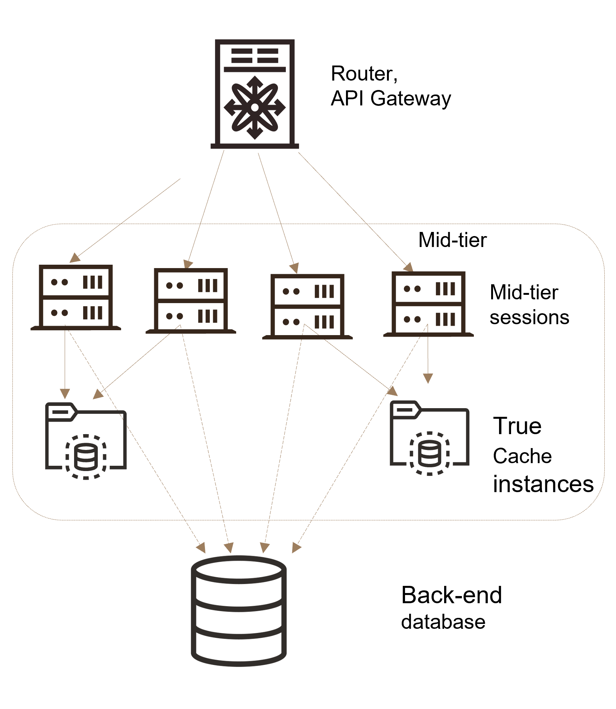

# Introduction

## About this Workshop

Many large scale Web applications faces performance issues when a a database becomes the bottleneck. Run this hands-on workshop to learn how to use True Cache to improve scalability by offloading queries and reducing the number of requests and connections to the primary database.

Why use True Cache?
True Cache can be used to scale a read-mostly application even without partitioning data. When primary database becomes the bottleneck , True Cache can be used to offload the primary and scale the workload. Also the data is always consistent and recent within a single query, this is important when there are joins across multiple rows.

Estimated Workshop Time: 0 hours 45 minutes (This estimate is for the entire workshop - it is the sum of the estimates provided for each of the labs included in the workshop.)

### Objectives

Lab 1 Prepare setup.

Lab 2 Environment setup

Lab 3 Initialize environment.

Lab 4 Load data into the database.

Lab 5 Use truecache through JDBC

Lab 6 Clean up Stack and Instances

### Prerequisites (Optional)

Familiarity with Oracle Database is desirable, but not required
Familiarity with Java and JDBC is desirable, but not required
Some understanding of cloud and database terms is helpful
Familiarity with Oracle Cloud Infrastructure (OCI) is helpful

## Learn More

*(optional - include links to docs, white papers, blogs, etc)*

* [URL text 1](http://docs.oracle.com)
* [URL text 2](http://docs.oracle.com)

## Acknowledgements
* **Author** - <Name, Title, Group>
* **Contributors** -  <Name, Group> -- optional
* **Last Updated By/Date** - <Name, Month Year>
