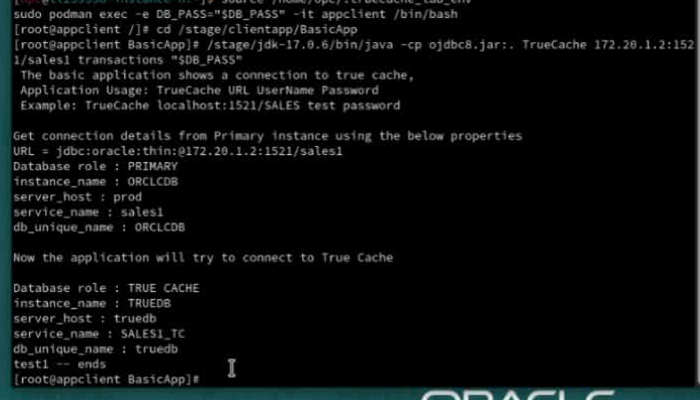

# Use True Cache through JDBC

## Introduction

Run the supplied BasicApp to see one logical JDBC connection use Primary for read-write work and True Cache for eligible read-only work.

*Estimated Time:* 5 minutes.

### Video Preview

[Use True Cache through JDBC walkthrough](videohub:1_gja8um8t)

### Objectives

- Run BasicApp and inspect its database-role output.
- Identify the change in read routing when the connection is marked read-only.

### Prerequisites

Complete Prepare and Warm True Cache. Both database services must be active. If a database has since restarted, repeat the service checks in Initialize Environment.

## Task 1: Open the Application Container

From a host terminal, load the lab's database credentials and enter the application container.

```bash
<copy>
source /home/opc/.truecache_lab_env
sudo podman exec -e DB_PASS="$DB_PASS" -it appclient /bin/bash
</copy>
```

The environment file supplies the database password, not the remote-desktop password. If it is missing or `DB_PASS` is empty, stop and contact the lab administrator.

At the application-container prompt, label this window **App Client** using the terminal-title command from Initialize Environment.

## Task 2: Run BasicApp

At the application-container prompt, run:

```bash
<copy>
cd /stage/clientapp/BasicApp
/stage/jdk-17.0.6/bin/java -cp ojdbc8.jar:. TrueCache 172.20.1.2:1521/sales1 transactions "$DB_PASS"
</copy>
```

**Expected:** the output identifies Primary first, then True Cache on service `SALES1_TC`. Check the role/service output, not only whether the application exits. Any Oracle error means the validation has not passed.



BasicApp changes the connection's read-only state with `setReadOnly(true)` and `setReadOnly(false)`. The driver can change the physical read route while the application keeps one logical connection; read-write work remains on Primary.

Type `exit` at the container prompt to return to the host. Relabel the window **Host Control** using the terminal-title command from Initialize Environment.

## Completion

You have identified both routes in the application output. Continue to [Performance Comparison and Lag Observability](../performance/performance_dbw26.md).

## Acknowledgements

* **Authors** - Sambit Panda, Consulting Member of Technical Staff, Oracle Database Product Management
* **Contributors** - Pankaj Chandiramani, Shefali Bhargava, Jyoti Verma, Nithin Thekkupadam Narayanan, Sarvesh Gupta
* **Last Updated By/Date** - Sambit Panda, Consulting Member of Technical Staff, Sep 2026
