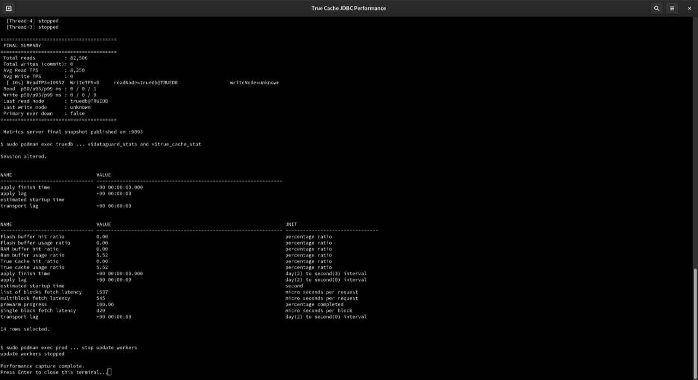

# Performance Comparison and Lag Observability

## Introduction

This lab compares read latency through Primary and True Cache while a bounded write workload runs on Primary. TPS is reported as a supporting throughput metric. The lab also reviews transport lag, apply lag, cache-hit ratios, and fetch latency.

*Estimated Time:* 15 minutes.

### Objectives

- Compare read latency through Primary and True Cache.
- Review TPS as a supporting throughput metric.
- Observe replication lag, cache-hit ratios, and fetch latency.

Complete the JDBC routing lab first. Keep the application-container shell open for the read workloads and use a separate desktop Terminal window for the Primary update workers.

## Task 1: Start the Bounded Primary Write Workload

From a separate desktop Terminal window, open the Primary container once:

~~~text
<copy>
sudo podman exec -it prod /bin/bash
</copy>
~~~

At the `prod` container prompt, run three bounded update-only workers:

~~~text
<copy>
export ORACLE_SID=ORCLCDB
: > /tmp/tcwrite.pids

update_accounts() {
  printf '%s\n' \
    "alter session set container=ORCLPDB1;" \
    "update transactions.accounts set balance=balance+1,last_modified_utc=systimestamp where account_id between $1 and $2;" \
    "commit;" \
    "exit" | sqlplus -s / as sysdba >/dev/null 2>&1
}

for worker in 1 2 3; do
  (
    start_id=$((1 + (worker - 1) * 2500))
    end_id=$((worker * 2500))
    for iteration in $(seq 1 20); do
      update_accounts "$start_id" "$end_id"
      sleep 0.15
    done
  ) &
  echo $! >> /tmp/tcwrite.pids
done
cat /tmp/tcwrite.pids
</copy>
~~~

These workers update existing `ACCOUNTS` rows for 20 iterations. They do not add rows and stop automatically.

## Task 2: Compare Primary and True Cache Reads

From the application-container shell, run the Primary baseline:

~~~text
<copy>
cd /stage/clientapp
READ_ONLY_WORKLOAD=true DIRECT_READ_ONLY=true DISABLE_TRUECACHE_PROPERTY=true URL=172.20.1.2:1521/sales1 THREADS=10 DURATION=30 METRICS_PORT=9092 ./TransactionsApp.sh primary
</copy>
~~~

Run the same workload directly against True Cache:

~~~text
<copy>
READ_ONLY_WORKLOAD=true DIRECT_READ_ONLY=true DISABLE_TRUECACHE_PROPERTY=true ALLOW_DIRECT_FALLBACK=true DIRECT_FALLBACK_URL=172.20.1.98:1521/SALES1_TC URL=172.20.1.98:1521/SALES1_TC THREADS=10 DURATION=30 METRICS_PORT=9093 ./TransactionsApp.sh truecache
</copy>
~~~

The output reports read latency, read TPS, and the last read node. The Primary run should identify Primary; the direct run should identify True Cache.

## Task 3: Review Lag and Cache Statistics

While the comparison is active, open the True Cache container from another desktop Terminal window:

~~~text
<copy>
sudo podman exec -it truedb /bin/bash
</copy>
~~~

At the `truedb` container prompt, run:

~~~text
<copy>
export ORACLE_SID=TRUEDB
sqlplus / as sysdba
alter session set container=ORCLPDB1;
set pages 100 lines 240
select name, value from v$dataguard_stats where lower(name) in ('transport lag','apply lag') order by name;
select name, value, unit from v$true_cache_stat where lower(name) in ('true cache hit ratio','ram buffer hit ratio','flash buffer hit ratio','prewarm progress','apply finish time','apply lag','transport lag','estimated startup time','single block fetch latency','multiblock fetch latency','list of blocks fetch latency') order by name;
exit
exit
</copy>
~~~

The exact values vary with the workload. The important result is that the queries return current replication and cache statistics.

## Task 4: Stop the Write Workers

Return to the original Primary-container shell and clean up the bounded workers:

~~~text
<copy>
kill $(cat /tmp/tcwrite.pids) 2>/dev/null || true
rm -f /tmp/tcwrite.pids
exit
</copy>
~~~

## Next Lab

Continue to [Availability and Failover](../availability/availability_dbw26.md).

## Acknowledgements

* **Authors** - Sambit Panda, Consulting Member of Technical Staff, Oracle Database Product Management
* **Contributors** - Pankaj Chandiramani, Shefali Bhargava, Jyoti Verma, Nithin Thekkupadam Narayanan, Sarvesh Gupta
* **Last Updated By/Date** - Sambit Panda, Consulting Member of Technical Staff, Sep 2026
