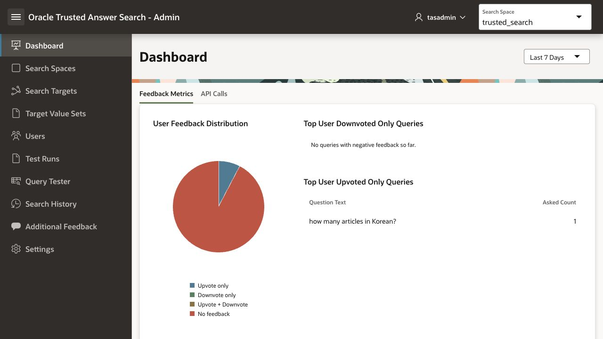
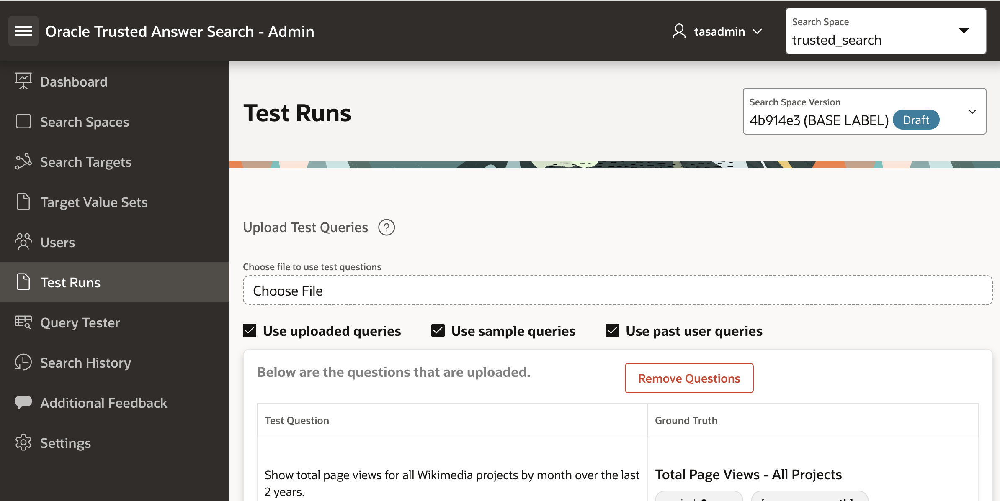
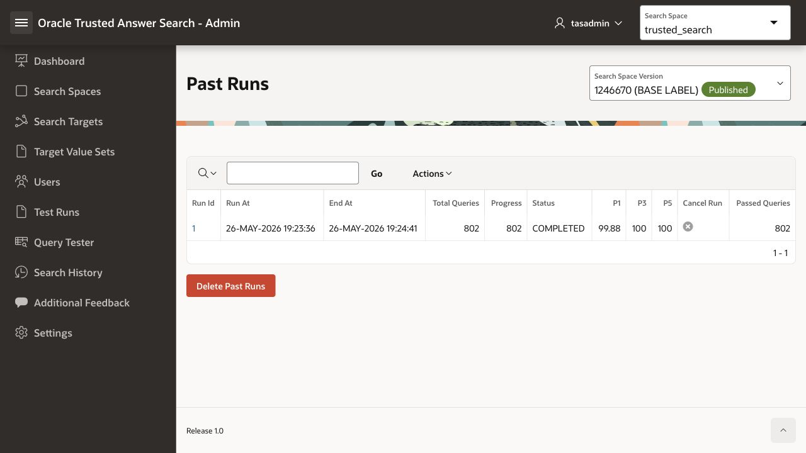
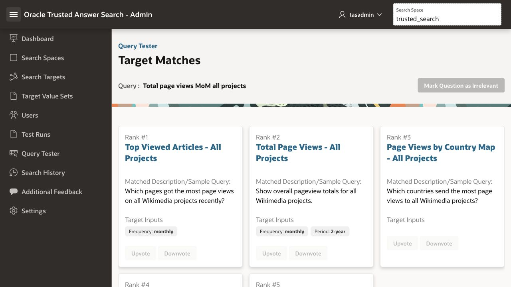

# Lab 5: Improve Top-1 Accuracy with Evidence

## Introduction

In Lab 4, Maya fixed one Wikimedia search query. That was useful, but her engineering lead asks a better question:

What if this is not just one bad query? What if the right answer is usually close, but not always first?

That is the difference between a search system that feels promising and a search system users trust. If the expected report is in the top three results, the system is nearby. If it is not Rank #1, users still have to hunt.

In this lab, Maya uses test-run metrics to find that pattern, improves the words that guide matching, reruns the test suite, and checks whether Top-1 accuracy improves.

**Estimated time:** 25 minutes

### Objectives

In this lab, you will:

* See portal user feedback appear in the Admin app.
* Compare Top-1, Top-3, and Top-5 accuracy.
* Use Top-3-vs-Top-1 gaps to find near misses.
* Inspect failed or weak test results.
* Improve matching with descriptions, sample queries, and value-set synonyms.
* Rerun tests and compare quality metrics.
* Review draft changes before publishing.
* Publish the improved draft when quality is acceptable.

### Prerequisites

This lab assumes you completed Lab 4 and are signed in to the Trusted Answer Search Admin app.

> **Learn more:** For the underlying product model, see the Oracle Database documentation for [Trusted Answer Search overview](https://docs.oracle.com/en/database/oracle/oracle-database/26/otasc/trusted-answer-search-overview.html). The sections on target actions, target inputs, target value sets, feedback-aware relevance, and change management are especially relevant to this lab.

## Task 1: See Portal Feedback in Admin

In Lab 4, the user left feedback in the published portal. Maya now checks whether that signal reached the admin experience.

1. In the Admin app, click **Dashboard**.
2. Review the feedback regions.

    

    Depending on recent activity, the dashboard can show signals such as:

    * Feedback metrics.
    * Top user-upvoted queries.
    * Top user-downvoted queries.
    * Trending queries.

3. If the feedback does not appear immediately, refresh the page.
4. In the left navigation menu, click **Search History**.
5. Find the recent query:

    ```text
    <copy>
    Total page views MoM all projects
    </copy>
    ```

6. Review the feedback indicators for that query.

This closes the first loop: users do not just search. Their feedback becomes an operational signal for the application team.

## Task 2: Run a Baseline Test Suite

Maya starts with evidence before making more changes.

1. In the left navigation menu, click **Test Runs**.
2. If you are using the green-button environment, the Wikimedia uploaded test questions are already loaded and an initial lightweight run may already appear under **View Past Runs**.
3. Select the search-space version you want to evaluate.

    * Use the **Published** version to see the current baseline.
    * Use your **Draft** version to evaluate the draft you created in Lab 4.

4. Click **Run Tests**.
5. Keep the available query sources selected, such as:

    * Uploaded test questions.
    * Sample queries.
    * Past user queries, if available.

6. Click **Run**.



The uploaded Wikimedia test file contains curated regression questions. Running with sample queries evaluates a much larger set generated from the search target sample queries.

## Task 3: Find the Top-3 vs Top-1 Gap

1. Click **View Past Runs**.
2. Open or review the latest completed run.



### Observe

Review:

* Total queries evaluated.
* Status.
* Top-1, Top-3, and Top-5 accuracy.
* Passed queries.

In the current Admin app UI, these may appear as:

| UI Label | Meaning |
| --- | --- |
| P1 | Top-1 accuracy: the expected target was ranked first. |
| P3 | Top-3 accuracy: the expected target appeared in the first three results. |
| P5 | Top-5 accuracy: the expected target appeared in the first five results. |

The interesting pattern is:

```text
<copy>
Top-3 is high, but Top-1 is lower.
</copy>
```

That means the system often knows the right neighborhood, but users still have to choose from the results. Maya's job is to move the right answer from nearby to first.

## Task 4: Inspect Near Misses

1. Open a completed test run.
2. Review the query result rows.
3. Look for queries where the expected target was found, but not ranked first.
4. Pick one weak result and compare:

    * Query text.
    * Ground truth target.
    * Rank #1 target.
    * Expected target rank.
    * Target input mismatches, if any.

For this LiveLab story, use the same near miss from Lab 4:

```text
<copy>
Total page views MoM all projects
</copy>
```

The expected target is:

```text
<copy>
Total Page Views - All Projects
</copy>
```

The misleading target is:

```text
<copy>
Top Viewed Articles - All Projects
</copy>
```

Maya now has a diagnosis: the query contains words and shorthand that are close to the right report, but still pull the ranking toward the wrong one.

## Task 5: Add a Sample Query

Descriptions explain what a target is. Sample queries show how users ask for it.

1. In the left navigation menu, click **Search Targets**.
2. Search for:

    ```text
    <copy>
    Total Page Views - All Projects
    </copy>
    ```

3. Open the target.
4. In the **Sample Queries** region, click **Add Sample Query**.
5. Enter:

    ```text
    <copy>
    Total page views MoM all projects
    </copy>
    ```

6. Click **Add**.

This teaches the system that this exact analyst wording belongs to the total page views report.

## Task 6: Add a More General Business Phrase

Now Maya adds language that helps future users who ask the same question differently.

1. Stay on the `Total Page Views - All Projects` target.
2. In the **Descriptions** region, click **Add Description** if you did not already add this in Lab 4.
3. Enter:

    ```text
    <copy>
    Overall Wikimedia traffic trend across all projects
    </copy>
    ```

4. Click **Add**.

Now the target has both a specific sample query and a broader description.

## Task 7: Review the Controlled Vocabulary

Maya also checks whether the time-period wording is governed correctly.

1. In the left navigation menu, click **Target Value Sets**.
2. Open the `period` value set.
3. Find the value:

    ```text
    <copy>
    2-year
    </copy>
    ```

4. Review its synonyms, such as:

    ```text
    <copy>
    2 years
    last 2 years
    past 24 months
    last two years
    </copy>
    ```

This is controlled vocabulary. Users can say "past 24 months," but the application receives the canonical value `2-year`.

## Task 8: Rerun the Test Suite

Now Maya checks whether curation changed measurable quality.

1. In the left navigation menu, click **Test Runs**.
2. Select your draft version.
3. Click **Run Tests**.
4. Keep the same query sources you used for the baseline run.
5. Click **Run**.
6. When the run completes, open it from **View Past Runs**.

Compare the new run to the baseline.

### Observe

Look for:

```text
<copy>
Top-1 accuracy improved or stayed stable.
Top-3 accuracy stayed high.
Top-5 accuracy stayed high.
</copy>
```

If Top-1 does not change, that is still useful. It means this was a good one-query fix, but not a broad regression-suite shift. The workflow is the same: inspect weak results, identify wording patterns, improve curation, rerun tests.

## Task 9: Inspect the Target Action

Maya's engineering lead now asks: "When the user clicks a result, what actually happens?"

1. Return to **Search Targets**.
2. Open:

    ```text
    <copy>
    Total Page Views - All Projects
    </copy>
    ```

3. Find the **Target Action** region.
4. Review the URL or SQL action for the target.

For this target, the action is a Wikimedia URL template similar to:

```text
<copy>
https://stats.wikimedia.org/#/all-projects/reading/total-page-views/normal|bar|:period|~total|:frequency
</copy>
```

The placeholders are backed by target inputs:

```text
<copy>
:period
:frequency
</copy>
```

Trusted Answer Search returns the target action metadata. The application decides how to execute it.

## Task 10: Review Search History and Additional Feedback

1. In the left navigation menu, click **Search History**.
2. Review recent queries.
3. Confirm that the query you used in Lab 4 appears with feedback indicators.
4. In the left navigation menu, click **Additional Feedback**.
5. Review any free-text feedback captured from users.

Search history and feedback are future test material. When users ask something surprising, Maya can turn that query into a new sample query, synonym, test question, or search target.

## Task 11: Review the Draft Before Publishing

Before Maya promotes the draft, she checks what changed.

1. In the left navigation menu, click **Search Spaces**.
2. Open the `trusted_search` search space.
3. Open your draft version.
4. Review available draft-change, diff, or version comparison actions.

Look for the changes you made:

```text
<copy>
Downvote feedback for Top Viewed Articles - All Projects
New description: Overall Wikimedia traffic trend across all projects
New sample query: Total page views MoM all projects
</copy>
```

If the change list does not look right, do not publish yet. Delete the draft and clone the published version again, or return to the affected target and correct the issue.



## Task 12: Publish the Improved Draft

When the test run looks acceptable and the draft changes make sense, publish the draft.

1. Stay on the draft version for `trusted_search`.
2. Click **Publish**.
3. Confirm the publish action.
4. Return to the **Published Wiki Search URL**.
5. Search again:

    ```text
    <copy>
    Total page views MoM all projects
    </copy>
    ```

The portal now uses the improved published version.

## Task 13: Know the Recovery Path

If a draft goes wrong, you do not need heroics.

1. Return to **Search Spaces**.
2. Open `trusted_search`.
3. If the bad change is still in a draft, delete the draft and clone the published version again.
4. If the bad change was already published, clone the last acceptable version into a new draft, validate it, and publish it.

The workflow is intentionally boring. Boring is good when production behavior is involved.

## Summary

In this lab, you:

* Saw portal user feedback appear in the Admin app.
* Found the quality gap between Top-3 and Top-1 accuracy.
* Inspected a near miss.
* Added a sample query and description to improve matching.
* Reviewed target value set synonyms.
* Reran tests and compared metrics.
* Reviewed a target action and its inputs.
* Used search history and feedback as improvement signals.
* Reviewed draft changes before publishing.
* Published the improved version.

The main idea:

```text
<copy>
Top-3 tells you the right answer is nearby.
Top-1 tells you whether users can trust the first result.
Trusted Answer Search gives teams a way to close that gap.
</copy>
```

You have now completed the Trusted Answer Search LiveLab.

## Acknowledgements

**Authors**

* Allen Hosler, Principal Product Manager, Database Applied AI

**Last Updated Date** - May, 2026
