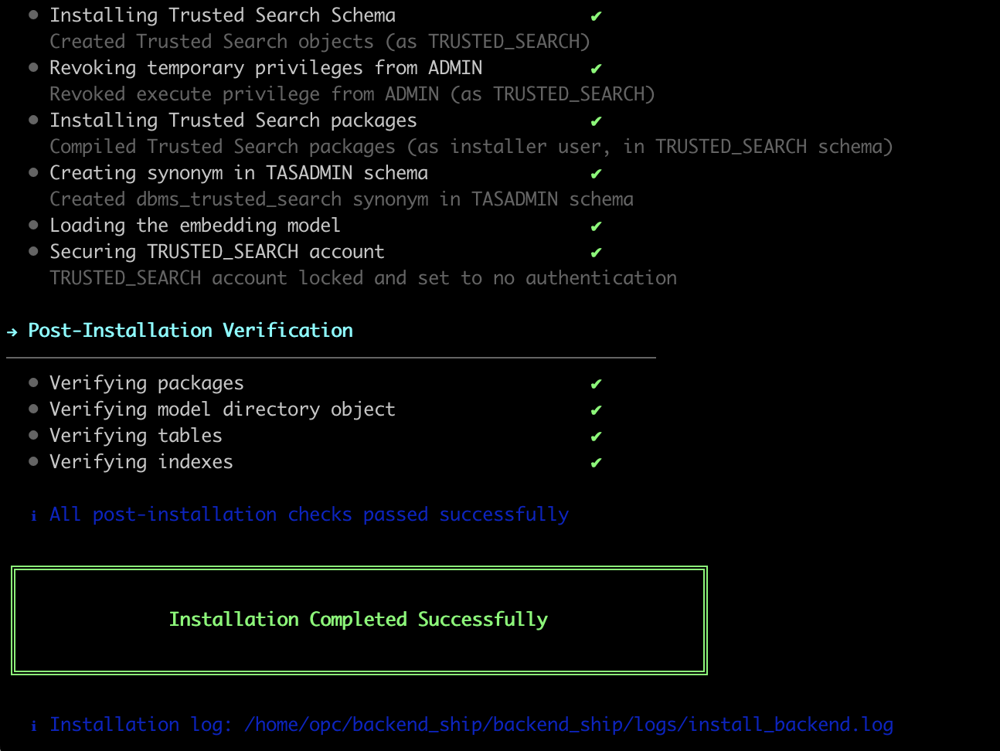

# Lab 2: Run the Backend Installer

## Introduction

In this lab, you will install the Trusted Answer Search backend into your Autonomous Database.

The backend installer creates the `TRUSTED_SEARCH` schema, creates the `TASADMIN` administrator user, installs PL/SQL packages and metadata tables, and loads the ONNX embedding model into the database.

If you are using the green button environment, skip this lab and go directly to **Lab 4**.

**Estimated time:** 20 minutes

### Objectives

In this lab, you will:

* Extract the Trusted Answer Search backend installer.
* Configure `install_backend.conf`.
* Run the installer.
* Confirm that the backend and `TASADMIN` user were created.

### Prerequisites

This lab assumes you completed Lab 1 and have:

* SQL\*Plus installed and available in your `PATH`.
* A working Autonomous Database connect string or wallet/TNS alias.
* The Autonomous Database `ADMIN` password.
* A password you want to assign to `TASADMIN`.
* A PAR URL for the ONNX embedding model.
* The Trusted Answer Search product zip file.

## Task 1: Extract the Backend Installer

1. Connect to your helper VM.

2. Create a working folder.

    ```sh
    <copy>
    mkdir -p ~/trusted_answer_search
    cd ~/trusted_answer_search
    </copy>
    ```

3. Copy or download the Trusted Answer Search zip into this folder.

4. Extract the top-level product zip.

    ```sh
    <copy>
    unzip -X trusted_answer_search.zip -d product
    cd product
    </copy>
    ```

5. Extract the backend installer.

    ```sh
    <copy>
    unzip -X backend_ship.zip -d backend_ship
    cd backend_ship
    </copy>
    ```

6. Confirm that the installer files are present.

    ```sh
    <copy>
    ls -la
    </copy>
    ```

You should see:

```text
<copy>
install_backend.sh
install_backend.conf
uninstall_backend.sh
README.md
</copy>
```

## Task 2: Configure install_backend.conf

1. Make the configuration file writable.

    ```sh
    <copy>
    chmod u+w install_backend.conf
    </copy>
    ```

2. Open `install_backend.conf` in your preferred text editor.

3. Set these values.

    ```text
    <copy>
    DB_CONNECT_STRING={your-connect-string-or-tns-alias}
    DB_USER=ADMIN
    DB_PASSWORD={your-admin-password}
    TASADMIN_PASSWORD={choose-a-password-for-tasadmin}
    MODEL_FILE_NAME=multilingual-e5-base.onnx
    MODEL_URI={your-model-par-url}
    </copy>
    ```

4. Leave private-bucket credential values commented out if you are using a PAR URL.

The PAR URL already contains the short-lived access token. That means the installer can load the model without creating an OCI credential in the database.

## Task 3: Run the Installer

Run the backend installer.

```sh
<copy>
./install_backend.sh --config install_backend.conf
</copy>
```

The installer will:

1. Check database version, privileges, SQL\*Plus, and connectivity.
2. Create the `TRUSTED_SEARCH` schema.
3. Create the `TASADMIN` user.
4. Load the ONNX embedding model from Object Storage.
5. Install Trusted Answer Search PL/SQL packages, dictionary tables, indexes, and views.

When installation succeeds, the terminal displays an installation success message.



This is the moment where the database becomes more than a database. It now contains the trusted-search engine.

## Task 4: Save the TASADMIN Password

You will use the `TASADMIN_PASSWORD` value again when signing in to the Admin and Portal applications.

Save these values somewhere temporary for this workshop:

```text
<copy>
TASADMIN username: TASADMIN
TASADMIN password: {the password you set}
</copy>
```

## Task 5: If the Installer Fails

If the installer fails partway through, fix the error, uninstall, and rerun.

```sh
<copy>
./uninstall_backend.sh --config install_backend.conf
./install_backend.sh --config install_backend.conf
</copy>
```

Common issues:

| Error | Likely Cause | Fix |
| --- | --- | --- |
| `sqlplus: command not found` | SQL\*Plus is not in `PATH` | Add Instant Client SQL\*Plus to `PATH`. |
| `ORA-01017` | Wrong database password or connect string | Recheck `DB_USER`, `DB_PASSWORD`, and `DB_CONNECT_STRING`. |
| `ORA-54426` | ONNX model was not exported in the expected format | Re-export the model using OML4Py as shown in Lab 1. |
| Model download fails | PAR URL expired or is unreachable from the database | Create a new PAR URL and update `MODEL_URI`. |

You may now **proceed to the next lab**.

## Acknowledgements

**Authors**

* Allen Hosler, Principal Product Manager, Database Applied AI

**Last Updated Date** - May, 2026
