# Lab 3: Load APEX Apps and Sample Data

## Introduction

In this lab, you will load the Trusted Answer Search APEX applications and the Wikimedia sample search space.

Oracle Trusted Answer Search ships two APEX apps:

* **Admin App:** where application experts manage search spaces, search targets, value sets, feedback, and regression tests.
* **Portal App:** a simple end-user search experience that shows how Trusted Answer Search can sit in front of an application.

If you are using the green button environment, skip this lab and go directly to **Lab 4**. Your apps and sample data are already loaded.

**Estimated time:** 25 minutes

### Objectives

In this lab, you will:

* Create the `TASADMIN` APEX workspace.
* Import the Admin app.
* Import the Portal app.
* Load the Wikimedia sample search targets, value sets, and test queries.
* Confirm that the Admin app is ready for the storyline in Lab 4.

### Prerequisites

This lab assumes you completed Lab 2 and have:

* A working APEX URL for your Autonomous Database.
* The database `ADMIN` password.
* The `TASADMIN` password from `install_backend.conf`.
* `admin.zip` and `portal.zip` from `apex_ship.zip`.
* The Wikimedia sample files:
  * `search_target.json`
  * `target_value_set.json`
  * `test_run.json`

## Task 1: Open Oracle APEX

1. In the OCI Console, navigate to your **Autonomous Database**.
2. Click **Tool configuration**.
3. Find **Oracle APEX** and copy the **Public access URL**.
4. Open the URL in your browser.

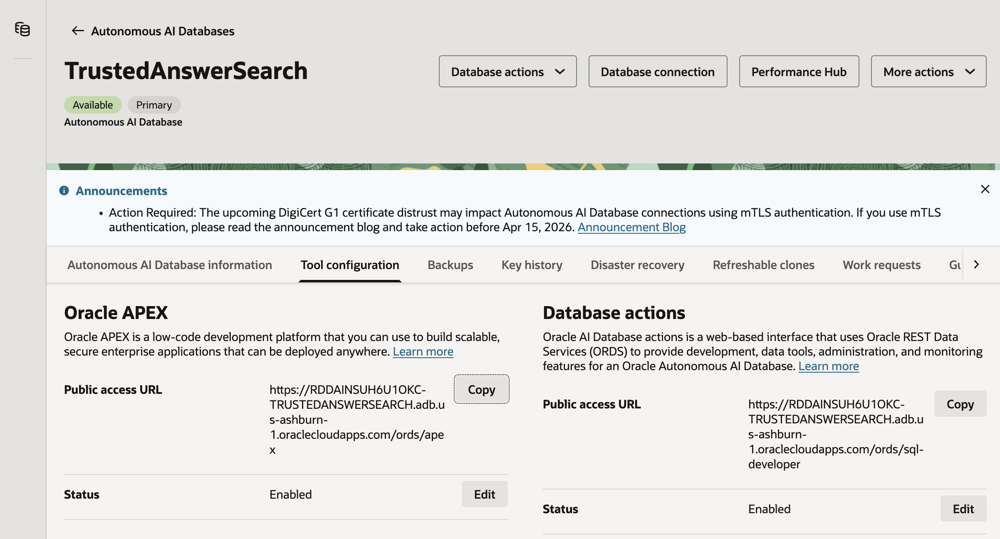

## Task 2: Create the TASADMIN Workspace

1. Sign in to the **INTERNAL** workspace using your database `ADMIN` credentials.
2. Click **Create Workspace**.

    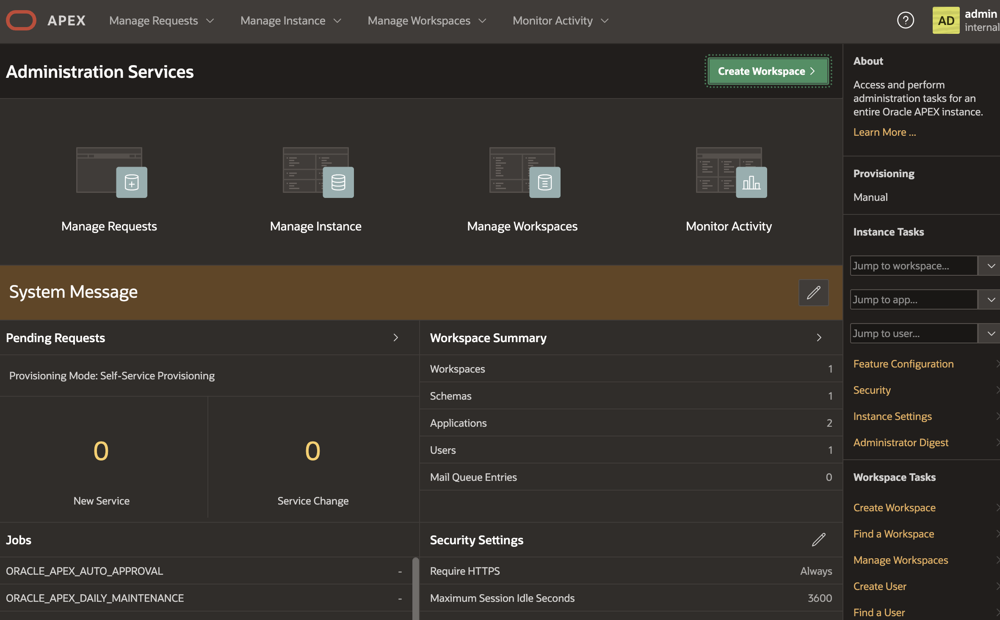

3. Choose **Existing Schema**.

    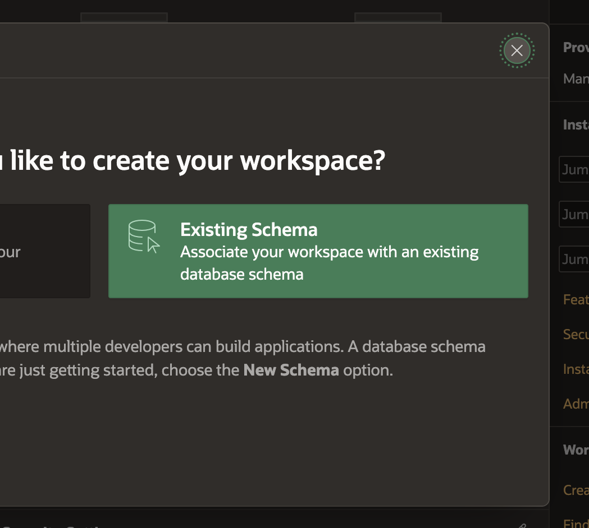

4. Configure the workspace.

    | Field | Value |
    | --- | --- |
    | Database User | `TASADMIN` |
    | Workspace Name | `TASADMIN` |
    | Workspace Username | `ADMIN` |
    | Workspace Password | Choose a temporary APEX workspace admin password |

5. Click **Create Workspace**.

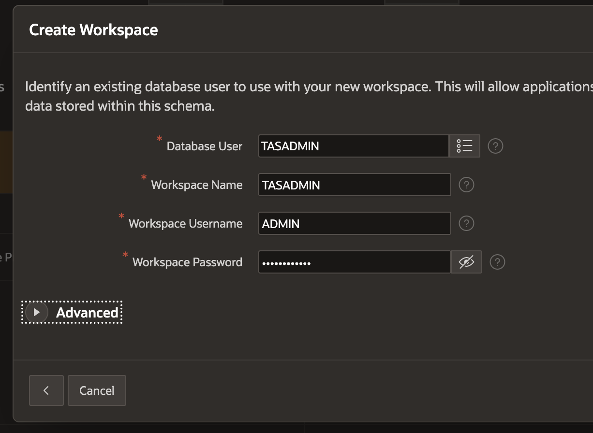

## Task 3: Sign In to the TASADMIN Workspace

1. Sign out of the **INTERNAL** workspace.

    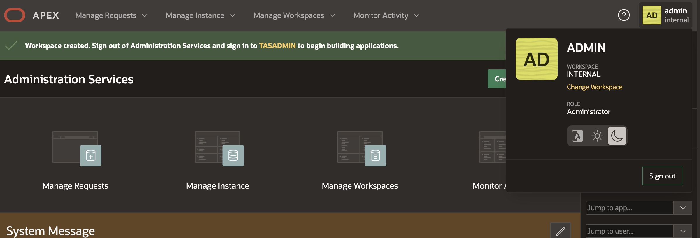

2. On the APEX login page, enter the `TASADMIN` workspace.
3. Sign in with the workspace administrator credentials you created in Task 2.

    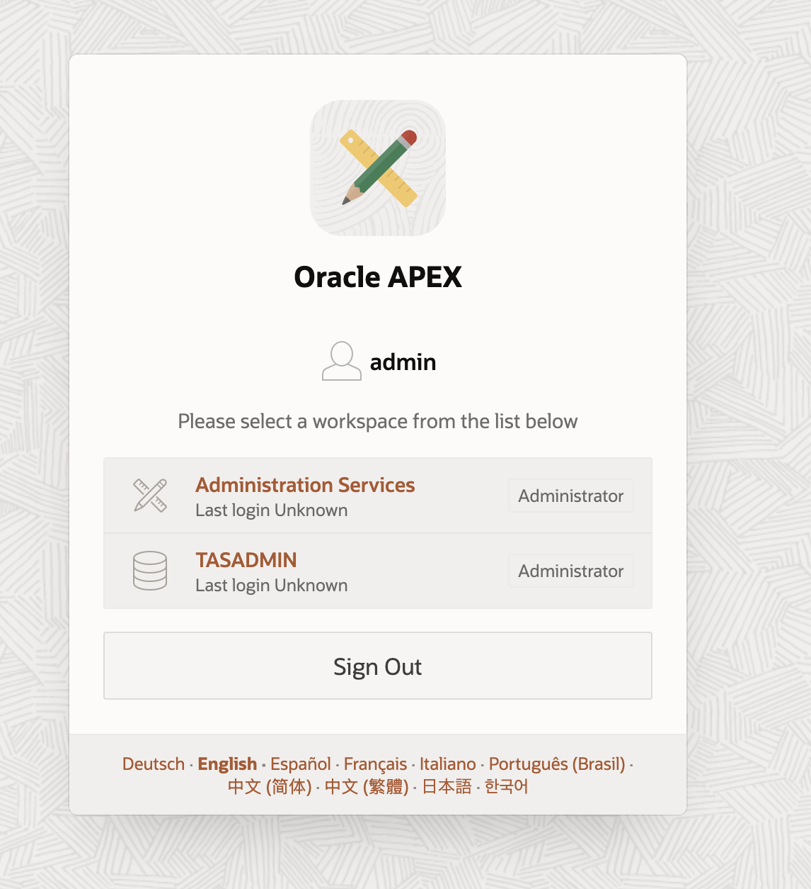

## Task 4: Import the Admin App

1. From the workspace home page, click **App Builder**.

    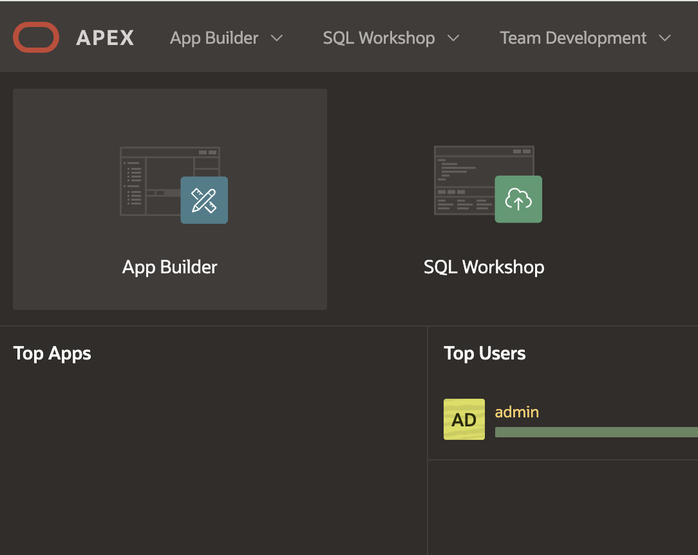

2. Click **Import**.

    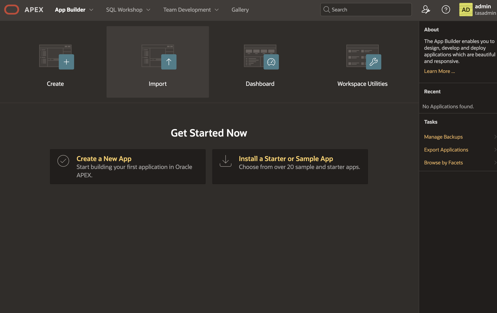

3. Upload `admin.zip`.

    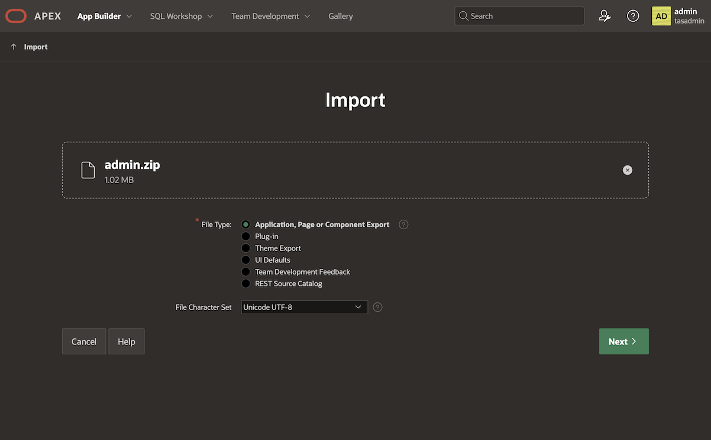

4. On the install page, use these settings.

    | Setting | Value |
    | --- | --- |
    | Application Name | Oracle Trusted Answer Search - Admin App |
    | Parsing Schema | `TASADMIN` |
    | Build Status | Run Application Only |
    | Install As Application | Auto Assign New Application ID |

5. Click **Install Application**.

    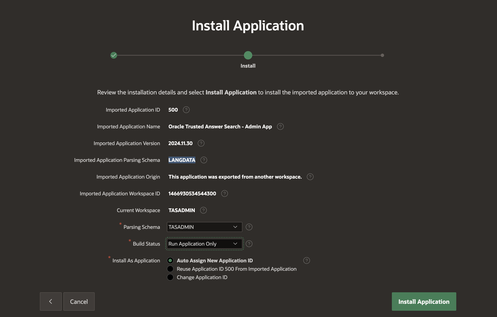

## Task 5: Import the Portal App

1. Return to **App Builder**.
2. Click **Import**.
3. Upload `portal.zip`.
4. Install it into the same workspace and parsing schema.

Use these settings.

| Setting | Value |
| --- | --- |
| Parsing Schema | `TASADMIN` |
| Build Status | Run Application Only |
| Install As Application | Auto Assign New Application ID |

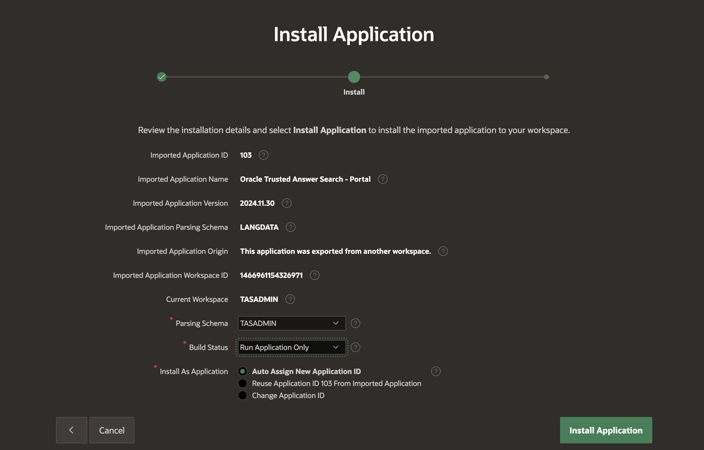

The Admin app is the control room. The Portal app is the front door.

## Task 6: Launch the Admin App

1. From App Builder, locate **Oracle Trusted Answer Search - Admin App**.
2. Click **Run Application**.
3. Sign in with:

    ```text
    <copy>
    Username: TASADMIN
    Password: {TASADMIN_PASSWORD from install_backend.conf}
    </copy>
    ```

You should see the Trusted Answer Search Admin dashboard.

## Task 7: Create a Search Space

1. In the Admin app sidebar, click **Search Spaces**.
2. Click **Create Search Space**.
3. Enter:

    ```text
    <copy>
    trusted_search
    </copy>
    ```

4. Click **Create**.
5. Open the new search space.


## Task 8: Import the Wikimedia Search Metadata

The Wikimedia sample gives you a realistic set of analytics reports. The search-space import uses two files:

* `search_target.json` for the trusted reports/actions.
* `target_value_set.json` for controlled parameter values.

1. On the search space version page, click **Import**.
2. Upload:

    ```text
    <copy>
    search_target.json
    target_value_set.json
    </copy>
    ```

3. Click **Import**.

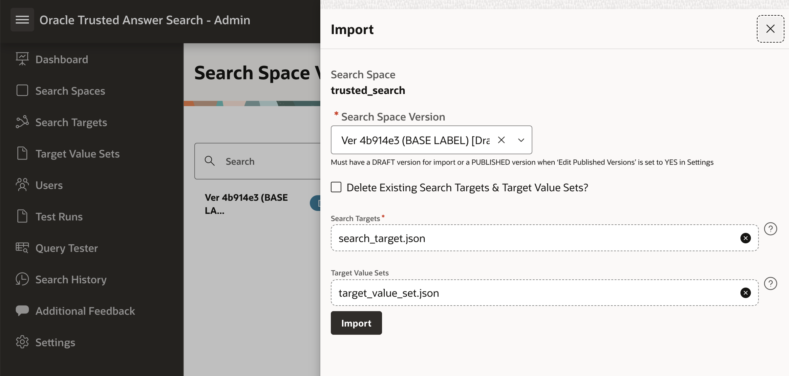

The sample data gives you:

* Search targets such as page views, edits, articles, editors, and country maps.
* Value sets for period, frequency, project, and language.

## Task 9: Load the Wikimedia Regression Questions

The `test_run.json` file contains curated regression questions for the Wikimedia sample. These are the questions you will use later to measure Top-1, Top-3, and Top-5 accuracy.

1. In the Admin app sidebar, click **Test Runs**.
2. Find the upload option for test questions.
3. Upload:

    ```text
    <copy>
    test_run.json
    </copy>
    ```

4. Confirm that the uploaded questions are available for future test runs.

In the green-button path, Terraform performs this step for you.

## Task 10: Publish the Search Space Version

The Portal app searches the published version of a search space. Publish the version now so Lab 4 starts from the same state as the green-button environment.

1. In the Admin app sidebar, click **Search Spaces**.
2. Open the `trusted_search` search space.
3. Open the current draft version.
4. Click **Publish**.
5. Confirm the publish action.

After publishing, many edit buttons are disabled for that version. That is expected. Published versions are read-only. In Lab 4, you will clone this published version into a draft before making improvements.

## Task 11: Confirm the Portal App Opens

1. Return to App Builder.
2. Run **Oracle Trusted Answer Search - Portal App**.
3. Sign in with:

    ```text
    <copy>
    Username: TASADMIN
    Password: {TASADMIN_PASSWORD from install_backend.conf}
    </copy>
    ```

4. Confirm that the Portal app opens and is using the `trusted_search` search space.

Record these two links for the rest of the workshop:

```text
<copy>
Admin URL: {URL for Oracle Trusted Answer Search - Admin App}
Published Wiki Search URL: {URL for Oracle Trusted Answer Search - Portal App}
</copy>
```

Do not spend much time testing the Portal app yet. The real story begins in Lab 4.

You may now **proceed to Lab 4**.

## Acknowledgements

**Authors**

* Allen Hosler, Principal Product Manager, Database Applied AI

**Last Updated Date** - May, 2026
