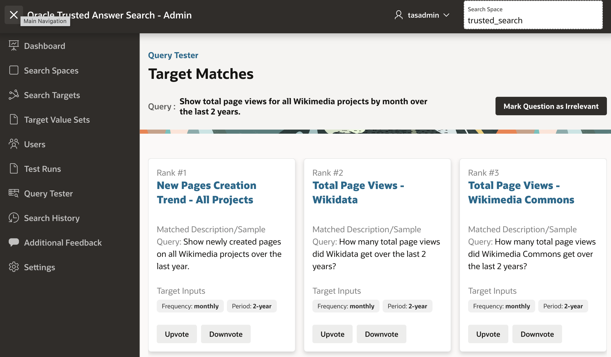

# **Lab 3: Trusted Continuous Improvement of Search**

## Introduction

Trusted Answer Search is designed to improve continuously through **human oversight and structured feedback loops**. Unlike traditional AI systems that require retraining or prompt engineering, Trusted Answer Search allows application experts to directly control and refine how natural-language queries map to application outcomes.

In this lab, you will work with real **Wikimedia analytics queries** and actively shape how the system behaves—fixing incorrect rankings, teaching new language patterns, and extending the search experience.

**Estimated time:** 25 minutes.

### Objectives

* Refine search results using structured feedback.
* Add new descriptions to improve matching accuracy.
* Introduce new search targets dynamically.
* Understand how changes impact system behavior.

---

## Task 1: Navigate to the Search Space

1. In the **Search Admin** application sidebar, click on **Search Spaces**.
2. Click **Create Search Space**, and give it a name (e.g., `trusted_search`).
3. Click **Create**.


---

## Task 2: Upload Search Targets and Value Sets

1. Click on your newly created search space. This will take you to the **Search Space Versions** page.
2. Click **Import**.
3. Upload:
   * `search_target.json`
   * `target_value_set.json`
  *Note: These can be found in the trusted_answer_search zip in apex_ship/samples/wikimedia*
4. Click **Import**.

These files define:

* The available reports (e.g., page views, edits, editors)
* The parameter vocabulary (e.g., *last 2 years*, *monthly*, *French Wiktionary*)

These value mappings are what allow the system to interpret phrases like
“last 2 years” → `period = 2-year` 


---

## Task 3: Run an Initial Query

1. Navigate to **Query Tester**.
2. Run:

   ```
   Show total page views for all Wikimedia projects by month over the last 2 years.
   ```

This is one of the predefined test queries 

### Observe:

* Ranked results
* Extracted parameters:

  * `period = 2-year`
  * `frequency = monthly`

The correct answer should be:
**Total Page Views - Wikidata** 


---

## Task 4: Fix an Incorrect Result in Real Time

1. Identify the **Rank #1 result** (e.g., *New Pages Creation Trend - All Projects*).
2. Click **Downvote**.
3. Re-run the same query.

### Observe:

* The correct result (**Total Page Views - All Projects**) moves to Rank #1
* The incorrect result is demoted



You just corrected the system **instantly**.
No retraining, no redeployment, no prompt tuning.

---

## Task 5: Teach the System a New Phrase

Now you will expand the system’s understanding.

1. Navigate to **Search Targets**.

2. Open:

   ```
   Total Page Views - All Projects
   ```

3. Add a new description:

   ```
   Wikimedia traffic trend over time
   ```

4. Save your changes.

5. Go back to **Query Tester** and run:

   ```
   Wikimedia traffic trend
   ```

### Observe:

* The system now maps this new phrasing correctly

You just extended the system’s language understanding using **curation—not training**

---

## Task 6: Add a New Search Target

Now you will introduce new functionality.

1. Navigate to **Search Targets**

2. Click **Create**

3. Define a new target:

   * **Name:** Top Viewed Articles - All Projects
   * Add descriptions:

     ```
     most popular pages on Wikimedia
     top viewed Wikimedia pages
     ```

4. Save

5. Test:

   ```
   What are the most popular pages on Wikimedia?
   ```

### Observe:

* The system routes to your new report

You have **added a new capability instantly**

---

## Task 7: Understand Impact of Changes (Regression Awareness)

1. Modify an existing description (make it more generic, e.g. “page views trend”).
2. Re-run:

   ```
   Show total page views for all Wikimedia projects over the last 2 years
   ```

### Observe:

* Rankings may shift depending on similarity

This is why Trusted Answer Search provides:

* Draft versions
* Controlled promotion
* Visibility into changes

---

You have now experienced how Trusted Answer Search enables:

* Deterministic results
* Real-time correction
* Controlled evolution

You may now **proceed to the next lab**.

---

## Acknowledgements

**Authors** 

* Allen Hosler, Principal Product Manager, Database Applied AI

**Last Updated Date** - April, 2026
