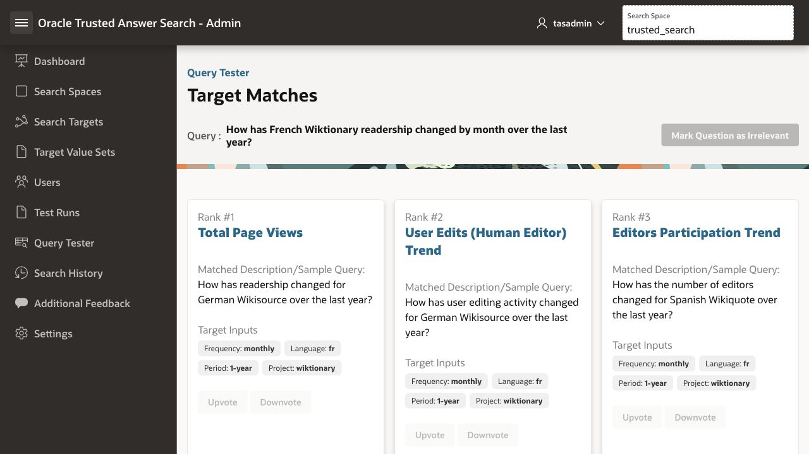
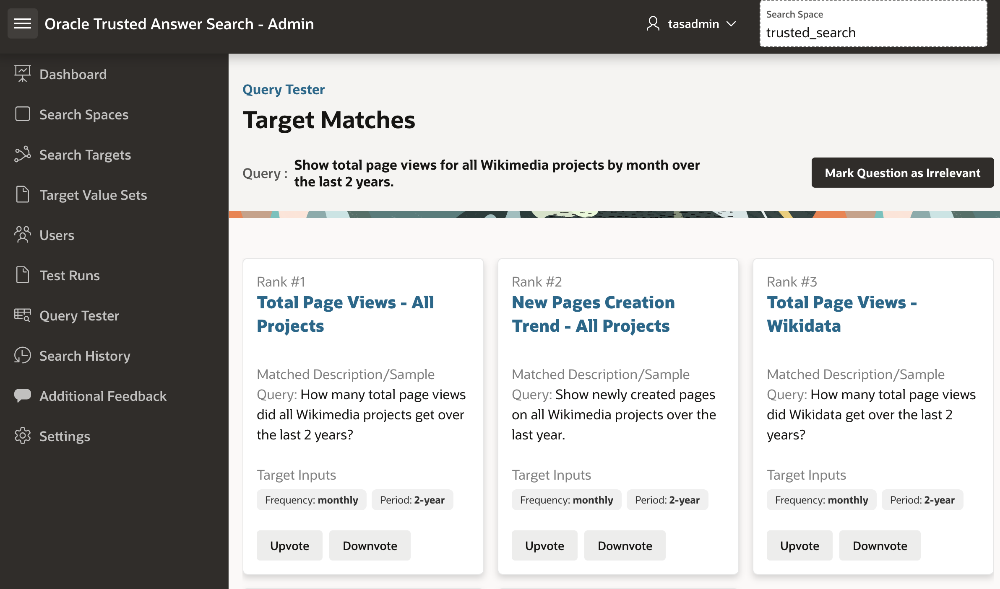
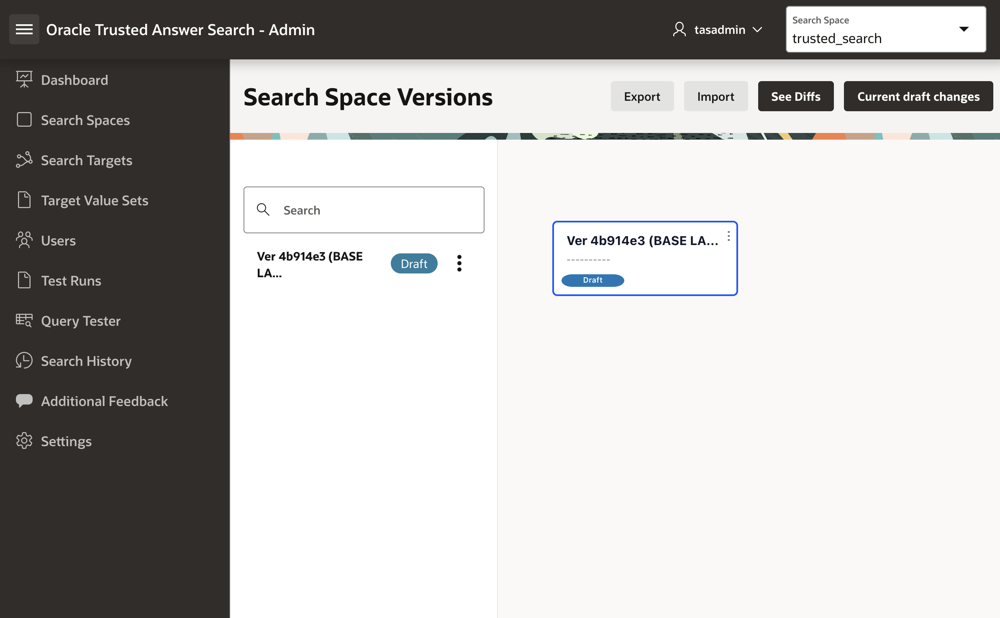
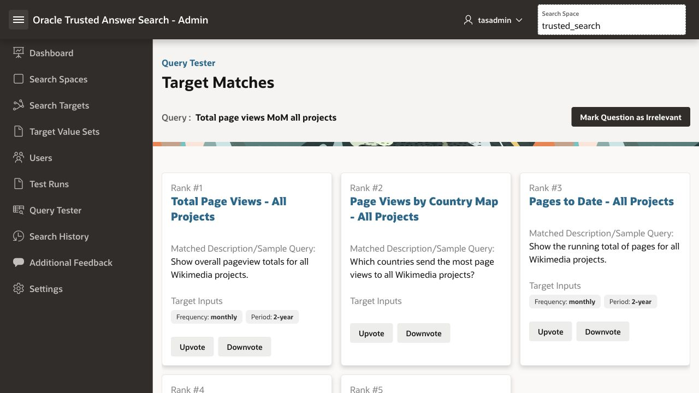

# Lab 4: Make Wikimedia Search Trusted

## Introduction

Maya is preparing for a Wikimedia planning meeting. Her team needs answers about readership, edits, devices, languages, projects, and country trends across Wikimedia properties such as Wikipedia, Wiktionary, Wikibooks, Wikimedia Commons, and Wikidata.

The data exists. That is not the problem.

The problem is that the analytics site has many reports, filters, project names, language codes, and URL patterns. Users know what they want, but they do not always know the exact page or parameter combination that gets them there.

A generic LLM search box can sound helpful, but for this kind of bounded application workflow, a confident wrong answer is worse than no answer. Maya does not need a paragraph that guesses. She needs the application to open the right trusted report with the right controlled inputs.

Trusted Answer Search maps natural-language questions to curated application targets such as reports, URLs, or SQL-driven views. The application keeps control of what can be returned, while users get a natural-language search experience.

**Estimated time:** 25 minutes

### Objectives

In this lab, you will:

* Search the published Wikimedia portal using natural language.
* See a natural-language question map to a trusted report target.
* Inspect extracted target inputs such as language, project, period, and frequency.
* Leave end-user feedback in the published portal.
* Clone a published search-space version into a governed draft.
* Correct a bad ranking with expert feedback.
* Teach the system a new business phrase with a curated description.
* Confirm deterministic, repeatable search behavior.

### Prerequisites

You need:

* The Trusted Answer Search **Admin URL**.
* The **Published Wiki Search URL**.
* The `TASADMIN` username.
* The `TASADMIN` password.
* A loaded and published `trusted_search` search space.

If you are using the green button environment, these values are provided for you.

> **Learn more:** For product concepts, see the Oracle Database documentation for [Trusted Answer Search overview](https://docs.oracle.com/en/database/oracle/oracle-database/26/otasc/trusted-answer-search-overview.html), especially the sections on search targets, target actions, target inputs, target value sets, feedback-aware relevance, and reliability characteristics.

## Task 1: Search Like an End User

Maya starts where her users start: the published search application.

1. Open the **Published Wiki Search URL** in a new browser tab.
2. Sign in with the `TASADMIN` username and password if prompted.
3. Search for:

    ```text
    <copy>
    How has French Wiktionary readership changed by month over the last year?
    </copy>
    ```

This is a normal business question. The user did not type a report name, language code, project code, time-window code, or URL.

Open the top result if the portal shows a link or action. The result opens a Wikimedia analytics page instead of generating a free-form answer.

## Task 2: Inspect the Same Query in Admin

Now Maya opens the Admin app to see what the search system actually resolved.

1. Open the **Admin URL**.
2. Sign in with:

    ```text
    <copy>
    Username: TASADMIN
    Password: {your TASADMIN password}
    </copy>
    ```

3. In the left navigation menu, click **Query Tester**.
4. Run the same query:

    ```text
    <copy>
    How has French Wiktionary readership changed by month over the last year?
    </copy>
    ```

### Observe

The top result should be a total page views trend target, and the query should resolve controlled inputs similar to:

```text
<copy>
Language: fr
Project: wiktionary
Period: 1-year
Frequency: monthly
</copy>
```



Trusted Answer Search did not invent a free-form answer. It selected a trusted report target and extracted values the application can execute.

## Task 3: Notice the Application Action

Open the top result or inspect the corresponding search target.

The result opens a Wikimedia analytics page using a trusted target action. For this sample, the target action is a URL template with controlled placeholders.

For example, a target action can look like:

```text
<copy>
https://stats.wikimedia.org/#/:language.:project.org/reading/total-page-views/normal|bar|:period|~total|:frequency
</copy>
```

When the user asks about French Wiktionary over the last year by month, Trusted Answer Search resolves the placeholders and the application can open the correct report.

This is the key distinction:

* A chatbot tries to answer.
* Trusted Answer Search routes the user to a trusted application action.

## Task 4: Find a Search Result That Needs Expert Help

Maya now tests a shorter analyst-style query:

```text
<copy>
Total page views MoM all projects
</copy>
```

The expected target is:

```text
<copy>
Total Page Views - All Projects
</copy>
```

But the initial top result may be:

```text
<copy>
Top Viewed Articles - All Projects
</copy>
```



The application has the right report, but the query is messy. `MoM` is shorthand. `All projects` is broad. This is exactly where enterprise search usually becomes frustrating: close, plausible, and still wrong.

## Task 5: Leave End-User Feedback

Before Maya fixes anything as an administrator, she captures the user signal from the portal.

1. Return to the **Published Wiki Search URL**.
2. Search again:

    ```text
    <copy>
    Total page views MoM all projects
    </copy>
    ```

3. If the incorrect result appears near the top, click the thumbs-down icon for:

    ```text
    <copy>
    Top Viewed Articles - All Projects
    </copy>
    ```

4. If the expected result appears, click the thumbs-up icon for:

    ```text
    <copy>
    Total Page Views - All Projects
    </copy>
    ```

This does not require Maya to rebuild the app or retrain a model. The portal captured real user feedback that administrators can review.

In Lab 5, you will see this same feedback show up in the Admin app.

## Task 6: Create a Governed Draft

Before Maya changes anything, she creates a draft.

The green-button environment starts with `trusted_search` already published. That is intentional: the published version powers the end-user portal app. Published versions are read-only, so production search behavior is protected.

1. In the left navigation menu, click **Search Spaces**.
2. Open the `trusted_search` search space.
3. Find the published version.
4. If a draft version already exists from an earlier attempt, either use that draft or delete it before cloning.

    > **Note:** A search space can have only one draft version at a time. For the cleanest walkthrough, delete the existing draft, then clone the published version again.

5. If no draft exists, open the actions menu for the published version.
6. Click **Clone**.
7. Enter a label such as:

    ```text
    <copy>
    LiveLab Draft
    </copy>
    ```

8. Click **Create**.



You now have a safe workspace for changes. The published portal keeps using the trusted version while Maya experiments in the draft.

## Task 7: Reproduce the Problem in the Draft

1. In the left navigation menu, click **Query Tester**.
2. In the search-space version selector, choose your draft version.
3. Run the same query:

    ```text
    <copy>
    Total page views MoM all projects
    </copy>
    ```

4. Confirm that the incorrect result is still near the top:

    ```text
    <copy>
    Top Viewed Articles - All Projects
    </copy>
    ```

This matters because the correction happens in a draft. You are not changing production behavior by clicking around.

## Task 8: Correct the Ranking with Feedback

1. Find the incorrect result:

    ```text
    <copy>
    Top Viewed Articles - All Projects
    </copy>
    ```

2. Click **Downvote**.
3. Run the exact same query again:

    ```text
    <copy>
    Total page views MoM all projects
    </copy>
    ```

### Observe

The correct result should move to Rank #1:

```text
<copy>
Total Page Views - All Projects
</copy>
```



The model was not retrained. The app was not redeployed. Maya gave the system expert evidence, and the draft behavior changed.

### Expected result

After the downvote, the rerun should show:

```text
<copy>
Rank #1: Total Page Views - All Projects
Frequency: monthly
Period: 2-year
</copy>
```

## Task 9: Teach a New Business Phrase

Leadership does not always say "page views." Sometimes they say "traffic trend." Maya can teach the search space that business phrase directly.

1. In the left navigation menu, click **Search Targets**.
2. Search for:

    ```text
    <copy>
    Total Page Views - All Projects
    </copy>
    ```

3. Open the target.
4. In the **Descriptions** region, click **Add Description**.
5. Enter:

    ```text
    <copy>
    Wikimedia traffic trend over time
    </copy>
    ```

6. Click **Add**.

## Task 10: Test the New Phrase

1. Return to **Query Tester**.
2. Confirm your draft version is still selected.
3. Run:

    ```text
    <copy>
    Wikimedia traffic trend
    </copy>
    ```

### Observe

The top result should be:

```text
<copy>
Total Page Views - All Projects
</copy>
```

The matched description should include:

```text
<copy>
Wikimedia traffic trend over time
</copy>
```

You taught the search system new application language with curation, not prompt engineering.

## Task 11: Confirm Controlled Value Mapping

Run:

```text
<copy>
Show page views for all Wikimedia projects over the past 24 months
</copy>
```

### Observe

The top result should be:

```text
<copy>
Total Page Views - All Projects
</copy>
```

The phrase:

```text
<copy>
past 24 months
</copy>
```

maps to the controlled value:

```text
<copy>
Period: 2-year
</copy>
```

That mapping comes from a target value set. The user can speak naturally, but the application receives a valid value.

## Task 12: Confirm Deterministic Search

Run this query twice:

```text
<copy>
Show total page views for Wikimedia Commons over the last 2 years
</copy>
```

### Observe

The Rank #1 result should be the same both times:

```text
<copy>
Total Page Views - Wikimedia Commons
</copy>
```

For bounded enterprise workflows, repeatability is not boring. It is the difference between a search feature and a compliance meeting with snacks.

## Summary

In this lab, you:

* Used a natural-language portal to reach a trusted Wikimedia report.
* Saw target inputs extracted from normal user language.
* Left user feedback in the published portal.
* Created a governed draft from a published version.
* Corrected a bad ranking with expert feedback.
* Added a curated description for a new business phrase.
* Saw a synonym map to a controlled application value.
* Confirmed deterministic search behavior.

The main idea:

```text
<copy>
Trusted Answer Search lets users ask naturally while the application still
controls the targets, parameters, and production rollout.
</copy>
```

You may now **proceed to Lab 5**.

## Acknowledgements

**Authors**

* Allen Hosler, Principal Product Manager, Database Applied AI

**Last Updated Date** - May, 2026
