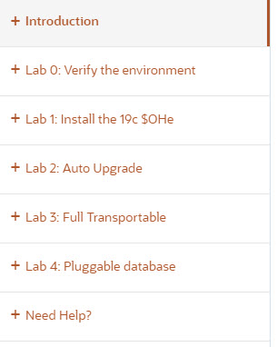

# Introduction #

## About this workshop ##

**19c Database** is the current version Oracle promotes to customers and partners as the best target version for a database upgrade. Oracle 19c is the long-term support version and will be supported for at least four years after the initial release. After this, Extended support and Sustaining support will be available. This hands-on workshop focuses on **Upgrading your environment to 19c** demonstrating three scenarios that you can use (both on-premises and in the cloud) to upgrade your environment to 19c in a Container/Multitenant setup.

This hands-on lab can be run stand-alone but be aware that individual steps might take time to finish. Usually the hands-on lab is delivered as part of the PTS 19c Upgrade Workshop which fills the time waiting with explanations and information.

Estimated time: 3 hours.

### Objectives ###

- Learn to install a new Oracle 19c Home
- Upgrade a database by using the AutoUpgrade tool
- Upgrade a database using Full Transportable tablespaces
- Upgrade a database using unplugging a PDB and plugging it into a new 19c CDB (and upgrade)

### Prerequisites ###

- A provisioned LiveLabs Environment
    - On the Attendee Page, you should see the NoVNC URL
- The labs have been set up to work with a NoVNC remove desktop environment using an HTML5 compatible browser. Most proxy systems will work with this setup.
- If you want to run (parts) of the workshop using a direct SSH connection, you need direct access to the Internet or a proxy that supports tunneling.
    - Lab 3-5 can be run using SSH only
    - The setup of SSH for your keys (password authentication is not allowed) is not described in the lab.

## Access the labs

- Use **Lab Contents** menu on the left side of the screen to access the labs.
    - If the menu is not displayed, click the menu button  on the top left to make it visible.

- From the menu, click on the lab that you would like to run. For example, if you want to proceed to **Lab 1**, click **Lab 1: Verify the environment**.

     

- You may close the menu by clicking the   again.

You may now **proceed to the next lab**.

## Acknowledgements ##

- **Author** - Robert Pastijn, Database Product Management, PTS EMEA - April 2020
- **Last Update by** - Robert Pastijn - Adopted to Livelabs - November 2021
