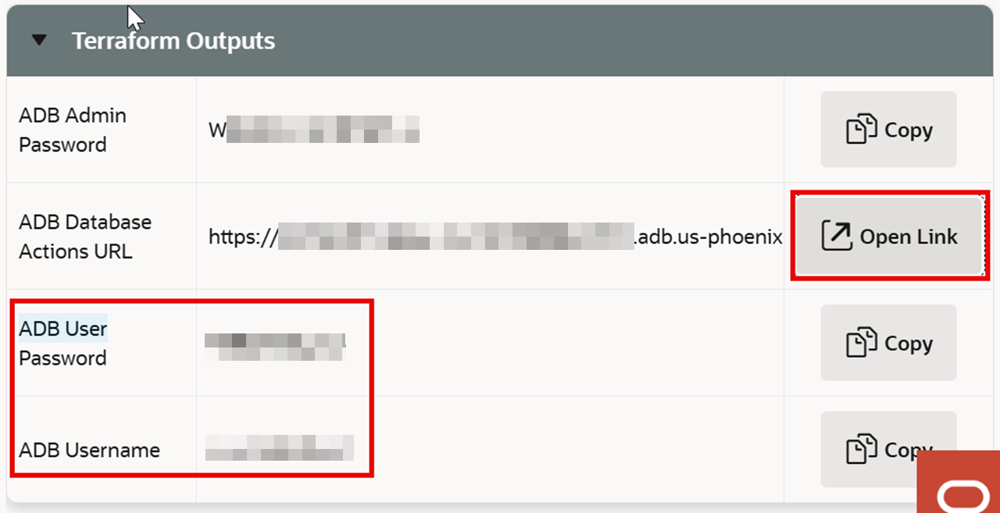
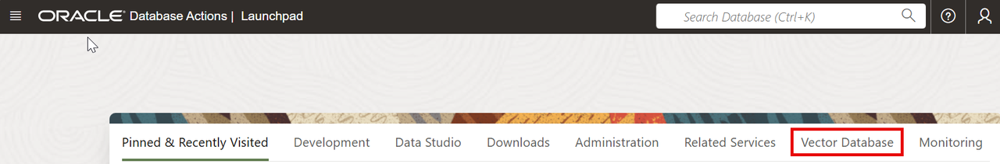
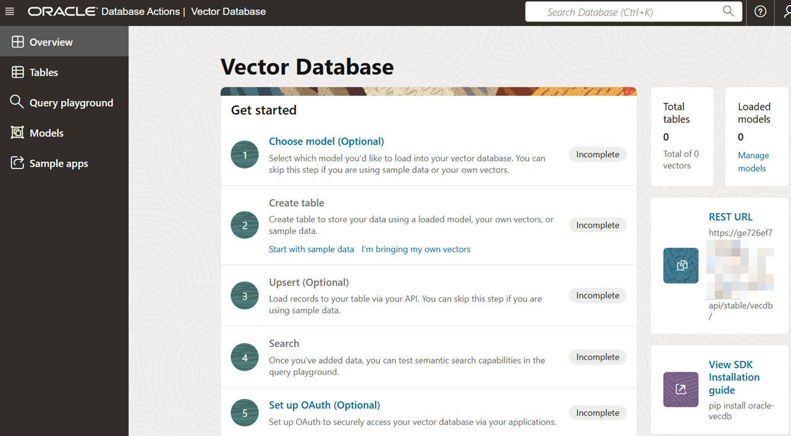
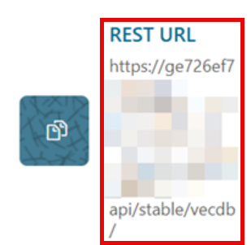
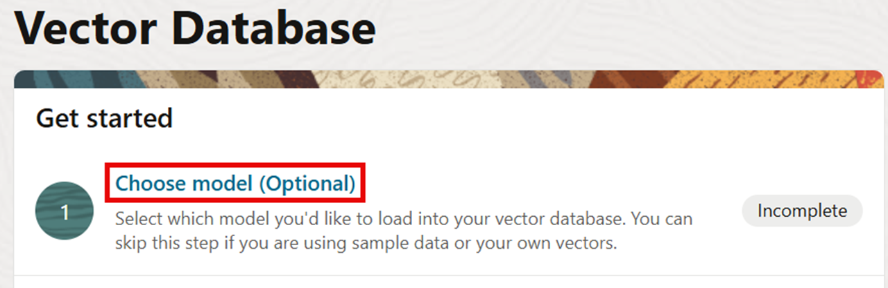
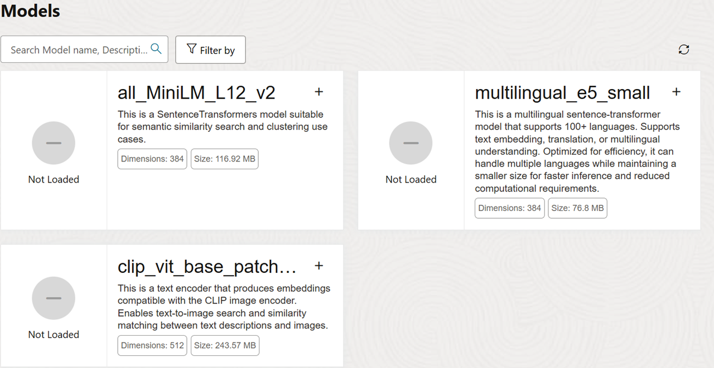
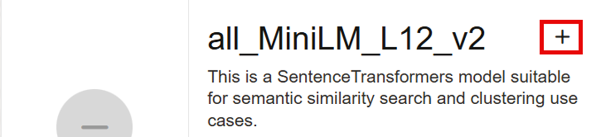
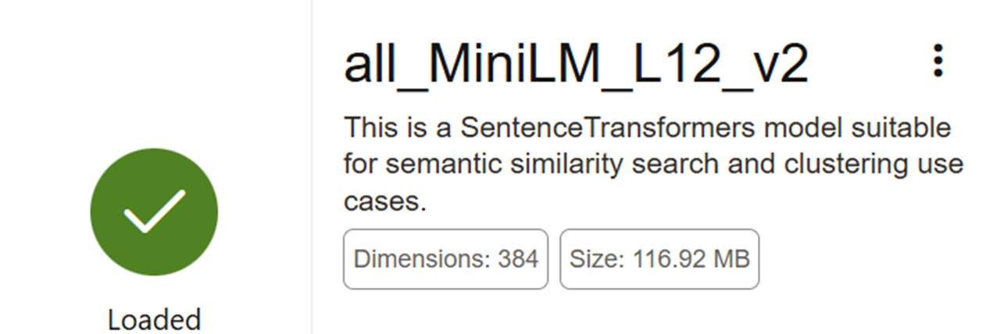

# Lab 1: Working with the Vector Database Console

## Introduction

In this lab, you sign in to Database Actions, open the Autonomous AI Vector Database Console, retrieve the REST URL that later labs use from Python, review available embedding models, and become familiar with the console workspace.

Estimated Time: X

### Objectives

- Sign in to Database Actions and open the Vector Database Console.
- Retrieve the Vector Database REST URL.
- Review the available embedding models.
- Explore the Vector Database Console.

### Prerequisites

- Complete the Get Started Lab and keep its final page available.
- Oracle Cloud account with access to the workshop Autonomous AI Vector Database.

## Task 1: Sign In to Database Actions and Open the Vector Database Console

Database Actions is the web interface for working with your Autonomous AI Vector Database. In this task, you use the Sandbox login information to access Database Actions, then open its Vector Database workspace.

1. Return to the final step of the Get Started Lab and select **View Login Info**.
2. On the Reservation Information page, scroll to **ADB Database Actions URL** in the Terraform Outputs section.
    Record the **ADB Username** and **ADB User Password**. Keep these credentials private; do not add them to source files or a Git repository.

3. Select **Open Link** next to **ADB Database Actions URL**.

    
    Database Actions login page opens in a new browser tab or window.

4. Enter the ADB username and password you recorded, then select **Sign In**.

    The Database Actions launchpad displays the database tools available to you.

5. Select **Vector Database**.

    

6. In the Vector Database panel, select **Open** in the lower-right corner.

    

    The Vector Database Console is a browser-based workspace for exploring vector database resources. Use it to view and load embedding and reranking models; create, browse, and query vector tables; and configure an OAuth client for REST access. It also provides links to sample applications and the Oracle VecDB Python SDK. In the next task, you will copy the REST URL that the SDK uses to connect to this database.
    The Vector Database Console opens. Keep this browser tab open for the remaining tasks in this lab.

## Task 2: Retrieve the REST URL

To connect to Autonomous AI Vector Database from Python, you need the REST URL, username, and password. You recorded the username and password in Task 1; now copy the REST URL.

1. In the Vector Database Console, select the **Overview** tab if it is not already selected.

2. On the right side of the console, select **REST URL** to copy the URL.

3. Save the URL in a secure temporary location, keep it on your clipboard, or return to this page when you configure the Python client in Lab 3. Do not add credentials to source control.

## Task 3: Load an Embedding Model

A core Autonomous AI Vector Database capability is integrated embedding. When you upsert a record into an integrated embedding table, the database uses the configured model to generate a vector from the selected metadata field and stores that vector with the record.

Three embedding models are available when your database is created, but they are not loaded initially. In this workshop, you use `all_MiniLM_L12_v2`, so load it before you begin the Python exercises.

1. In the Vector Database Console, select **Choose model** to view the models available to load.

    

2. Review the available models. The three listed models are available for use but are not yet loaded into your database.

    You can also load your own ONNX-compatible embedding or reranking model when an application requires a different model.

    

3. Find `all_MiniLM_L12_v2`, then select the **+** icon next to the model name to load it.

    

4. Wait a few seconds for the model to load. When loading is complete, a green circle with a check mark appears next to the model, indicating that it is ready to use.

    

5. Confirm that `all_MiniLM_L12_v2` shows the green check mark. You are now ready to start coding your application.

## Task 4: Explore the Vector Database Console

The Vector Database Console includes additional capabilities that you do not need to configure yet. It is especially useful for reviewing the vector tables you create and for testing queries against the data you load in later labs.

1. Review the links in the left navigation panel to see the available console areas.

    There is nothing else to configure in this task. The purpose is to become familiar with where the console features are located.

2. Continue to the Python exercises. After you have created vector tables and loaded data, return to the console to inspect your tables and test queries.

You may now **proceed to the next lab.**

## Learn More

- [Connect to Oracle Autonomous AI Database using Database Actions](https://github.com/oracle-livelabs/common/blob/main/labs/sqldevweb-login/sqldevweb-login.md)
- [Autonomous AI Vector Database documentation](https://docs.oracle.com/en/cloud/paas/autonomous-database/vcapi/overview.html)

## Acknowledgements

* **Author** - Oracle LiveLabs workshop authoring team
* **Last Updated By/Date** - Codex, August 28, 2026