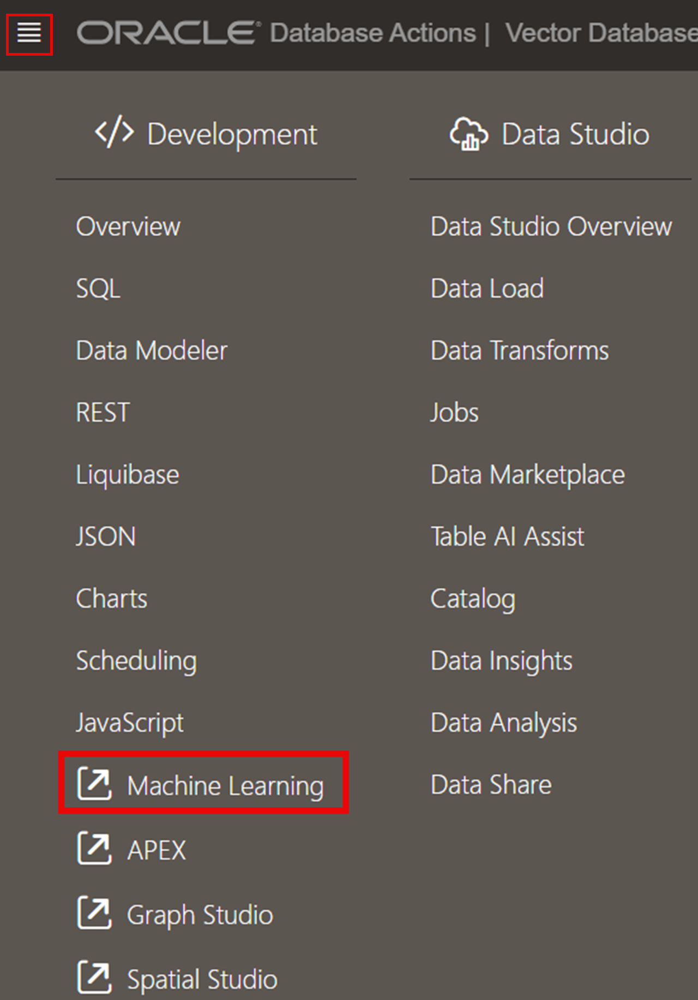
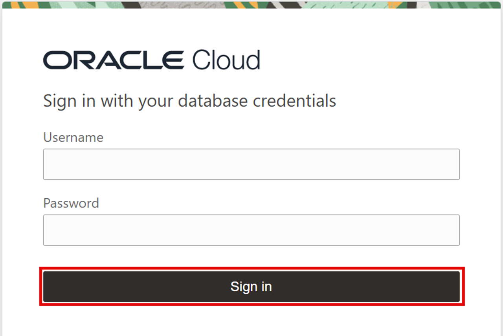
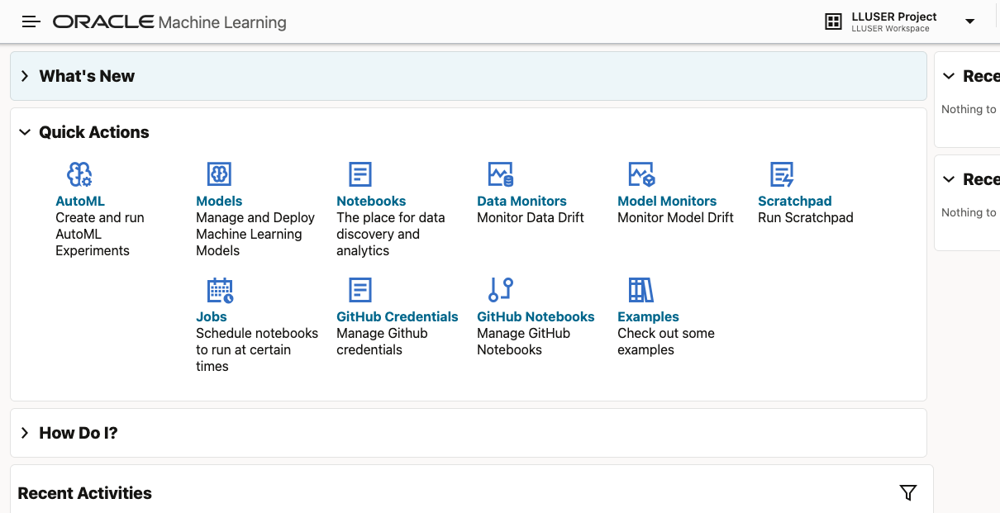
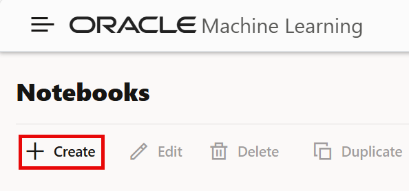
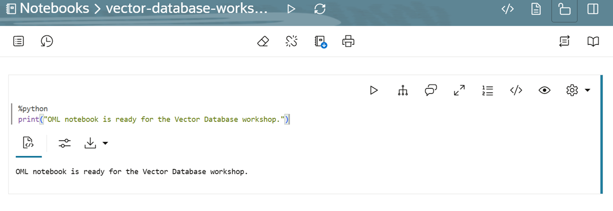
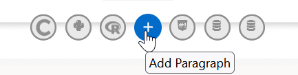

# Lab 2: Get Started with Oracle Machine Learning Notebooks

## Introduction

In this lab, you switch from the Vector Database Console to Oracle Machine Learning (OML) Notebooks. You open OML, create a notebook, then run a Python paragraph. Later labs use this notebook environment to run the Vector Database Python SDK examples.

Estimated Time: X

### Objectives

- Open Oracle Machine Learning from your Autonomous AI Vector Database.
- Create an OML notebook.
- Add and run a `%python` paragraph.

### Prerequisites

- Complete Lab 1: Working with the Vector Database Console.
- Have the database sign-in credentials provided for this workshop.

## Task 1: Open Oracle Machine Learning

1. From the Vector Database Console, open the **Database Actions** navigation menu in the upper-left corner and select **Oracle Machine Learning**.

    

2. On the Oracle Machine Learning sign-in page, enter the workshop database username and password, then select **Sign In**.

    

3. The OML landing page opens. This is where you organize projects, create notebooks, and run SQL, Python, and other notebook paragraphs.

    

## Task 2: Create a Notebook

1. In OML, click the **Notebooks** icon, then select **Create** to create a new notebook.

    

2. Enter `vector-database-workshop` for the notebook name, then select **Create**.

    The notebook opens with a first paragraph, ready for you to choose the language and enter code.

## Task 3: Add and Run a Python Paragraph

1. In the first notebook paragraph, enter the following code.

    

    ```
    <copy>
    %python
    print("OML notebook is ready for the Vector Database workshop.")
    </copy>
    ```

2. Run the paragraph by selecting the **Run** icon or pressing **Shift+Enter**.

    

3. Confirm that the output appears below the paragraph. The first time you run Python, OML starts a Python environment, which can take about a minute.

4. To add another paragraph, select **Add Paragraph** by moving your mouse just below or between any paragraph. Use `%python` at the top of a paragraph whenever you want to run Python code in the notebook.

    

    Keep this notebook open. You will use it to run the Python SDK examples in the next lab.

## Learn More

- [Oracle Machine Learning Notebooks documentation](https://docs.oracle.com/en/database/oracle/machine-learning/oml-notebooks/)

## Acknowledgements

* **Author** - Oracle LiveLabs workshop authoring team
* **Last Updated By/Date** - Codex, August 27, 2026
