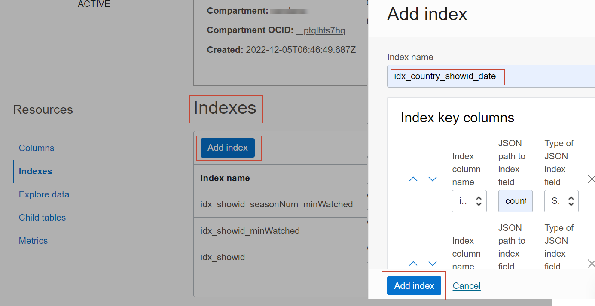
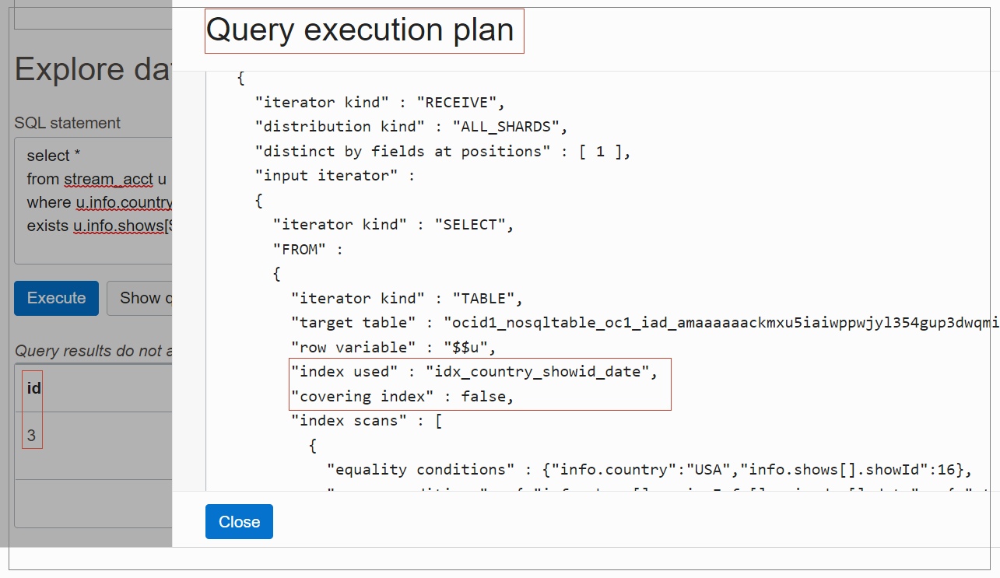

# Explore Data and Run Queries

## Introduction

This lab picks up where Lab 5 left off. You are going to explore in more detail
the tables you created, and execute queries using OCI Console.  

**And now, for the fun part, let’s look at some queries over the streaming data.**

_Estimated Time:_ 15 minutes

### Objectives

* Writing and optimizing queries over nested array

### Prerequisites

* An Oracle Free Tier, Paid Account or Green Button
* Connection to the Oracle NoSQL Database Cloud Service
* Working knowledge of bash shell


## Task 1: Create the required indexes

Before exploring nested arrays, create the indexes on `stream_acct` table that will be handy while writing the queries. You already created three indexes as part of the previous lab after creating **stream_acct** table.
Given below are the DDL statements for creating the two new indexes. You will create these indexes from the OCI console as shown below. You can have the DDL statement as reference when you create the index in the OCI console.

Log in to the OCI console. From the hamburger menu, click **Databases**. Under Oracle NoSQL Databases, click **Tables**.
Click the **stream_acct** table. Under **Resources**, click **Indexes**. The list of indexes already created in the table is listed.


Create an index `idx_country_showid_date` as shown below.
````
<copy>
create index idx_country_showid_date on stream_acct(
    info.country as string,
    info.shows[].showId as integer,
    info.shows[].seriesInfo[].episodes[].date as string)
</copy>    
````

````
<copy>
create index idx_country_genre on stream_acct(
    info.country as string,
    info.shows[].genres[] as string)
</copy>    
````


## Task 2: Don’t unnest that array!

People familiar with more traditional SQL on flat data may think that in order to do interesting things with arrays, the arrays have to be unnested and/or subqueries have to be employed (and in fact some commercial NoSQL systems require unnesting and subqueries to work with arrays).

Unnesting, employed in the FROM clause, is like a row-level self-join operation. Assuming only one array is to be unnested, each table row is combined with each element of that array, which is contained in the row itself, to produce N tuples, where N is the size of the array.

Although Oracle NoSQL supports unnesting (but not subqueries), it also includes various other features that make unnesting and subqueries unnecessary in most cases. In this section you will understand these features. Avoiding unnesting makes queries on arrays easier to write and more efficient to execute. However, some times unnesting is indeed unavoidable. In the next section, you learn examples of unnesting queries.

1. **A simple introductory query**

Write a query that returns the number of users in USA that have shown an interest in the show with id 16.

**Method 1:**
````
<copy>
select count(*) as cnt
from stream_acct u
where u.info.country = "USA" and
u.info.shows.showId =any 16
</copy>
````
Notice the use of the `=any` operator here. Using the simple `=` operator would cause a runtime error to be raised, because `=` expects each of its operands to be at most one value, but the `u.info.shows.showId` path expression returns all the show ids in the shows array. Instead, the  `=any` acts like a `contains` here, i.e., it returns true if the shows array contains a show id with value 16.

See [Sequence Comparison operators] (https://docs.oracle.com/en/database/other-databases/nosql-database/22.2/sqlreferencefornosql/sequence-comparison-operators.html) for more details on the `=any` operations.

**Method 2:**
The query could also be written like this:

````
<copy>
select count(*) as cnt
from stream_acct u
where u.info.country = "USA" and
exists u.info.shows[$element.showId = 16]
</copy>
````

Here, the `$element` variable iterates over the elements of the shows array and the condition `$element.showId = 16` selects the show whose id is 16. Since the path expression `u.info.shows[$element.showId = 16]` returns a set of shows (at most one show in this case), rather than a boolean value, the exists operator is needed to convert this set to a boolean value (returning true if the set is not empty).
See [Path expressions](https://docs.oracle.com/en/database/other-databases/nosql-database/22.2/sqlreferencefornosql/path-expressions.html) for the full specification of path expressions.

**Indexes used:**

Both the above queries uses the `idx_country_showid_date` index. Both the query conditions are pushed to the index. In fact, the index is “covering” each query, i.e., it contains all the info needed by the query, and as a
result, no table rows are scanned during execution. Click [Query Optimization ](https://docs.oracle.com/en/database/other-databases/nosql-database/22.2/sqlreferencefornosql/query-optimization.html) for more examples and details about
how indexes are used by queries.

**Query Plan:**

To confirm the use of the index and to see what conditions are pushed to it, you can display the query execution plan from the OCI console as shown below. Once you provide your query under Explore Data, click **Show query execution plan** to view the execution plan for the query.


**Note**: This query does not access any data in arrays nested under the shows array. This example is an introduction to some of the query features (e.g., the “any” comparison operators, the exists operator, and the filtering conditions inside path expression) that you will use in the more complex queries that follow.

2. **Placing conditions on the elements of nested arrays**

Write a query that returns the details of users in USA who have watched at least one episode of show 16 after 2022-04-01.

**Query 2 a:**
````
<copy>
select * as cnt
from stream_acct u
where u.info.country = "USA" and
exists u.info.shows[$element.showId = 16].seriesInfo.episodes[$element.date > "2022-04-01"]
</copy>
````

In this example, the path expression after the `exists` operator drills down to the deepest arrays and applies filtering at 2 levels. The first `$element` variable iterates over the shows of each user and the `$element.showId = 16` condition selects the show with id 16. The second `$element` variable iterates over the episodes of that show and the condition selects the episodes with a date after 2022-04-01.

**Index Used:**

The query uses the `idx_country_showid_date` index. The index is not covering as you are fetching all the data from the table. You can view this index being used from the query plan as shown below.




**Incorrect way of writing the above query:**

Sometimes, you can easily make a very common mistake when writing the above query:

**Query 2 b:**
````
<copy>
select * from stream_acct u
where u.info.country = "USA" and
      u.info.shows.showId =any 16 and
      u.info.shows.seriesInfo.episodes.date >any "2022-04-01"
</copy>
````
The queries 2a and 2b are not equivalent! Query 2b returns the number of users in USA who have watched at least one episode of show 16 and have also watched an episode of some show (not necessarily show 16) after 2022-04-01. The 2 “any” predicates in this query are applied independent of each other.

**Index Used:**

Query 2b uses the `idx_country_showid_date` index. However, only one of the two `any` conditions can be pushed to the index. In this case, the `showId` condition is pushed because it’s an equality condition whereas the date condition is a range one. The date condition must be applied on the table rows, which must be retrieved. Therefore, the index is not covering this query as shown below.


3. **Which index to choose?**

The query processor can identify which of the available indexes are beneficial for a query and rewrite the query to make use of such an index. What happens when there is more than one index available for the query? Can you force using a particular index?. Some examples to understand the usage of indexes in queries.

**Example:**

Write a query that returns the number of users who have watched at least one episode of show 15 after 2022-04-01.

````
<copy>
select count(*) as cnt
from stream_acct u
where exists u.info.shows[$element.showId = 15].seriesInfo.episodes[$element.date > "2022-04-01"]
</copy>
````

**Choice of Indexes:**

 In this case, the query can use either `idx_country_showid_date` or `idx_showId`, and it’s not clear which index is the better choice. If it chooses `idx_country_showid_date`, it will do a full scan of the whole index applying the two
conditions on each index key. As a result, it will access and filter-out many non-qualifying index keys. If it chooses `idx_showId`, it will scan only the index keys with `showId = 15`, but it will then have to retrieve the associated table rows in order to apply the date conditions on them. So,`idx_showid` scans far fewer index keys than `idx_country_showid_date`, but `idx_showId` is not covering whereas `idx_country_showid_date` is.


Whether `idx_showId` or `idx_country_showid_date` is better depends on how selective the show id condition is. Oracle NoSQL does not currently collect statistics on index keys distribution, so it relies on a simple heuristic to choose among multiple applicable indexes. In this case, the heuristic chooses `idx_showId` on the assumption that the `showId = 15` predicate must be a highly selective one because `showId` is the complete key of an index. If this turns out to be the wrong choice, you can force the use of `idx_country_showid_date` by using an index hint, as shown in the next example.

**Forcing the use of a specific index**

````
<copy>
select /*+ FORCE_INDEX(stream_acct idx_country_showid_date) */
count(*) as cnt
from stream_acct u
where exists u.info.shows[$element.showId = 15].seriesInfo.episodes[$element.date > "2022-04-01"]
</copy>
````
In this example, you are forcing the use of index `idx_country_showid_date`. You can verify this from the query plan shown below.


4. **Placing conditions on the elements of sibling arrays**

You can place conditions on the elements of any arrays.

**Example:**

Write a query that returns the number of users in USA who have watched a French or Danish
show in 2022.

````
<copy>
select count(*) as cnt
from stream_acct u
where u.info.country = "USA" and
      exists u.info.shows[
      exists $element.genres[$element in ("french", "danish")] and
      exists $element.seriesInfo.episodes["2022-01-01" <= $element.date
      and $element.date <= "2022-12-31"] ]
</copy>
````
Here, the genres and episodes arrays are not nested into each other, but both are nested inside the shows array (hence genres and episodes are `sibling` arrays). Since both the genre and date conditions must apply to the same show, the conditions are written as two filtering predicates at the level of the shows array.

**Indexes used:**

The query uses the `idx_country_genre `index. The country and genres conditions are pushed to the index. Two index scans will be performed: one scanning the keys with value (`USA`, `french`) and another scanning the keys with value (`USA`,`danish`). The date conditions will be applied on the table rows associated with the qualifying index keys. This can be viewed in the query plan as shown below.


Two more things are worth mentioning here.

* The query could have benefited by an index on all three fields: country, genre, and episode date. If such an index existed, all the query conditions could be pushed to the index. However, you cannot create such an index (in the current implementation) as all the arrays indexed must be nested into each other. Here the genres arrays and the episodes arrays do not satisfy this constraint.
* The expression `exists $element.genres[$element in ("french", "danish")]` can been written in one of the following ways:
`exists $element.genres[$element = "french" or $element = "danish")]`
or
`$element.genres[] =any seq_concat(“french”, “danish”)`

However, either of these two forms would cause the condition to be pushed to the index as a `filtering predicate` and not as a `start/stop` predicate that establishes the boundaries of the index scan (only the country predicate would be pushed as a start/stop predicate in this case). In other words, the IN operator is optimizable, whereas the OR operator and an `any` operator whose right operand returns more than one values are not optimizable.

5. **Aggregating array elements**

You can transform the shape of JSON documents and aggregate array elements.

**Example:**

Write a query that returns the user’s account, user ids, the total time the user has spent watching show 16, and an array containing information about all the episodes of show 16 that the user has watched. The users should have watched at least one episode of show 16 after 2022-4-01.
````
<copy>
select u.id,
seq_sum(u.info.shows[$element.showId = 16].seriesInfo.episodes.minWatched) as time,
[ seq_transform(u.info.shows[$element.showId = 16],
     seq_transform($sq1.seriesInfo[],
        seq_transform($sq2.episodes[],
        { "showName" : $sq1.showName,
          "seasonNum" : $sq2.seasonNum,
          "episodeId" : $sq3.episodeID,
          "dateWatched" : $sq3.date}
))) ] as episodes
from stream_acct u
where u.info.country = "USA" and
exists u.info.shows[$element.showId = 16].seriesInfo.episodes[$element.date > "2022-04-01"]
</copy>
````
Each element of the array in the above query is a JSON document containing the show name, the season number, the episode id, and the date the episode was watched.

When you execute the query for a sample data, the query returns a sample result that looks like this:


The query illustrates how the `seq_transform` expression can be used, together with JSON object and array constructors, to transform the shape of the stored data. In this case, information from arrays in 3 different levels is combined into a new single flat array.

In general, the `seq_transform` expression takes two other expressions as input. It evaluates the first (`source`) expression, and for each value in the resulting sequence, it evaluates the second (`mapper`) expression. The result of the `seq_transform` expression itself is the concatenation of the values produced by the evaluations of the mapper expression. During these evaluations, a variable is available to reference the current value of the source expression. The name of the variable is `$sk n`, where n is the level of nesting of the `seq_transform` expression within other seq_transform expressions.

In this example, the source expression of the first (outer-most) `seq_transform` expression returns show 16. Then, the `$sk1` variable is bound to this show and the second `seq_transform` expression is evaluated. The source expression of this `seq_transform` returns all the show-16 seasons watched. For each such season, the `$sk2` variable is bound to it and the third `seq_transform` expression is evaluated. The source expression of this `seq_transform` returns all the episodes of the current season. Finally, the mapper expression of the third `seq_transform` constructs a json document with the needed info for each episode, extracting this info from the values bound to the `$sk1`, `$sk2`, and `$sk3` variables.

The query also illustrates the use of a sequence aggregation function (`seq_sum`) to sum up the time spent by a user watching episodes that satisfy a condition (the episodes of show 16).
Click [Sequence Aggregate functions](https://docs.oracle.com/en/database/other-databases/nosql-database/22.2/sqlreferencefornosql/sequence-aggregate-functions.html) for details on sequence aggregation functions.
The corresponding query plan showing the use of index is shown below.


6. **Complex conditions on nested arrays**

You can write more complex conditions on nested arrays.

**Example:**

The query returns the number of users who have fully watched show 15 (all seasons and all episodes to their full length).

````
<copy>
select count(*) as cnt
from users u
where u.info.shows.showId =any 15 and
      size(u.info.shows[$element.showId = 15].seriesInfo) =
      u.info.shows[$element.showId = 15].numSeasons and
      not seq_transform(u.info.shows[$element.showId = 15].seriesInfo[],
                        $sq1.numEpisodes = size($sq1.episodes)) =any false and
      not seq_transform(u.info.shows[$element.showId=15].seriesInfo.episodes[],
                        $sq1.lengthMin = $sq1.minWatched) =any false
</copy>
````

Let’s look closer at the WHERE clause of this query. The first condition selects show 15. The second condition requires that the size of the series Info array for show 15 is equal to the number of seasons for show 15, that is, the user has watched all the seasons. This (and the following) condition is required because the data contain only the seasons and episodes that a user has actually watched, not all the available seasons/episodes of a show. The third condition requires that the user has watched all the episodes of each season of show 15. It does so by using a
`seq_transform` expression to iterate over the seasons of show 15 and for each season, check if its number or episodes is equal to the size of its episodes array.

The `seq_transform` returns the result of these checks, i.e., a sequence of true/false values. The rest of the condition checks that the sequence contains only true values. The fourth condition requires that the user has fully watched each episode of show 15. It does so in the same way as the third condition.

The query uses the index `idx_showId`, pushing the `showId` condition to it. The other conditions cannot be pushed to any index. The query plan showed below shows the usage of this index.


## Task 3: Unnest if you really have to!

In the previous section you used path expressions with filtering conditions on array elements, the `seq_transform` expression, and the sequence aggregation functions to avoid the need for unnesting and subqueries. In fact, probably the only case where unnesting is really needed is when you want to group by fields that are contained in arrays. You will not use grouping in the first example below. It is just to illustrate the concept of unnesting. However you will use grouping in the rest of the queries in this section. See [Unnest Arrays and Maps](https://docs.oracle.com/en/database/other-databases/nosql-database/22.2/sqlreferencefornosql/unnest-arrays-maps.html) for more details on unnesting queries.

**Unnesting for the sake of it**

**Example:** For each user in USA who has watched at least one episode of show 16 after 2022-04-01, return one result for every episode of show 16 that the user has watched. Each such result contains the user's account and user ids, the show name, the season number, the episode id, and the date the episode was watched.

````
<copy>
select u.id,
       $show.showName, $season.seasonNum,
       $episode.episodeID, $episode.date
from stream_acct u, u.info.shows[] as $show,
              $show.seriesInfo[] as $season,
              $season.episodes[] as $episode
where u.info.country = "USA" and
      $show.showId = 16 and
      $show.seriesInfo.episodes.date >any "2022-04-01"
</copy>
````
Although a single table row satisfies the WHERE clause of this query, the result set of the query consists of 4 rows. The reason is that the query flattens the result array with four elements to produce 4 separate results as shown below.


**Grouping by a field in a top-level array**

**Example:**

 For each show, write a query that returns the number of users who have shown an interest in that show. Sort the results by the number of users in descending order.

````
<copy>
select $show.showId, count(*) as cnt
from stream_acct u, unnest(u.info.shows[] as $show)
group by $show.showId
order by count(*) desc
</copy>
````
Here the query orders the shows according to a measure of their popularity as shown below.


**Indexes used:**

The query uses the `idx_showid` index and the index is a covering one for this query. To make the use of this index possible, two Oracle NoSQL features have been used.

* The index was created with the `with unique keys per row` property. This informs the query processor that for any streaming user, the shows array cannot contain two or more shows with the same show id. The restriction is necessary because if duplicate show ids existed, they wouldn’t be included in the index, and as a result, the index would contain fewer entries than the number of elements in the shows arrays. So, use of such an index by the query would yield fewer results from the FROM clause than if the index was not used.
* The `UNNEST` clause was used in the query to wrap the unnesting expression. Semantically, the `UNNEST` clause is a noop (no operator). However, if an index exists on the array(s) that are being unnested by a query, use of `UNNEST` is necessary for the index to be considered by the query. The `UNNEST` clause places some restrictions on what kind of expressions can appear in it (see [Limitation for expression usage in the UNNEST clause](https://docs.oracle.com/en/database/other-databases/nosql-database/22.2/sqlreferencefornosql/unnest-arrays-maps.html)]), and these restrictions make it easier for the query optimizer to “match” the index and the query.

**Grouping by a field in a top-level array, but aggregating over deeply nested fields**

**Example:**

For each show, return the total time users have spent watching that show. Sort the results in descending order of the total time.

````
<copy>
select $show.showId, sum($show.seriesInfo.episodes.minWatched) as totalTime
from stream_acct u, unnest(u.info.shows[] as $show)
group by $show.showId
order by sum($show.seriesInfo.episodes.minWatched) desc
</copy>
````
The above query is similar to the previous one. It just sorts the shows according to a different measure
of popularity as shown below.


**Indexes used**

The query uses the `idx_showid_minWatched` index, and the index is a covering one for this query. Notice that `idx_showid_minWatched` index indexes the `episodeID` field as well. It may appear that this is not necessary, but the field is actually needed so that the index satisfies the `with unique keys per row` property.


What if you didn’t have `idx_showid_minWatched`? Could this query have used `idx_showid`? The answer is no. This is because of the argument to the `sum()`function: The `idx_showid` index contains just the `showid` (and the primary key). So, if the query was evaluated by scanning that index, you wouldn’t be able to evaluate the `$show.seriesInfo.episodes.minWatched` expression, because there wouldn’t be any `$show` variable anymore (there would exist only an internal `$showid` variable that ranges over the index entries). Therefore, in order to compute
 the argument of `sum()`, you need to retrieve the full row. But what is the exact expression that should be computed as the argument of `sum()`? One might say that the expression is `info.shows.seriesInfo.episodes.minWatched`.
However, this is not correct because the expression returns the minutes watched for all the show ids in the row, instead of just the show id of the current group. This analysis leads to the following equivalent query, which does use the `idx_showid` index. However, the index is not covering in this case as shown below.

````
<copy>
select $show.showId,
sum(u.info.shows[$element.showId = $show.showId].
seriesInfo.episodes.minWatched) as totalTime
from stream_acct u, unnest(u.info.shows[] as $show)
group by $show.showId
order by sum(u.info.shows[$element.showId = $show.showId].
seriesInfo.episodes.minWatched) desc
</copy>
````

**Grouping by fields in a nested array**

**Example:**

For each show and associated season, return the total time users have spent watching that show and season. Sort the results in descending order by the total time.

````
<copy>
select $show.showId,
       $seriesInfo.seasonNum,
       sum($seriesInfo.episodes.minWatched) as totalTime
from stream_acct u, unnest(u.info.shows[] as $show,
                     $show.seriesInfo[] as $seriesInfo)
group by $show.showId, $seriesInfo.seasonNum
order by sum($seriesInfo.episodes.minWatched) desc
</copy>
````
The query uses `idx_showid_seasonNum_minWatched` as a covering index as shown below.


## Task 4: Clean Up

This task deletes the tables and other OCI components that got created.

<if type="paid">
1. On the top left, go to menu, then **Databases**, then under Oracle NoSQL Database, press **Tables**
Set your compartment to `demonosql`. Click the **freeTest** table, which will bring up the table details screen. Press **More Actions** and then **Delete** under that. This will bring up a new screen and press **Delete** again.

  

  Deleting tables is an async operation, so you will not immediately see the results on the Oracle Cloud Console. Eventually the status of the tables will get changed to deleted.
</if>

<if type="freetier">
1. On the top left, go to menu, then **Databases**, then under Oracle NoSQL Database, press **Tables**
Set your compartment to 'demonosql'. Click the **freeTest** table, which will bring up the table details screen. Press **More Actions** and then **Delete** under that. This will bring up a new screen and press **Delete** again.

  

  Deleting tables is an async operation, so you will not immediately see the results on the Oracle Cloud Console. Eventually the status of the tables will get changed to deleted.
</if>

<if type="livelabs">
1. On the top left, go to menu, then **Databases**, then under Oracle NoSQL Database, press **Tables**
Select your compartment. Click the **freeTest** table, which will bring up the table details screen. Press **More Actions** and then **Delete** under that. This will bring up a new screen and you press **Delete** again.

  

  Deleting tables is an async operation, so you will not immediately see the results on the Oracle Cloud Console. Eventually the status of the tables will get changed to deleted.
</if>

2. Return to the 'Tables' screen and repeat the process for the **stream_acct** table.

<if type="paid">

3. Remove the files added into your Cloud Shell. Open Cloud Shell and execute. Minimize Cloud Shell.

    ````
    <copy>
    cd ~
    rm -rf video-on-demand-with-nosql-database
    </copy>
    ````

4. Remove the 'demonosql' compartment. From upper left hand menu, go to **Identity and Security** then **Compartments** under 'Identity.'

    

5. The 'Compartments' screen appears and click **demonosql**

    

6. Press the **Delete** button. This will fire off a job that runs asynchronously.

    
</if>

<if type="freetier">
3. Remove the files added into your Cloud Shell. Open Cloud Shell and execute. Minimize Cloud Shell.

    ````
    <copy>
    cd ~
    rm -rf video-on-demand-with-nosql-database
    </copy>
    ````

4. Remove the 'demonosql' compartment. From upper left hand menu, go to **Identity and Security** then **Compartments** under 'Identity.'

    

5. The 'Compartments' screen appears and click **demonosql**

    

6. Press the **Delete** button. This will fire off a job that runs asynchronously.

    
</if>

## Learn More


* [Oracle NoSQL Database Cloud Service page](https://www.oracle.com/database/nosql-cloud.html)
* [NoSQL SQL Reference Manual](https://docs.oracle.com/en/database/other-databases/nosql-database/22.3/sqlreferencefornosql/index.html)


## Acknowledgements
* **Author** - Markos Zaharioudakis, Software Architect, NoSQL Product Development
* **Last Updated By/Date** - Vandana Rajamani, Principal UA developer, Oracle NoSQL Database, November 2022
