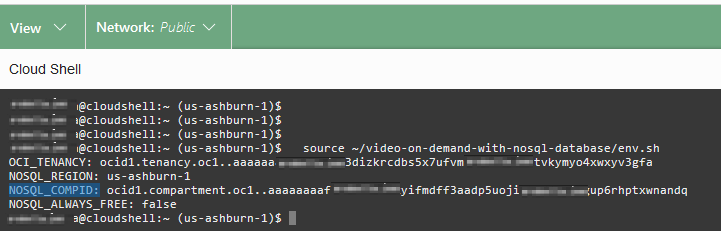
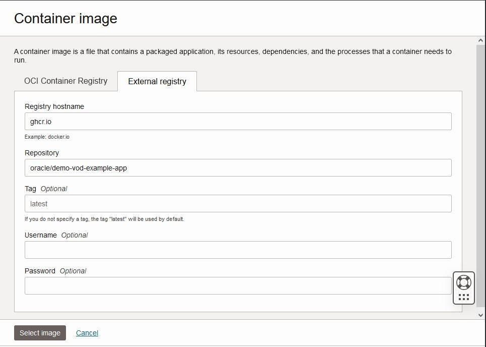

# Deploy the Activity Tracking application using Container Instances

## Introduction

This lab picks up where lab 4 left off. We are going to explore in more detail
another possibility to deploy the application - use Container Instances.

Oracle Cloud Infrastructure (OCI) Container Instances is a serverless compute service
that enables you to quickly and easily run containers without managing any servers.
Container Instances runs your containers on serverless compute optimized for container
workloads that provides the same isolation as virtual machines.

Container instances are suitable for containerized workloads that do not require a
container orchestration platform like Kubernetes. These use cases include: APIs,
web applications, build and deployment jobs in CI/CD pipelines, automation tasks f
or cloud operations, data/media processing jobs, development or test environments, and more.

_Estimated Time:_ 20 minutes

[Walkthrough Lab 05: Deploy the Activity Tracking application using Container Instances](videohub:1_mwp455k5)

### Objectives

* Deploy the application using Container Instance
* Read data with GraphQL API deployed in the new Container Instance

### Prerequisites

* An Oracle Free Tier, Paid Account or Green Button
* Connection to the Oracle NoSQL Database Cloud Service
* Working knowledge of bash shell
* Working knowledge of SQL language


## Task 1: Review the code using OCI Code Editor

In this task we will review the code using OCI Code Editor.

1. Open the OCI Code Editor in the top right menu.

    


2. Go to the Code Editor, and open the file `index.js` in the following directory
`video-on-demand-with-nosql-database/demo-vod` as shown in the screen-shot:

    

   Let's take a look at the function `createNoSQLClient` again.  In the
   previous lab, we ran the application code using Cloud Shell and used
   **delegation tokens**.  In this lab, we are going to be running
   application using **Resource Principals**.

    * As discussed in the Lab 2 - Task 4: Understand Credentials, and Policies.
To use them you have to set up a dynamic group and create a policy that grants
the dynamic group access to a resource.
We did it for you in **Lab 2 - Task 3: Deploy Infrastructure using Terraform**.
Take a look at the `policy.tf` file in the following directory `video-on-demand-with-nosql-database`.
    * In this Lab, We will use a container image that we deployed in GitHub Container Registry.
Take a look to the `Dockerfile` in the following directory `video-on-demand-with-nosql-database/demo-vod`, and [check here](https://github.com/oracle/nosql-examples/blob/master/.github/workflows/build-and-push-demo-vod-image.yml)

    * Note: When deploying using OKE - see Lab 1, you will do the connection using **Instance Principals**. It is not the topic of this workshop but if you
want to learn more read the `oracle-app-ndcs-deployment.yaml` file in the following directory `video-on-demand-with-nosql-database`. [Check here](https://github.com/oracle/nosql-examples/blob/master/.github/workflows/deploy-oke-oci-cli-demo-vod.yml) to learn how to deploy using GitHub Actions.

When you are done looking at code, go ahead and exit from the Code Editor.

## Task 2: Restart the Cloud Shell

1. Let's get back into the Cloud Shell. From the earlier lab, you may have
minimized it in which case you need to enlarge it. It is possible it may have
become disconnected and/or timed out. In that case, restart it.

    

2. Execute the following environment setup shell script in the Cloud Shell to
set up your environment. Please copy the values for `NOSQL_REGION` and `NOSQL_COMPID.`

    ```shell
    <copy>
    source ~/video-on-demand-with-nosql-database/env.sh
    </copy>
    ```
  

  Minimize the Cloud Shell.

## Task 3: Deploy a Container Instance


 1. On left side drop down (left of Oracle Cloud banner), go to Developer Services and then Containers & Artifacts - Container Instances.

     

 2. Click on Create Container Instance. This opens up a new window.

   Enter **Oracle NoSQL powers Video On-Demand applications** as the name.
   Other information does not need to be changed for this LiveLab. Click **Next.**

     

    Enter **demo-vod-example-app** as the name.  Click on **select image**, and
    a new screen appears.  Choose **external registry**, and
    enter **ghcr.io** as Registry hostname, **oracle/demo-vod-example-app** as Repository and Click **Select Image** at bottom of screen.

       

    Scroll down and add the following environment variables:
     - `NOSQL_ServiceType` as a key and `useResourcePrincipal` as a value
     - `NOSQL_REGION` as a key and the value copied in Task 2 as a value
     - `NOSQL_COMPID` as a key and the value copied in Task 2 as a value

     

   Click **Next.**

 3. Review and Click on create.

     

 4. Wait few second until the deployment is created - Status will change from **Creating** to **Active.**

     

   Please copy the Public IP address.


## Task 4: Read Data and Examine It

1. Execute the following environment setup shell script in the Cloud Shell to set up your environment.

    ```shell
    <copy>
    source ~/video-on-demand-with-nosql-database/env.sh
    </copy>
    ```
Set the variable IP_CI with the value copied in the previous section. Execute in the Cloud Shell.

    ```shell
    <copy>
    export IP_CI=<copied Public IP address>
    </copy>
    ```
    **Note:** The "demo-vod" application is running in the container.

2. Read back the data that we entered in the Lab 4 using the GraphQL query `Streams`.
Execute in the Cloud Shell.

    ```shell
    <copy>
    curl --request POST --header 'content-type: application/json' --url $IP_CI:3000 \
--data '{"query":"query Streams { streams { id  info { firstName  lastName country } }}"}' | jq
    </copy>
    ```

    This will display all the rows in the table currently without details about shows.

3. Read data for a specific user using the GraphQL query `Stream($streamId: Int).`

    ```shell
    <copy>
    curl --request POST \
    --header 'content-type: application/json' \
    --url $IP_CI:3000 \
    --data '{
  "query": "query Stream($streamId: Int) { user1:stream(id: $streamId) {id   info{ country shows {showName}} } }", "variables": { "streamId": 1} }'|jq
    </copy>
    ```

5. Execute one of the reports using the GraphQL queries.
      - For every show aired by the application, fetch the total watch time by all users

        ```shell
        <copy>
        curl --request POST \
        --header 'content-type: application/json' \
        --url $IP_CI:3000 \
        --data '{"query":"query WatchTime { watchTime { showName seasonNum length } } "}'|jq
        </copy>
        ```

Exit out of the Cloud Shell. You may now **proceed to the next lab.**

## Learn More


* [Oracle NoSQL Database Cloud Service page](https://www.oracle.com/database/nosql-cloud.html)
* [About Oracle NoSQL Database Cloud Service](https://docs.oracle.com/en/cloud/paas/nosql-cloud/index.html)
* [About Container Instance](https://docs.oracle.com/en-us/iaas/Content/container-instances/home.htm)


## Acknowledgements
* **Author** - Dario Vega, Product Manager, NoSQL Product Management
* **Last Updated By/Date** - Michael Brey, Director, NoSQL Product Development, July 2023
