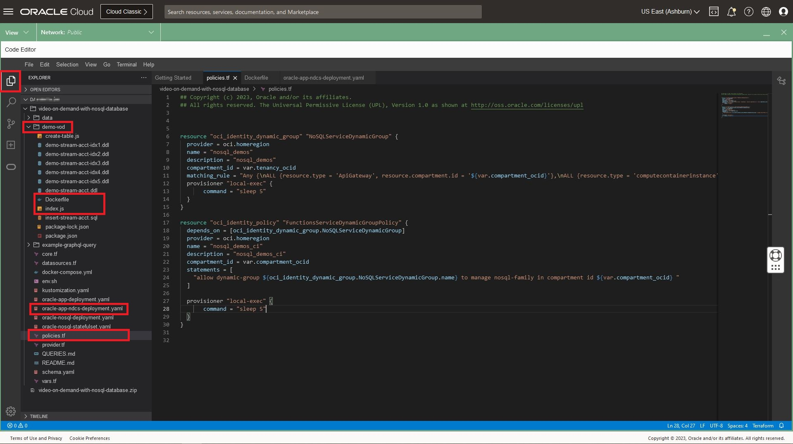
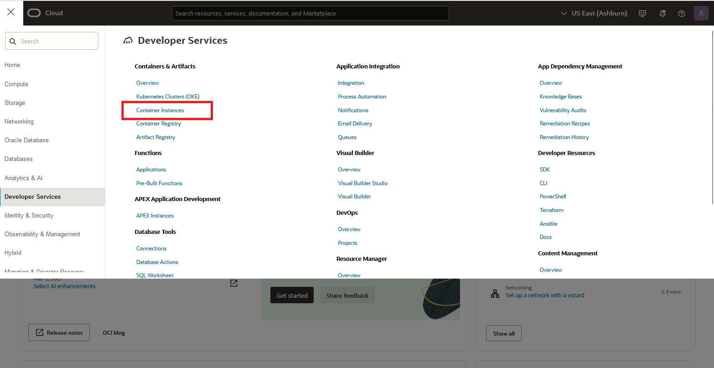
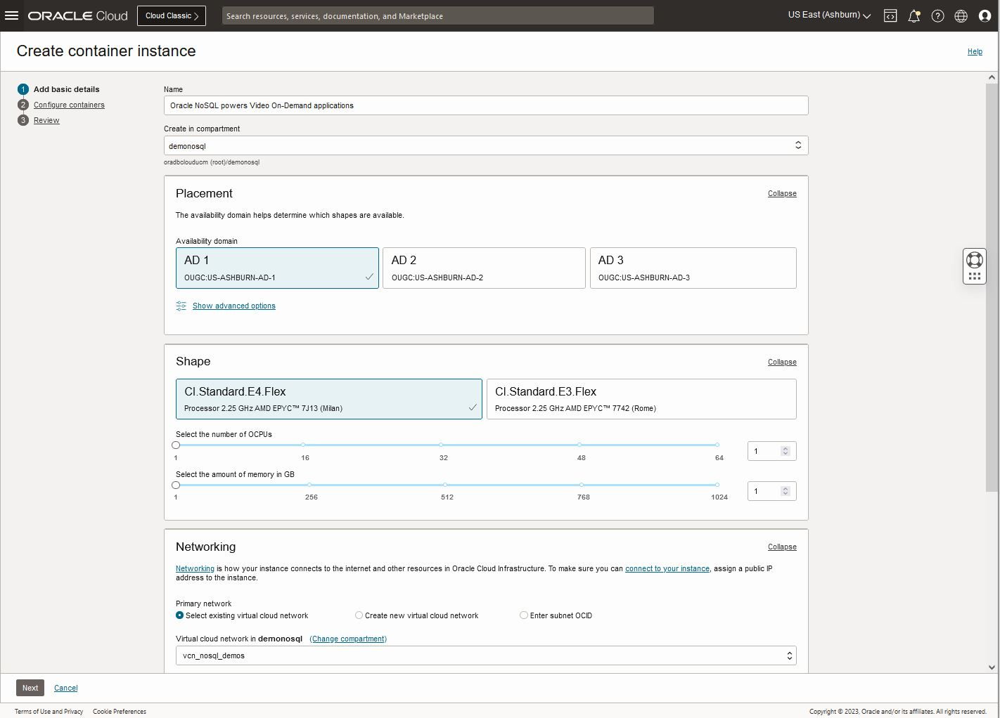
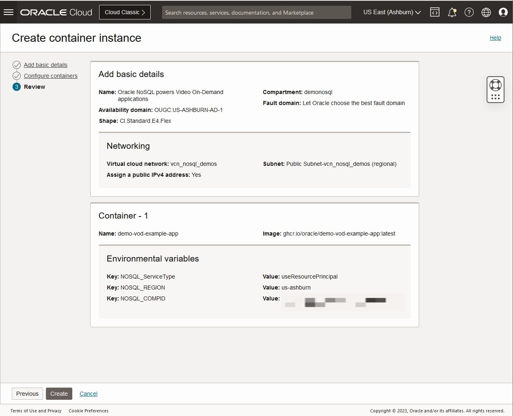
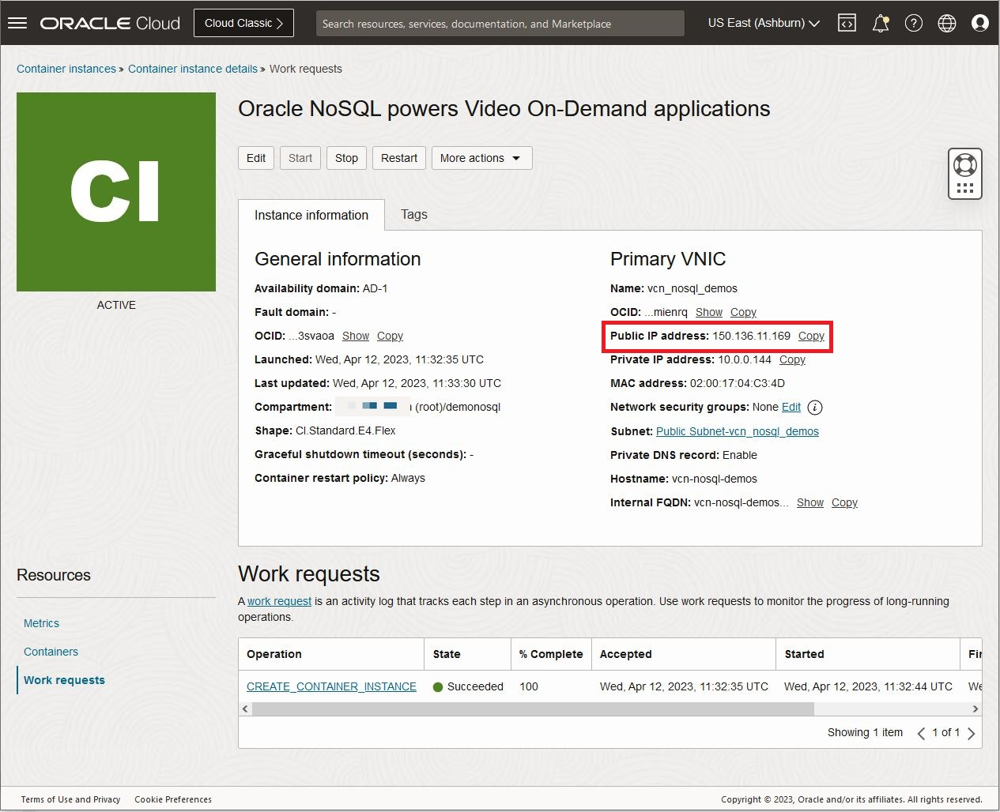

# Deploy the Activity Tracking application using Container Instances

## Introduction

This lab picks up where lab 4 left off. We are going to explore in more detail
another possibility to deploy the application - use Container Instances.

Oracle Cloud Infrastructure (OCI) Container Instances is a serverless compute service
that enables you to quickly and easily run containers without managing any servers.
Container Instances runs your containers on serverless compute optimized for container
workloads that provides the same isolation as virtual machines.

Container instances are suitable for containerized workloads that do not require a
container orchestration platform like Kubernetes. These use cases include: APIs,
web applications, build and deployment jobs in CI/CD pipelines, automation tasks f
or cloud operations, data/media processing jobs, development or test environments, and more.

_Estimated Time:_ 25 minutes

### Objectives

* Deploy the application using Container Instance
* Read data with GraphQL API deployed in the new Container Instance

### Prerequisites

* An Oracle Free Tier, Paid Account or Green Button
* Connection to the Oracle NoSQL Database Cloud Service
* Working knowledge of bash shell
* Working knowledge of SQL language


## Task 1: Review the code using OCI Code Editor

In this task we will review the code using OCI Code Editor.

1. Open the OCI Code Editor in the top right menu.

    


2. Go to the Code Editor, and open the file `index.js` in the following directory
`video-on-demand-with-nosql-database/demo-vod` as shown in the screen-shot:

    

    Oracle NoSQL Database offers **flexible deployment** options to suit the needs of
its customers. Whether deploying on an "On-Premises" cluster or utilizing the
Oracle NoSQL Database Cloud Service, developers and end-users get the latest in
NoSQL technology. Oracle offers a complete range of deployment options to
support your NoSQL database, from on-premises to private cloud to public cloud.

    The function `createNoSQLClient` allows to illustrate this:
    - You can use **Instance Principals** to do the connection to NoSQL Cloud Service as
shown in this code instead of specifying the credentials. Once they are set up,
you can configure your OKE cluster to isolate workloads across node pools,
create a dynamic group, write your policies. Your application connects to Oracle
NoSQL Database Cloud Service by using Instance Principals. You can Deploy your
application using the Kubernetes command line tool kubectl from the
instructions in a manifest file.
e.g. We deploy our image [using GitHub Actions](https://github.com/oracle/nosql-examples/blob/master/.github/workflows/deploy-oke-oci-cli-demo-vod.yml)

    - In the previous lab, we ran the application code using Cloud Shell and using another way
called **delegation token**

    - In this lab, we are going to be running application code and we will deploy the application using **Resource Principals**.

    - Finally, the default configuration in this code, allows you to do the Connection
to on-premise non-secure configuration. It is not the topic of this Lab but if you
want to learn more [click here](https://github.com/oracle/nosql-examples/blob/master/demo-livelab/video-on-demand-with-nosql-database/README.md)

    - Otherwise, the rest of the code is exactly the same.

    As a developer, you can access your data via an API or SQL. Review the rest of the code,
we are using both APIs to develop our application
    - Get, put, scan APIs for raw key/value pairs and tables – CRUD API
    - SQL for rich access to JSON, more complex filtering expressions
    - Support for conjunctions and disjunctions in filter expressions

    In the next Lab **Explore Data and Run Queries**, we will explore more on detail
 **SQL for rich access to JSON**. But let us continue with this Lab.

## Task 2: Restart the Cloud Shell

1. Let's get back into the Cloud Shell. From the earlier lab, you may have
minimized it in which case you need to enlarge it. It is possible it may have
become disconnected and/or timed out. In that case, restart it.

    

2. Execute the following environment setup shell script in the Cloud Shell to
set up your environment. Please copy the values for `NOSQL_REGION` and `NOSQL_COMPID`

   ```
  <copy>
  source ~/video-on-demand-with-nosql-database/env.sh
  </copy>
  ```


## Task 3: Deploy a Container Instance

 1. Log into the OCI console using your tenancy.

 

 2. On left side drop down (left of Oracle Cloud banner), go to Developer Services and then Containers & Artifacts - Container Instances.

     

 3. Click on Create Container Instance. This opens up a new window.

   Enter **Oracle NoSQL powers Video On-Demand applications** as  name.
   Other information does not need to be changed for this LiveLab. Then click Next

     

  Enter **demo-vod-example-app** as  name and add the following environment variables
     - `NOSQL_ServiceType` as a key and `useResourcePrincipal` as a value
     - `NOSQL_REGION` as a key and the value copied in Task 2 as a value
     - `NOSQL_COMPID` as a key and the value copied in Task 2 as a value

     

   Click on **select image**, choose **external registry**,
   enter **ghcr.io/oracle/demo-vod-example-app:latest** as image and Click **Select Image**

     

   Click Next

 4. Review and Click on create

     

 8. Wait few second until the deployment is created - Status will change from **Creating** to **Active**

     

   Please copy the Public IP address


## Task 4: Read Data and Examine It

1. Set the variable IP_CI with the value copied in the previous section. Execute in the Cloud Shell.

    ```
    <copy>
    export IP_CI=150.136.11.169
    </copy>
    ```
    **Note:** This will start the "demo-vod" application in the background.

2. Read back the data that we entered in the Lab 4 using the GraphQL query `Streams`.
Execute in the Cloud Shell.

    ````
    <copy>
    curl --request POST --header 'content-type: application/json' --url $IP_CI:3000 \
--data '{"query":"query Streams { streams { id  info { firstName  lastName country } }}"}' | jq
    </copy>
    ````

    This will display all the rows in the table currently without details about shows.

3. Read data for a specific user using the GraphQL query `Stream($streamId: Int)`

    ````
    <copy>
    curl --request POST \
    --header 'content-type: application/json' \
    --url $IP_CI:3000 \
    --data '{
  "query": "query Stream($streamId: Int) { user1:stream(id: $streamId) {id   info{ country shows {showName}} } }", "variables": { "streamId": 1} }'|jq
    </copy>
    ````

5. Execute one of the reports using the GraphQL queries - For every show aired
by the application, fetch the total watch time by all users

    ````
    <copy>
    curl --request POST \
    --header 'content-type: application/json' \
    --url $IP_CI:3000 \
    --data '{"query":"query WatchTime { watchTime { showName seasonNum length } } "}'|jq
    </copy>
    ````
You may now **proceed to the next lab.**

## Learn More


* [Oracle NoSQL Database Cloud Service page](https://www.oracle.com/database/nosql-cloud.html)
* [About Oracle NoSQL Database Cloud Service](https://docs.oracle.com/en/cloud/paas/nosql-cloud/index.html)
* [About Container Instance](https://docs.oracle.com/en-us/iaas/Content/container-instances/home.htm)


## Acknowledgements
* **Author** - Dario Vega, Product Manager, NoSQL Product Management
* **Last Updated By/Date** - Dario Vega, Product Manager, NoSQL Product Management, January 2023
