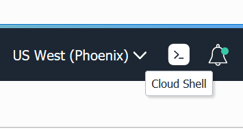
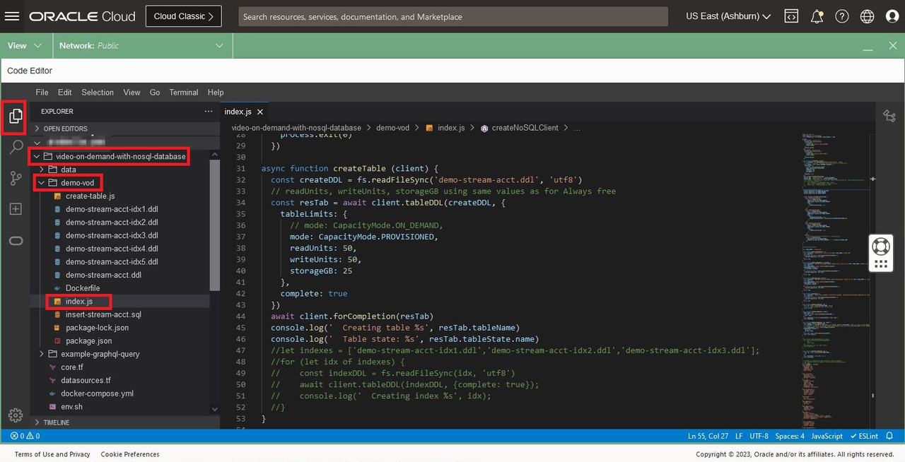
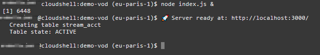

# Run the Activity Tracking application

## Introduction

This lab picks up where lab 4 left off. We are going to explore in more detail the tables we created, load data, and execute queries using a Python application.

_Estimated Lab Time:_ 25 minutes

### Objectives

* Understand the different tables
* Read data with GraphQL API

### Prerequisites

* An Oracle Free Tier, Paid Account or Green Button
* Connection to the Oracle NoSQL Database Cloud Service
* Working knowledge of bash shell
* Working knowledge of SQL language


## Task 1: Restart the Cloud Shell

1. Let's get back into the Cloud Shell. From the earlier lab, you may have minimized it in which case you need to enlarge it. It is possible it may have become disconnected and/or timed out. In that case, restart it.

    

2. Execute the following environment setup shell script in the Cloud Shell to set up your environment. If you close/open the Cloud Shell Console, please re-execute it.

    ```
    <copy>
    source ~/video-on-demand-with-nosql-database/env.sh
    </copy>
    ```

## Task 2: Review the code using OCI Code Editor



1. createNoSQLClient
explain that this code can also executed using OKE and on premise
- useInstancePrincipal
- on-premise non-secure configuration
2. createTable


## Task 3: Load Data and Examine It

The goal of this task is to understand the difference between the 2 data models used. The demoKeyVal table is a schema-less table, sometimes referred to as a JSON document, that contains a primary key and a JSON column.

1. Install the Node.js application. Execute in the Cloud Shell.

    ```
    <copy>
    cd ~/video-on-demand-with-nosql-database/demo-vod
    npm install
    npm install oracle-nosqldb --save
    node index.js &
    </copy>
    ```
    **Note:** This will start the "demo-vod" application in the background.

2. After you complete step 1, you will see a message in the shell saying 'application running'

    

    Press the **Enter** key on your keypad to get the command line prompt back.

3. Read back the data that we entered in the Lab 3. Execute in the Cloud Shell.

    ````
    <copy>
    curl --request POST --header 'content-type: application/json' --url 'localhost:3000' \
--data '{"query":"query Streams { streams { id  info { firstName  lastName country } }}"}' | jq
    </copy>
    ````

    This will display all the rows in the table currently without details about shows.

4. Read data for a specific user using GET command

    ````
    <copy>
    curl --request POST \
    --header 'content-type: application/json' \
    --url 'localhost:3000' \
    --data '{
  "query": "query Stream($streamId: Int) { user1:stream(id: $streamId) {id   info{ country shows {showName}} } }", "variables": { "streamId": 1} }'|jq
    </copy>
    ````

5. Execute one of the reports - For every show aired by the application, fetch the total watch time by all users

    ````
    <copy>
    curl --request POST \
    --header 'content-type: application/json' \
    --url 'localhost:3000' \
    --data '{"query":"query WatchTime { watchTime { showName seasonNum length } } "}'|jq
    </copy>
    ````

6. Insert data into the stream_acct table.

    This will be done using a curl command to transfer data over the network to the NoSQL store using the "demo-vod" application. Execute in Cloud Shell.

    ````
    <copy>
    cd ~/video-on-demand-with-nosql-database/example-graphql-query/
    </copy>
    ````

    ````
    <copy>
    sh create-stream.sh
    sh query-stream-by-id.sh
    </copy>
    ````

    ````
    <copy>
    sh update-stream.sh
    sh query-stream-by-id.sh
    </copy>
    ````


7. You can also execute sql statements using Oracle Cloud Infrastructure CLI commands. Going this route, you will be querying the data over REST. Execute in Cloud Shell.

    ````
    <copy>
    SQL_STATEMENT="SELECT * from stream_acct a where a.info.country = 'USA'"
    echo "$SQL_STATEMENT"
    </copy>
    ````

    ````
    <copy>
    oci nosql query execute -c  $NOSQL_COMPID --statement "$SQL_STATEMENT"
    </copy>
    ````
  In this case, the data is formatted as a nice JSON document.

7. Load information for 91 users. For the shows, we will insert 5 randoms shows
using a set of 46 shows

````
<copy>
cd ~/video-on-demand-with-nosql-database/example-graphql-query/
sh load.sh
</copy>
````
If you have an error saying,
````
ls: cannot access ../data/User: No such file or directory
````
it means that you forgot to load the data
````
<copy>
cd ~/video-on-demand-with-nosql-database/data/
sh unzip.sh
</copy>
````


## Learn More


* [Oracle NoSQL Database Cloud Service page](https://www.oracle.com/database/nosql-cloud.html)
* [About Oracle NoSQL Database Cloud Service](https://docs.oracle.com/pls/topic/lookup?ctx=cloud&id=CSNSD-GUID-88373C12-018E-4628-B241-2DFCB7B16DE8)
* [Java API Reference Guide](https://docs.oracle.com/en/cloud/paas/nosql-cloud/csnjv/index.html)
* [Node API Reference Guide](https://oracle.github.io/nosql-node-sdk/)
* [Python API Reference Guide](https://nosql-python-sdk.readthedocs.io/en/latest/index.html)
* [NoSQL SQL Reference Manual](https://docs.oracle.com/en/database/other-databases/nosql-database/21.2/sqlreferencefornosql/sql-reference-guide.pdf)
* [About Cloud Shell](https://docs.oracle.com/en-us/iaas/Content/API/Concepts/cloudshellintro.htm)


## Acknowledgements
* **Author** - Dario Vega, Product Manager, NoSQL Product Management
* **Last Updated By/Date** - Dario Vega, Product Manager, NoSQL Product Management, August 202Z
