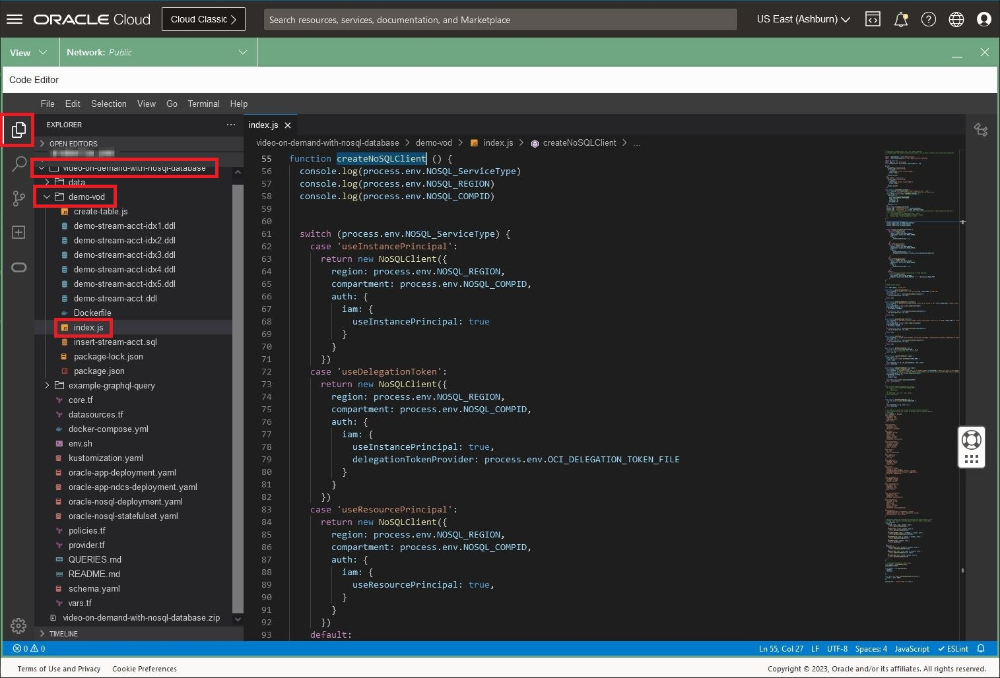

# Run the Activity Tracking application

## Introduction

This lab picks up where lab 3 left off. We are going to explore in more detail
the tables we created, load data, and execute queries using a GraphQL application.

_Estimated Time:_ 16 minutes

[Walkthrough Lab 04: Run the Activity Tracking application](videohub:1_0firnbxx)

### Objectives

* Understand the different tables
* Read data with GraphQL API

### Prerequisites

* An Oracle Free Tier, Paid Account or Green Button
* Connection to the Oracle NoSQL Database Cloud Service
* Working knowledge of bash shell
* Working knowledge of SQL language


## Task 1: Review the code using OCI Code Editor

In this task we will review the code using OCI Code Editor.

1. Open the OCI Code Editor in the top right menu.

    


2. Go to the Code Editor, and open the file `index.js` in the following directory
`video-on-demand-with-nosql-database/demo-vod` as shown in the screen-shot:

    

    Oracle NoSQL Database offers **flexible deployment** options to suit the needs of
its customers. Whether deploying on an "On-Premises" cluster or utilizing the
Oracle NoSQL Database Cloud Service, developers and end-users get the latest in
NoSQL technology. Oracle offers a complete range of deployment options to
support your NoSQL database, from on-premises to private cloud to public cloud.  Depending
on which deployment opiton you choose, you may need different authentication strategies.

  The function `createNoSQLClient` illustrates the different authentication options in the case
statement. We covered the authentication basics in Lab 2. If the function is not visible in your
screen, go ahead and scroll to it:
    * You can use **Instance Principals** to do the connection to NoSQL Cloud Service as
shown in this code. Once Instance Principals are set up, you can make API calls to
different Oracle Cloud Infrastructure services.  The benefit it applications running
on those instances does not have to configure user credentials or a configuration file.

    * You can use **Delegation Tokens** to do the connection to NoSQL Cloud Service
    and in this lab we will use them.

    * You can use **Resource Principals** to do the connection to NoSQL Cloud Service as
shown in this code.

    * Finally, the default configuration in this code, allows you to do the connection
to on-premise non-secure configuration. It is not the topic of this workshop but if you
want to learn more [check here.](https://github.com/oracle/nosql-examples/blob/master/demo-livelab/video-on-demand-with-nosql-database/README.md)


  When you create a table, you can choose between **Provisioned Capacity** and
**On-Demand Capacity**. With the availability of both models, businesses have total flexibility when
choosing the most cost-effective deployment to meet their business and application
workload requirements. Such flexibility empowers businesses to solely focus on application
innovations to delight their customers, making operational costs "worry-free" in their decision-making process.
You can also modify the **Capacity mode** from Provisioned Capacity to On Demand Capacity and vice-versa.
The function `createTable` illustrates this.

   


  As a developer, you can access your data via an API or SQL. Review the rest of the code in
in index.js and you will notice that we are using a combination of APIs and SQL statements
in our sample application.
    * Get, put, scan APIs for raw key/value pairs and tables – CRUD API
    * SQL for rich access to JSON, more complex filtering expressions
    * Support for conjunctions and disjunctions in filter expressions

    In the Lab **Explore Data and Run Queries**, we will explore more on detail our
rich SQL access into JSON objects. But for now, let's continue with this Lab. Go ahead
and exit from the Code Editor.

## Task 2: Restart the Cloud Shell

 1. Let's get back into the Cloud Shell. From the earlier lab, you may have
 minimized it in which case you need to enlarge it. It is possible it may have
 become disconnected and/or timed out. In that case, restart it.

    

 2. Execute the following environment setup shell script in the Cloud Shell to
 set up your environment. If you close/open the Cloud Shell Console, please re-execute it.

     ```shell
     <copy>
     source ~/video-on-demand-with-nosql-database/env.sh
     </copy>
     ```
     

## Task 3: Load Data and Examine It

1. Install the Node.js application. Execute in the Cloud Shell.

    ```shell
    <copy>
    cd ~/video-on-demand-with-nosql-database/demo-vod
    npm install
    npm install oracle-nosqldb --save
    node index.js &
    </copy>
    ```
    **Note:** This will start the "demo-vod" application in the background.

2. After you complete step 1, you will see a message in the shell saying 'application running'

    

    Press the **Enter** key on your keypad to get the command line prompt back.

3. Lets review the data that we entered in the Lab 3 using the GraphQL query `Streams`.
Execute in the Cloud Shell.

    ```shell
    <copy>
    curl --request POST --header 'content-type: application/json' --url 'localhost:3000' \
--data '{"query":"query Streams { streams { id  info { firstName  lastName country } }}"}' | jq
    </copy>
    ```

    This will display all the rows in the table currently without details about shows.
    You should see  "id":1, "id":2, and "id":3 if you scroll through the output.

4. Read data for a specific user using the GraphQL query `Stream($streamId: Int)`

    ```shell
    <copy>
    curl --request POST \
    --header 'content-type: application/json' \
    --url 'localhost:3000' \
    --data '{
  "query": "query Stream($streamId: Int) { user1:stream(id: $streamId) {id   info{ country shows {showName}} } }", "variables": { "streamId": 1} }'|jq
    </copy>
    ```

5. Execute one of the reports using the GraphQL queries - For every show aired
by the application, fetch the total watch time by all users

    ```shell
    <copy>
    curl --request POST \
    --header 'content-type: application/json' \
    --url 'localhost:3000' \
    --data '{"query":"query WatchTime { watchTime { showName seasonNum length } } "}'|jq
    </copy>
    ```

6. Insert data into the stream_acct table using the GraphQL mutations.

    This will be done using a curl command to transfer data over the network to the
    NoSQL store using the "demo-vod" application. The shell script will prompt the
    GraphQL and will execute it. Execute in Cloud Shell.

    ```shell
    <copy>
    cd ~/video-on-demand-with-nosql-database/example-graphql-query/
    </copy>
    ```

    ```shell
    <copy>
    sh create-stream.sh
    sh query-stream-by-id.sh
    </copy>
    ```

    ```shell
    <copy>
    sh update-stream.sh
    sh query-stream-by-id.sh
    </copy>
    ```


7. You can also execute sql statements using Oracle Cloud Infrastructure CLI commands.
Going this route, you will be querying the data over REST. Execute in Cloud Shell.

    ```shell
    <copy>
    SQL_STATEMENT="SELECT * from stream_acct a where a.info.country = 'USA'"
    echo "$SQL_STATEMENT"
    </copy>
    ```

    ```shell
    <copy>
    oci nosql query execute -c  $NOSQL_COMPID --statement "$SQL_STATEMENT"
    </copy>
    ```
  In this case, the data is formatted as a nice JSON document.

8. Load information for 91 users. For the shows, we will insert 5 random shows
selected from a set of 46 shows.

  **Note**: During this load, You can minimize the Cloud Shell and explore the data
  in detail using the NoSQL Console as shown in Lab 3 - Task 4

    ```shell
    <copy>
    cd ~/video-on-demand-with-nosql-database/example-graphql-query/
    sh load.sh
    </copy>
    ```
    If you have an error saying,
    ```shell
    <copy>
    ls: cannot access ../data/User: No such file or directory
    </copy>
    ```
    it means that you forgot to unzip the data-show-demo.zip file.
    ```shell
    <copy>
    cd ~/video-on-demand-with-nosql-database/data/
    sh unzip.sh
    </copy>
    ```
## Task 4: Create Indexes

In the Lab **Explore Data and Run Queries**, we will see the power of
**SQL for rich access to JSON**. Before doing it, we will create the indexes on
stream_acct table that will be handy while writing the queries.

You can create these indexes from the OCI console, OCI cli commands, Terraform or directly from your program.

In this task, we will create 3 of 5 indexes using a Node.js program.

1. Review the DDL commands
    ```shell
    <copy>
    cd ~/video-on-demand-with-nosql-database/demo-vod
    more demo-stream-acct-idx*.ddl | cat
    </copy>
    ```

2. Execute the create-table.js application. Execute in the Cloud Shell.

    ```shell
    <copy>
    cd ~/video-on-demand-with-nosql-database/demo-vod
    node create-table.js
    </copy>
    ```

After it is done executing, you should see something similar to the following:

  


Exit out of the Cloud Shell.  You may now **proceed to the next lab.**

## Learn More


* [Oracle NoSQL Database Cloud Service page](https://www.oracle.com/database/nosql-cloud.html)
* [About Oracle NoSQL Database Cloud Service](https://docs.oracle.com/en/cloud/paas/nosql-cloud/index.html)
* [Java API Reference Guide](https://oracle.github.io/nosql-java-sdk/)
* [Node API Reference Guide](https://oracle.github.io/nosql-node-sdk/)
* [Python API Reference Guide](https://nosql-python-sdk.readthedocs.io/en/latest/index.html)
* [About Cloud Shell](https://docs.oracle.com/en-us/iaas/Content/API/Concepts/cloudshellintro.htm)


## Acknowledgements
* **Author** - Dario Vega, Product Manager, NoSQL Product Management
* **Last Updated By/Date** - Michael Brey, Director, NoSQL Product Development, July 2023
