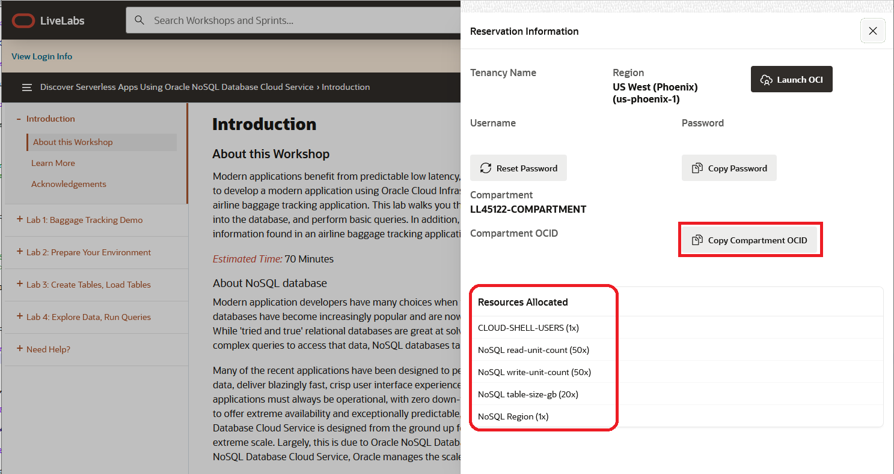

# Prepare Your Environment

## Introduction

This lab walks you through the steps necessary to create a proper operating environment.

_Estimated Lab Time:_ 5 minutes

### Objectives

In this lab you will:
* Use Compartment Created by Green Button
* Learn about Credentials, and Policies
* Set up Cloud Shell

### Prerequisites

This lab assumes you have:

* An Oracle Free Tier, Paid Account or Green Button
* Knowledge of vi, vim or emacs

## Task 1: Get Compartment OCID

Once you LiveLabs test environment was set up, you should have clicked on a button saying to 'Attend the Workshop.'This will take you to a screen that looks similar to this.

  

This environment does not allow you to create any compartments. Please take note of the compartment assigned. Under the **Compartment** is the **Compartment OCID.** Copy your **Compartment OCID** with the copy button and save for step 10 in Task 2. Paste it into notepad or some text file for use.

Please make note of the **Region** you are assigned. If you are assigned Phoenix, then you will be able to create Always Free NoSQL tables. If you are in another region, then you will be creating paid tables. This information is important for Lab 3. There are no costs to HOL users when creating and using paid tables.

## Task 2: Get Data and Code Bundle

In this task we will copy over a data bundle stored on object storage and place that in the Cloud Shell.

1. Execute the following in your Cloud Shell.

    ````
    <copy>
      cd $HOME
      rm -rf demo-tv-streaming-app
      git clone https://github.com/dario-vega/demo-tv-streaming-app.git
      cp ~/demo-tv-streaming-app/env-freetier.sh ~/demo-tv-streaming-app/env.sh
    </copy>
    ````

2. Exit from Cloud Shell


## Task 3: Understand Credentials, and Policies

**Oracle NoSQL Database Cloud Service uses Oracle Cloud Infrastructure Identity and Access Management to provide secure access to Oracle Cloud.** Oracle Cloud Infrastructure Identity and Access Management enables you to create user accounts and give users permission to inspect, read, use, or manage tables. Credentials are used for connecting your application to the service and are associated with a specific user.

The Oracle NoSQL Database SDKs allow you to provide the credentials to an application in multiple ways. The SDKs support a configuration file as well as one or more interfaces that allow direct specification of the information. You can use the SignatureProvider API to supply your credentials to NoSQL Database. Oracle NoSQL has SDKs in the following languages:  Java, Node.js, Python, Go, Spring and C#.

Another way to handle authentication is with Instance and Resource Principals. The Oracle NoSQL SDKs support both of them. Resource principals are primarily used when authenticating from functions.

Instance Principals is a capability in Oracle Cloud Infrastructure Identity and Access Management (IAM) that lets you make service calls from an instance. With instance principals, you don’t need to configure user credentials or rotate the credentials. Instances themselves are a principal type in IAM and are set up in IAM. You can think of them as an IAM service feature that enables instances to be authorized actors (or principals) to perform actions on service resources.

Oracle NoSQL Database Cloud service has three different resource types, namely, nosql-tables, nosql-rows, and nosql-indexes. It also has one aggregate resource called nosql-family. Policies are created that allow a group to work in certain ways with specific types of resources such as nosql-tables in a particular compartment. All NoSQL tables belong to a defined compartment. In Task 1 of this Lab, we created the demonosql compartment and this is where we will create our tables.

You can use **Instance Principals** to do the connection to NoSQL Cloud Service as shown below in the Node.js example instead of specifying the credentials. Once they are set up, they are simple to use because all you need to do is call the appropriate authorization constructor.

**NoSQL Database Node.js SDK**
```
function createClientResource() {
  return new NoSQLClient({
      region: process.env.NOSQL_REGION ,
      compartment:process.env.NOSQL_COMPID,
      auth: {
        iam: {
            useInstancePrincipal: true
        }
      }
  });
}
```
In the next labs we are going to be running application code and we need an instance to run that from. We will run this application using Cloud Shell using another way called delegation token

```
function createClientResource() {
  return new NoSQLClient({
    region: process.env.NOSQL_REGION ,
    compartment:process.env.NOSQL_COMPID,
    auth: {
      iam: {
          useInstancePrincipal: true,
          delegationTokenProvider: process.env.OCI_DELEGATION_TOKEN_FILE
      }
    }
  });
}
```

You may now **proceed to the next lab.**

## Learn More

* [About Identity and Access Management](https://docs.oracle.com/en-us/iaas/Content/Identity/Concepts/overview.htm)
* [About Managing User Credentials](https://docs.oracle.com/en-us/iaas/Content/Identity/Tasks/managingcredentials.htm)
* [About Cloud Shell](https://docs.oracle.com/en-us/iaas/Content/API/Concepts/cloudshellintro.htm)


## Acknowledgements
* **Author** - Dario Vega, Product Manager, NoSQL Product Management
* **Last Updated By/Date** - Dario Vega, Product Manager, NoSQL Product Management, August 2022
