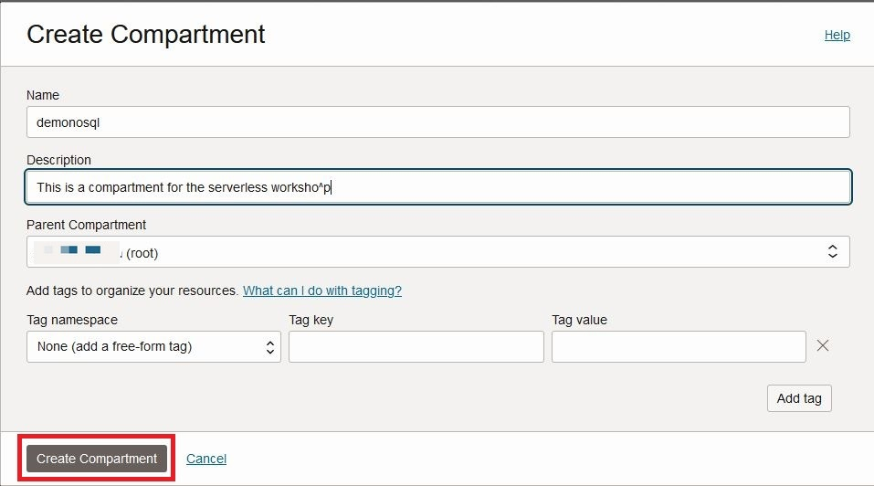

# Prepare Your Environment

## Introduction

This lab walks you through the steps necessary to create a proper operating environment.

_Estimated Lab Time:_ 5 minutes

### Objectives

In this lab you will:
* Create a Compartment
* Download Code Bundle
* Learn about Credentials, and Policies

### Prerequisites

This lab assumes you have:

* An Oracle Free Tier, Paid Account or Green Button


## Task 1: Create a Compartment

1. Log into the Oracle Cloud Console using your tenancy. Please make note of
what region you are at.

    

2. On left side drop down (left of Oracle Cloud banner), go to **Identity & Security**
and then **Compartments.**

    

3. Click **Create Compartment.** This opens up a new window.

  Enter **demonosql** as compartment **Name** field, enter some text into **Description**
  field and press **Create Compartment** button at bottom of window.
  The **Parent Compartment** field will display your current parent compartment --
  make sure this is your **root** compartment, whatever that is for your case.
  This HOL assumes the 'demonosql' compartment is a child of the root compartment.

    

## Task 2: Get Data and Code Bundle

In this task we will copy over a data bundle stored on object storage and
place that in the Cloud Shell.

1. Open the **Cloud Shell** in the top right menu. It can take about 2 minutes
to get the Cloud Shell started.

    
  
2. Execute the following in your Cloud Shell.

    ````
    <copy>
    cd $HOME
    rm -rf video-on-demand-with-nosql-database
    curl -L https://github.com/oracle/nosql-examples/raw/master/zips/video-on-demand-with-nosql-database.zip -o video-on-demand-with-nosql-database.zip
    unzip video-on-demand-with-nosql-database.zip
    cd ~/video-on-demand-with-nosql-database/data/
    sh unzip.sh
    cd $HOME
    </copy>
    ````

3. Exit from Cloud Shell

4. Open the **OCI Code Editor** in the top right menu. It can take about 2 minutes
to get the Code Editor started. You can continue the next Task. Cloud Editor
will be used only in the Lab4

    

## Task 3: Deploy Infrastructure using Terraform

1. To deploy the application, we will use a terraform scripts provided for this Lab. Click on the 'Deploy to Oracle Cloud ' button.  This will create a new window in your browser.

  [](https://cloud.oracle.com/resourcemanager/stacks/create?zipUrl=https://github.com/oracle/nosql-examples/raw/master/zips/video-on-demand-with-nosql-database.zip)

2. After successfully hitting the 'Deploy to Oracle Cloud' button, you will be brought to a new screen.

  


3. Provide your **Cloud Account Name** (tenancy name, not your username or email) and click on Next.

  Log into your account using your credentials (system may have remembered this from a prior log in).  You will see the Create Stack screen below:

  

  Click on the box "I have reviewed and accept the Oracle Terms of Use."  After clicking this box, it will populate the stack information, the name and the description.  Check the 'Create in compartment' box and make sure it shows demonosql.   If it does not, change it to demonosql.  

4. Click on Next on bottom left of screen.  This will move you to the 'Configure Variables' screen. Configure the variables for the infrastructure resources that this stack needs prior to running the apply job.

  Choose demonosql as _Compartment_  from the drop down list.

  

5. Click on Next, which brings you to the 'Review' screen.  Click on Create.

  

  A job will run automatically. It takes approx 1 minute. Wait still "State" field becomes **Succeeded.**  While it is running you will see a new screen that has the status displayed.   

  

  Once it has succeeded you can delete that window from your browser.

## Task 4: Understand Credentials, and Policies

**Oracle NoSQL Database Cloud Service uses Oracle Cloud Infrastructure Identity
and Access Management to provide secure access to Oracle Cloud.** Oracle Cloud
Infrastructure Identity and Access Management enables you to create user accounts
and give users permission to inspect, read, use, or manage tables.
Credentials are used for connecting your application to the service and are
associated with a specific user.

The Oracle NoSQL Database SDKs allow you to provide the credentials to an application
in multiple ways. The SDKs support a configuration file as well as one or more
interfaces that allow direct specification of the information. You can use the
SignatureProvider API to supply your credentials to NoSQL Database.
Oracle NoSQL has SDKs in the following languages:  Java, Node.js, Python, Go, Spring and C#.

Another way to handle authentication is with Instance and Resource Principals.
The Oracle NoSQL SDKs support both of them. Resource principals are primarily
used when authenticating from functions.

Instance Principals is a capability in Oracle Cloud Infrastructure Identity
and Access Management (IAM) that lets you make service calls from an instance.
With instance principals, you don’t need to configure user credentials or
rotate the credentials. Instances themselves are a principal type in IAM and
are set up in IAM. You can think of them as an IAM service feature that enables
instances to be authorized actors (or principals) to perform actions on service resources.

Oracle NoSQL Database Cloud service has three different resource types, namely,
nosql-tables, nosql-rows, and nosql-indexes. It also has one aggregate resource
called nosql-family. Policies are created that allow a group to work in certain
ways with specific types of resources such as nosql-tables in a particular
compartment. All NoSQL tables belong to a defined compartment.
In Task 1 of this Lab, we created the demonosql compartment and this is where
 we will create our tables.

You can use **Instance Principals** to do the connection to NoSQL Cloud Service
as shown below in the Node.js example instead of specifying the credentials.
Once they are set up, they are simple to use because all you need to do is call
the appropriate authorization constructor.

**NoSQL Database Node.js SDK**
```
<copy>
function createClientResource() {
  return new NoSQLClient({
      region: process.env.NOSQL_REGION ,
      compartment:process.env.NOSQL_COMPID,
      auth: {
        iam: {
            useInstancePrincipal: true
        }
      }
  });
}
</copy>
```
In the next labs we are going to be running application code and we need an
instance to run that from. We will run this application using Cloud Shell
using another way called delegation token

```
<copy>
function createClientResource() {
  return new NoSQLClient({
    region: process.env.NOSQL_REGION ,
    compartment:process.env.NOSQL_COMPID,
    auth: {
      iam: {
          useInstancePrincipal: true,
          delegationTokenProvider: process.env.OCI_DELEGATION_TOKEN_FILE
      }
    }
  });
}
</copy>
```

You may now **proceed to the next lab.**

## Learn More

* [About Identity and Access Management](https://docs.oracle.com/en-us/iaas/Content/Identity/Concepts/overview.htm)
* [About Managing User Credentials](https://docs.oracle.com/en-us/iaas/Content/Identity/Tasks/managingcredentials.htm)
* [About Cloud Shell](https://docs.oracle.com/en-us/iaas/Content/API/Concepts/cloudshellintro.htm)


## Acknowledgements
* **Author** - Dario Vega, Product Manager, NoSQL Product Management
* **Last Updated By/Date** - Dario Vega, Product Manager, NoSQL Product Management, March 2023
