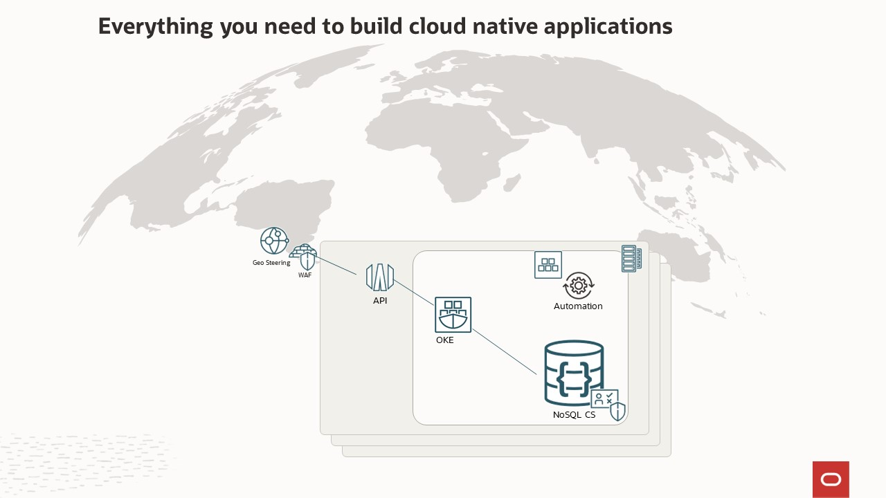
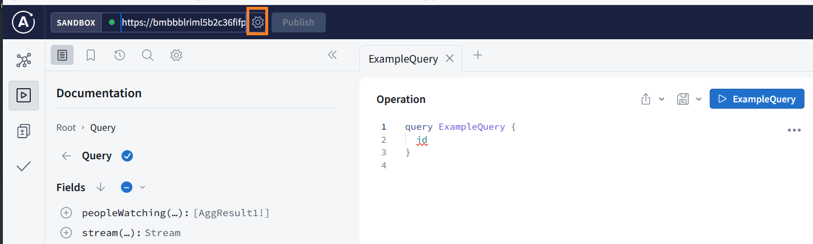
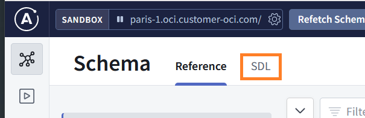

# Video on Demand - Activity Tracking Demo

## Introduction

This lab walks you through a Video on Demand streaming application demo created by the Oracle NoSQL development team. This application is composed of several micro-services using different Oracle Cloud Infrastructure services. During this demo, the focus will be on the Activity Tracking micro-service.


_Estimated Time:_ 12 minutes

### Activity Tracking service

Consider a Video on Demand streaming application. It streams various shows that customers across the globe watch. Shows can have a number of seasons and a season can have multiple episodes. You need a modern, persistent meta-data store to keep track of customer activity.

In general, customers are interested in tracking things like: the episodes they watch, the watch time per episode, the total number of seasons watched etc. Customers also want the streaming application to start streaming from where they left off watching - after all who wants to start at the beginning again.

The streaming application backend collects data so reports such as, which is the most popular show and what is the average watch time of a show, can be generated.


### Serverless Logic Tier

We selected this demo because it solves real world business problems. Many of those are listed on the slide.

  

This application is running in all the Oracle Cloud Infrastructure regions.

The application behind the demo uses a three-tier architecture, representing the brains of the application. The features of these services enable you to build a serverless production application that is highly available, scalable, and secure.
Your application can use thousands of servers, however, by leveraging the serverless paradigm you do not have to manage a single one.

Recently, REST has become the standard for designing web APIs.
The REST architectural style allows for running on stateless servers and offers structured access to resources.
However, REST APIs have shown to be inflexible when keeping up
with the rapidly changing requirements of the clients that access them, such as, increased mobile usage, low-powered devices and sloppy networks.

For those applications, we looked for a solution that minimized the data transferred over the network and allowed users to query data easily using an API directly.

GraphQL is an open-source data query and manipulation language for APIs, and a runtime for fulfilling those queries
with existing data. GraphQL provides a complete and understandable description of the data in your API, gives clients the power to ask for exactly what they need and nothing more, makes it easier to evolve APIs over time, and enables powerful developer tools.

GraphQL is often confused with being a database technology. GraphQL isn't tied to any specific database or storage engine and is instead backed by your existing data. You can code with GraphQL engines available in many languages.

In this demo, we will learn how easy it is develop the Activity Tracking service using Node.Js, ApolloServer and Oracle NoSQL Database.

In addition, by using managed services you gain the following benefits:
*	No operating systems to choose, secure, patch, or manage.
*	No servers to size, monitor, or scale out.
*	No risk to your cost by over-provisioning.
*	No risk to your performance by under-provisioning.

Here is a diagram of architecture behind the demo.

  

* The API Gateway service enables you to publish APIs with private endpoints that are accessible from within your network, and which you can expose with public IP addresses if you want them to accept internet traffic. The endpoints support API validation, request and response transformation, CORS, authentication and authorization, and request limiting.

* Oracle Cloud Infrastructure Container Engine for Kubernetes is a fully-managed, scalable, and highly available service that you can use to deploy your containerized applications to the cloud. Use Container Engine for Kubernetes (sometimes abbreviated to just OKE) when your development team wants to reliably build, deploy, and manage cloud-native applications. You specify whether to run applications on virtual nodes or managed nodes, and Container Engine for Kubernetes provisions them on Oracle Cloud Infrastructure in an existing OCI tenancy. The live running application was deployed using OKE.

    * In this Live Lab, we will use Container Instances because we do not need the orchestration platform and the kubernetes platform takes 10 minutes to setup. Oracle Cloud Infrastructure (OCI) Container Instances is a serverless compute service that enables you to quickly and easily run containers without managing any servers. Container Instances runs your containers on serverless compute optimized for container workloads that provides the same isolation as virtual machines. Container instances are suitable for containerized workloads that do not require a container orchestration platform like Kubernetes. These use cases include: APIs, web applications, build and deployment jobs in CI/CD pipelines, automation tasks f or cloud operations, data/media processing jobs, development or test environments, and more.


* Oracle NoSQL Database Cloud Service is a severless database cloud service that is designed for database operations that require predictable, single-digit millisecond latency responses to simple queries. NoSQL Database Cloud Service allows developers to focus on application development rather than setting up cluster servers, or performing system monitoring, tuning, diagnosing, and scaling.

The features of these services enable you to build a serverless production application that is highly available, scalable, and secure. Your application can use thousands of servers, however, by leveraging this pattern you do not have to manage a single one.

### Objectives

* Explore the Video on Demand streaming - Activity Tracking service  

### Prerequisites

*  Connection to the internet


## Task 1: The "Streaming" challenge

This particular application came to the NoSQL team from an internal Oracle team working with us to deliver a service with a very high value-add. (AI Service, Media Streams)

When we thought about this for a little bit, we realized that this was a perfect use case for NoSQL. Many Video on Demand services are now offering real time activity tracking. When you use their application, you get close to a real time feed of your viewing behaviors.

1. Read the following bullet points to understand a few goals of this application:

    * Predictable low latency
    * Scalable to your user base
    * Highly available
    * Auto expiry of the data


## Task 2: Explore data using GraphQL queries

Let us explore our API and showing some advantages of using GraphQL.

**Move faster with powerful developer tools**

With developer tools, you can know exactly what data you can request from your API without leaving your editor, you can highlight potential issues before sending a query, and you can take advantage of improved code intelligence. GraphQL applications are easily built with powerful tools like GraphiQL or Apollo GraphQL Studio.

1. In a browser window, enter [https://studio.apollographql.com/sandbox/explorer](https://studio.apollographql.com/sandbox/explorer).  When you go to the sandbox, you may initially see the error below. This will go away once you perform step 2.

  

2. In the sandbox, copy/paste the following url:

    ```
    <copy>https://bmbbblriml5b2c36fifpqz5ieq.apigateway.eu-paris-1.oci.customer-oci.com/</copy>
    ```

3. You should see a screen that likes similar to the below image.  Click on the gear and the "Open connection settings" dialog will open.

  

  Turn the "Auto Update" feature off by moving the slider bar from ON to OFF.  Then hit Save at bottom of window.

  

  This will add a new button at the top called "Refetch Schema"

  

  Now we are ready to play in the sandbox.

## Task 3: Ask for what you need, get exactly that

1. By default, it may put you in a spot where it wants you to execute an Example Query.  Under "Documentation" you will see something similar to this image below.

  

2. If that is the case, click on the arrow next to "Query" and it will place you into "Root."  Now that you have moved over to "Root", watch the animated gif below.  This walks you through the steps of triggering a query.  You will build a query from scratch by hitting "Query", then adding the "Streams" array, followed by adding several fields to display.   Finally you will hit the "Query" button to execute the query.   You will see the results of your query to the right.  Feel free to select different fields and re-execute your query and watch how the results change.  

  Hopefully you see, it is easy to build a GraphQL query in your API and get exactly what you need, nothing more and nothing less. GraphQL queries always return predictable results. Apps using GraphQL are fast and stable because they control the data they get, not the server.  


  

## Task 4: Get many resources in a single request

1. GraphQL queries access not just the properties of one resource but also smoothly follow references between them. While typical REST APIs require loading from multiple URLs, GraphQL APIs get all the data your app needs in a single request.  This makes GraphQL Apps much more efficient than REST based Apps, especially in slow network environments.  In the animated gif below we are going to build a query that includes the people watching shows from the US.   After executing that request we are to add another resource to the original request and grab the watch time of various shows.   We will then execute the request again, thus demonstrating getting different resources from a single request.   Follow along and build this request in your environment.

  

## Task 5: Describe what’s possible with a type system

1. GraphQL APIs are organized in terms of types and fields, not endpoints. Access the full capabilities of your data from a single endpoint. GraphQL uses types to ensure Apps only ask for what’s possible and provide clear and helpful errors.  We can take a look at the schema, and see the different fields and their associated types.  To move to the schema view, click the button marked in the graphic below.

  

2. After you do that, click on the SDL tab.

  

3. Next you should see something similar to the below image.   Go ahead and scroll through the list and review the different parts of the schema.

  


## Task 6: Test using an unique URL

In the previous tasks, we looked at the flexibility and the power of GraphQL to explore the data exposed by the Activity Tracking microservice of our Video on Demand streaming application.

Now, explore the queries that we will use in the next Lab.

1. Open the [demo-streaming.json](files/demo-streaming.json) file in another tab on
your browser

  

  If you prefer, you can use an API tool like Postman

  


## Task 7: Key takeaways

  1. Read the following information.

    While this was a simple demo, it used many components that are available in Oracle Cloud Infrastructure today.
    * The Activity Tracking application is running live in all Oracle Cloud Infrastructure Regions
    * The Activity Tracking application uses Oracle Cloud Infrastructure traffic Management for
Geo-Steering to steer network requests to closest Oracle Cloud Infrastructure region
    * The Activity Tracking uses Oracle Cloud Infrastructure API gateway
    * Data is stored in Oracle NoSQL Cloud Service as JSON documents
    * GraphQL is a query language for your APIs, which provides a complete and understandable description of the data in your API.  It is easy to integrate with the Oracle NoSQL Database Cloud Service.

    The benefits to customers are shown in this slide.

      

    You may now **proceed to the next lab.**

## Learn More
* [About Architecting Microservices-based applications](https://docs.oracle.com/en/solutions/learn-architect-microservice/index.html)
* [Speed Matters! Why Choosing the Right Database is Critical for Best Customer Experience?](https://blogs.oracle.com/nosql/post/speed-matters-why-choosing-the-right-database-is-critical-for-best-customer-experience)
* [About Security, Identity, and Compliance](https://www.oracle.com/security/)
* [Application Development](https://www.oracle.com/application-development/)

* [Oracle NoSQL Database Cloud Service page](https://www.oracle.com/database/nosql-cloud.html)
* [About Oracle NoSQL Database Cloud Service](https://docs.oracle.com/en/cloud/paas/nosql-cloud/index.html)
* [About API Gateway](https://www.oracle.com/cloud/cloud-native/api-management/)
* [About Container Engine for Kubernetes (OKE)](https://www.oracle.com/cloud/cloud-native/container-engine-kubernetes/)
* [About Container Instance](https://www.oracle.com/cloud/cloud-native/container-instances/)

* [About AI Services](https://www.oracle.com/artificial-intelligence/ai-services/)
* [About Media Streams](https://www.oracle.com/cloud/media-streams/)


## Acknowledgements
* **Author** - Dario Vega, Product Manager, NoSQL Product Management
* **Last Updated By/Date** - Michael Brey, Director, NoSQL Product Development, April 2023
