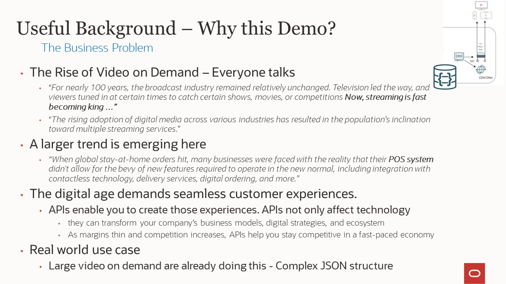

# Video on Demand - Activity Tracking Demo

## Introduction

This lab walks you through a Video on Demand streaming application demo created by the Oracle NoSQL development team. This application is composed of several micro-services using different Oracle Cloud Infrastructure services. During this demo, the focus will be on the Activity Tracking micro-service.


### Activity Tracking service

Consider a Video on Demand streaming application. It streams various shows that customers across the globe watch. Shows can have a number of seasons and a season can have multiple episodes. You need a modern, persistent meta-data store to keep track of customer activity.

In general, customers are interested in tracking things like: the episodes they watch, the watch time per episode, the total number of seasons watched etc. Customers also want the streaming application to start streaming from where they left off watching - after all who wants to start at the beginning again.

The streaming application backend collects data so reports such as, which is the most popular show and what is the average watch time of a show, can be generated.

_Estimated Lab Time:_ 7 minutes

### Serverless Logic Tier

We selected this demo because it solves real world business problems. Many of those are listed on the slide.

  

This application is running in all the Oracle Cloud Infrastructure regions.

  

The application behind the demo uses a three-tier architecture, representing the brains of the application. The features of these services enable you to build a serverless production application that is highly available, scalable, and secure.
Your application can use thousands of servers, however, by leveraging the serverless paradigm you do not have to manage a single one.

Recently, REST has become the standard for designing web APIs.
The REST architectural style allows for running on stateless servers and offers structured access to resources.
However, REST APIs have shown to be inflexible when keeping up
with the rapidly changing requirements of the clients that access them, such as, increased mobile usage, low-powered devices and sloppy networks.

For those applications, we looked for a solution that minimized the data transferred over the network and allowed users to query data easily using an API directly.

GraphQL is an open-source data query and manipulation language for APIs, and a runtime for fulfilling those queries
with existing data. GraphQL provides a complete and understandable description of the data in your API, gives clients the power to ask for exactly what they need and nothing more, makes it easier to evolve APIs over time, and enables powerful developer tools.

GraphQL is often confused with being a database technology. GraphQL isn't tied to any specific database or storage engine and is instead backed by your existing data. You can code with GraphQL engines available in many languages.

In this demo, we will learn how easy it is develop the Activity Tracking service using Node.Js, ApolloServer and Oracle NoSQL Database.

In addition, by using managed services you gain the following benefits:
*	No operating systems to choose, secure, patch, or manage.
*	No servers to size, monitor, or scale out.
*	No risk to your cost by over-provisioning.
*	No risk to your performance by under-provisioning.

Here is a diagram of architecture behind the demo.

  


### Objectives

* Explore the Video on Demand streaming - Activity Tracking service  

### Prerequisites

*  Connection to the internet


## Task 1: The "Streaming" challenge

This particular application came to the NoSQL team from an internal Oracle team working with us to deliver a service with a very high value-add. (AI Service, Media Streams)

When we thought about this for a little bit, we realized that this was a perfect use case for NoSQL. Many Video on Demand services are now offering real time activity tracking. When you use their application, you get close to a real time feed of your viewing behaviors.

What are a few goals of this application:

  - Predictable low latency
  - Scalable to your user base
  - Highly available
  - Auto expiry of the data


## Task 2: Explore data using GraphQL queries

Let us explore our API and showing some advantages of using GraphQL.

**Move faster with powerful developer tools**

With developer tools, you can know exactly what data you can request from your API without leaving your editor, you can highlight potential issues before sending a query, and you can take advantage of improved code intelligence. GraphQL applications are easily built with powerful tools like GraphiQL or Apollo GraphQL Studio.

1. In a browser window, enter [https://studio.apollographql.com/sandbox/explorer](https://studio.apollographql.com/sandbox/explorer)
2. In the sandbox, copy/paste the following url:
````
<copy>https://bmbbblriml5b2c36fifpqz5ieq.apigateway.eu-paris-1.oci.customer-oci.com/
</copy>
````
3. And now, you are ready to use our API


## Task 3: Ask for what you need, get exactly that

Send a GraphQL query to your API and get exactly what you need, nothing more and nothing less. GraphQL queries always return predictable results. Apps using GraphQL are fast and stable because they control the data they get, not the server.


## Task 4: Describe what’s possible with a type system

GraphQL APIs are organized in terms of types and fields, not endpoints. Access the full capabilities of your data from a single endpoint. GraphQL uses types to ensure Apps only ask for what’s possible and provide clear and helpful errors.


## Task 5: Get many resources in a single request

GraphQL queries access not just the properties of one resource but also smoothly follow references between them. While typical REST APIs require loading from multiple URLs, GraphQL APIs get all the data your app needs in a single request.


## Task 6: Test using an unique URL

In the previous tasks, we looked at the flexibility and the power of GraphQL to explore the data exposed by the Activity Tracking microservice of our Video on Demand streaming application.

Now, explore the queries that we will use in the next Lab.

Open the [demo-streaming.json](files/demo-streaming.json) file in another tab on
your browser


If you prefer, you can use an API tool like Postman


## Task 7: Key takeaways

1. While this was a simple demo, it used many components that are available in Oracle Cloud Infrastructure today.

  * Application is running live in all Oracle Cloud Infrastructure Regions
  * Application uses Oracle Cloud Infrastructure traffic Management for
  Geo-Steering to steer network requests to closest Oracle Cloud Infrastructure region
  * Uses Oracle Cloud Infrastructure API gateway
  * Data stored in Oracle NoSQL Cloud Service as JSON documents
  * GraphQL is a query language for your API, and a server-side runtime for executing queries using a type system (schema) you define for your data

  The benefits to customers are shown in this slide.

      

You may now **proceed to the next lab.**

## Learn More

* [About Architecting Microservices-based applications](https://docs.oracle.com/en/solutions/learn-architect-microservice/index.html)
* [Speed Matters! Why Choosing the Right Database is Critical for Best Customer Experience?](https://blogs.oracle.com/nosql/post/speed-matters-why-choosing-the-right-database-is-critical-for-best-customer-experience)
* [Process media by using serverless job management and ephemeral compute workers](https://docs.oracle.com/en/solutions/process-media-using-oci-services/index.html)
* [Oracle NoSQL Database Multi-Region](https://blogs.oracle.com/nosql/post/oracle-nosql-database-multi-region-table-part1)
* [About Security, Identity, and Compliance](https://www.oracle.com/security/)
* [Application Development](https://www.oracle.com/application-development/)

### Services

* [Oracle NoSQL Database Cloud Service page](https://www.oracle.com/database/nosql-cloud.html)
* [About Oracle NoSQL Database Cloud Service](https://docs.oracle.com/pls/topic/lookup?ctx=cloud&id=CSNSD-GUID-88373C12-018E-4628-B241-2DFCB7B16DE8)
* [About API Gateway](https://www.oracle.com/cloud/cloud-native/api-management/)
* [AI Services](https://www.oracle.com/artificial-intelligence/ai-services/)
* [Media Streams](https://www.oracle.com/cloud/media-streams/)

### References


## Acknowledgements
* **Author** - Dario Vega, Product Manager, NoSQL Product Management
* **Last Updated By/Date** - Dario Vega, Product Manager, NoSQL Product Management, August 2022
