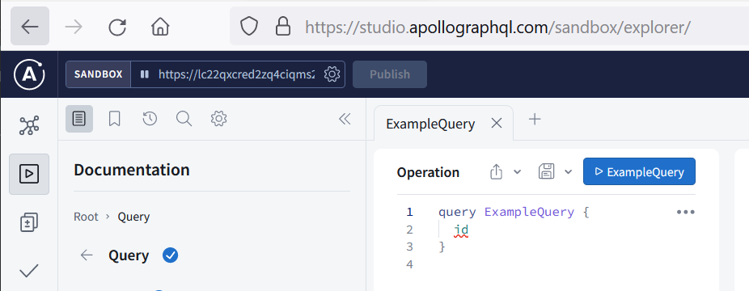

# Video on Demand streaming - Activity Tracking Demo

## Introduction

This lab walks you through a Video on Demand streaming application demo created
by the Oracle NoSQL development team. This application is composed of multiple
services (micro-services) using multiple OCI services.
During this Lab, the focus will be on one of them - the Activity Tracking service.

Consider a Video on Demand streaming application. It streams various shows that
are watched by customers across the globe. Every show has number of seasons and
every season has multiple episodes. You need a modern persistent meta-data store
which keeps track of the current activity of the customers using the VoD streaming
application.

A customer is interested to know about the episodes they watched, the watch time
per episode, the total number of seasons of the show they watched etc. The customer
also wants the streaming application to start streaming from where they left off
watching.

The streaming application needs reports on which show is most popular among
customers, how many minutes a show is being watched etc.

_Estimated Lab Time:_ 7 minutes

### Serverless Logic Tier

We selected this demo because it solves real world business problems. Many of those are listed on the slide.

  

This application is running in all the Oracle Cloud Infrastructure regions.

  

The application behind the demo uses a three-tier architecture, representing the
brains of the application. The features of these services enable you to build a
serverless production application that is highly available, scalable, and secure.
Your application can use thousands of servers, however, by leveraging this pattern
you do not have to manage a single one.

In addition, by using these managed services together you gain the following benefits:
*	No operating systems to choose, secure, patch, or manage.
*	No servers to size, monitor, or scale out.
*	No risk to your cost by over-provisioning.
*	No risk to your performance by under-provisioning.

Here is a diagram of architecture behind the demo.

  

### Objectives

* Explore the Video on Demand streaming - Activity Tracking service  

### Prerequisites

*  Connection to the internet

## Task 1: The "Streaming" challenge

This particular application came to the NoSQL team from different Oracle team
working with us delivering service with very high value added.
( AI Service, Media Streams )

When we thought about this for a little bit, we realized that this was a perfect
use case for NoSQL. Many Video on Demand services are now offering real time
activity tracking. You will use their application, and you get close to a real time
feed of where your device is at as it moves along its journey.

The second thing in this example is the involvement of an active/active configuration.
You write data locally in closest data center as that end-user is, but you want
to read it from anywhere. For the best latency, you want the tracking information
to be immediately written to the local data center. Then, let the system take care
of propagating that data to the other data centers in an active/active set up.

If you took a trip from the US to Europe for example, the last thing you would
want to do is force all the writes back to the US. You want to start streaming
from where they left off watching and you need the best possible latency.

What are a few goals of this application:

  - Predictable low latency
  - Scalable to your user base
  - Highly available
  - Auto expiry of the data
  - Offload consumer queries from operation data store

## Task 2: Explore data using GraphQL queries

A query language for your API

GraphQL is a query language for APIs and a runtime for fulfilling those queries
with your data. GraphQL provides a complete and understandable description
of the data in your API, gives clients the power to ask for exactly what they
need and nothing more, makes it easier to evolve APIs over time, and enables
powerful developer tools.

Move faster with powerful developer tools

Know exactly what data you can request from your API without leaving your editor,
highlight potential issues before sending a query, and take advantage of
improved code intelligence.
GraphQL makes it easy to build powerful tools like GraphiQL or apollographql studio.

1. In a browser window, enter https://studio.apollographql.com/sandbox.
2. In the sandbox, enter https://lc22qxcred2zq4ciqms2tzzxv4.apigateway.us-ashburn-1.oci.customer-oci.com/
3. And now, you are ready to use our API

## Task 3: Ask for what you need, get exactly that

Send a GraphQL query to your API and get exactly what you need, nothing more
and nothing less. GraphQL queries always return predictable results.
Apps using GraphQL are fast and stable because they control the data they get,
not the server.

Gif animated with query

## Task 4: Describe what’s possible with a type system

GraphQL APIs are organized in terms of types and fields, not endpoints.
Access the full capabilities of your data from a single endpoint.
GraphQL uses types to ensure Apps only ask for what’s possible and provide
clear and helpful errors.

Gif animated with schema

## Task 5: Get many resources in a single request

GraphQL queries access not just the properties of one resource but also smoothly
follow references between them. While typical REST APIs require loading from
multiple URLs, GraphQL APIs get all the data your app needs in a single request.

Gif animated with curl test

## Task 6: Key takeaways

1. While this was a simple demo, it used many components that are available in Oracle Cloud Infrastructure today.

  * Application is running live in all Oracle Cloud Infrastructure Regions
  * Application uses Oracle Cloud Infrastructure traffic Management for Geo-Steering to steer network requests to closest Oracle Cloud Infrastructure region
  * Uses Oracle Cloud Infrastructure API gateway
  * Data stored in Oracle NoSQL Cloud Service as JSON documents

  The benefits to customers are shown in this slide.

      

You may now **proceed to the next lab.**

## Learn More

* [About Architecting Microservices-based applications](https://docs.oracle.com/en/solutions/learn-architect-microservice/index.html)
* [Speed Matters! Why Choosing the Right Database is Critical for Best Customer Experience?](https://blogs.oracle.com/nosql/post/speed-matters-why-choosing-the-right-database-is-critical-for-best-customer-experience)
* [Process media by using serverless job management and ephemeral compute workers](https://docs.oracle.com/en/solutions/process-media-using-oci-services/index.html)
* [Oracle NoSQL Database Multi-Region](https://blogs.oracle.com/nosql/post/oracle-nosql-database-multi-region-table-part1)
* [About Security, Identity, and Compliance](https://www.oracle.com/security/)
* [Application Development](https://www.oracle.com/application-development/)

### Services

* [Oracle NoSQL Database Cloud Service page](https://www.oracle.com/database/nosql-cloud.html)
* [About Oracle NoSQL Database Cloud Service](https://docs.oracle.com/pls/topic/lookup?ctx=cloud&id=CSNSD-GUID-88373C12-018E-4628-B241-2DFCB7B16DE8)
* [About API Gateway](https://docs.oracle.com/en-us/iaas/Content/APIGateway/Concepts/apigatewayoverview.htm)
* [AI Services](https://www.oracle.com/artificial-intelligence/ai-services/)
* [Media Streams](https://www.oracle.com/cloud/media-streams/)

## Acknowledgements
* **Author** - Dario Vega, Product Manager, NoSQL Product Management
* **Last Updated By/Date** - Dario Vega, Product Manager, NoSQL Product Management, August 2022
