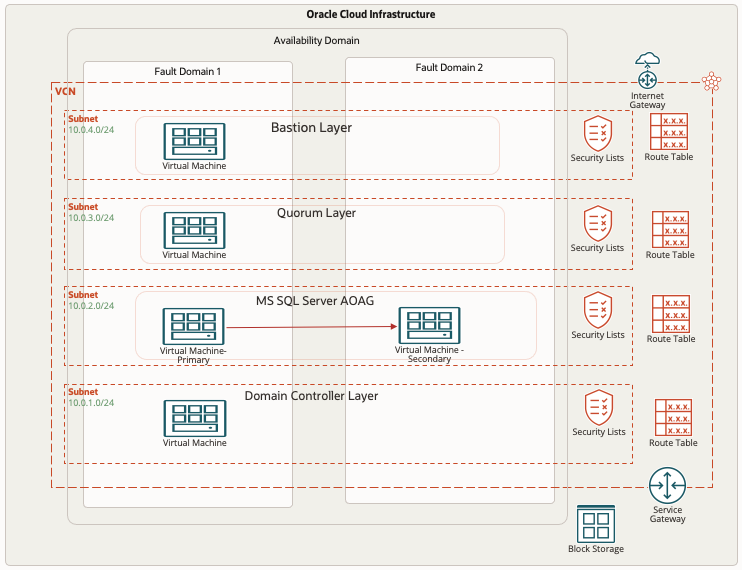

# Introduction

## About this Workshop

This hands-on workshop provides users with step-by-step instructions on deploying the WSFC (Windows Server Failover Clustering) and configuring the Microsoft SQL Server Always On Availability Group setup.

**Architecture:**
This reference architecture includes a Microsoft SQL Server Always On Availability Group, bastion server, Active Directory Domain Controller, and a quorum Witness host on Oracle Cloud Infrastructure.

The Oracle Cloud Infrastructure region provides object storage (for backup) for the region. The region includes a single availability domain with two fault domains. 

The Availability Domain provides block storage for the Availability Domain. It also contains a virtual cloud network (VCN) with four regional subnets and a service gateway. The VCN provides routing tables for each subnet, and each subnet provides its security list access.

* Bastion host layer: A Bastion host resides in one fault domain. An internet gateway provides a public connection.
* Quorum server layer: A single Quorum Witness server resides in the fault domain to manage synchronization and replication to ensure that there is only one owner of a particular resource group at any given time.
* Microsoft SQL Server Always On Availability Group: A primary Microsoft SQL Server database resides in one fault domain and communicates with a secondary Microsoft SQL Server database in another fault domain. 
* Domain controller layer: A domain controller resides in a single fault domain to which Compute Instances are attached.

  

Estimated Time: 5 Hour

**Workshop Objectives**

In this workshop, you will learn how to:
* Setup the Windows bastion host
* Setup the Windows Active Directory in Compute Instance
* Installation of Microsoft SQL Server 2019 from MarketPlace images
* In Compute Instance, create a two-node Windows Server Failover Cluster.
* How to configure the Quorum for Windows Failover Cluster
* Setup and Configure the Microsoft SQL Server Always On Availability Group setup

### Prerequisites
* An Oracle Free Tier, Always Free, Paid, or LiveLabs Cloud Account
* Some understanding of cloud and security terms is helpful.
* Familiarity with Oracle Cloud Infrastructure (OCI) is helpful.
* Required Subnets: One public subnet for the Bastion host and three private subnets to host the Domain Controller, Microsoft SQL Server Nodes, and Quorum Server

## Learn More
- You can find more information about Deploy a highly available Microsoft SQL Server database [here](https://docs.oracle.com/en/solutions/deploy-microsoft-sql-on-oci/index.html#GUID-06B8A24C-A5E8-46C2-A648-CF8EB324EDFF)

## Acknowledgements
* **Author** - Ramesh Babu Donti, Principal Cloud Architect, NA Cloud Engineering
* **Contributors** -  Devinder Pal Singh, Senior Cloud Engineer, NA Cloud Engineering
* **Last Updated By/Date** - Ramesh Babu Donti, Principal Cloud Architect, NA Cloud Engineering, June 2022