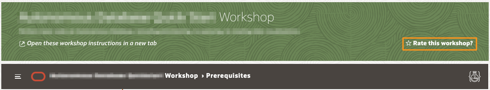
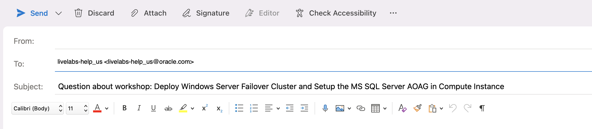

# Need Help?   

## Introduction
This page is designed to help you solve some common problems users face in this LiveLab.

If you still find yourself stuck or would like to report an issue with the workshop, click the question mark icon in the upper left corner to contact the LiveLabs team directly via email.  

For more about getting support using our email, click [here](#HowToFormatYourSupportEmailRequest).

### **Rate This Workshop**
When you are finished please don't forget to rate this workshop!  We rely on this feedback to help us improve and refine our LiveLabs catalog.  Follow the steps to submit your rating.

1.  Go back to your **Workshop Homepage** in LiveLabs by searching for your workshop and clicking the Launch button.

2.  Click on the **Brown Button** to re-access the workshop  

    

3.  Click **Rate this workshop**

    

If you still have an active reservation, you can also rate by going to **My Reservations** -> **Launch Workshop**.

## How to Format Your Support Email Request
This will construct an email in your default mail application that is auto populated to address our LiveLabs support inbox and will also include your current workshop in the subject line. Follow the steps below to contact us and get a quick resolution to your issue.

1. Do not change the subject line.
2. Include the description of your issue and any pertinent information in the contents on your email.

    

3. Include the **Lab Number**, **Step Number**, and **Sub-Step Number** where you've encounter the issue.
4. Attach a **Screenshot** and **Any Troubleshooting Steps** you've tried so we can recreate the issue and provide a timely and accurate solution.

## Acknowledgements
* **Author** - Ramesh Babu Donti, Principal Cloud Architect, NA Cloud Engineering
* **Contributors** -  Devinder Pal Singh, Senior Cloud Engineer, NA Cloud Engineering
* **Last Updated By/Date** - Ramesh Babu Donti, Principal Cloud Architect, NA Cloud Engineering, June 2022
